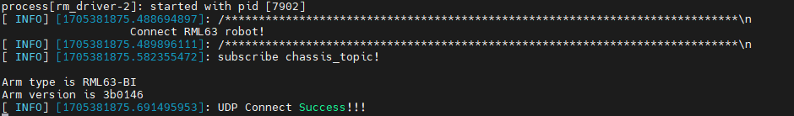
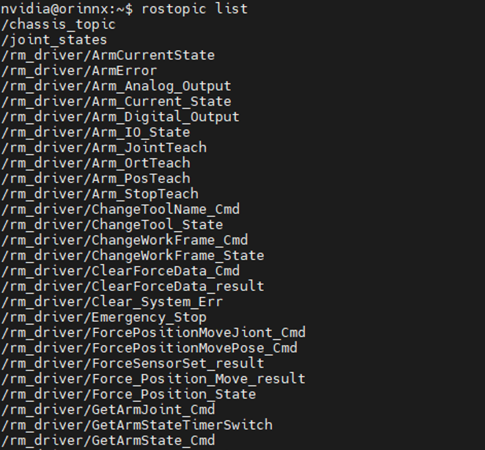
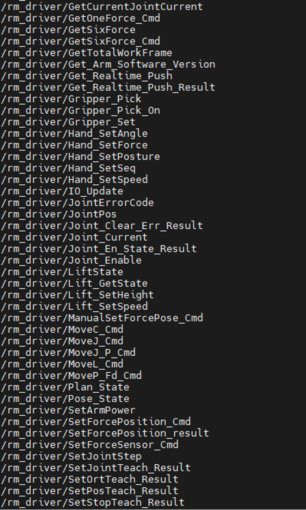
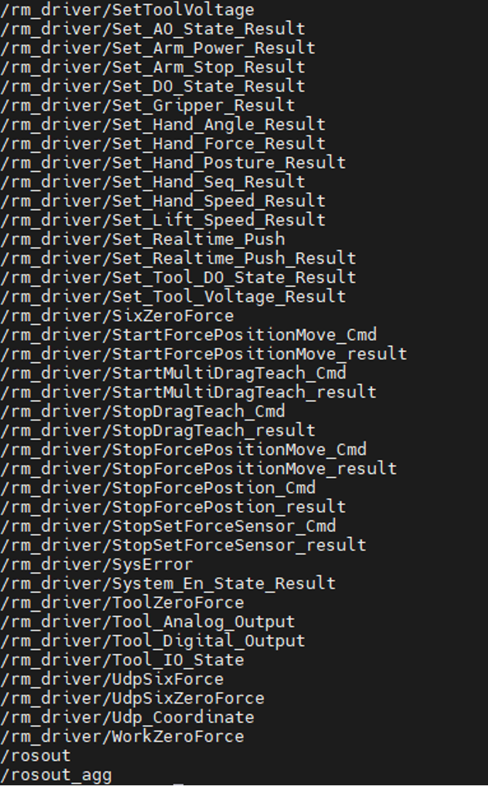

# <p class="hidden">ROS: </p>Introduction to the Rm_driver Package

The rm_driver package, as an important part of the ROS package of the robotic arm, is intended to communicate and control the robotic arm through the ROS. The package will be introduced in detail in the following aspects.

- Package application.
- Package structure description.
- Package topic description.

The above three parts are provided for users to:

- Learn how to use the package.
- Understand the composition and function of files in the package.
- Know the topics of the package for easy development and use.

Code link: [https://github.com/RealManRobot/rm_robot/tree/main/rm_driver](https://github.com/RealManRobot/rm_robot/tree/main/rm_driver)

## 1. Application of the rm_driver package

### 1.1 Basic use of the package

After the environment configuration and connection are complete, the node can be started directly by the following command to control the robotic arm.

The current control is based on the fact that the IP address of the robotic arm is still 192.168.1.18 without change.

```
roslaunch rm_driver rm_<arm_type>_driver.launch
```

Generally, the above `<arm_type>` is required for the actual type of the robotic arm and optional for 65, 63, ECO65, 75, and GEN72.

After the underlying driver is started successfully, the following screen will pop up.



The configuration file is as follows:

```
    <launch>
        <!-- Tag -->
        <arg name="Arm_IP"  default="192.168.1.18"/>  <!-- Set the IP address for the TCP connection -->
        <arg name="Arm_Port" default="8080"/>         <!-- Set the port for the TCP connection -->
        <arg name="Arm_Dof"  default="6"/>            <!-- Set the degree of freedom of the robotic arm -->
        <arg name="Arm_Type" default="RML63"/>       <!-- Set the type of the robotic arm -->
        <arg name="Follow" default="false"/>           <!-- Set the follow, false: low follow; true: high follow -->
        <arg name="Udp_IP" default="192.168.1.10"/>    <!-- Set the IP address for the udp-based real-time pushing -->
        <arg name="Udp_Port" default="8089"/>         <!-- Set the port for the udp-based real-time pushing -->
        <arg name="Udp_cycle" default="5"/>           <!-- Set the udp-based real-time pushing cycle (ms), in multiples of 5 and at least 5(200 Hz) -->
        <arg name="Udp_force_coordinate" default="0"/>  <!-- Set the reference frame for the 6-DoF force -->

        <!-- Start the underlying driver node of the robotic arm -->
        <node name="rm_driver" pkg="rm_driver" type="rm_driver" output="screen" respawn="false">
            <!-- Robot frame -->
            <param name="Arm_IP"                value="$(arg Arm_IP)"/>
            <param name="Arm_Port"              value="$(arg Arm_Port)"/>
            <param name="Arm_Dof"               value="$(arg Arm_Dof)"/>
            <param name="Arm_Type"              value="$(arg Arm_Type)"/>
            <param name="Follow"                value="$(arg Follow)"/>
            <param name="Udp_IP"                value="$(arg Udp_IP)"/>
            <param name="Udp_Port"              value="$(arg Udp_Port)"/>
            <param name="Udp_cycle"             value="$(arg Udp_cycle)"/>
            <param name="Udp_force_coordinate"  value="$(arg Udp_force_coordinate)"/>
        </node>
    </launch>
```

The main parameters are as follows.

Arm_IP: refers to the current IP address of the robotic arm.<br>
Arm_Port: refers to the port for the TCP connection. <br>
Arm_Type: refers to the current type of the robotic arm, optional for RM65, ECO65, RML63, RM75, and GEN72. <br>
Arm_Dof: refers to the degree of freedom of the robotic arm, 6: 6 DoF; 7: 7 DoF. <br>
Follow: refers to the pass-through follow, false: low follow; true: high follow. <br>
Udp_IP: refers to the target IP address for the udp-based real-time pushing. <br>
Udp_cycle: refers to the udp-based real-time pushing cycle (ms), in multiples of 5 and at least 5(200 Hz). <br>
Udp_Port: refers to the port for the udp-based real-time pushing. <br>
Udp_force_coordinate: refers to the reference frame for the 6-DoF force system.

- 0: sensor frame (original data);
- 1: current work frame;
- 2: current tool frame.

In actual use, select and activate the launch file and the correct type will be automatically set. If you have special requirements, modify the parameters here. After the modification, restart the node to make the modified parameter take effect.

## 2. Structure description of the rm_driver package

### 2.1 File overview

The current rm_driver package consists of the following files.

```
├── CMakeLists.txt             #Build rule file
├── launch                            <-Node launch + parameter configuration file
│ ├── rm_63_driver.launch       #RML63 launch file
│ ├── rm_65_driver.launch       #RM65 launch file
│ ├── rm_75_driver.launch       #RM75 launch file
│ ├── rm_eco65_driver.launch    #ECO65 launch file
│ └── rm_gen72_driver.launch    #GEN72 launch file
├── package.xml #Dependency declaration file
└── src
├── cJSON.c                     #JSON file
├── cJSON.h                     #JSON header file
├── rm_driver.cpp               #rm_driver node source file
└── rm_robot.h                  #rm_driver node header file
```

## 3. Topic description of the rm_driver package

The rm_driver package has many topics, which are available via running the following commands.






