# <p class="hidden">ROS: </p>Introduction to the Rm_example Package

The rm_bringup package is intended to enable the basic functions of the robotic arm and control the robotic arm. Additionally, other functions of the robotic arm are available regarding its code. The package will be introduced in detail in the following aspects.

1. Package application.
2. Package structure description.
3. Package topic description.

The above three parts are provided for users to:

1. Learn how to use the package.
2. Understand the composition and function of files in the package.
3. Know the topics of the package for easy development and use.

Code link: [https://github.com/RealManRobot/rm_robot/tree/main/rm_demo](https://github.com/RealManRobot/rm_robot/tree/main/rm_demo)

## 1. Application of the rm_example package

### 1.1 Changing the work frame

Firstly, run the rm_driver node of the robotic arm.

```
roslaunch rm_driver rm_<arm_type>_driver.launch
```

`<arm_type>` is the actual model of the robotic arm, and the supported models include 65, 63, ECO65, 75, and GEN72.

For the 65 robotic arm, its start command is as follows:

```
roslaunch rm_driver rm_65_driver.launch
```

After the node is started successfully, execute the following command to run the node to change the work frame.

```
rosrun rm_demo api_ChangeWorkFrame_demo
```

If the following command appears, the frame is switched successfully.

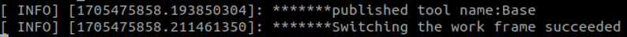

### 1.2 Changing the tool frame

Firstly, run the rm_driver node of the robotic arm.

```
roslaunch rm_driver rm_<arm_type>_driver.launch
```

`<arm_type>` is the actual model of the robotic arm, and the supported models include 65, 63, ECO65, 75, and GEN72.

For the 65 robotic arm, its start command is as follows:

```
roslaunch rm_driver rm_65_driver.launch
```

After the node is started successfully, execute the following command to run the node to change the tool frame.

```
rosrun rm_demo api_ChangeToolName_demo
```

If the following command appears, the frame is switched successfully.

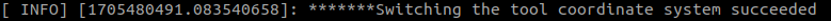

### 1.3 Getting the current state of the robotic arm

Firstly, run the rm_driver node of the robotic arm.

```
roslaunch rm_driver rm_<arm_type>_driver.launch
```

`<arm_type>` is the actual model of the robotic arm, and the supported models include 65, 63, ECO65, 75, and GEN72.

For the 65 robotic arm, its start command is as follows:

```
roslaunch rm_driver rm_65_driver.launch
```

After the node is started successfully, execute the following command to run the node to get the current state of the robotic arm.

```
rosrun rm_demo api_Get_Arm_State_demo
```

If the following command appears, the state is obtained successfully.

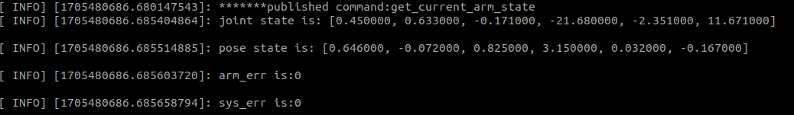

In the interface, there is the current joint angle, as well as the current end effector position and orientation (Euler angle) of the robotic arm.

### 1.4 MoveJ

The robotic arm is controlled for MoveJ through the following commands.

Firstly, run the rm_driver node of the robotic arm.

```
roslaunch rm_driver rm_<arm_type>_driver.launch
```

`<arm_type>` is the actual model of the robotic arm, and the supported models include 65, 63, ECO65, 75, and GEN72.

For the 65 robotic arm, its start command is as follows:

```
roslaunch rm_driver rm_65_driver.launch
```

After the node is started successfully, execute the following command to control the robotic arm for motion.

```
rosrun rm_demo api_moveJ_demo _Arm_Dof:=6
```

The _Arm_Dof in the command refers to the current degree of freedom of the robotic arm, which is optional for 6 and 7.

For example, to start a 7-DoF robotic arm, the following command is executed.

```
rosrun rm_demo api_moveJ_demo _Arm_Dof:=7
```

If execution succeeds, the joints of the robotic arm will rotate, and the following information will be displayed on the screen.

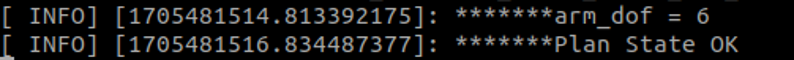

### 1.5 MoveJ_P

The robotic arm is controlled for MoveJ_P through the following commands.

Firstly, run the rm_driver node of the robotic arm.

```
roslaunch rm_driver rm_<arm_type>_driver.launch
```

`<arm_type>` is the actual model of the robotic arm, and the supported models include 65, 63, ECO65, 75, and GEN72.

For the 65 robotic arm, its start command is as follows:

```
roslaunch rm_driver rm_65_driver.launch
```

After the node is started successfully, execute the following command to control the robotic arm for motion.

```
rosrun rm_demo api_moveJ_P_demo
```

If execution succeeds, the following prompt will appear on the screen, and the robotic arm will move to the given pose.

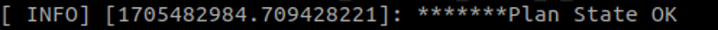

### 1.6 MoveL

The robotic arm is controlled for MoveL through the following commands.

Firstly, run the rm_driver node of the robotic arm.

```
roslaunch rm_driver rm_<arm_type>_driver.launch
```

`<arm_type>` is the actual model of the robotic arm, and the supported models include 65, 63, ECO65, 75, and GEN72.

For the 65 robotic arm, its start command is as follows:

```
roslaunch rm_driver rm_65_driver.launch
```

After the node is started successfully, execute the following command to control the robotic arm for motion.

```
rosrun rm_demo api_moveL_demo
```

If execution succeeds, the following prompt will appear on the screen, and the robotic arm will move to the given pose through MoveJ_P first, and then move through MoveL.

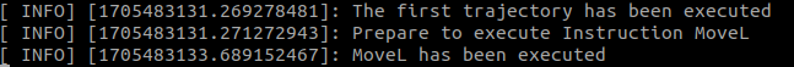

### 1.7 Scene planning

The robotic arm is controlled for scene planning through the following commands.

Firstly, run the moveit node of the virtual robotic arm.

```
roslaunch rm_<arm_type>_moveit_config demo.launch
```

`<arm_type>` is the actual model of the robotic arm, and the supported models include 65, 63, ECO65, 75, and GEN72.

For the 65 robotic arm, its start command is as follows:

```
roslaunch rm_65_moveit_config demo.launch
```

After the node is started successfully, the following rviz interface will pop up.


Because this demo uses the MoveItVisualTools to control the program running, the RvizVisualToolsGui is added as follows: click Add New Panel in rviz.

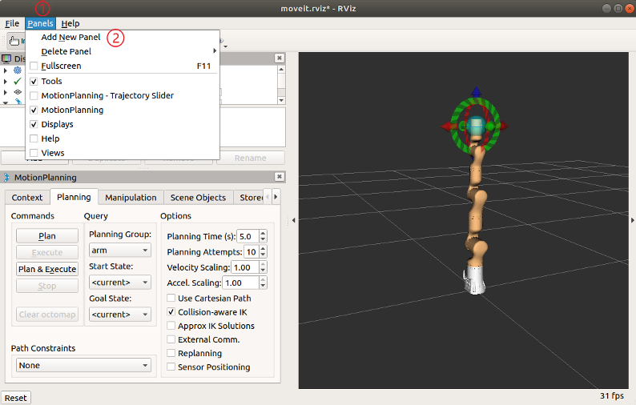

Add the RvizVisualToolsGui to rviz.

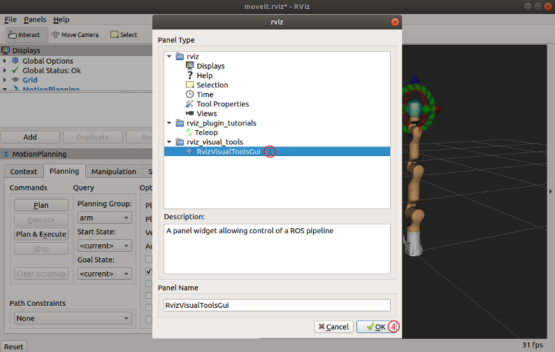

Open a new terminal and execute the following command to start the scene planning node:

```
roslaunch rm_demo arm_<arm_type>_planning_scene_ros_api_demo
```

After the scene planning node is started successfully, click the Next button in the RvizVisualToolsGui panel to run the program.

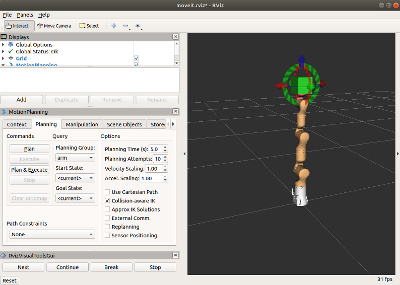

Click the Next button several times until the execution is complete, and the scene planning node will exit.

### 1.8 Obstacle avoidance planning

The robotic arm is controlled for obstacle avoidance planning through the following commands.

Firstly, run the moveit node of the virtual robotic arm.

```
roslaunch rm_<arm_type>_moveit_config demo.launch
```

`<arm_type>` is the actual model of the robotic arm, and the supported models include 65, 63, ECO65, 75, and GEN72.

For the 65 robotic arm, its start command is as follows:

```
roslaunch rm_65_moveit_config demo.launch
```

After the node is started successfully, the following rviz interface will pop up.

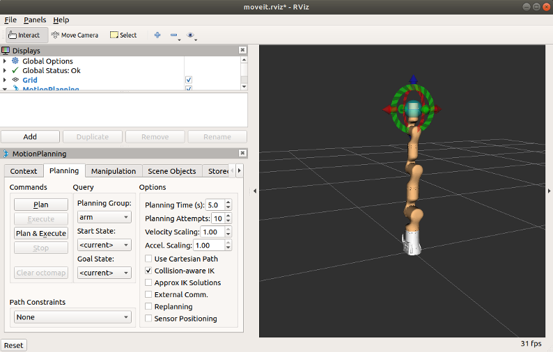

Open a new terminal and execute the following command to start the obstacle avoidance planning node:

```
rosrun rm_demo rm_<arm_type>_moveit_obstacles_demo.py
```

`<arm_type>` is the actual model of the robotic arm, and the supported models include 65, 63, ECO65, 75, and GEN72.

For the 65 robotic arm, its start command is as follows:

```
roslaunch rm_65_moveit_config demo.launch
```

After the node runs, it can be seen in rviz that a table is added in the scene, and the robot moves to the forward pose and finally returns to the zero pose from the forward pose, avoiding the table automatically.

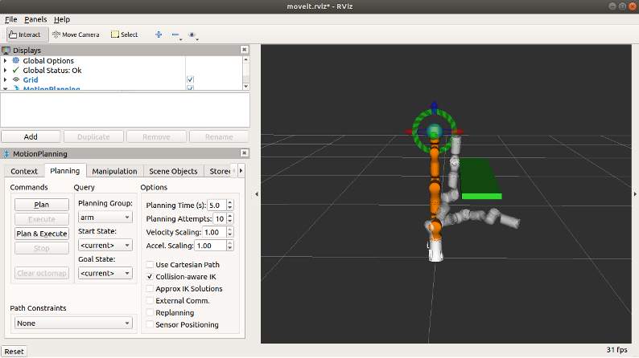

### 1.9 Picking and placing

The robotic arm is controlled to pick and place through the following commands.

Firstly, run the moveit node of the virtual robotic arm.

```
roslaunch rm_<arm_type>_moveit_config demo.launch
```

`<arm_type>` is the actual model of the robotic arm, and the supported models include 65, 63, ECO65, 75, and GEN72.

For the 65 robotic arm, its start command is as follows:

```
roslaunch rm_65_moveit_config demo.launch
```

After the node is started successfully, the following rviz interface will pop up.

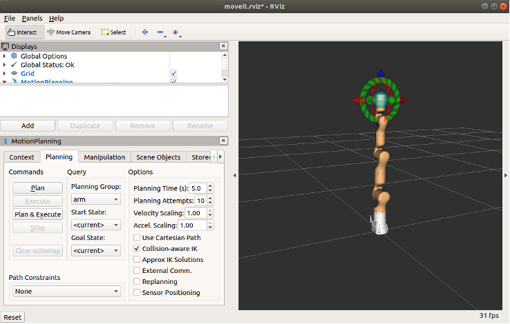

Open a new terminal and execute the following command to start the pick_place_demo node:

```
rosrun rm_demo rm_<arm_type>_pick_place_demo
```

`<arm_type>` is the actual model of the robotic arm, and the supported models include 65, 63, ECO65, 75, and GEN72.

For the 65 robotic arm, its start command is as follows:

```
roslaunch rm_65_moveit_config demo.launch
```

After the node runs, it can be seen in rviz that three objects are added to the scene, including two tables and a target. The robot moves to the location of the target, picks up the target on one table, then places the target on another table, and finally returns to the zero pose.

## 2. Structure description of the rm_example package

### 2.1 File overview

The current rm_example package consists of the following files.
```
├── CMakeLists.txt  # Build rule file
├── launch
│ └── planning_scene_ros_api_demo.launch
├── package.xml
├── scripts
│ ├── getHSV.py
│ ├── moveit_obstacles_demo.py
│ ├── moveit_plan_and_stop.py
│ ├── rm_63_moveit_obstacles_demo.py #RML63 obstacle avoidance program
│ ├── rm_65_moveit_obstacles_demo.py #RM65 obstacle avoidance program
│ ├── rm_75_moveit_obstacles_demo.py #RM75 obstacle avoidance program
│ ├── rm_eco65_moveit_obstacles_demo.py #ECO65 obstacle avoidance program
│ ├── rm_gen72_moveit_obstacles_demo.py #GEN72 obstacle avoidance program
│ └── test_rgb.py
└── src
├── api_ChangeToolName_demo.cpp #Source code of changing the tool frame
├── api_ChangeWorkFrame_demo.cpp #Source code of changing the work frame
├── api_eco65_pick_place_demo.cpp #Source code of picking and placing
├── api_gen72_moveJ_P_demo.cpp #Source code of GEN72 moveJ_P
├── api_gen72_moveL_demo.cpp #Source code of GEN72 moveL
├── api_gen72_pick_place_demo.cpp #Source code of picking and placing
├── api_getArmCurrentState.cpp #Getting the current state of the robotic arm
├── api_Get_Arm_State_demo.cpp #Getting the state of the robotic arm
├── api_moveJ_demo.cpp #MoveJ
├── api_moveJ_P_demo.cpp #MoveJ_P
├── api_moveL_demo.cpp #MoveL
├── api_rm65_pick_place_demo.cpp #Source code of picking and placing
├── api_rm75_pick_place_demo.cpp #Source code of picking and placing
├── api_rml63_pick_place_demo.cpp #Source code of picking and placing
├── api_teach_demo.cpp #Teaching source code
├── arm_63_planning_scene_ros_api_demo.cpp #Source code of RML63 scene planning
├── arm_65_planning_scene_ros_api_demo.cpp #Source code of RM65 scene planning
├── arm_75_planning_scene_ros_api_demo.cpp #Source code of RM75 scene planning
├── arm_eco65_planning_scene_ros_api_demo.cpp #Source code of ECO65 scene planning
├── arm_gen72_planning_scene_ros_api_demo.cpp#Source code of GEN72 scene planning
├── planning_scene_ros_api_demo.cpp
└── test_api_movel.cpp
```

## 3. Topic description of the rm_example package

### 3.1 Description of changing the work frame

The data communication diagram of this node is as follows:

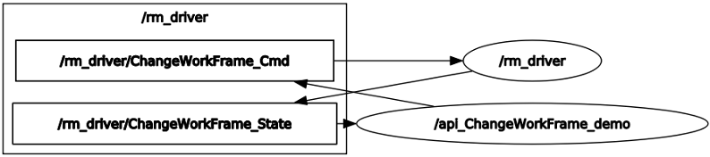

From the diagram, the main communication topics between the /api_ChangeWorkFrame_demo node and /rm_driver are /rm_driver/ChangeWorkFrame_State and /rm_driver/ChangeWorkFrame_Cmd. The /rm_driver/ChangeWorkFrame_Cmd indicates the change request and publishes the target frame, and the /rm_driver/ChangeWorkFrame_State indicates the change result.

### 3.2 Description of changing the tool frame

The data communication diagram of this node is as follows:

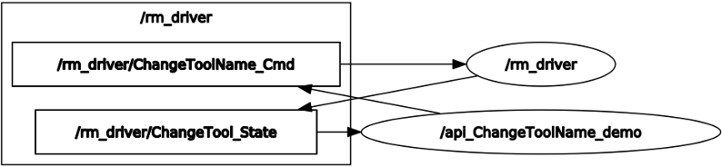

From the diagram, the main communication topics between the /api_ChangeToolName_demo node and /rm_driver are /rm_driver/ChangeTool_State and /rm_driver/ChangeToolName_Cmd. The /rm_driver/ChangeToolName_Cmd indicates the change request and publishes the target frame, and the /rm_driver/ChangeTool_State indicates the change result.

### 3.3 Description of rm_get_state

The data communication diagram of this node is as follows:

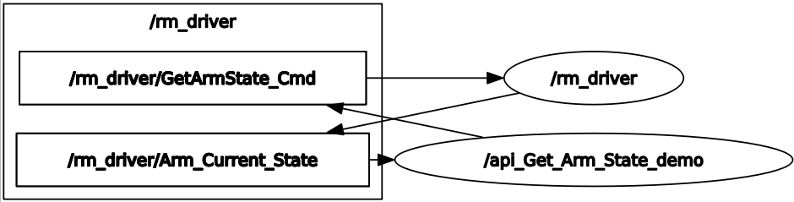

From the diagram, the main communication topics between the /api_Get_Arm_State_demo node and /rm_driver are /rm_driver/Arm_Current_State and /rm_driver/GetArmState_Cmd. The /rm_driver/GetArmState_Cmd indicates the request for the current state of the robotic arm, and the /rm_driver/Arm_Current_State indicates the result of the current state.

### 3.4 Description of moveJ_demo

The data communication diagram of this node is as follows:

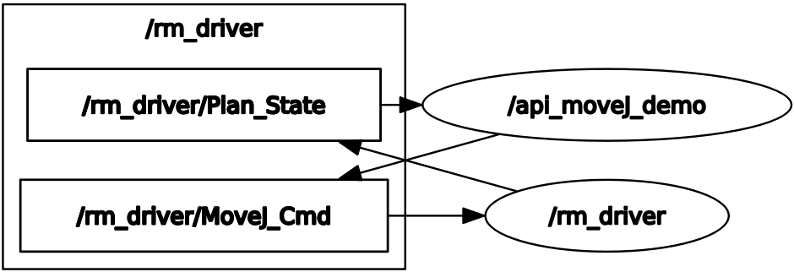

From the diagram, the main communication topics between the /api_moveJ_demo node and /rm_driver are /rm_driver/MoveJ_Cmd and /rm_driver/Plan_State. The /rm_driver/MoveJ_Cmd indicates the request to control the motion of the robotic arm and publishes the radians of each joint to be moved, and the /rm_driver/Plan_State indicates the motion result.

### 3.5 Description of moveJ_P_demo

The data communication diagram of this node is as follows:

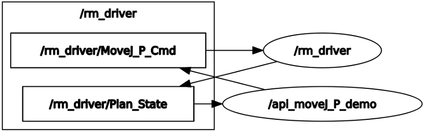

From the diagram, the main communication topics between the /api_moveJ_P_demo node and /rm_driver are /rm_driver/MoveJ_P_Cmd and /rm_driver/Plan_State. The /rm_driver/MoveJ_P_Cmd indicates the request to control the motion of the robotic arm and publishes the coordinates of the target point, and the /rm_driver/Plan_State indicates the motion result.

### 3.6 Description of moveL_demo

The data communication diagram of this node is as follows:

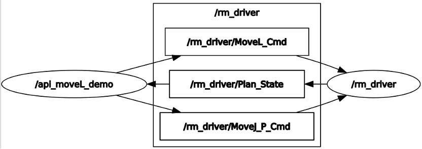

From the diagram, the main communication topics between the /Movel_demo_node and /rm_driver are /rm_driver/MoveJ_P_Cmd, /rm_driver/MoveL_Cmd, and /rm_driver/Plan_State. The /rm_driver/MoveJ_P_Cmd indicates the request to control the motion of the robotic arm and publishes the coordinates of the first target point, and the /rm_driver/Plan_State indicates the motion result. After reaching the first point, the /rm_driver/MoveL_Cmd is executed to publish the pose of the second point for the robotic arm to reach it through linear motion, and the /rm_driver/Plan_State indicates the motion result.

### 3.7 Scene planning

The data communication diagram of this node is as follows:

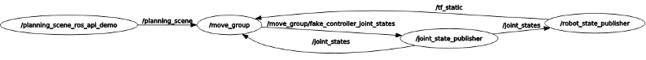

From the diagram, the main communication topic between the /planning_scene_ros_api_demo node and /move_group is /planning_scene, which is adding obstacles. For more information, please refer to its source code.

### 3.8 Obstacle avoidance planning

The data communication diagram of this node is as follows:

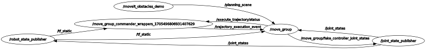

### 3.9 Picking and placing

The data communication diagram of this node is as follows:

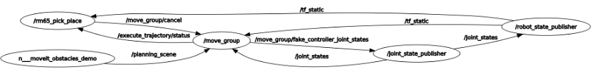
