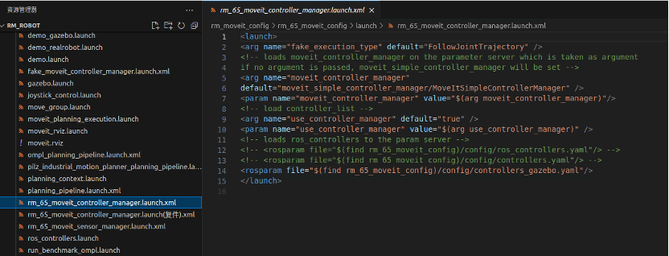
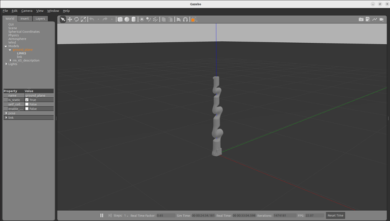
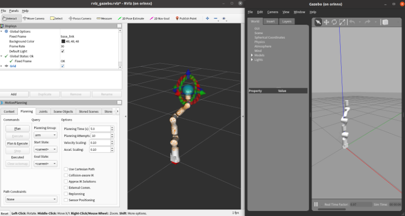

# <p class="hidden">ROS: </p>Introduction to the Rm_gazebo Package

The rm_gazebo package is intended to realize the simulation of Moveit planning for the robotic arm. A virtual robotic arm is built in the simulation environment of the gazebo and then controlled by the Moveit. The package will be introduced in detail in the following aspects.

1. Package application.
2. Package structure description.

The above two parts are provided for users to:

1. Learn how to use the package.
2. Understand the composition and function of files in the package.

Code link: [https://github.com/RealManRobot/rm_robot/tree/main/rm_gazebo](https://github.com/RealManRobot/rm_robot/tree/main/rm_gazebo)

## 1. Application of the rm_gazebo package

### 1.1 Control of the virtual robotic arm

After the environment and package installation is complete, run the rm_gazebo package.

Before running, to modify the relevant configuration file, find the rm_<arm_type>_moveit_controller_manager.launch.xml file via the following path, uncomment the code in the red box below, and comment the previous yaml loading code.



After completing the above operations, run the following command to launch the gazebo virtual space and virtual robotic arm.

```ROS
roslaunch rm_gazebo arm_<arm_type>_bringup_moveit.launch
```

If running succeeds, the following screen will pop up.



The simulation control with the Moveit and gazebo is available after the control interface of rviz appears.



## 2. Structure description of the rm_gazebo package

### 2.1 File overview

The current rm_gazebo package consists of the following files.

```
├── CMakeLists.txt                                      #Build rule file
├── config
│ ├── ECO65                                             #ECO65 simulation configuration file
│ │ ├── arm_gazebo_control.yaml
│ │ ├── arm_gazebo_joint_states.yam                     #Joint state controller
│ │ ├── rm_eco65_trajectory_control.yaml                #Joint controller
│ │ └── trajectory_control.yaml
│ ├── GEN72
│ │ ├── arm_gazebo_control.yaml
│ │ ├── arm_gazebo_joint_states.yaml
│ │ ├── gen_72_trajectory_control.yaml
│ │ ├── rviz_gazebo_bak.rviz
│ │ ├── rviz_gazebo.rviz
│ │ └── trajectory_control.yaml
│ ├── RM65 #Same as the simulation configuration file of ECO65
│ │ ├── arm_gazebo_control.yaml
│ │ ├── arm_gazebo_joint_states.yaml
│ │ ├── rm_65_trajectory_control.yaml
│ │ ├── rviz_gazebo.rviz
│ │ └── trajectory_control.yaml
│ ├── RM75 #Same as the simulation configuration file of ECO65
│ │ ├── arm_gazebo_control.yaml
│ │ ├── arm_gazebo_joint_states.yaml
│ │ ├── rm_75_trajectory_control.yaml
│ │ ├── rviz_gazebo_bak.rviz
│ │ ├── rviz_gazebo.rviz
│ │ └── trajectory_control.yaml
│ └── RML63 #Same as the simulation configuration file of ECO65
│ ├── arm_gazebo_control.yaml
│ ├── arm_gazebo_joint_states.yaml
│ ├── rml_63_trajectory_control.yaml
│ ├── rviz_gazebo.rviz
│ └── trajectory_control.yaml
├── launch
│ ├── arm_63_bringup_moveit.launch                      # gazebo launch file for RML63 simulation
│ ├── arm_65_bringup_moveit.launch                      # gazebo launch file for RM65 simulation
│ ├── arm_75_bringup_moveit.launch                      # gazebo launch file for RM75 simulation
│ ├── arm_eco65_bringup_moveit.launch                      # gazebo launch file for ECO65 simulation
│ ├── arm_gen72_bringup_moveit.launch                      # gazebo launch file for GEN72 simulation
│ ├── ECO65 #ECO65 launch file
│ │ ├── arm_eco65_trajectory_controller.launch          #Launch file of the simulation controller
│ │ ├── rm_eco65_arm_gazebo_states.launch               #State monitoring launch file of the virtual robotic arm
│ │ ├── rm_eco65_arm_trajectory_controller.launch
│ │ └── rm_eco65_arm_world.launch                       #gazebo loading launch file of the virtual robotic arm
│ ├── GEN72 #GEN72 gazebo launch file (same as the ECO65)
│ │ ├── arm_gazebo_states.launch
│ │ ├── arm_gen72_trajectory_controller.launch
│ │ ├── arm_trajectory_controller.launch
│ │ └── arm_world.launch
│ ├── RM65 #RM65 gazebo launch file (same as the ECO65)
│ │ ├── arm_65_trajectory_controller.launch
│ │ ├── rm_65_arm_gazebo_states.launch
│ │ ├── rm_65_arm_trajectory_controller.launch
│ │ └── rm_65_arm_world.launch
│ ├── RM75 #RM75 gazebo launch file (same as the ECO65)
│ │ ├── arm_75_trajectory_controller.launch
│ │ ├── arm_gazebo_states.launch
│ │ ├── arm_trajectory_controller.launch
│ │ └── arm_world.launch
│ └── RML63 #RML63 gazebo launch file (same as the ECO65)
│ ├── arm_gazebo_states.launch
│ ├── arm_trajectory_controller.launch
│ ├── arm_world.launch
│ └── rml_63_trajectory_controller.launch
└── package.xml
```
