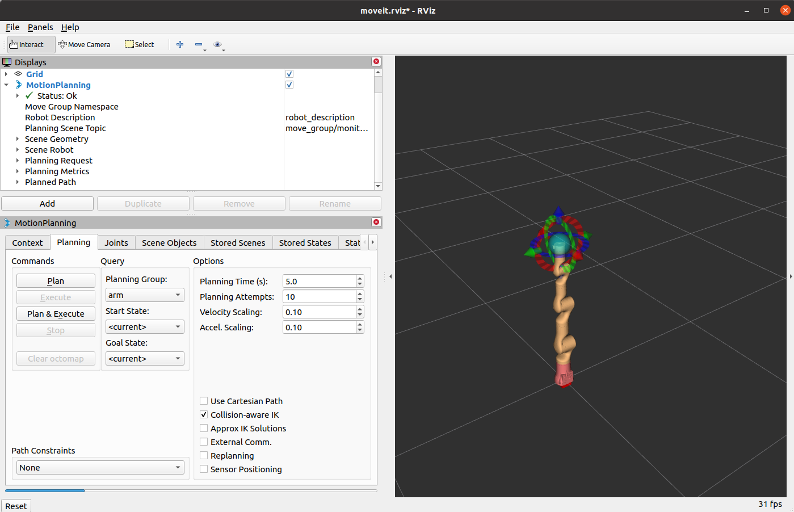
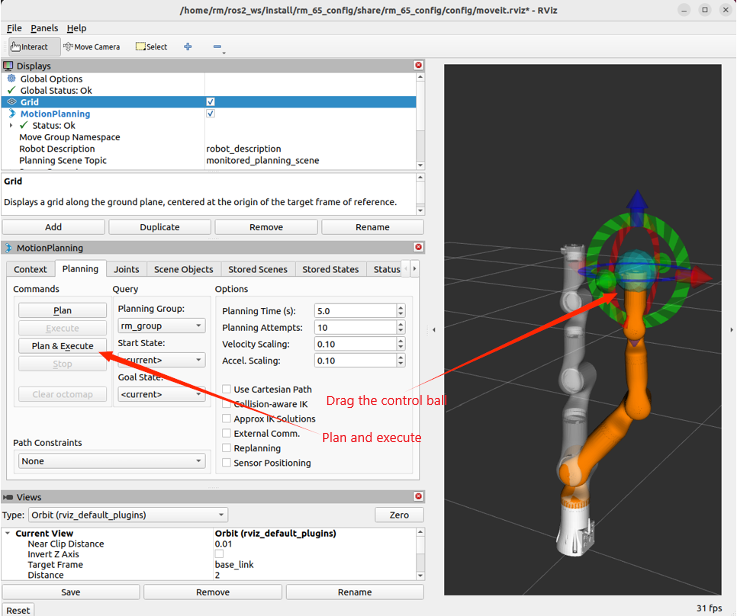
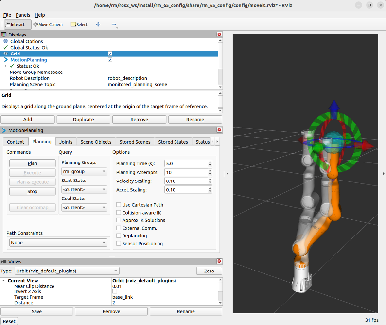
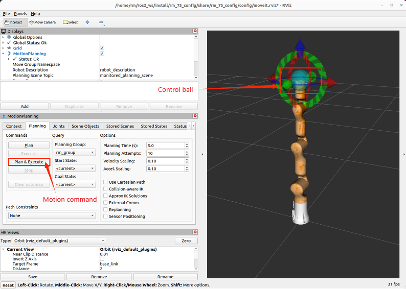
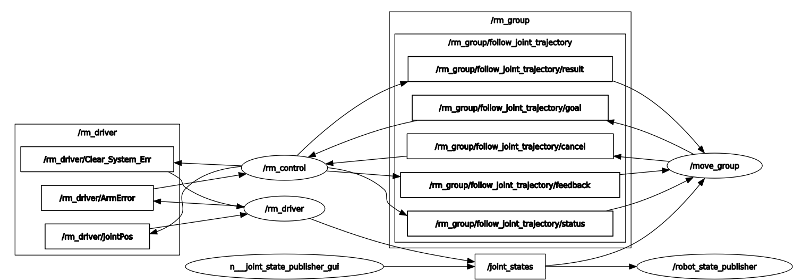

# <p class="hidden">ROS: </p>Introduction to the Rm_moveit_config Package

The rm_moveit_config package is designed for the moveit to control the real robotic arm and is intended to call the official moveit framework to generate the moveit configuration and launch files special for the current robotic arm in combination with the URDF of the robotic arm. Through the package, the moveit is used to control the virtual robotic arm and the real robotic arm.

1. Package application.
2. Package structure description.
3. Package topic description.

The above three parts are provided for users to:

1. Learn how to use the package.
2. Understand the composition and function of files in the package.
3. Know the topics of the package for easy development and use.

Code link: [https://github.com/RealManRobot/rm/robot/tree/main/rm/moveit/config](https://github.com/RealManRobot/rm_robot/tree/main/rm_moveit_config)

## 1. Application of the rm_moveit_config package

### 1.1 Control of the virtual robotic arm with moveit

After the environment configuration and connection are complete, the node can be started directly by the following command.

```
roslaunch rm_<arm_type>_moveit_config demo.launch
```

Generally, the above `<arm_type>` is required for the actual type of the robotic arm, such as 65, ECO65, 75, and GEN72 for the robotic arm, and 65_6f, ECO65_6f, and 75_6f for the 6-DoF force.

The 63 robotic arm is started by the following command, and its 6-DoF force type is 63_6f.
```
roslaunch rml_63_moveit_config demo.launch
```

For the 65 robotic arm, its start command is as follows:
```
roslaunch rm_65_moveit_config demo.launch
```

After the node is started successfully, the following screen will pop up.



Next, drag the control ball to move the robotic arm to the target position, and then click Plan & Execute.



Plan and execute.



### 1.2 Control of the real robotic arm with moveit

More control commands are required to control the real robotic arm, with detailed control modes as follows.

Firstly, run the underlying driver node.

```
roslaunch rm_driver rm_<arm_type>_driver.launch
```

Then, run the relevant nodes of the intermediate rm_control package.
```
roslaunch rm_control rm_<arm_type>_control.launch
```

Finally, start the moveit node to control the real robotic arm.

```
roslaunch rm_<arm_type>_moveit_config demo_realrobot.launch
```

Note that the `<arm_type>` in the above commands is required for the actual type of the robotic arm, such as 65, ECO65, 75, 65_6f, ECO65_6f, 75_6f, and GEN72.

However, for the 63 robotic arm, the following start command should be used. If a 6-DoF force device is installed, the 63 should be changed to 63_6f.

```
roslaunch rml_63_config demo_realrobot.launch
```

After the above operations are complete, the following screen will appear, and the motion of the robotic arm is controlled by dragging the control ball.



## 2. Structure description of the rm_moveit_config package

### 2.1 File overview

The current rm_moveit_config package consists of the following files.

```
    ├── rm_65_moveit_config              #RM65 moveit package
    │   ├── CMakeLists.txt                   #Build rules of the RM65 moveit package
    │   ├── config                           #Parameter file of the RM65 moveit package
    │   │   ├── cartesian_limits.yaml
    │   │   ├── chomp_planning.yaml
    │   │   ├── controllers_gazebo.yaml        #gazebo simulation controller
    │   │   ├── controllers.yaml               #Real robotic arm controller
    │   │   ├── fake_controllers.yaml
    │   │   ├── joint_limits.yaml                #RM65 joint limit
    │   │   ├── kinematics.yaml                #RM65 kinematics parameter
    │   │   ├── ompl_planning.yaml
    │   │   ├── rm_65.srdf                      #Control configuration file of the RM65 moveit
    │   │   ├── controllers.yaml               #RM65 motion controller
    │   │   └── sensors_3d.yaml
    │   ├── launch
    │   │   ├── chomp_planning_pipeline.launch.xml
    │   │   ├── default_warehouse_db.launch
    │   │   ├── demo_gazebo.launch            #Launch file of the virtual RM65 moveit
    │   │   ├── demo.launch                    #Launch file of the virtual RM65 moveit
    │   │   ├── demo_realrobot.launch           #Launch file of the real RM65 moveit
    │   │   ├── fake_moveit_controller_manager.launch.xml
    │   │   ├── gazebo.launch
    │   │   ├── joystick_control.launch
    │   │   ├── move_group.launch
    │   │   ├── moveit_planning_execution.launch
    │   │   ├── moveit.rviz
    │   │   ├── moveit_rviz.launch
    │   │   ├── ompl_planning_pipeline.launch.xml
    │   │   ├── pilz_industrial_motion_planner_planning_pipeline.launch.xml
    │   │   ├── planning_context.launch
    │   │   ├── planning_pipeline.launch.xml
    │   │   ├── rm_65_moveit_controller_manager.launch (copy).xml
    │   │   ├── rm_65_moveit_controller_manager.launch.xml
    │   │   ├── rm_65_moveit_sensor_manager.launch.xml
    │   │   ├── ros_controllers.launch
    │   │   ├── run_benchmark_ompl.launch
    │   │   ├── sensor_manager.launch.xml
    │   │   ├── setup_assistant.launch
    │   │   ├── trajectory_execution.launch (copy).xml
    │   │   ├── trajectory_execution.launch.xml
    │   │   ├── warehouse.launch
    │   │   └── warehouse_settings.launch.xml
    │   └── package.xml
    ├── rm_75_moveit_config           #RM75 moveit package (refer to RM65 for details)
    │   ├── CMakeLists.txt
    │   ├── config
    │   │   ├── cartesian_limits.yaml
    │   │   ├── chomp_planning.yaml
    │   │   ├── controllers_gazebo.yaml
    │   │   ├── controllers.yaml
    │   │   ├── fake_controllers.yaml
    │   │   ├── joint_limits.yaml
    │   │   ├── kinematics.yaml
    │   │   ├── ompl_planning.yaml
    │   │   ├── rm_75.srdf
    │   │   ├── ros_controllers.yaml
    │   │   └── sensors_3d.yaml
    │   ├── launch
    │   │   ├── chomp_planning_pipeline.launch.xml
    │   │   ├── default_warehouse_db.launch
    │   │   ├── demo_gazebo.launch
    │   │   ├── demo.launch
    │   │   ├── demo_realrobot.launch
    │   │   ├── fake_moveit_controller_manager.launch.xml
    │   │   ├── gazebo.launch
    │   │   ├── joystick_control.launch
    │   │   ├── move_group.launch
    │   │   ├── moveit_planning_execution.launch
    │   │   ├── moveit.rviz
    │   │   ├── moveit_rviz.launch
    │   │   ├── ompl_planning_pipeline.launch.xml
    │   │   ├── pilz_industrial_motion_planner_planning_pipeline.launch.xml
    │   │   ├── planning_context.launch
    │   │   ├── planning_pipeline.launch.xml
    │   │   ├── rm_75_moveit_controller_manager.launch (copy).xml
    │   │   ├── rm_75_moveit_controller_manager.launch.xml
    │   │   ├── rm_75_moveit_sensor_manager.launch.xml
    │   │   ├── ros_controllers.launch
    │   │   ├── run_benchmark_ompl.launch
    │   │   ├── sensor_manager.launch.xml
    │   │   ├── setup_assistant.launch
    │   │   ├── trajectory_execution.launch.xml
    │   │   ├── warehouse.launch
    │   │   └── warehouse_settings.launch.xml
    │   └── package.xml
    ├── rm_eco65_moveit_config           #ECO65 moveit package (refer to RM65 for details)
    │   ├── CMakeLists.txt
    │   ├── config
    │   │   ├── cartesian_limits.yaml
    │   │   ├── chomp_planning.yaml
    │   │   ├── controllers_gazebo.yaml
    │   │   ├── controllers.yaml
    │   │   ├── fake_controllers.yaml
    │   │   ├── gazebo_controllers.yaml
    │   │   ├── gazebo_rm_eco65.urdf
    │   │   ├── joint_limits.yaml
    │   │   ├── kinematics.yaml
    │   │   ├── ompl_planning.yaml
    │   │   ├── rm_eco65.srdf
    │   │   ├── ros_controllers.yaml
    │   │   ├── sensors_3d.yaml
    │   │   ├── simple_moveit_controllers.yaml
    │   │   └── stomp_planning.yaml
    │   ├── launch
    │   │   ├── chomp_planning_pipeline.launch.xml
    │   │   ├── default_warehouse_db.launch
    │   │   ├── demo_gazebo.launch
    │   │   ├── demo.launch
    │   │   ├── demo_realrobot.launch
    │   │   ├── fake_moveit_controller_manager.launch.xml
    │   │   ├── gazebo.launch
    │   │   ├── joystick_control.launch
    │   │   ├── move_group.launch
    │   │   ├── moveit_planning_execution.launch
    │   │   ├── moveit.rviz
    │   │   ├── moveit_rviz.launch
    │   │   ├── ompl-chomp_planning_pipeline.launch.xml
    │   │   ├── ompl_planning_pipeline.launch.xml
    │   │   ├── pilz_industrial_motion_planner_planning_pipeline.launch.xml
    │   │   ├── planning_context.launch
    │   │   ├── planning_pipeline.launch.xml
    │   │   ├── rm_eco65_moveit_controller_manager.launch copy.xml
    │   │   ├── rm_eco65_moveit_controller_manager.launch.xml
    │   │   ├── rm_eco65_moveit_sensor_manager.launch.xml
    │   │   ├── ros_controllers.launch
    │   │   ├── ros_control_moveit_controller_manager.launch.xml
    │   │   ├── run_benchmark_ompl.launch
    │   │   ├── sensor_manager.launch.xml
    │   │   ├── setup_assistant.launch
    │   │   ├── simple_moveit_controller_manager.launch.xml
    │   │   ├── stomp_planning_pipeline.launch.xml
    │   │   ├── trajectory_execution.launch.xml
    │   │   ├── warehouse.launch
    │   │   └── warehouse_settings.launch.xml
    │   └── package.xml
    └── rml_63_moveit_config          #RML63 moveit package (refer to RM65 for details)
        ├── CMakeLists.txt
        ├── config
        │   ├── cartesian_limits.yaml
        │   ├── chomp_planning.yaml
        │   ├── controllers_gazebo.yaml
        │   ├── controllers.yaml
        │   ├── fake_controllers.yaml
        │   ├── joint_limits.yaml
        │   ├── kinematics.yaml
        │   ├── ompl_planning.yaml
        │   ├── rml_63_description.srdf
        │   ├── ros_controllers.yaml
        │   └── sensors_3d.yaml
        ├── launch
        │   ├── chomp_planning_pipeline.launch.xml
        │   ├── default_warehouse_db.launch
        │   ├── demo_gazebo.launch
        │   ├── demo.launch
        │   ├── demo_realrobot.launch
        │   ├── fake_moveit_controller_manager.launch (copy).xml
        │   ├── fake_moveit_controller_manager.launch.xml
        │   ├── gazebo.launch
        │   ├── joystick_control.launch
        │   ├── move_group.launch
        │   ├── moveit_planning_execution.launch
        │   ├── moveit.rviz
        │   ├── moveit_rviz.launch
        │   ├── ompl_planning_pipeline.launch.xml
        │   ├── pilz_industrial_motion_planner_planning_pipeline.launch.xml
        │   ├── planning_context.launch
        │   ├── planning_pipeline.launch.xml
        │   ├── rml_63_description_moveit_controller_manager.launch.xml
        │   ├── rml_63_description_moveit_sensor_manager.launch.xml
        │   ├── ros_controllers.launch
        │   ├── run_benchmark_ompl.launch
        │   ├── sensor_manager.launch.xml
        │   ├── setup_assistant.launch
        │   ├── trajectory_execution.launch.xml
        │   ├── warehouse.launch
        │   └── warehouse_settings.launch.xml
        └── package.xml
```

## 3. Topic description of the rm_moveit_config package

To make the topic structure more clear, the topics of the moveit are reviewed and explained here in the data flow diagram.

After starting the above node to control the real robotic arm, you can run the following command to check the state of the current topic.

```
rosrun rqt_graph rqt_graph
```

If running succeeds, the following diagram will appear.



The diagram shows the topic communication between the currently running nodes and other nodes. For the /rm_driver node, it subscribes to and publishes the following topics during the moveit runtime.

As shown in the diagram, the topic /joint_states published by the rm_driver is continuously subscribed by the /robot_state_publisher node and /move_group node. The /robot_state_publisher receives the /joint_states to continuously publish the TF between joints, and the /move_group, as a related node of the moveit, subscribes to the topic because the moveit needs to get the real-time joint state of the current robotic arm during planning.

From the diagram, it can be seen that the rm_driver subscribes to the topic /rm_driver/jointPos of the rm_control, which is the topic of the pass-through function of the robotic arm. Through the topic, the rm_control publishes the planned joint position to the rm_driver node to control the robotic arm for motion.

The rm_control is the communication bridge between the rm_driver and the moveit. It communicates with the /move_group through the /rm_group /follow_joint_trajectory, gets the planned trajectory, performs interpolation operations, and sends the interpolated data to the rm_driver in a pass-through manner.
