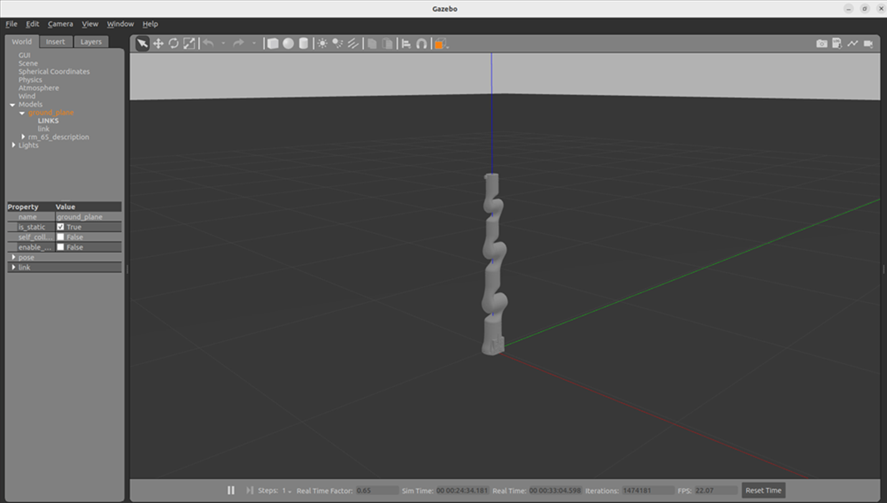
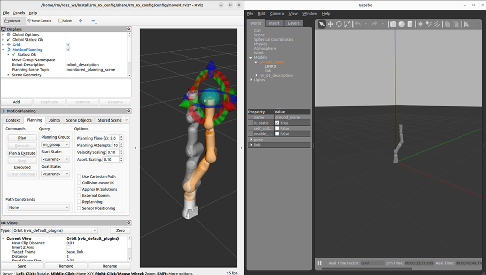

# <p class="hidden">ROS2: </p>Introduction to the Rm_bringup Package

The rm_bringup package is intended to enable multiple launch files to run at the same time and is used to start a complex function combining multiple nodes with one command.

The package will be introduced in detail from the following three aspects with different purposes:

* 1. Package application: Learn how to use the rm_bringup package.
* 2. Package structure description: Understand the composition and function of files in the rm_bringup package.
* 3. Package topic description: Know the topics of the rm_bringup package for easy development and use.

Code link: [https://github.com/RealManRobot/ros2_rm_robot/tree/main/rm_bringup](https://github.com/RealManRobot/ros2_rm_robot/tree/main/rm_bringup)

## 1. Application of the rm_bringup package

### 1.1 Control of the real robotic arm with moveit2

After the environment configuration and connection are complete, the node can be started directly by the following command to run the launch.py file in the rm_bringup package.

```
ros2 launch rm_bringup rm_<arm_type>_bringup.launch.py
```

Generally, the above `<arm_type>` is required for the actual type of the robotic arm and optional for 65, 63, ECO65, 75, and GEN72.
For the 65 robotic arm, its start command is as follows:

```
ros2 launch rm_bringup rm_65_bringup.launch.py
```

After the node is started successfully, the following screen will pop up.
  
The launch.py file enables the moveit2 to control the real robotic arm. Then, the control ball is available for planning and controlling the motion of the robotic arm. For details, please refer to [rm_moveit2_config](../moveit2Config/index.md).

### 1.2 Control of the virtual robotic arm in the gazebo

The gazebo node can be started directly by running the launch.py file in the rm_bringup package.

```
ros2 launch rm_bringup rm_<arm_type>_gazebo.launch.py
```

Generally, the above `<arm_type>` is required for the actual type of the robotic arm and optional for 65, 63, ECO65, 75, and GEN72.
For the 65 robotic arm, its start command is as follows:

```
ros2 launch rm_bringup rm_65_gazebo.launch.py
```

After the node is started successfully, the following screen will pop up.
  
Then, the following command is executed to start moveit2 to control the virtual robotic arm in the gazebo.


## 2. Structure description of the rm_bringup package

### 2.1 File overview

The current rm_bringup package consists of the following files.

```
├── CMakeLists.txt                               #Build rule file
├── doc                                 #Folder for auxiliary documents and images
│   ├── rm_bringup1.png                 #Image 1
│   ├── rm_bringup2.png                 #Image 2
│   └── rm_bringup3.png                 #Image 3
├── launch                            #Launch file
│   ├── rm_63_bringup.launch.py         #RML63 moveit2 launch file
│   ├── rm_65_bringup.launch.py         #RM65 moveit2 launch file
│   ├── rm_75_bringup.launch.py         #RM75 moveit2 launch file
│   ├── rm_75_gazebo.launch.py          #RM75 gazebo launch file
│   ├── rm_eco65_bringup.launch.py      #ECO65 moveit2 launch file
│   └── rm_gen72_bringup.launch.py      #GEN72 moveit2 launch file
├── package.xml                         #Dependency declaration file
├── README_CN.md                        #Readme (Chinese)
└── README.md                           #Readme (English)
```

## 3. Topic description of the rm_bringup package

The package does not have any topics at present, but it calls the topic from other packages.
