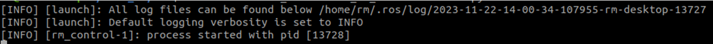
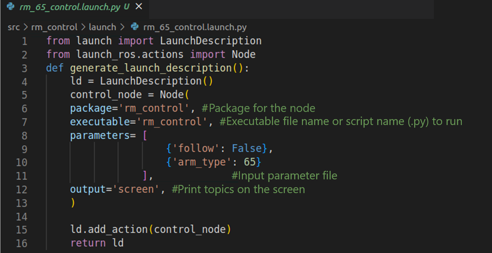

# <p class="hidden">ROS2: </p>Introduction to the Rm_control Package

The rm_control package is essential for the moveit2 to control the real robotic arm. It is intended to subdivide the trajectory planned by the moveit2 and send the subdivided trajectory to the rm_driver in a pass-through manner to realize the planned motion of the robotic arm.
The package will be introduced in detail from the following three aspects with different purposes:

* 1. Package application: Learn how to use the package.
* 2. Package structure description: Understand the composition and function of files in the package.
* 3. Package topic description: Know the topics of the package for easy development and use.

Code link: [https://github.com/RealManRobot/ros2_rm_robot/tree/main/rm_control](https://github.com/RealManRobot/ros2_rm_robot/tree/main/rm_control)

## 1. Application of the rm_control package

### 1.1 Basic use of the package

After the environment configuration and connection are complete, the node can be started directly by the following command to run the rm_control package.

```
ros2 launch  rm_control rm_<arm_type>_control.launch.py
```

Generally, the above `<arm_type>` is required for the actual type of the robotic arm and optional for 65, 63, ECO65, 75, and GEN72.
For the 65 robotic arm, its start command is as follows:

```
ros2 launch  rm_control rm_65_control.launch.py
```

After the node is started successfully, the following screen will pop up.

The note is valid only with the rm_driver package and related nodes of the moveit2. For details, please refer to "rm_moveit2_config".

### 1.2 Advanced use of the package

Some parameters can be set in the rm_control package. Due to small quantities, the parameters are directly set in the launch file.

As shown in the image above, the area in the first red box indicates the path of the file, and the area in the second red box indicates the currently configurable parameters.
The parameter follow refers to the follow mode used for the current pass-through manner, with true for high follow and false for low follow. The high follow means that the motion mode of the robotic arm is completely consistent with the pass-through manner, and a detailed computation is required according to the pass-through rate, and the speed and acceleration of the robotic arm. Therefore, it features a high-use threshold, but a fine control. The low follow means that the robotic arm generally moves to the pass-through point according to the pass-through rate, speed, and acceleration. If there is a point that is too late to reach, it may be discarded. Therefore, it features a low-use threshold and simple control, but it satisfies the requirements of most scenes.
The arm_type refers to the current type of the robotic arm, which is optional for 65 (RM65), 651 (ECO65), 632 (RML63), 75 (RM75), and 72 (GEN72).
In actual use, choose and activate the launch file and the correct type will be automatically set. If you have special requirements, modify the parameters here. After the modification, rebuild the modified parameter in the workspace directory to make it take effect.
Run the colcon build command in the workspace directory.

```
colcon build
```

After the build succeeds, the package can be started by the above commands.

## 2. Structure description of the rm_control package

### 2.1 File overview

The current rm_control package consists of the following files.

```
├── CMakeLists.txt             #Build rule file
├── doc                                 #Folder for auxiliary documents and images
│   ├── rm_control1.png             
│   └── rm_control2.png             
├── include                         #Dependency header file folder
├── cubicSpline.h              #Cubic spline interpolation header file
│   └── rm_control.h                #rm_control header file
├── launch
│   ├── rm_63_control.launch.py     #RML63 launch file
│   ├── rm_65_control.launch.py     #RM65 launch file
│   ├── rm_75_control.launch.py     #RM75 launch file
│   ├── rm_eco65_control.launch.py  #ECO65 launch file
│   └── rm_gen72_control.launch.py  #GEN72 launch file
├── package.xml                       #Dependency declaration file
├── README_CN.md
├── README.md
└── src
└── rm_control.cpp             #Source code file
```

## 3. Topic description of the rm_control package

The following are the topics of the package:

```
  Subscribers:
    /parameter_events: rcl_interfaces/msg/ParameterEvent
  Publishers:
    /parameter_events: rcl_interfaces/msg/ParameterEvent
    /rm_driver/movej_canfd_cmd: rm_ros_interfaces/msg/Jointpos
    /rosout: rcl_interfaces/msg/Log
  Service Servers:
    /rm_control/describe_parameters: rcl_interfaces/srv/DescribeParameters
    /rm_control/get_parameter_types: rcl_interfaces/srv/GetParameterTypes
    /rm_control/get_parameters: rcl_interfaces/srv/GetParameters
    /rm_control/list_parameters: rcl_interfaces/srv/ListParameters
    /rm_control/set_parameters: rcl_interfaces/srv/SetParameters
    /rm_control/set_parameters_atomically: rcl_interfaces/srv/SetParametersAtomically
  Service Clients:

  Action Servers:
    /rm_group_controller/follow_joint_trajectory: control_msgs/action/FollowJointTrajectory
  Action Clients:
```
  
Publishers: refers to the topic currently published, mainly including:

- rm_driver/movej_canfd_cmd. Through this topic, the subdivided trajectory is published to the rm_driver, and then the rm_driver sends the trajectory to the robotic arm through a pass-through command.

Action Servers: refers to the action accepted and published:

- The rm_group_controller/follow_joint_trajectory action is a communication bridge between the rm_control and the moveit2. Through this action, the rm_control receives the trajectory planned by moveit2, then subdivides the trajectory and sends it to the rm_driver through the above topic.
