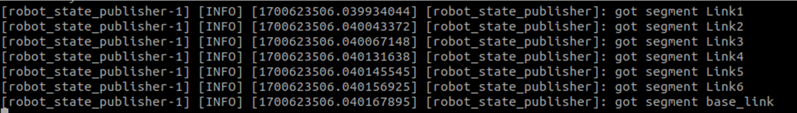
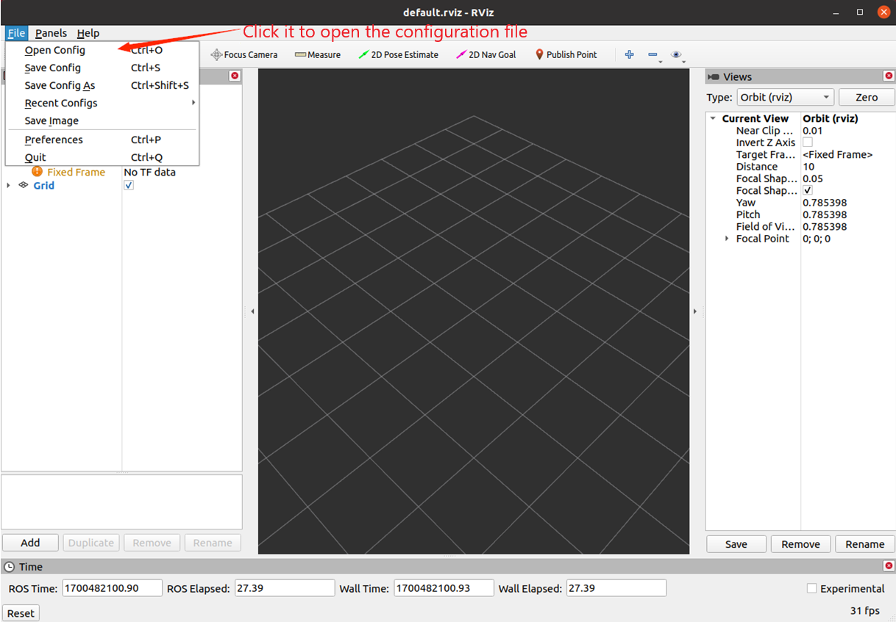
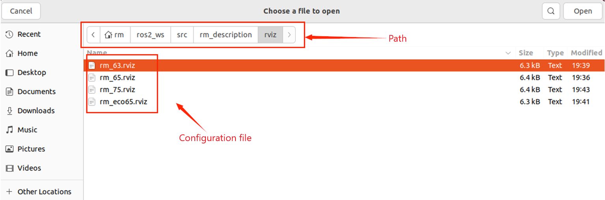
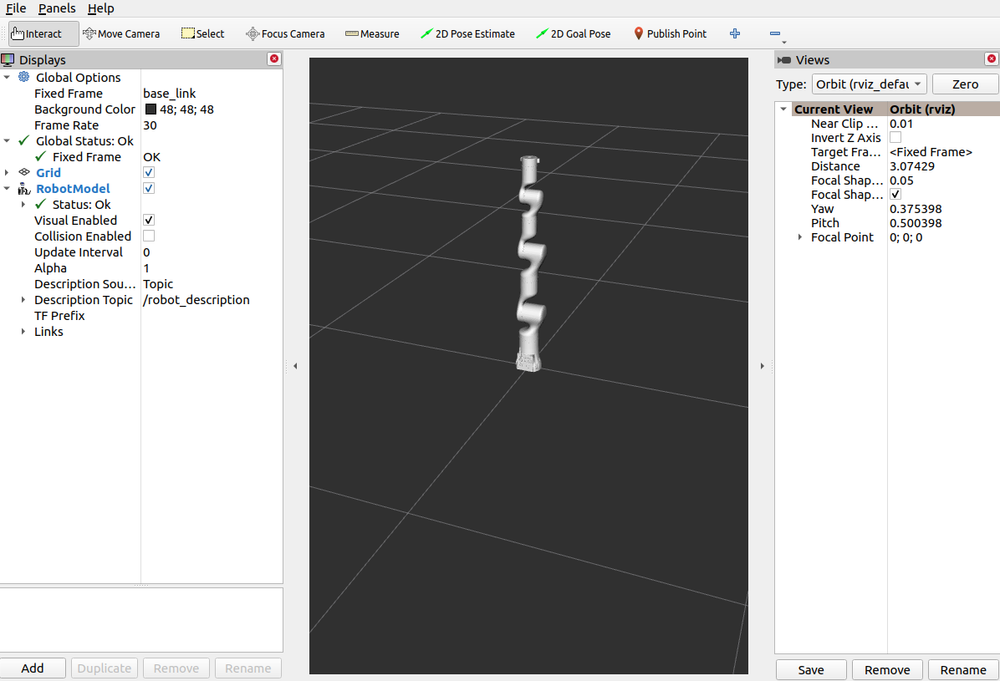

# <p class="hidden">ROS2: </p>Introduction to the Rm_description Package

The rm_description package is intended to display the robot model and TF, through which, the virtual robotic arm in the computer is linked with the real robotic arm in reality. Additionally, it is important for the control of moveit2.
The package will be introduced in detail from the following three aspects with different purposes:

* 1. Package application: Learn how to use the package.
* 2. Package structure description: Understand the composition and function of files in the package.
* 3. Package topic description: Know the topics of the package for easy development and use.

Code link: [https://github.com/RealManRobot/ros2_rm_robot/tree/main/rm_description](https://github.com/RealManRobot/ros2_rm_robot/tree/main/rm_description)

## 1. Application of the rm_description package

After the environment configuration and connection are complete, the node can be started directly by the following command to run the rm_description package.

```
ros2 launch rm_description rm_<arm_type>_display.launch.py
```

Generally, the above `<arm_type>` is required for the actual type of the robotic arm and optional for 65, 63, ECO65, 75, and GEN72.
For the 65 robotic arm, its start command is as follows:

```
ros2 launch rm_description rm_65_display.launch.py
```

After the node is started successfully, the following screen will pop up.

Then, start the rm_driver node.

```
ros2 launch rm_driver rm_<arm_type>_driver.launch.py
```

After a successful start, check the state of the robotic arm in the rviz2 and run the following command to start the rviz2.

```
rviz2
```

Open the robot model with the following configuration.

Locate the corresponding configuration file in the rviz folder of the rm_description package.

After loading, the current state of the robotic arm is available in the rviz2.


## 2. Structure description of the rm_description package

```
├── CMakeLists.txt             #Build rule file
├── launch
│   ├── rm_63_display.launch.py     #RML63 launch file
│   ├── rm_65_display.launch.py     #RM65 launch file
│   ├── rm_75_display.launch.py     #RM75 launch file
│   ├── rm_eco65_display.launch.py  #ECO65 launch file
│   └── rm_gen72_display.launch.py  #GEN72 launch file
├── meshes                          #Folder for model file
│   ├── rm_63_arm                   #Folder for RML63 model file
│   │   ├── base_link.STL
│   │   ├── link1.STL
│   │   ├── link2.STL
│   │   ├── link3.STL
│   │   ├── link4.STL
│   │   ├── link5.STL
│   │   └── link6.STL
│   ├── rm_65_arm                 #Folder for RM65 model file
│   │   ├── base_link.STL
│   │   ├── link1.STL
│   │   ├── link2.STL
│   │   ├── link3.STL
│   │   ├── link4.STL
│   │   ├── link5.STL
│   │   └── link6.STL
│   ├── rm_75_arm                   #Folder for RM75 model file
│   │   ├── base_link.STL
│   │   ├── link1.STL
│   │   ├── link2.STL
│   │   ├── link3.STL
│   │   ├── link4.STL
│   │   ├── link5.STL
│   │   ├── link6.STL
│   │   └── link7.STL
│   └── rm_eco65_arm              #Folder for ECO65 model file
│   │   ├── baselink.STL
│   │   ├── Link1.STL
│   │   ├── Link2.STL
│   │   ├── Link3.STL
│   │   ├── Link4.STL
│   │   ├── Link5.STL
│   │   └── Link6.STL
│   └── rm_gen72_arm              #Folder for GEN72 model file
│       ├── base_link.STL
│       ├── Link1.STL
│       ├── Link2.STL
│       ├── Link3.STL
│       ├── Link4.STL
│       ├── Link5.STL
│       ├── Link6.STL
│       └── Link7.STL
├── package.xml
├── rviz                          #Folder for rviz2 configuration file
│   ├── rm_63.rviz
│   ├── rm_65.rviz
│   ├── rm_75.rviz
│   ├── rm_eco65.rviz
│   └── rm_gen72.rviz
├── textures
└── urdf
    ├── display_arm.rviz
    ├── rm_65_description.csv
    ├── rm_65_gazebo.urdf               #RM65 gazebo simulation urdf description file
    ├── rm_65.urdf                      #RM65 urdf description file
    ├── rm_75_description.csv
    ├── rm_75_gazebo.urdf               #RM75 gazebo simulation urdf description file
    ├── rm_75.urdf                      #RM75 urdf description file
    ├── rm_eco65.csv
    ├── rm_eco65_gazebo.urdf               #ECO65 gazebo simulation urdf description file
    ├── rm_eco65.urdf                   #ECO65 urdf description file
    ├── rm_gen72.csv
    ├── rm_gen72_gazebo.urdf               #GEN72 gazebo simulation urdf description file
    ├── rm_gen72.urdf                   #GEN72 urdf description file
    ├── rml_63_description.csv
    ├── rml_63_gazebo.urdf               #RML63 gazebo simulation urdf description file
    └── rml_63.urdf                      #RML63 urdf description file
```

## 3. Topic description of the rm_description package

The following are the topics of the package:

```
  Subscribers:
    /joint_states: sensor_msgs/msg/JointState
    /parameter_events: rcl_interfaces/msg/ParameterEvent
  Publishers:
    /parameter_events: rcl_interfaces/msg/ParameterEvent
    /robot_description: std_msgs/msg/String
    /rosout: rcl_interfaces/msg/Log
    /tf: tf2_msgs/msg/TFMessage
    /tf_static: tf2_msgs/msg/TFMessage
  Service Servers:
    /robot_state_publisher/describe_parameters: rcl_interfaces/srv/DescribeParameters
    /robot_state_publisher/get_parameter_types: rcl_interfaces/srv/GetParameterTypes
    /robot_state_publisher/get_parameters: rcl_interfaces/srv/GetParameters
    /robot_state_publisher/list_parameters: rcl_interfaces/srv/ListParameters
    /robot_state_publisher/set_parameters: rcl_interfaces/srv/SetParameters
    /robot_state_publisher/set_parameters_atomically: rcl_interfaces/srv/SetParametersAtomically
  Service Clients:

  Action Servers:

  Action Clients:
```

**Subscribers:**

- `joint_states`: refers to the current state of the robotic arm. It is published when the rm_driver package runs, and then the model in the rviz moves according to the actual state of the robotic arm.

**Publishers:**

- `/tf` and `/tf_static`: describe the frame transformation (TF) relationship between the joint of the robotic arm and the joint. There is very little information on the remaining topics and their usage scenes, but you can do your own research.
