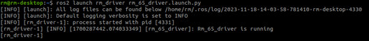
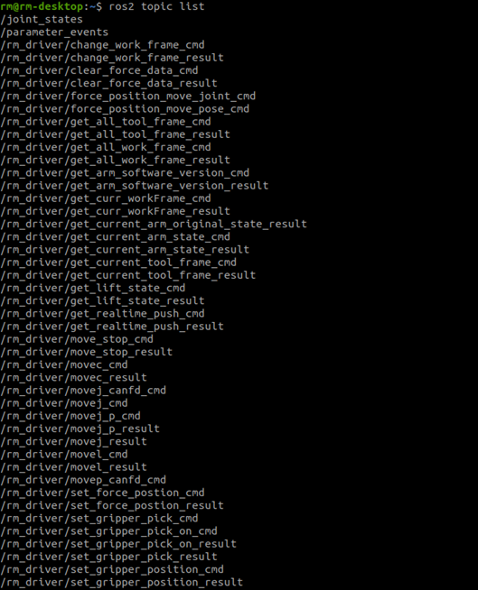
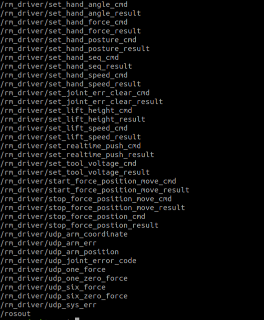

# <p class="hidden">ROS2: </p>Introduction to the Rm_driver Package

The rm_driver package, as an important part of the ROS2 package of the robotic arm, is intended to communicate and control the robotic arm through the ROS2.
The package will be introduced in detail from the following three aspects with different purposes:

* 1. Package application: Learn how to use the package.
* 2. Package structure description: Understand the composition and function of files in the package.
* 3. Package topic description: Know the topics of the package for easy development and use.

Code link: [https://github.com/RealManRobot/ros2_rm_robot/tree/main/rm_driver](https://github.com/RealManRobot/ros2_rm_robot/tree/main/rm_driver)

## 1. Application of the rm_driver package

### 1.1 Basic use of the package

The node can be started directly by the following command to control the robotic arm.

::: tip
The current control is based on the fact that the IP address of the robotic arm is still 192.168.1.18 without change.
:::

```
ros2 launch rm_driver rm_<arm_type>_driver.launch.py
```

Generally, the above `<arm_type>` is required for the actual type of the robotic arm and optional for 65, 63, ECO65, 75, and GEN72.
After the underlying driver is started successfully, the following screen will pop up.
  

### 1.2 Advanced use of the package

If the IP address of the robotic arm is changed, the start command will be invalid, so it will fail to connect to the robotic arm by directly executing the above command. However, you can re-establish the connection by modifying the following configuration file.
The configuration file is located in the config folder of the rm_driver package.
  
The configuration file is as follows:

```
rm_driver:   
  ros__parameters:  
    #robot param  
    arm_ip: "192.168.1.18"        #Set the IP address for the TCP connection
    tcp_port: 8080                #Set the port for the TCP connection
    
    arm_type: "RM_65"             #Set the type of the robotic arm
    arm_dof: 6                    #Set the degree of freedom of the robotic arm

    udp_ip: "192.168.1.10"        #Set the IP address for the udp-based real-time pushing
    udp_cycle: 5                  #Set the udp-based real-time pushing cycle, in multiples of 5
    udp_port: 8089                #Set the port for the udp-based real-time pushing
    udp_force_coordinate: 0       #Set the reference frame for the 6-DoF force system, 0: sensor frame; 1: current work frame; 2: current tool frame
```

The main parameters are as follows.

* arm_ip: refers to the current IP address of the robotic arm.
* tcp_port: refers to the port for the TCP connection.
* arm_type: refers to the current type of the robotic arm, optional for RM65, ECO65, RML63, RM75, and GEN72.
* arm_dof: refers to the degree of freedom of the robotic arm, 6: 6 DoF; 7: 7 DoF.
* udp_ip: refers to the target IP address for the udp-based real-time pushing.
* udp_cycle: refers to the udp-based real-time pushing cycle, in multiples of 5.
* udp_port: refers to the port for the udp-based real-time pushing.
* udp_force_coordinate: refers to the reference frame for the 6-DoF force system, 0: sensor frame (original data); 1: current work frame; 2: current tool frame.
* In actual use, choose and activate the launch file and the correct type will be automatically set. If you have special requirements, modify the parameters here. After the modification, rebuild the modified parameter in the workspace directory to make it take effect.
* Run the colcon build command in the workspace directory.

```
colcon build
```

* After the build succeeds, the package can be started by the above commands.

## 2. Structure description of the rm_driver package

```
├── CMakeLists.txt             #Build rule file
├── config                         #Configuration folder
│   ├── rm_63_config.yaml          #RML63 configuration file
│   ├── rm_65_config.yaml          #RM65 configuration file
│   ├── rm_75_config.yaml          #RM75 configuration file
│   ├── rm_eco65_config.yaml       #ECO65 configuration file
│   └── rm_gen72_config.yaml       #GEN72 configuration file
├── doc
│   ├── RealMan Robotic Arm rm_driver Topic Detailed Description (ROS2).md
│   ├── rm_driver1.png
│   ├── rm_driver2.png
│   ├── rm_driver3.png
│   ├── rm_driver4.png
│   └── RealMan robotic arm ROS2 rm_driver description.md
├── include                         #Dependency header file folder
│   └── rm_driver
│       ├── cJSON.h                #API header file
│       ├── constant_define.h      #API header file
│       ├── rman_int.h             #API header file
│       ├── rm_base_global.h       #API header file
│       ├── rm_base.h              #API header file
│       ├── rm_define.h            #API header file
│       ├── rm_driver.h            #rm_driver.cpp header file
│       ├── rm_praser_data.h       #API header file
│       ├── rm_queue.h             #API header file
│       ├── rm_service_global.h    #API header file
│       ├── rm_service.h           #API header file
│       └── robot_define.h         #API header file
├── launch
│   ├── rm_63_driver.launch.py     #RML63 launch file
│   ├── rm_65_driver.launch.py     #RM65 launch file
│   ├── rm_75_driver.launch.py     #RM75 launch file
│   ├── rm_eco65_driver.launch.py  #ECO65 launch file
│   └── rm_gen72_driver.launch.py  #GEN72 launch file
├── lib
│   ├── libRM_Service.so -> libRM_Service.so.1.0.0        #API library file
│   ├── libRM_Service.so.1 -> libRM_Service.so.1.0.0      #API library file
│   ├── libRM_Service.so.1.0 -> libRM_Service.so.1.0.0    #API library file
│   ├── libRM_Service.so.1.0.0                            #API library file
│   ├── linux_arm_service_release_v4.3.2.t1.tar.bz2       #API library file
│   └── linux_x86_service_release_v4.3.2.t1.tar.bz2       #API library file
├── package.xml                         #Dependency declaration file
├── README_CN.md
├── README.md
└── src
    └── rm_driver.cpp                                     #Driver source code file
```

## 3. Topic description of the rm_driver package

The rm_driver package has many topics to enable functions of the robotic arm based on the API.
After the package runs, the topics are available by the following commands.

```
ros2 topic list
```


  
