# <p class="hidden">ROS2: </p>Introduction to the Rm_example Package

The rm_example package is intended to enable the basic functions of the robotic arm and control the robotic arm, such as the joint motion, Cartesian space motion, and spline curve trajectory motion.
The package will be introduced in detail from the following three aspects with different purposes:

* 1. Package application: Learn how to use the package.
* 2. Package structure description: Understand the composition and function of files in the package.
* 3. Package topic description: Know the topics of the package for easy development and use.

Code link: [https://github.com/RealManRobot/ros2_rm_robot/tree/main/rm_example](https://github.com/RealManRobot/ros2_rm_robot/tree/main/rm_example)

## 1. Application of the rm_example package

### 1.1 Changing the work frame

Firstly, run the rm_driver node of the robotic arm.

```
ros2 launch rm_driver rm_<arm_type>_driver.launch.py
```

Generally, the above `<arm_type>` is required for the actual type of the robotic arm and optional for 65, 63, ECO65, 75, and GEN72.
For the 65 robotic arm, its start command is as follows:

```
ros2 launch rm_driver rm_65_driver.launch.py
```

After the node is started successfully, execute the following command to run the node to change the work frame.

```
ros2 run rm_example rm_change_work_frame
```

If the following command appears, the frame is switched successfully:
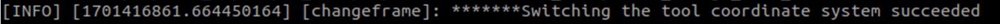
Firstly, subscribe to the topic of the current work frame, and enter the following command in the terminal to verify:

```
ros2 topic echo /rm_driver/get_curr_workFrame_result
```

Then, publish the request for the current frame.

```
ros2 topic pub --once /rm_driver/get_curr_workFrame_cmd std_msgs/msg/Empty "{}"
```

The following interface will appear on the terminal.
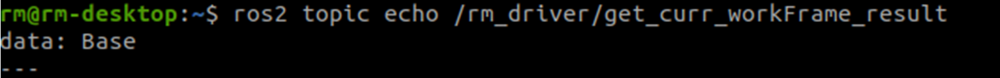

### 1.2 Getting the current state of the robotic arm

Firstly, run the rm_driver node of the robotic arm.

```
ros2 launch rm_driver rm_<arm_type>_driver.launch.py
```

Generally, the above `<arm_type>` is required for the actual type of the robotic arm and optional for 65, 63, ECO65, 75, and GEN72.
For the 65 robotic arm, its start command is as follows:

```
ros2 launch rm_driver rm_65_driver.launch.py
```

After the node is started successfully, execute the following command to run the node to get the current state of the robotic arm.

```
ros2 run rm_example rm_get_state
```

If the following command appears, the frame is switched successfully.
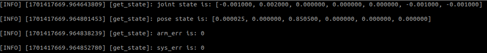
In the interface, there is the current joint angle, as well as the current end effector position and orientation (Euler angle) of the robotic arm.

### 1.3 MoveJ

The robotic arm is controlled for MoveJ through the following commands.
Firstly, run the rm_driver node of the robotic arm.

```
ros2 launch rm_driver rm_<arm_type>_driver.launch.py
```

Generally, the above `<arm_type>` is required for the actual type of the robotic arm and optional for 65, 63, ECO65, 75, and GEN72.
For the 65 robotic arm, its start command is as follows:

```
ros2 launch rm_driver rm_65_driver.launch.py
```

After the node is started successfully, execute the following command to control the robotic arm for motion.

```
ros2 launch rm_example rm_<dof>_movej.launch.py
```

The dof in the command refers to the current degree of freedom of the robotic arm, which is optional for 6 dof and 7 dof.
For example, to start a 7-DoF robotic arm, the following command is executed.

```
ros2 launch rm_example rm_7dof_movej.launch.py
```

If execution succeeds, the joints of the robotic arm will rotate, and the following information will be displayed on the screen.
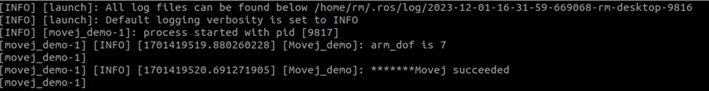

### 1.4 MoveJ_P

The robotic arm is controlled for MoveJ_P through the following commands.
Firstly, run the rm_driver node of the robotic arm.

```
ros2 launch rm_driver rm_<arm_type>_driver.launch.py
```

Generally, the above `<arm_type>` is required for the actual type of the robotic arm and optional for 65, 63, ECO65, 75, and GEN72.
For the 65 robotic arm, its start command is as follows:

```
ros2 launch rm_driver rm_65_driver.launch.py
```

After the node is started successfully, execute the following command to control the robotic arm for motion.

```
ros2 run rm_example movejp_demo
```

If execution succeeds, the following prompt will appear on the screen, and the robotic arm will move to the given pose.
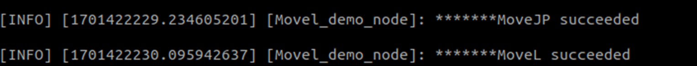

### 1.5 MoveL

The robotic arm is controlled for MoveL through the following commands.
Firstly, run the rm_driver node of the robotic arm.

```
ros2 launch rm_driver rm_<arm_type>_driver.launch.py
```

Generally, the above `<arm_type>` is required for the actual type of the robotic arm and optional for 65, 63, ECO65, 75, and GEN72.
For the 65 robotic arm, its start command is as follows:

```
ros2 launch rm_driver rm_65_driver.launch.py
```

After the node is started successfully, execute the following command to control the robotic arm for motion.

```
ros2 run rm_example movel_demo
```

If execution succeeds, the following prompt will appear on the screen, and the robotic arm will move to the given pose through MoveJ_P first, and then move through MoveL.
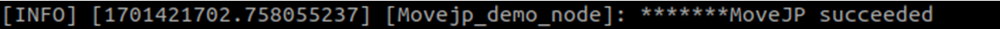

## 2. Structure description of the rm_example package

The current rm_example package consists of the following files.

```
├── CMakeLists.txt                               #Build rule file
├── doc
│   ├── rm_example10.png
│   ├── rm_example11.png
│   ├── rm_example1.png
│   ├── rm_example2.png
│   ├── rm_example3.png
│   ├── rm_example4.png
│   ├── rm_example5.png
│   ├── rm_example6.png
│   ├── rm_example7.png
│   ├── rm_example8.png
│   └── rm_example9.png
├── launch
│   ├── rm_6dof_movej.launch.py                 #6 DoF MoveJ launch file
│   └── rm_7dof_movej.launch.py                 #7 DoF MoveJ launch file
├── package.xml
└── src
    ├── api_ChangeWorkFrame_demo.cpp        #Source file of changing the work frame
    ├── api_Get_Arm_State_demo.cpp          #Source file of getting the state of the robotic arm
    ├── api_MoveJ_demo.cpp                  #MoveJ source file
    ├── api_MoveJP_demo.cpp                 #MoveJ_P source file
    ├── api_MoveJP_Gen72_demo.cpp           #MoveJ_P source file for GEN72
    └── api_MoveL_demo.cpp                  #MoveL source file
    └── api_MoveL_Gen72_demo.cpp            #MoveL source file for GEN72
```

## 3. Topic description of the rm_example package

### 3.1 Description of rm_change_work_frame

The data communication diagram of this node is as follows:
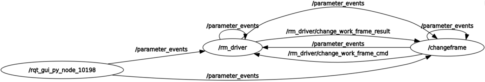
From the diagram, the main communication topics between the /changeframe node and /rm_driver are /rm_driver/change_work_frame_result and /rm_driver/change_work_frame_cmd. The /rm_driver/change_work_frame_cmd indicates the change request and publishes the target frame, and the /rm_driver/change_work_frame_result indicates the change result.

### 3.2 Description of rm_get_state

The data communication diagram of this node is as follows:
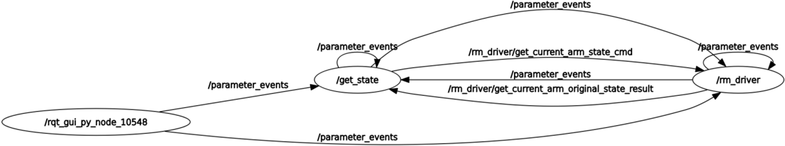
From the diagram, the main communication topics between the /get_state node and /rm_driver are /rm_driver/get_current_arm_state_cmd and /rm_driver/get_current_arm_original_state_result. The rm_driver/get_current_arm_state_cmd indicates the request for getting the current state of the robotic arm, and the /rm_driver/get_current_arm_original_state_result indicates the change result.

### 3.3 Description of moveJ_demo

The data communication diagram of this node is as follows:
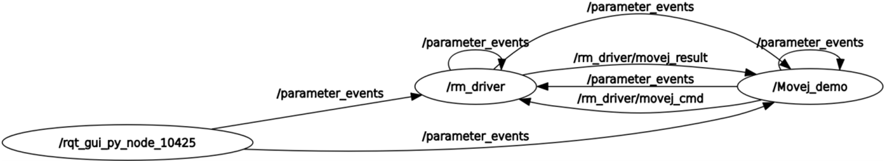
From the diagram, the main communication topics between the /Movej_demo node and /rm_driver are /rm_driver/movej_cmd and /rm_driver/movej_result. The /rm_driver/movej_cmd indicates the request to control the motion of the robotic arm and publishes the radians of each joint to be moved, and the /rm_driver/ movej_result indicates the motion result.

### 3.4 Description of moveJ_P_demo

The data communication diagram of this node is as follows:
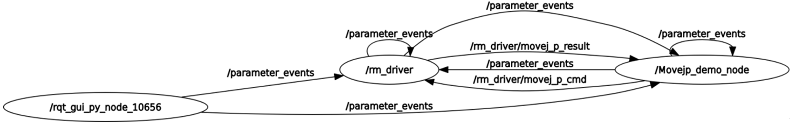
From the diagram, the main communication topics between the /Movejp_demo_node and /rm_driver are /rm_driver/movej_p_cmd and /rm_driver/movej_p_result. The /rm_driver/movej_p_cmd indicates the request to control the motion of the robotic arm and publishes the coordinates of the target point, and the /rm_driver/ movej_p_result indicates the motion result.

### 3.5 Description of moveL_demo

The data communication diagram of this node is as follows:
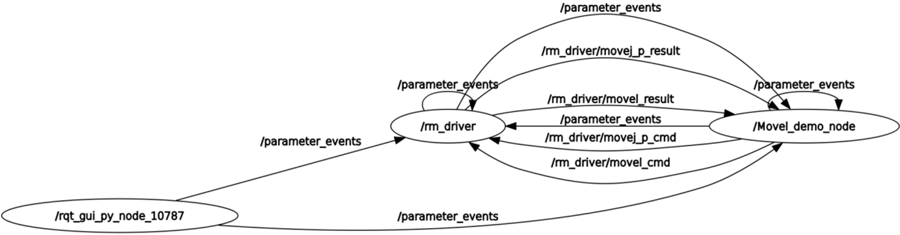
From the diagram, the main communication topics between the /Movel_demo_node and /rm_driver are /rm_driver/movej_p_cmd and /rm_driver/movej_p_result, as well as /rm_driver/movel_cmd and /rm_driver/movel_result. The /rm_driver/movej_p_cmd indicates the request to control the motion of the robotic arm and publishes the coordinates of the first target point, and the /rm_driver/ movej_p_result indicates the motion result. After reaching the first point, the /rm_driver/movel_cmd is executed to publish the pose of the second point for the robotic arm to reach it through linear motion, and the /rm_driver/movel_result indicates the motion result.
