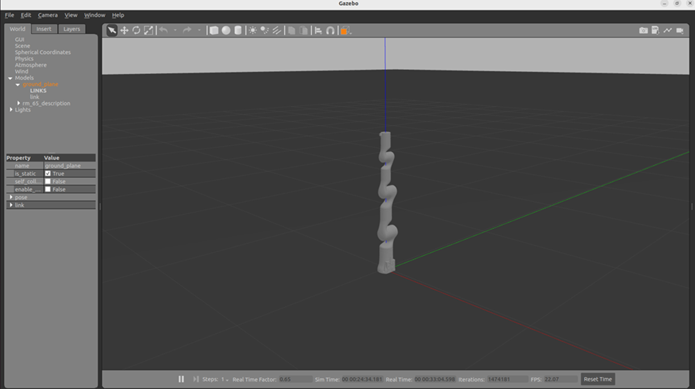
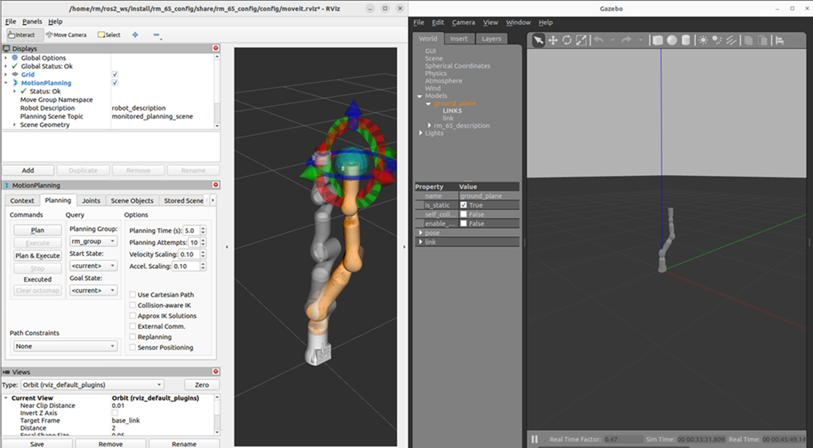

# <p class="hidden">ROS2: </p>Introduction to the Rm_gazebo Package

The rm_gazebo package is intended to realize the simulation of moveit2 planning for the robotic arm. A virtual robotic arm is built in the simulation environment of the gazebo and then controlled by moveit2.
The package will be introduced in detail from the following two aspects with different purposes:

* 1. Package application: Learn how to use the package.
* 2. Package structure description: Understand the composition and function of files in the package.

Code link: [https://github.com/RealManRobot/ros2_rm_robot/tree/main/rm_gazebo](https://github.com/RealManRobot/ros2_rm_robot/tree/main/rm_gazebo)

## 1 Control of the virtual robotic arm

After the environment and package installation is complete, run the rm_gazebo package.
Run the following command to launch the gazebo virtual space and virtual robotic arm.

```
ros2 launch rm_gazebo gazebo_65_demo.launch.py
```

If running succeeds, the following screen will pop up.

Then, the following command is executed to start moveit2 to control the virtual robotic arm in the gazebo.

```
ros2 launch rm_65_config gazebo_moveit_demo.launch.py
```

The simulation control with the moveit2 and gazebo is available after the control interface of rviz2 appears.


## 2. Structure description of the rm_gazebo package

```
├── CMakeLists.txt                               #Build rule file
├── config
│   ├── gazebo_63_description.urdf.xacro     #RML63 gazebo model description file
│   ├── gazebo_65_description.urdf.xacro     #RM65 gazebo model description file
│   ├── gazebo_75_description.urdf.xacro     #RM75 gazebo model description file
│   ├── gazebo_eco65_description.urdf.xacro  #ECO65 gazebo model description file
│   └── gazebo_gen72_description.urdf.xacro  #GEN72 gazebo model description file
├── doc
│   ├── rm_gazebo1.png
│   └── rm_gazebo2.png
├── include
│   └── rm_gazebo
├── launch
│   ├── gazebo_63_demo.launch.py             #RML63 gazebo launch file
│   ├── gazebo_65_demo.launch.py             #RM65 gazebo launch file
│   ├── gazebo_75_demo.launch.py             #RM75 gazebo launch file
│   ├── gazebo_eco65_demo.launch.py          #ECO65 gazebo launch file
│   └── gazebo_gen72_demo.launch.py          #GEN72 gazebo launch file
├── package.xml
├── README_CN.md
└── README.md
```
