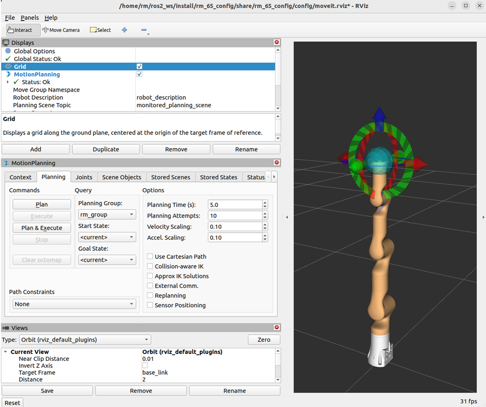
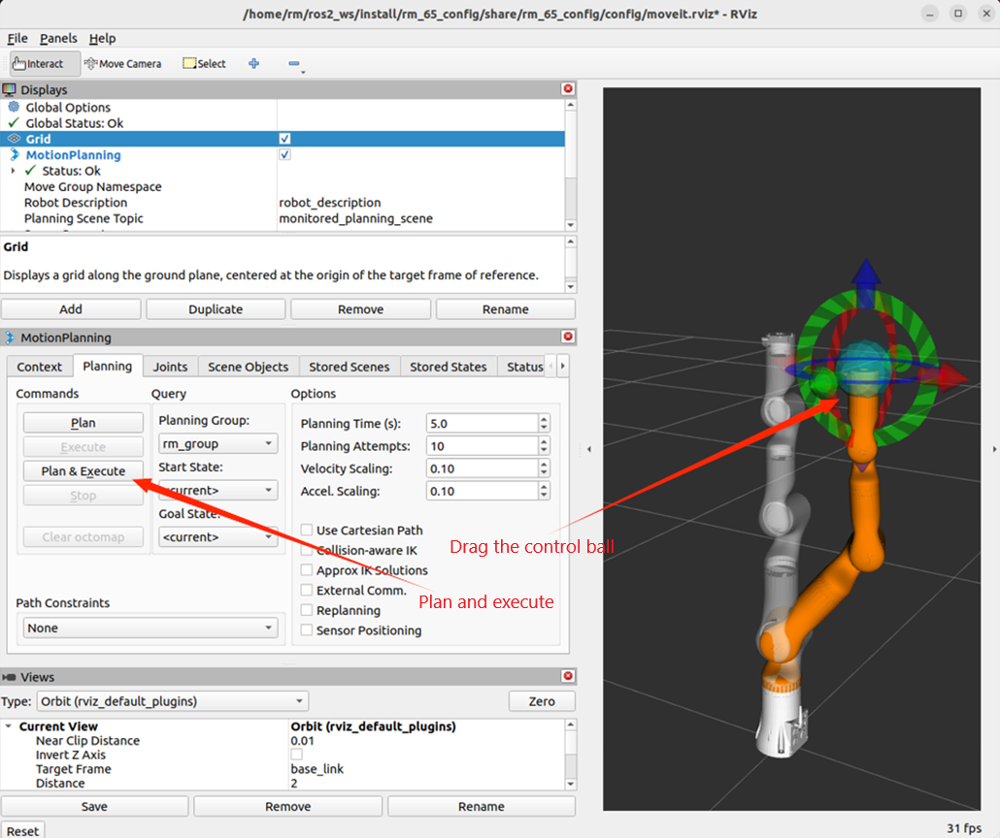
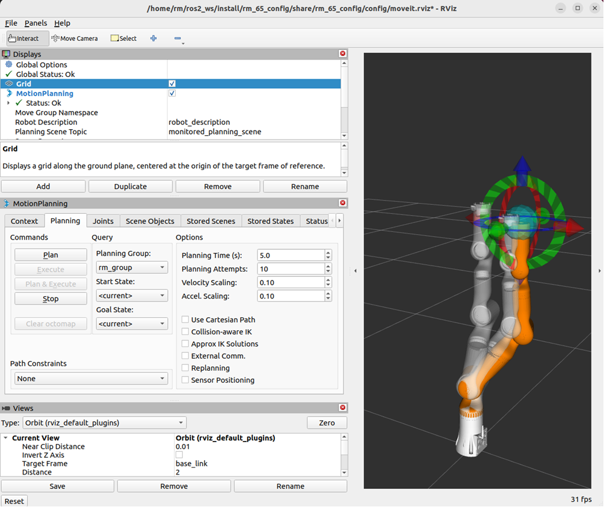
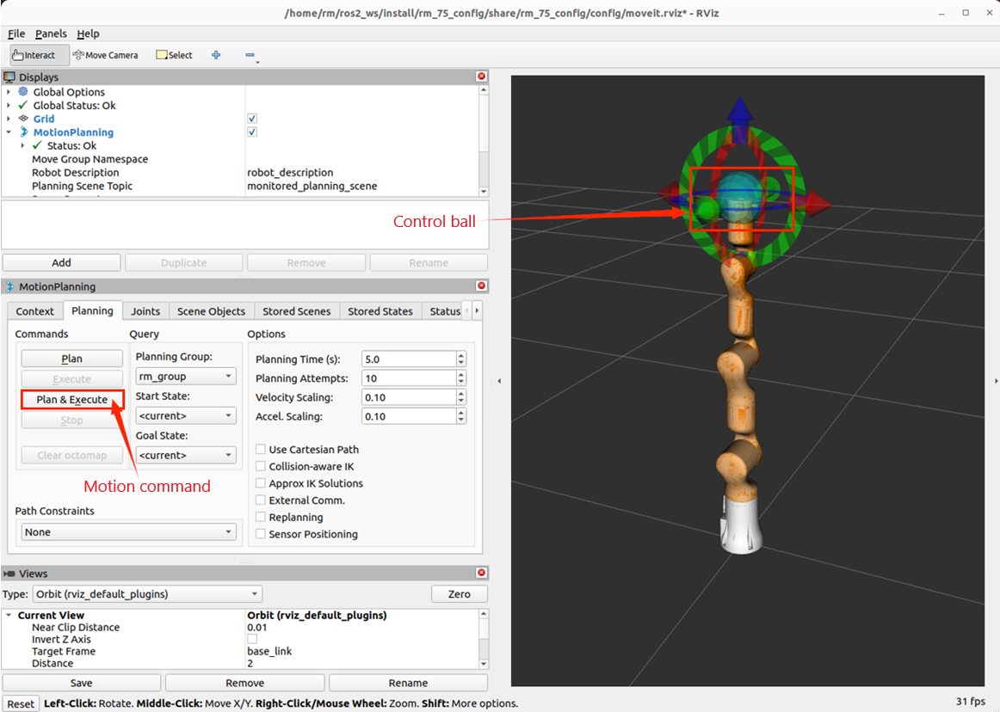
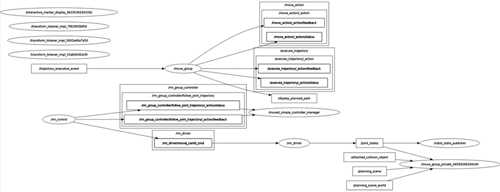
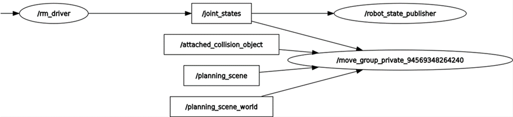
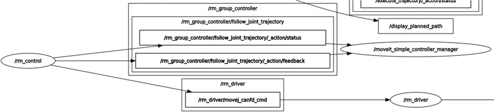
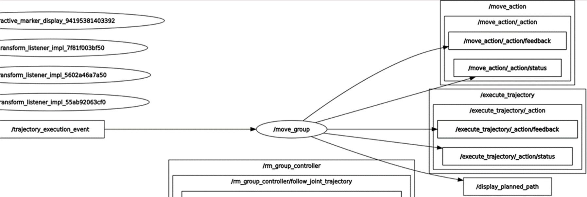

# <p class="hidden">ROS2: </p>Introduction to the Rm_moveit2_config Package

The rm_moveit2_config package is designed for the moveit2 to control the real robotic arm and is intended to call the official moveit2 framework to generate the moveit2 configuration and launch files special for the current robotic arm in combination with the URDF of the robotic arm. Through the package, the moveit2 is used to control the virtual robotic arm and the real robotic arm.
The package will be introduced in detail from the following three aspects with different purposes:

* 1. Package application: Learn how to use the package.
* 2. Package structure description: Understand the composition and function of files in the package.
* 3. Package topic description: Know the topics of the package for easy development and use.

Code link: [https://github.com/RealManRobot/ros2_rm_robot/tree/main/rm_moveit2_config](https://github.com/RealManRobot/ros2_rm_robot/tree/main/rm_moveit2_config)

## 1. Application of the rm_moveit2_config package

### 1.1 Control of the virtual robotic arm with moveit2

After the environment configuration and connection are complete, the node can be started directly by the following command.

```
ros2 launch rm_<arm_type>_config demo.launch.py
```

Generally, the above `<arm_type>` is required for the actual type of the robotic arm and optional for 65, 63, ECO65, 75, and GEN72.
For the 65 robotic arm, its start command is as follows:

```
ros2 launch rm_65_config demo.launch.py
```

After the node is started successfully, the following screen will pop up.

Next, drag the control ball to move the robotic arm to the target position, and then click Plan & Execute.

Plan and execute.


### 1.2 Control of the real robotic arm with moveit2

More control commands are required to control the real robotic arm, with detailed control modes as follows.
Firstly, run the underlying driver node.

```
ros2 launch rm_driver rm_<arm_type>_driver.launch.py
```

Next, run the files in the rm_description package.

```
ros2 launch rm_description rm_<arm_type>_display.launch.py
```

Then, run the relevant nodes of the intermediate rm_control package.

```
ros2 launch rm_control rm_<arm_type>_control.launch.py
```

Finally, start the moveit2 node to control the real robotic arm.

```
ros2 launch rm_<arm_type>_config real_moveit_demo.launch.py
```

Note that the `<arm_type>` in the above commands is required for the actual type of the robotic arm, such as 65, 63, ECO65, 75, and GEN72.
After the above operations are complete, the following screen will appear, and the motion of the robotic arm is controlled by dragging the control ball.


## 2. Structure description of the rm_moveit2_config package

```
├── rm_63_config                                    #RML63 moveit2 package
│   ├── CMakeLists.txt                              #Build rules of the RML63 moveit2 package
│   ├── config                                      #Parameter file of the RML63 moveit2 package
│   │   ├── initial_positions.yaml                  #RML63 pose initialization with moveit2
│   │   ├── joint_limits.yaml                       #RML63 joint limit
│   │   ├── kinematics.yaml                         #RML63 kinematics parameter
│   │   ├── moveit_controllers.yaml                 #RML63 moveit2 controller
│   │   ├── moveit.rviz                             #Display configuration file of the RML63 rviz2
│   │   ├── pilz_cartesian_limits.yaml
│   │   ├── rml_63_description.ros2_control.xacro   #RML63 xacro description file
│   │   ├── rml_63_description.srdf                 #Control configuration file of the RML63 moveit2
│   │   ├── rml_63_description.urdf.xacro           #RML63 xacro description file
│   │   └── ros2_controllers.yaml                   #RML63 motion controller
│   ├── launch
│   │   ├── demo.launch.py                          #Launch file of virtual RML63 moveit2
│   │   ├── gazebo_moveit_demo.launch.py            #Launch file of virtual RML63 moveit2
│   │   ├── move_group.launch.py
│   │   ├── moveit_rviz.launch.py
│   │   ├── real_moveit_demo.launch.py              #Launch file of real RML63 moveit2
│   │   ├── rsp.launch.py
│   │   ├── setup_assistant.launch.py
│   │   ├── spawn_controllers.launch.py
│   │   ├── static_virtual_joint_tfs.launch.py
│   │   └── warehouse_db.launch.py
│   └── package.xml
├── rm_65_config                                    #RM65 moveit2 package (refer to RML63 for details)
│   ├── CMakeLists.txt
│   ├── config
│   │   ├── initial_positions.yaml
│   │   ├── joint_limits.yaml
│   │   ├── kinematics.yaml
│   │   ├── moveit_controllers.yaml
│   │   ├── moveit.rviz
│   │   ├── pilz_cartesian_limits.yaml
│   │   ├── rm_65_description.ros2_control.xacro
│   │   ├── rm_65_description.srdf
│   │   ├── rm_65_description.urdf.xacro
│   │   └── ros2_controllers.yaml
│   ├── launch
│   │   ├── demo.launch.py
│   │   ├── gazebo_moveit_demo.launch.py
│   │   ├── move_group.launch.py
│   │   ├── moveit_rviz.launch.py
│   │   ├── real_moveit_demo.launch.py
│   │   ├── rsp.launch.py
│   │   ├── setup_assistant.launch.py
│   │   ├── spawn_controllers.launch.py
│   │   ├── static_virtual_joint_tfs.launch.py
│   │   └── warehouse_db.launch.py
│   └── package.xml
├── rm_75_config                                      #RM75 moveit2 package (refer to RML63 for details)
│   ├── CMakeLists.txt
│   ├── config
│   │   ├── initial_positions.yaml
│   │   ├── joint_limits.yaml
│   │   ├── kinematics.yaml
│   │   ├── moveit_controllers.yaml
│   │   ├── moveit.rviz
│   │   ├── pilz_cartesian_limits.yaml
│   │   ├── rm_75_description.ros2_control.xacro
│   │   ├── rm_75_description.srdf
│   │   ├── rm_75_description.urdf.xacro
│   │   └── ros2_controllers.yaml
│   ├── launch
│   │   ├── demo.launch.py
│   │   ├── gazebo_moveit_demo.launch.py
│   │   ├── move_group.launch.py
│   │   ├── moveit_rviz.launch.py
│   │   ├── real_moveit_demo.launch.py
│   │   ├── rsp.launch.py
│   │   ├── setup_assistant.launch.py
│   │   ├── spawn_controllers.launch.py
│   │   ├── static_virtual_joint_tfs.launch.py
│   │   └── warehouse_db.launch.py
│   └── package.xml
└── rm_eco65_config                                    #ECO65 moveit2 package (refer to RML63 for details)
│    ├── CMakeLists.txt
│    ├── config
│    │   ├── initial_positions.yaml
│    │   ├── joint_limits.yaml
│    │   ├── kinematics.yaml
│    │   ├── moveit_controllers.yaml
│    │   ├── moveit.rviz
│    │   ├── pilz_cartesian_limits.yaml
│    │   ├── rm_eco65_description.ros2_control.xacro
│    │   ├── rm_eco65_description.srdf
│    │   ├── rm_eco65_description.urdf.xacro
│    │   └── ros2_controllers.yaml
│    ├── launch
│    │   ├── demo.launch.py
│    │   ├── gazebo_moveit_demo.launch.py
│    │   ├── move_group.launch.py
│    │   ├── moveit_rviz.launch.py
│    │   ├── real_moveit_demo.launch.py
│    │   ├── rsp.launch.py
│    │   ├── setup_assistant.launch.py
│    │   ├── spawn_controllers.launch.py
│    │   ├── static_virtual_joint_tfs.launch.py
│    │   └── warehouse_db.launch.py
│    └── package.xml
└── rm_gen72_config             #GEN72 moveit2 package (refer to RML63 for details)
    ├── CMakeLists.txt
    ├── config
    │   ├── initial_positions.yaml
    │   ├── joint_limits.yaml
    │   ├── kinematics.yaml
    │   ├── moveit_controllers.yaml
    │   ├── moveit.rviz
    │   ├── pilz_cartesian_limits.yaml
    │   ├── rm_gen72_description.ros2_control.xacro
    │   ├── rm_gen72_description.srdf
    │   ├── rm_gen72_description.urdf.xacro
    │   └── ros2_controllers.yaml
    ├── launch
    │   ├── demo.launch.py
    │   ├── gazebo_moveit_demo.launch.py
    │   ├── move_group.launch.py
    │   ├── moveit_rviz.launch.py
    │   ├── real_moveit_demo.launch.py
    │   ├── rsp.launch.py
    │   ├── setup_assistant.launch.py
    │   ├── spawn_controllers.launch.py
    │   ├── static_virtual_joint_tfs.launch.py
    │   └── warehouse_db.launch.py
    └── package.xml
```

## 3. Topic description of the rm_moveit2_config package

To make the topic structure more clear, the topics of the moveit2 are reviewed and explained here in the data flow diagram.
After starting the above node to control the real robotic arm, you can run the following command to check the state of the current topic:

```
ros2 run rqt_graph rqt_graph
```

If running succeeds, the following diagram will appear.

The diagram shows the topic communication between the currently running nodes and other nodes. For the **/rm_driver** node, it subscribes to and publishes the following topics during the **moveit2** runtime.


As shown in the diagram, the topic **/joint_states** published by the **rm_driver** is continuously subscribed by the **/robot_state_publisher** node and **/move_group_private** node. The **/robot_state_publisher** receives the **/joint_states** to continuously publish the TF between joints, and the **/move_group_private**, as a related node of the **moveit2**, subscribes to the topic because the **moveit2** needs to get the real-time joint state of the current robotic arm during planning.
From the diagram, it can be seen that the **rm_driver** subscribes to the topic **/rm_driver/movej_canfd_cmd** of the **rm_control**, which is the topic of the pass-through function of the robotic arm. Through this topic, the **rm_control** publishes the planned joint position to the **rm_driver** node to control the robotic arm for motion.

The **rm_control** is the communication bridge between the **rm_driver** and the **moveit2**. It communicates with the **/moveit_simple_controller_manager** through the **/rm_group_controller/follow_joint_trajectory**, gets the planned trajectory, performs interpolation operations, and sends the interpolated data to the **rm_driver** in a pass-through manner.

The **moveit2** involves the **move_group**, **move_group_private**, and **moveit_simple_controller_manager** nodes, which are intended to enable the motion planning of the robotic arm, display the planning data in **rviz**, and pass the planning data to the **rm_control** for segmentation.
