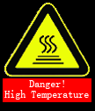
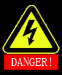
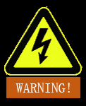

# 
Start Guide:
Safety Guide

## Introduction

This section defines the safety principles and specifications that shall be followed when operating a robot or robot system. Integrators and users must carefully read this manual, especially the contents marked with warning signs, which must be mastered and strictly observed. Considering the complexity and hazards of robot systems, users must fully understand the hazards of the operations and strictly abide by the specifications and requirements in this manual. Integrators and users must have a high awareness of safety.

### Safety warning signs

The safety signs used in this manual are explained as follows, which must be followed.

**Meanings of warning signs**

| Sign     | Meaning                                            |
|-------------------------------------------|------------------------------------------------|
|  | A hazardous electricity consumption situation, which, if not avoided, can lead to personal injury and death or severe equipment damage.             |
|  | A potentially hazardous hot surface, which, if touched, can lead to personal injury.                          |
|  | A hazardous situation, which, if not avoided, can lead to personal death or severe injury.                    |
|  | A potentially hazardous electricity consumption situation, which, if not avoided, can lead to personal injury or severe equipment damage.             |
|  | A potentially hazardous situation, which, if not avoided, can lead to personal injury or severe equipment damage. Matters marked with this sign may, depending on the actual situation, have the possibility to cause major consequences sometimes. |
|  | A situation, which, if not avoided, can lead to personal injury or equipment damage. Matters marked with this sign may, depending on the actual situation, have the possibility to cause major consequences sometimes.     |

### Safety precautions

This manual contains safety measures for protecting users and preventing equipment damage. Users are expected to read through this manual and get familiar with all safety precautions. We try to describe all potentially hazardous situations in this manual, but we cannot cover every such situation due to unpredictability.

When starting a robot or robot system for the first time, users shall understand and follow the basic information provided below. Additional safety-related information is presented in other sections of this manual. Notwithstanding that, it is impossible to cover every aspect. Additionally, in actual use, the specific issues need to be analyzed case by case.

**Notes on safety precautions**

| Sign     | Meaning                                            |
|-------------------------------------------|------------------------------------------------|
|  | 1. The robot and all electrical equipment must be installed according to the requirements and specifications in this manual.  2. Before using the robot for the first time and putting it into production, it is required to carry out preliminary tests and inspections on the robot and its protection system.  3. Before starting the equipment for the first time, it is necessary to check its hardware, software, and appearance to ensure its normal use. In performing such inspection, reference to the national or regional work safety rules and regulations in force must be made, and all safety functions must be tested.  4. Users must check and ensure that all safety parameters and user programs are correct and that all safety functions are normal. All safety functions must be tested by personnel who are competent in operating robots. Only after the robot has been tested comprehensively and carefully in terms of its safety and reached the safety level can it be started.  5. The robot installation and commissioning shall be conducted by professional personnel according to installation standards.  6. Upon completion of installation and construction, the robot shall be subject to a comprehensive risk assessment again, and the assessment records shall be maintained.  7. Safety parameters are set and modified only by authorized personnel. Passwords or isolation measures shall be used to prevent the setting or modification of safety parameters by unauthorized personnel. After the safety parameters are modified, relevant safety functions shall be analyzed.  8. In case of an accident or abnormal operation, the robot can be stopped by pressing the emergency stop switch. |
|  | 1. The robot body and control cabinet will generate heat during operation. Therefore, it is not allowed to operate or touch the robot while it is working or has just stopped.  2. The robot will be cooled down 1 hour after being disconnected from the power supply.  3. Nobody shall extend their fingers to the hot point of the controller. |
|  | 1. Ensure that the arms and end effectors of the robot are correctly and safely installed in place.  2. Make sure that the robot arms have enough space to move freely.  3. Do not use the robot if it has been damaged.  4. Connect safety devices to safety interfaces instead of normal I/O interfaces.  5. Ensure the correct installation and settings (such as the installation angle of the robot body, end effector weight, TCP offset, and safety configuration). Save the installation file and load it into the program.  6. Make sure that tools and obstacles are free of sharp corners or twisting points. Keep nobody within the working arm span of the robot.  7. Pay attention to the movement direction of the robot when using the teach pendant.  8. Note that any impact will lead to the release of very high kinetic energy, which is much higher than that under the conditions of high speed and high payload.  9. Be aware that the connection of different machines may make hazards worse or introduce new hazards. Perform comprehensive risk assessment throughout the installation process. When different levels of safety and emergency stop performance are required, always choose the highest level. Keep reading and understanding the manuals of all equipment used during the installation.  10. Do not make any changes to the robot. Any change to the robot may bring about hazards unpredictable to integrators. The authorized restructuring of the robot shall be subject to the latest edition of all relevant service manuals. If the robot is changed or altered in any way, Realman Intelligent Technology (Beijing) Co., Ltd. will not assume any liability arising therefrom.  11. Prior to the transportation of the robot, check its insulation and protective measures.  12. When handling robots, observe the transportation requirements, and handle them with care to avoid bumping. |
|  | 1. It is strongly recommended that all the robot functions and the robot program be checked separately when the robot is connected with or working together with any machines that could cause damage to the robot. It is recommended that the robot program be tested at temporary waypoints outside the workspace of other machines.  2. Realman Intelligent Technology (Beijing) Co., Ltd. will assume no liability for the damage or personal injury resulting from robot program errors and operation errors for human reasons.  3. The robot is prevented from exposure to a permanent magnetic field for a long time. Otherwise, a strong magnetic field could cause damage to the robot. |

### Liabilities and specifications

As an incomplete structure, our robots are designed for combination with other equipment to construct complete ones. Therefore, this manual covers neither the comprehensive procedures for designing, installing, and operating a complete robot nor the possibilities of affecting the safety of peripheral equipment of this complete system. The installation safety of a complete robot depends on how the robot is integrated. Integrators shall design the complete system and assess its installation risks according to the national laws, regulations, safety codes, and standards of their respective countries. Risk assessment is one of the most important tasks for integrators. They can make reference to the following standards to carry out the risk assessment process. Risk assessment is one of the most important tasks for integrators. They can make reference to the following standards to carry out the risk assessment process.

- ISO 12100:2010 Safety of machinery - General principles for design - Risk assessment and risk reduction
- ISO 10218-2:2011 Robots and robotic devices - Safety requirements for industrial robots - Part 2: Robot systems and integration
- RIA TR R15.306-2014 Technical report for industrial robots and robot systems - Safety requirements - Task-based risk assessment methodology
- ANSI B11.0-2010 Safety of machinery - General requirements and risk assessment

Integrators of robots within our full range are obliged to perform (including but not limited to) the following responsibilities:

- perform comprehensive risk assessment of the complete robot system;
- ensure the correct design and installation of the complete system;
- provide training for users and workers;
- establish the complete system operating procedures and clarify the use process;
- establish appropriate safety measures;
- take appropriate actions to eliminate hazards or reduce all hazards to an acceptable level during final installation.

### Hazard identification

The risk assessment shall consider all potential contact between the operator and the robot during normal use and any foreseeable misoperation. The operators shall not expose their necks, faces, and heads to avoid contact. Where the robot is used without any perimeter safeguards, the risk assessment shall be carried out first to determine whether related hazards will constitute an unacceptable risk, such as:

- potential hazards from the use of sharp end effectors or tool connectors;

- potential hazards from handling toxic or other hazardous substances;

- hazards that the operator's fingers are pinched by the robot base or joints;

- hazards of collision with the robot;

- hazards from the improper fixation of the robot or end effector;

- hazards from the impact between the robot's payload and a hard surface.

Integrators must identify these hazards and their risk levels through risk assessment, and determine and implement corresponding measures to reduce the risks to an acceptable level. Keep in mind that certain robots may present other significant hazards.

By combining the inherent safety measures applied to our full range of robots with the safety specifications or risk assessment implemented by integrators and users, the risks associated with the collaborative operation of our robots will be reduced to a reasonable and feasible level as far as possible. Any remaining risks presented by the robot before installation are communicated to integrators and users through this document. If, during risk assessment, the integrators identify any hazards existing in their specific applications that may pose unacceptable risks to users, the integrators must take appropriate risk reduction measures to eliminate the hazards or reduce the risks to an acceptable level. It will be unsafe to use the robot before taking appropriate risk reduction measures (if necessary).

In the case of non-collaborative installation of the robot (for example, when using hazardous tools), it may be deduced during risk assessment that the integrator needs to connect additional safety equipment (for example, safe startup equipment) during its programming to ensure the safety of personnel and equipment.

## Handling and precautions

During the lifting of the robot, the moving parts shall have appropriate measures in place and be properly located, to prevent them from unintended movement and causing hazards. During packing for transportation, the robots shall be packed according to the packing standards, with any marks required printed on the exterior surface of the packing box.

During transportation, the robots must maintain stable at a fixed position.

When the robot is taken out from the packing material and moved to the installation position, it shall be held still until all the bolts of the robot base are fastened.

No brake is installed inside joints 4‒6 of the robot. When disconnected from the power supply, the robot shall be kept in a proper position in case the joints rotate under the action of gravity and cause collision. (In the vertical state, the robot shall be put in the zero position before power cut-off.)

After transportation, the original packing materials shall be kept in a dry place for potential future use for repacking and relocating the robot.

::: warning Warning

RM65 and ECO65 series robots have no brake inside joints 4‒6, RM75 series robots have no brake inside joints 5‒7, and RML63 series robots have no brake inside joints 5 and 6.

:::

## Maintenance, repair, and disposal

Maintenance and repair must be carried out in compliance with all safety instructions in this manual.

After any change to the control system and robot joints, it is necessary to re-calibrate the zero points of the robot and end effector on site. The parameter settings shall also be checked. If the parameters are backed up, the backed-up parameters can be imported directly. Otherwise, the parameters need to be reset.

Maintenance and repair must be carried out by an authorized system integrator or Realman Intelligent Technology (Beijing) Co., Ltd. To return any part to Realman Intelligent Technology (Beijing) Co., Ltd., the requirements in the service manual shall be followed.

The safety level specified for maintenance and repair must be guaranteed, the national or regional work safety regulations in effect must be observed, and all safety functions must be tested.

The purpose of maintenance and repair is to ensure the normal operation of the system or to restore the system to normal after it fails.

Repair includes fault diagnosis and actual repair.

The following safety procedures and warnings must be observed when operating the robotic arm or controller:

**Safety procedure:**

1. Remove the power input from the controller interface board to ensure complete power-off. Take necessary measures to eliminate the possibility that anyone may restore the power supply to the system during repair. After the power is cut off, check the system again to make sure it is disconnected from the power supply.
2. Observe the electrostatic discharge (ESD) regulations when disassembling the robotic arm or controller.
3. Prevent water or dust from flowing into the robotic arm or controller.

**Warnings:**

1. During repair, the defective parts shall be replaced with new ones with the same part number or replaced by Realman Intelligent Technology (Beijing) Co., Ltd.
2. After maintenance, all disabled safety measures shall be enabled immediately.
3. All repair operations shall be documented and kept in the technical documents related to the complete robot system.
4. No parts of the controller shall be repaired by the users themselves. For any maintenance or repair services, please contact your dealer or Realman Intelligent Technology (Beijing) Co., Ltd.

**Disposal:**

Our full range of robots must be disposed of in accordance with applicable national laws, regulations, and standards.

**Repair and maintenance:**

1. The safety functions of the robot must be tested at least once a year to ensure normal working.
2. On the end joint of a robotic arm, there is a battery to supply power to the encoder for saving the multi-coil counts of the joint.
To prevent loss of encoder data, the robotic arm shall be started to charge the battery for at least 5−10 minutes every month. If the end joint is still abnormal after being charged, the robotic arm shall be restarted 5−10 minutes later. If the problem remains, please contact our after-sales service personnel.

::: warning Warning
Joint 6 of RM65, ECO65 and RML63 series robots and Joint 7 of RM75 series robots have a battery to supply power to the encoder.
:::

## Quality warranty

### Product quality warranty

Our full range of robots has a 12-month limited warranty period.

Within 12 months (or a maximum period of 15 months if the transportation time is included) after the new equipment and its components are put into service, if there are defects caused by poor manufacture or materials, Realman Intelligent Technology (Beijing) Co., Ltd. will provide necessary spare parts for replacement or repair the defective parts.

The ownership of the replaced or returned equipment or components vest in Realman Intelligent Technology (Beijing) Co., Ltd.

If the product is out of warranty, we will reserve the right to charge the customer for replacement or repair services.

If the equipment has any defects outside the warranty period, Realman Intelligent Technology (Beijing) Co., Ltd. will not be liable for any damage or losses that arise from the above defects, including production losses or damage to other production equipment.

### Disclaimer

If any equipment defects are caused due to improper handling or failure to follow the relevant instructions in this manual, the product quality warranty will become invalid.

Faults resulting from the following circumstances are not covered under this warranty:

1. Failure to install, wire, or connect other control equipment as per this manual.
2. Use beyond the specifications or standards specified in this manual.
3. Use of the product for purposes other than those specified.
4. Storage method and operating environment beyond the specifications specified in this manual (such as contamination, salt damage, and condensation).
5. Product damage due to improper transportation.
6. Product damage due to accidents or collisions.
7. Use of non-original components and accessories.
8. Damage due to the modification, commissioning, or repair of original parts by a third party other than Realman Intelligent Technology (Beijing) Co., Ltd. or its designated integrators.
9. Natural disasters such as fires, earthquakes, tsunamis, lightning strikes, strong winds, and floods.
10. Failure to identify the production date or warranty start date.
11. Changes to software or internal data.
12. Failure to reproduce the fault or identify the fault by Realman Intelligent Technology (Beijing) Co., Ltd.
13. Use of the product in any radioactive equipment, biological test equipment, or any applications deemed hazardous by Realman Intelligent Technology (Beijing) Co., Ltd.
14. Faults caused for any other reasons outside the scope of liabilities of Realman Intelligent Technology (Beijing) Co., Ltd.

::: warning Warning
Users shall not disassemble the product without prior permission of Realman Intelligent Technology (Beijing) Co., Ltd.
:::

According to the product quality warranty agreement, Realman Intelligent Technology (Beijing) Co., Ltd. only provides a warranty for defects and faults occurring on the product and its components sold to its distributors. Realman Intelligent Technology (Beijing) Co., Ltd. will not be held liable for any other express or implied warranties or liabilities, including but not limited to any implied warranties of merchantability or fitness for a particular purpose. Furthermore, Realman Intelligent Technology (Beijing) Co., Ltd. will not be held liable for indirect damages or consequences in any form arising from the relevant products.

In the event of a robot failure, users shall contact Realman Intelligent Technology (Beijing) Co., Ltd. as soon as possible to obtain a solution. Users shall not disassemble or maintain the robot by themselves for any reason; otherwise, the warranty service will be terminated.
