# 
Start guide:
Robotic Arm Teaching

The teach pendant software panel is used for robot teaching operations. Users can move the robot by clicking on the icons on the panel. At the same time, the panel provides feedback on the robot's motion information to users.

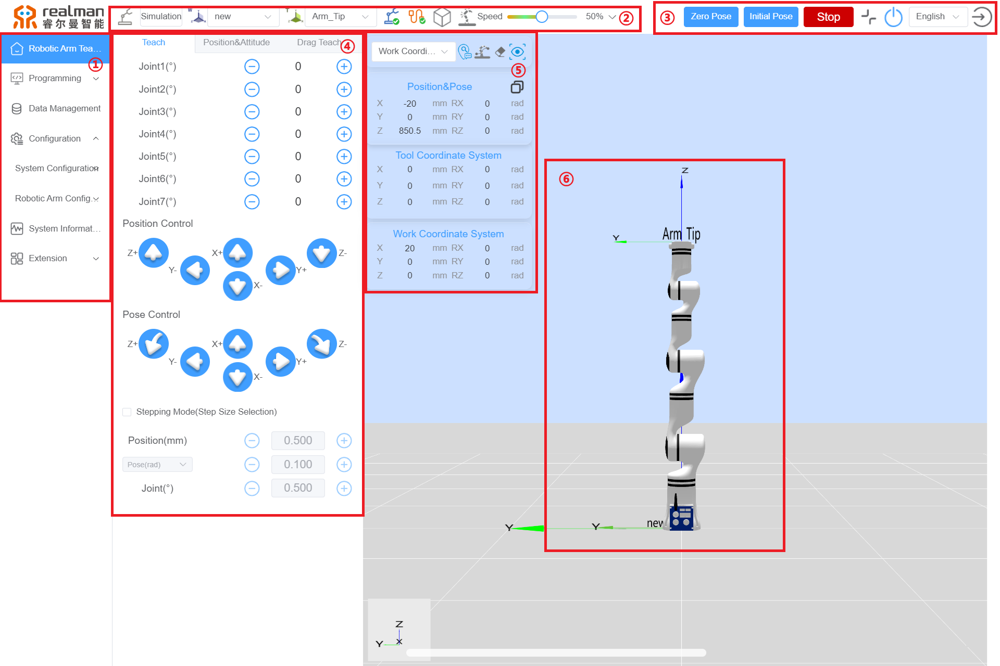

Robot teaching panel

**Names of functional areas on the robot teaching panel**  

| S/N | Name             |
|------|------------------|
| 1    | Menu Bar Options: Including Robotic Arm Teach Pendant, Programming, Data Management, Configuration, System Information, and Extension.   |
| 2    | Top Navigation Bar: Including Work Mode Selection, Work Coord Sys Selection, Tool Coord Sys Selection, Robotic Arm Status, Network, Electronic Fence, Collision Detection, and Teach Speed Percentage.   |
| 3    | Quick Menu: Including Zero Pose, Initial Pose, Robot Emergency Stop/Recover, Full Screen/Exit Full Screen, Robot Power On/Off, Switch Language, and Log Out.  |
| 4    | Teaching Area: Including Joint Teach, Position&Attitude Teach, Pose Teach, Step Mode Settings, Position Editing, and Drag Teach.  |
| 5    | Work Coordinate System Area: Including Point Info, Draw Trajectories sfter open/close, Clear Trajectories, Reset perspective, Copy Joint Data, Copy Pose Data, Current Position&Pose, Tool Coordinate System, Work Coordinate System.   |
| 6    | 3D Simulation Model: Including the 3D model of the robotic arm for simulation purposes. |

The following will explain each area/button in order according to the table above:

## Menu bar options

Clicking on the menu bar options will switch to the corresponding panel, facilitating user operations. The selected panel is highlighted with a blue background.

 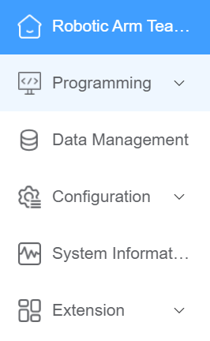 

Menu bar options

## Work mode selection

The yellow icon represents the selection of real mode, where the program runs on the actual robot. The robot moves according to the commands, and the interface displays the robot parameters and robotic arm motion state images.

The gray icon represents the selection of simulation mode, where the actual robot does not move, and only the 3D simulation model is operated. Before completing a robot program, users can first choose simulation mode to verify program feasibility. This improves the safety of robot applications and ensures the planned trajectory is reachable.

  

Work mode selection

## Work frame selection

Users can select a work frame to control the robot's motion state. By choosing the base frame (Base) on the teach pendant interface, the robot will move in the direction of the frame as shown in the diagram. Users can also create a custom work frame based on actual project requirements to serve as a reference direction for robot movement. For example, work1 can be a user-defined work frame ([method for setting the robot work frame](../../teachingPendant/setting/index.md#work-coordinate-system-calibration)). Once set, users can switch between work frames.

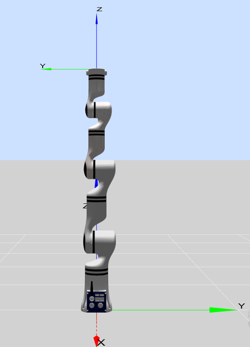

Robot base frame diagram

 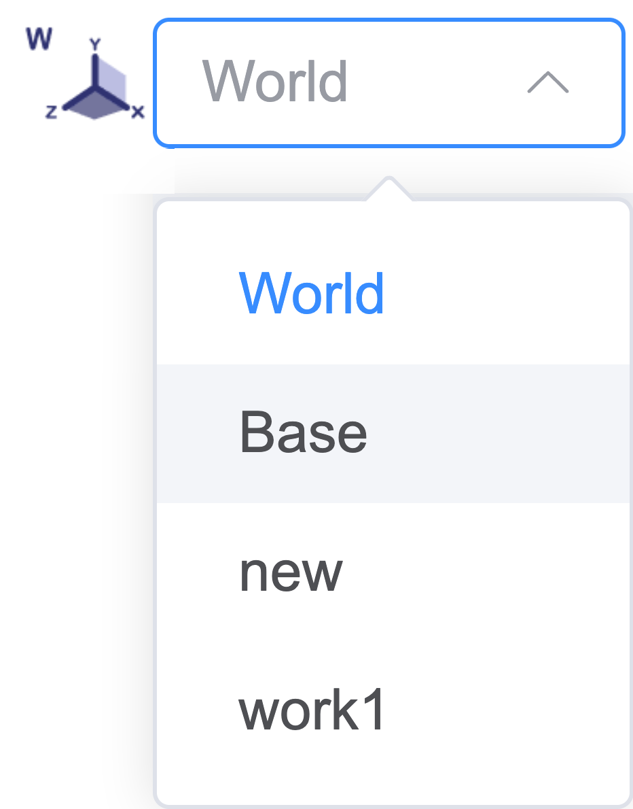 

Work frame selection diagram

## Tool frame selection

The tool frame can be selected from the drop-down menu. By default, the displayed pose target is the flange center. Users can set their own tool frame. For example, tool1 can be a user-defined tool frame ([method for setting the robot tool frame](../../teachingPendant/setting/index.md#tool-calibration)). Once set, users can switch between tool frames.

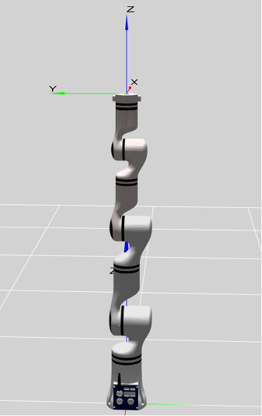

End effector flange center frame

 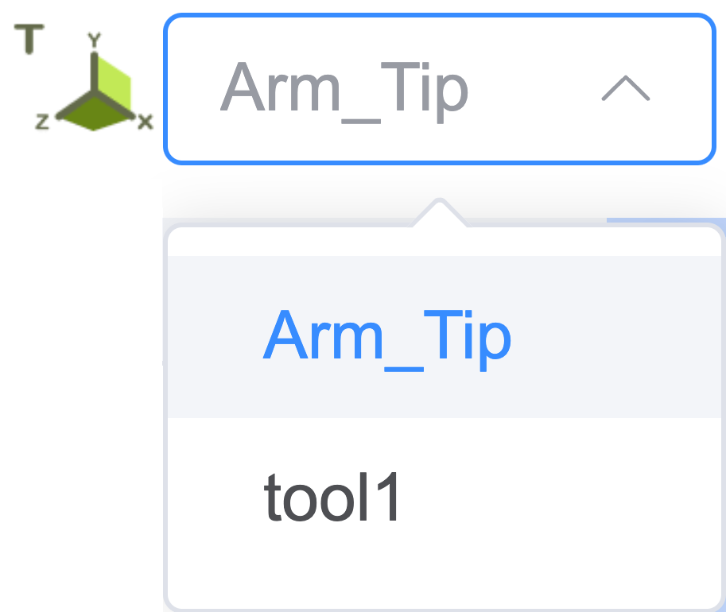 

Tool frame selection diagram

## Robotic arm state display

When an error occurs in the robot, it will be indicated here. Clicking the icon will open the error message list.

 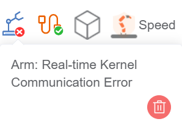 

Robotic arm error state display

## Network connection state display

When the connection to the robot is normal, it turns green; when communication is disconnected, it turns red.

 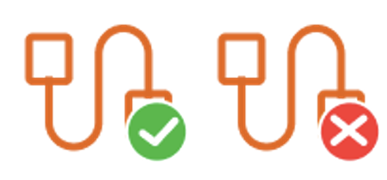 

Network connection state display

## Speed display

Here, you can either display in real-time or adjust the robot's movement speed as a percentage of its maximum speed using the slider.

 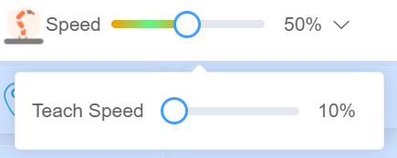 

Speed setting diagram

When using pose editing, this area can be used to set the data change speed when the '+' or '-' button is long-pressed.

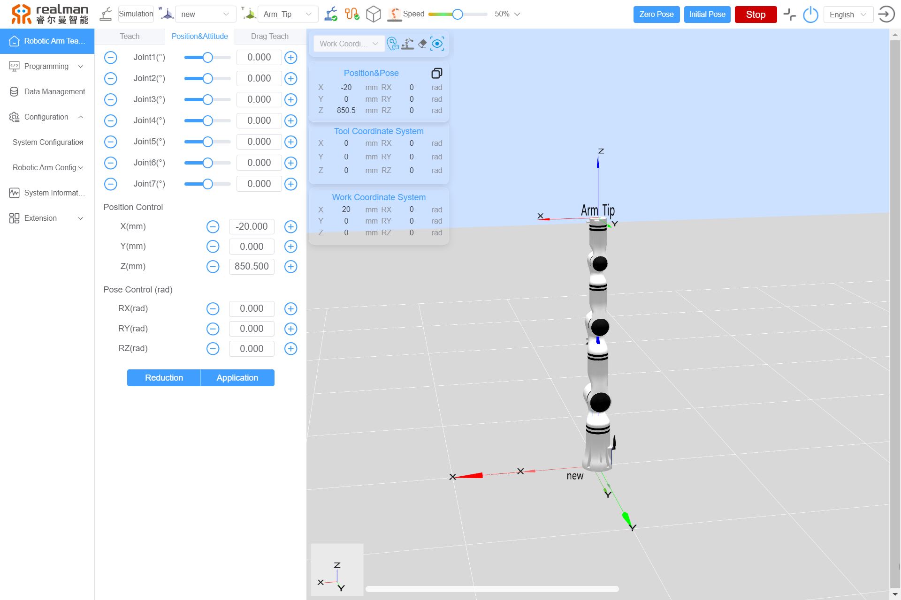

## Robot E-stop button

Pressing the E-stop button stops the robot at maximum speed. Pressing it again cancels the emergency stop, allowing the robotic arm to be operated again.

  

Robot E-stop button

## Full screen button

This button is used to control entering and exiting full-screen mode on the teaching interface.

 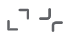 

Interface full screen button

## Power button

This button is used to control the robot's power switch. Blue indicates that the robot power is on, and gray indicates that the robot power is off.

  

Robot power switch

## Switch Language

Click the language switch dropdown menu and select the target language to switch to it. Currently, it supports Chinese, English, Korean, Spanish, and Japanese.

 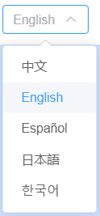 

Switch Language

## Logout

Clicking the logout button logs the user out.

  

Logout

## Joint control

The robot has six degrees of freedom, with each joint named Joint 1 to Joint 6 from bottom to top, corresponding to the robot's six joints. Users can control the rotation of each robot joint using the joint control buttons on the teaching interface. "Increase" indicates increasing the joint angle, while "decrease" indicates decreasing the joint angle (unit: °).

**Button table**  

| Increase |Decrease |
|------|------|
|   |  |

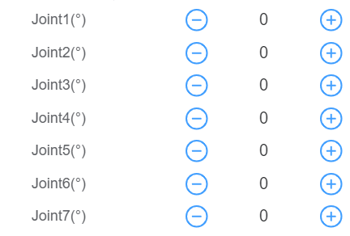

Joint control diagram

## Position control

The end effector can perform position control based on the world frame (World), base frame (Base), end effector frame (Arm_Tip), and user-defined plane frames. Users can perform teaching for the end effector under different frames. For the X-axis, "negative direction" indicates movement in the negative direction of the X-axis, while "positive direction" indicates movement in the positive direction of the X-axis. Long press the button to move the robot, and release it to stop the movement. The same applies to the other axes.

**Button table**  

| Negative direction |Positive direction |
|------|------|
|   |  |

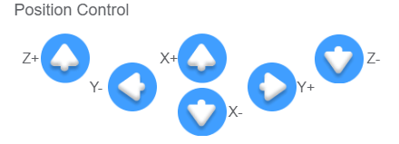

Position control button diagram

## Orientation control

The end effector can perform orientation control based on the world frame (World), base frame (Base), end effector frame (Arm_Tip), and user-defined work and tool frames. Users can perform teaching for the end effector under different frames. During orientation teaching, the end position remains unchanged, while the orientation rotates around a specified coordinate axis. For RX, "negative direction rotation" indicates rotation around the X-axis in the negative direction, while "positive direction rotation" indicates rotation around the X-axis in the positive direction.

**Button table**  

| Negative direction rotation |Positive direction rotation |
|------|------|
|   |  |

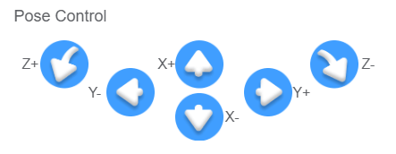

Orientation control button diagram

## Step mode setting

To improve teaching accuracy, the step control mode is used, allowing controlled variables to change accurately with step adjustments.

- First, check the "step mode" option box to activate step mode and enter step control.
- Users can adjust the step size of robot motion by clicking the buttons on either side of the step value.
- "Position": In the position control area, clicking a directional button moves the end effector a specified distance in the corresponding direction, with the unit in millimeters (The button must be held during movement, for releasing it will stop the robot midway).
- "Orientation": In the orientation control area, the angle of the end effector's orientation movement is set, with the unit in radians (rad) or degrees (°).
- "Joint": In the joint control area, the angle of the corresponding joint's movement is controlled, with the unit in degrees (°).
- Step control is only effective for end effector control and joint axis control.

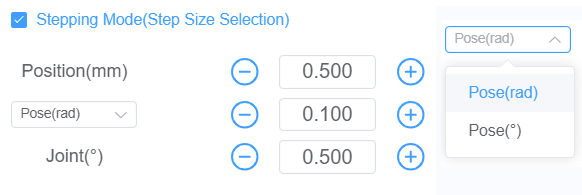

Step mode diagram

## Pose editing

1. By dragging the slider on the progress bar or moving the red virtual model's joints in the 3D simulation area, users can roughly adjust the joint angles of the robotic arm.
2. The `+` and`-` buttons can be used to fine-tune joint angles and position orientation, or parameters can be entered directly for adjustments. The adjusted position and orientation of the robotic arm are represented by the red virtual model.
3. Long press the `Apply` button to move the robotic arm to the position of the red virtual model; releasing the button stops the robotic arm. Clicking the `Reset` button restores the red virtual model to match the real robotic arm's position.

**Button table**  

| Progress bar slider | "+" and "-" buttons             |"Apply" button             |"Reset" button             |
|------|------------------|------------------|------------------|
| 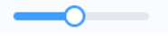  | 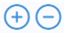 |  |       |

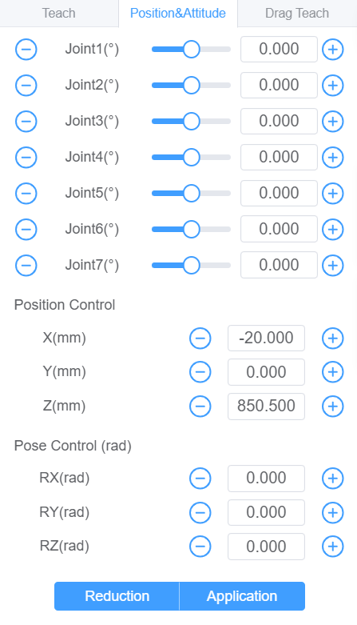

Pose editing diagram

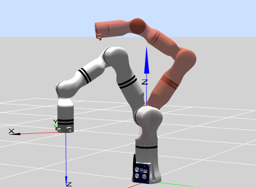

Red virtual model

## Drag teaching

### Teach Pendant Drag-and-Teach

In addition to recording points and trajectories through the robot's teaching interface, the robot also supports a drag teaching feature.

**Drag teaching includes the following modes**:

- **Reference Coordinate System**: The working coordinate system and the tool coordinate system can be selected as needed.
- **Current loop drag teaching**: After enabling the current loop mode, the robotic arm can be dragged at any position to change its orientation. Users can adjust the sensitivity value; the higher the value, the easier it is to drag the robotic arm, and the lower the value, the harder it is to drag the robotic arm.
- **6-DOF Drag Teaching**: This drag mode is only available for robotic arms with the 6-DOF version. Users can select the drag mode and whether to enable the drag singularity wall as needed, and it supports various drag methods such as customize, Only position, Only pose, and Position pose. Users can also freely combine the drag states of the six-dimensional force version robotic arms.
  - **Drag Mode**: Precise Dragging Mode, which is heavier to drag but offers higher precision, suitable for precise dragging to the target position; Fast Dragging Mode, which is lighter to drag but has lower precision, suitable for quickly dragging to the target position.
  - **Drag Singular Wall**: This refers to a virtual hard barrier near joint limits and singular regions. When enabled, the robotic arm cannot be dragged into the area within the wall.
  - **Drag Method**: Only position, allows the robotic arm to move through all axes without rotation; Only pose, allows the robotic arm to move in a spherical motion around the TCP (Tool Center Point) on all axes; Position pose, allows movement through all axes, with all axes being free.

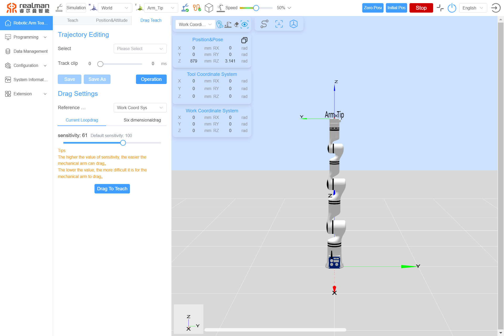

Current loop drag teaching mode

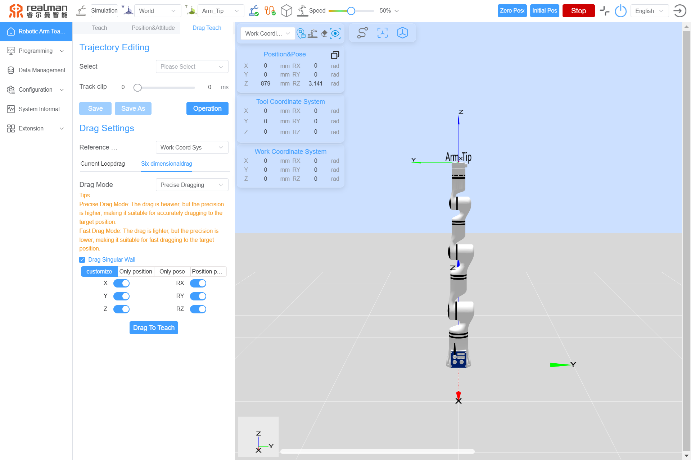

6-DoF force drag teaching mode

**Drag-and-Teach Operation Method**:

On the teach pendant, click the `Drag teaching` button, and then drag the robot. Once completed, click `end the drag teaching` to complete the trajectory recording. A pop-up window will appear for saving the new trajectory file, allowing users to decide whether to save it based on their needs.

| Start drag teaching | Finish drag teaching       |
|------|------------------|
| 
  
| 
  
 |

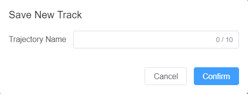

Save drag trajectories

After the trajectory recording is completed, click the blue button at the end of the robot to replay the trajectory.

### End-Effector Button Drag-and-Teach

There are two buttons on the end flange housing of robotic arm, which are intended to control the drag teaching and trajectory replay respectively.

By pressing the green button at the end of robotic arm, the robotic arm will become draggable, and the trajectory will be recorded during the dragging process. Trajectory recording will be completed as long as the green button is released. The position of the end button is shown in the diagram.

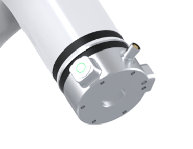

By clicking the blue button at the end of the robotic arm, the robotic arm will automatically return to the starting position of the trajectory and replay the trajectory once (the robotic arm replays only the finally recorded drag trajectory).

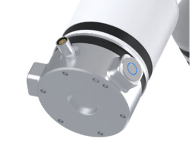

When the end effector tool is equipped with our standard two-finger gripper, the drag teaching process can record not only the robot's trajectory but also the actions of the gripper. While long press the green button to perform drag teaching, long press the blue button to close the gripper; press the blue button to open the gripper.

### Drag teaching trajectory trimming

The trajectories saved through drag teaching can be selected for execution or trimming here. Click the drop-down menu to select the trajectory to run, and then click the "Operation" button to execute it. During execution, you can click the "Stop" button to pause at any time. Once the execution is complete, click "Stop" again to manually stop the process.

The sliders at both ends of the progress bar can be used to trim the trajectory. As shown in the figure below, when dragging the sliders, the red virtual robotic arm will display the pose of each point on the trajectory in real time, helping users determine the trim points. Once trimming is complete, click the "Save" button to overwrite the original trajectory, or click the "Save As" button to save the trimmed trajectory as a new trajectory.

**Button table**  

| Drop-down menu | Run trajectory             |Stop motion             |Save             |Save as             |
|------|------------------|------------------|------------------|------------------|
|   |  |  |       |       |

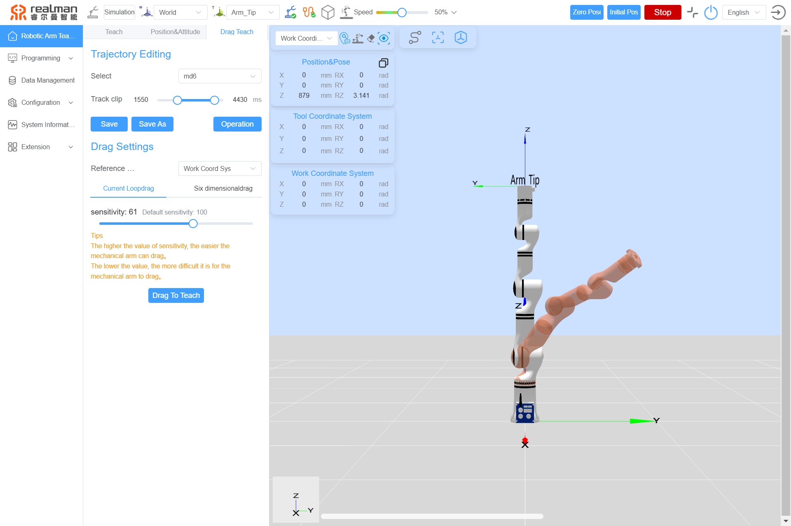

Trajectory trimming diagram

## Teaching frame selection

Select a frame to perform motion. When the tool frame is selected, the robot will move according to the direction of the tool frame.

 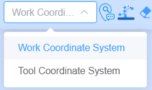 

Motion frame selection diagram

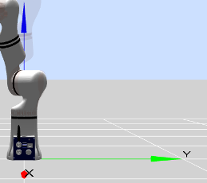

Work frame motion diagram

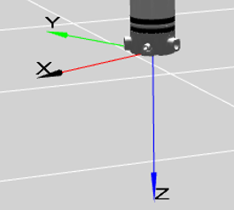

Tool-end motion diagram

## Draw/clear trajectory

Enable the "Draw trajectory" function to display the real-time trajectory line of the end effector in the model preview area.

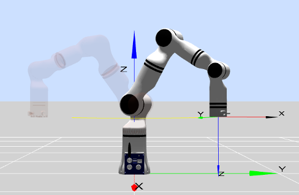

Trajectory drawing diagram

Enable the "Clear trajectory" function to remove the robot's trajectory line in the model preview area.

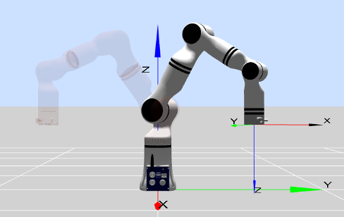

Trajectory clearing diagram

## One-click return button

Click the "One-click return" button to quickly restore the 3D simulation model view to its initial view.

  

One-click return button

## Zero orientation button

Zero orientation: long press the "Zero orientation" button to move the robot back to its zero position. Releasing the button stops the motion.

  

Zero orientation button

## Initial orientation button

Initial position: long press the "Initial orientation" button to return the robot to its initial position. Users can customize the robot's initial position via the teach pendant interface (see the [method for setting the initial position](../../teachingPendant/setting/index.md#initial-pose-setting) for details). Releasing the button stops the motion.

  

Initial orientation button

## Robot position and orientation parameter display

The X, Y, and Z values under position represent the coordinates of the tool flange center point (in the selected tool frame) within the selected frame (base frame, end frame, or user-defined frame). The RX, RY, and RZ values under orientation represent the rotation angles in radians relative to the selected frame. 
Supports clicking the copy button in the upper right corner to choose between copying joint data or copying pose data, and then copying the corresponding data.

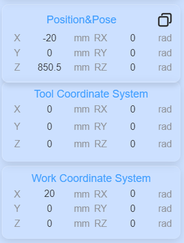

End effector pose display diagram

## 3D simulation model

The purpose of the robot simulation interface is to validate user-written programs without relying on the actual robotic arm. Users can verify the rationality of the robot's control program based on the simulation environment. Additionally, the model area includes the following user-friendly features:

- The simulation model can be resized and rotated by dragging the mouse (or touching the tablet interface) as needed.
- Each joint of the red virtual robotic arm can be dragged using the mouse. If the joint exceeds its limits, a pop-up warning will appear at the top of the page.

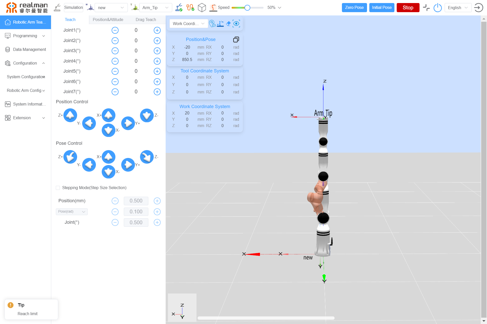

Exceeding limit warning

- If a joint reports an error, the corresponding joint in the model will turn red to alert the user.

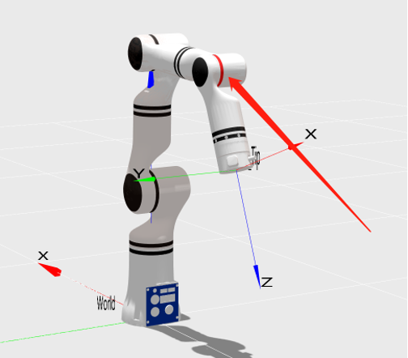

Joint error alert

