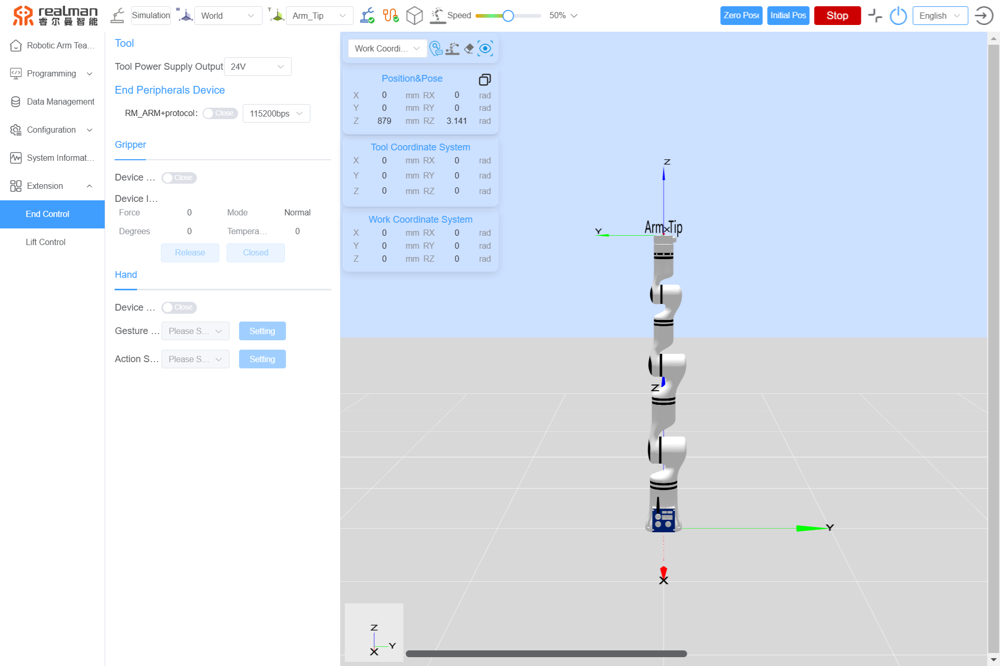
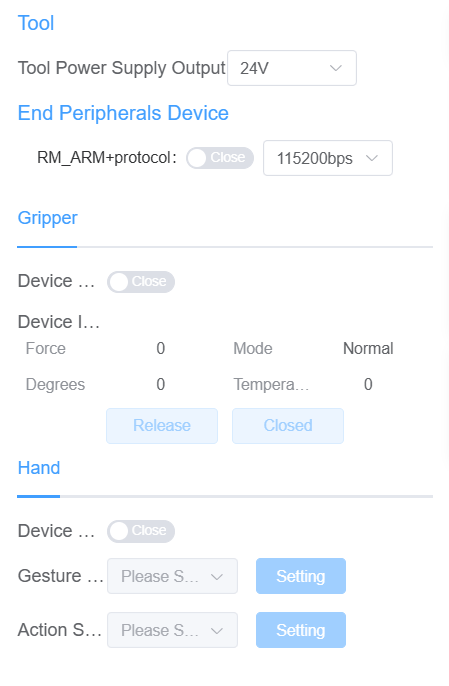
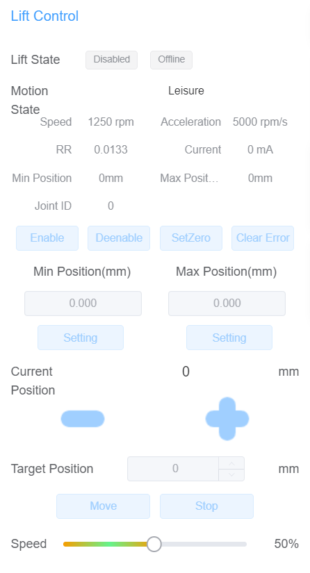

# 
Start guide: 
Robotic Arm Extension

In the extension interface of the teach pendant as shown in the image below:

Extension interface diagram

## End effector control

In the extension interface of the teach pendant, you can manage the end-effector tools. It supports switching the output voltage of the tool end, automatically identifies the end-effector tools via the RM_ARM+ protocol, and allows for basic control of the end-effector grippers, as shown in the figure below:

  

End effector control interface

**Power output**: This section allows configuring the external power output of the end interface board, which can be set to 0 V, 12 V, or 24 V. When the power output is set to 0V, the interface is grayed out and cannot be configured. 

**End-Effector Peripheral Devices**: Currently, peripheral devices or tools such as grippers and dexterous hands can be automatically identified via the RM_ARM+ protocol, or added by default for control through the end-effector interface.

- **When the RM_ARM+ protocol is not enabled**: Users can configure grippers or dexterous hands. The old protocol cannot obtain information about the devices connected to the end-effector.
  - **Gripper Control**: Install the gripper and check the box for the gripper. When the gripper status is enabled and online, you can view the current status parameters of the gripper and perform `Release` and `Closed` controls.
  - **Dexterous Hand Control**: After installing the dexterous hand and checking the box for the dexterous hand, you can set gestures and action sequences by configuring the `Gesture Number` and `Action Sequence`. The `Gesture Number` and `Action Sequence` here refer to the gestures and actions defined within the dexterous hand.
- **When the RM_ARM+ protocol is enabled**: The system automatically adapts to the connected end-effector and displays the corresponding operation interface. The end-effector ecosystem protocol support list is under testing and acceptance, to be supplemented later.
  - **End-effector Ecosystem**: When an ecosystem end-effector is installed and the RM_ARM+ protocol is enabled, the system automatically identifies and displays the device status and information of the ecological equipment. It also supports setting target parameters such as position, angle, force, and speed via sliders.

## Lift control and expansion joint control

In the extension interface of the teach pendant, parameters for lift control can be configured as shown in the image below. Users can move the lift to ascend or descend from its current position or set a target position and click the "Move" button to move the lift to the desired height.

  

Lift control

In the extension interface of the teach pendant, you can control the extended joints.
When an expansion joint is connected, parameters such as current speed, acceleration, current, maximum/minimum limits, and reduction ratio coefficient will be displayed. To avoid errors after connecting the joint, clear the joint errors first and then enable it. The expansion joint can move in both the forward and reverse directions. Additionally, users can set a target angle for movement and adjust the speed of the expansion joint's motion below.
