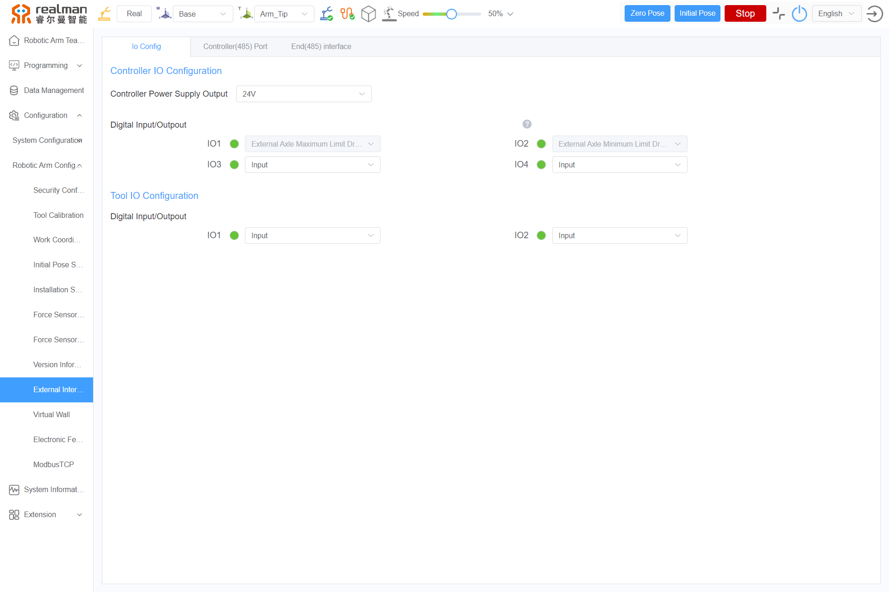
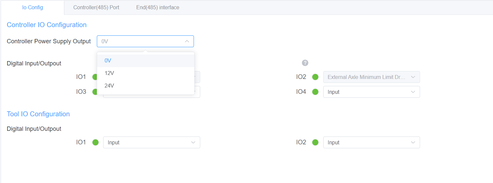
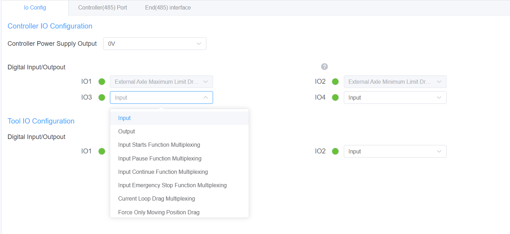
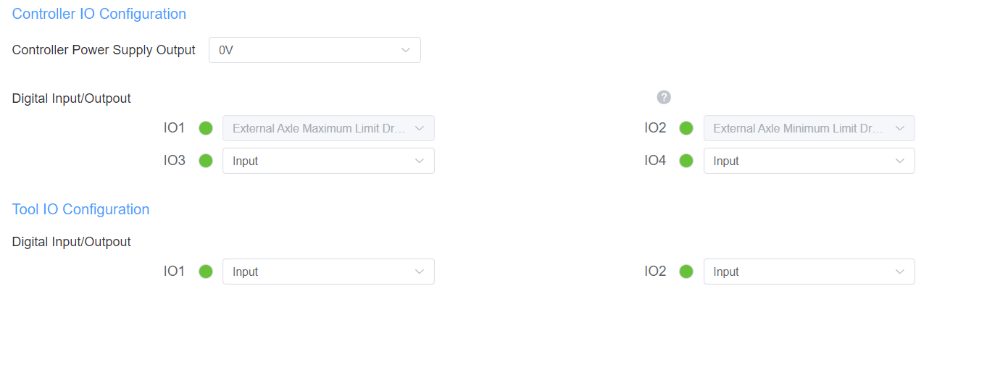
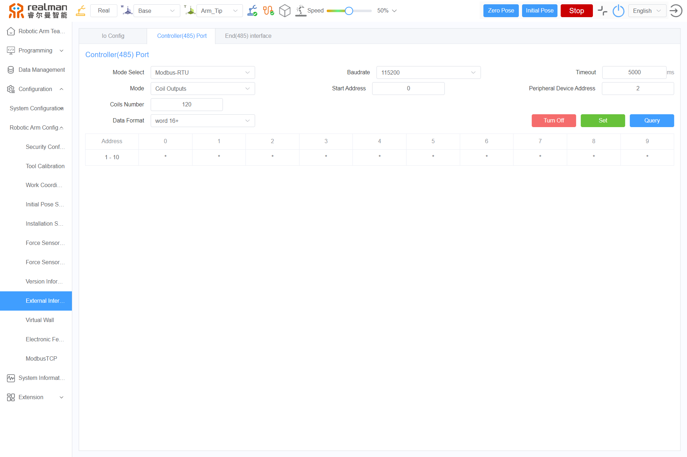
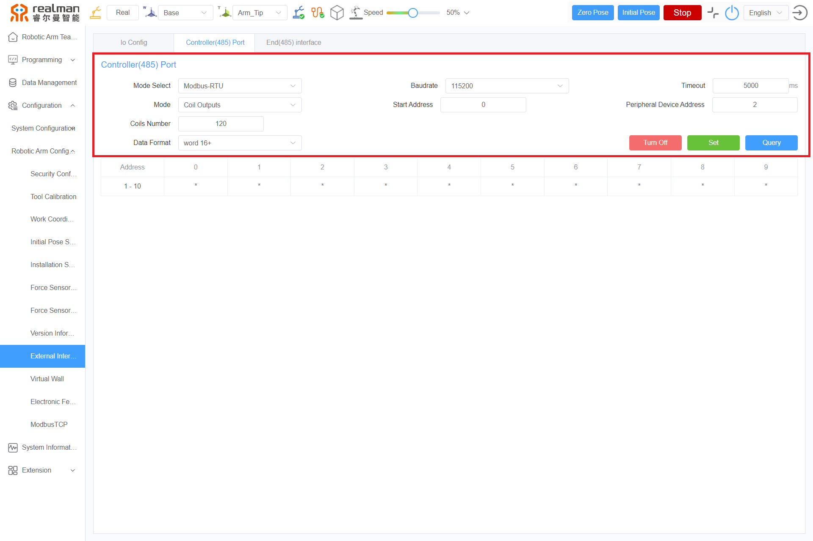

# 
Start guide: 
External Interface Settings

The external interface is configured under Configuration > Robotic arm configuration > External interface settings. The settings include IO settings, controller ports, and end effector interface board ports. Both the controller ports and end effector interface board ports come with a built-in modbus-RTU function, allowing a series of settings for RS485 and modbus-RTU to be completed via the selection bar on the left. The configured mode will be automatically recognized and displayed on the page. In modbus-RTU mode, after selecting the mode, real-time data can be viewed on the right-hand side.

## IO settings

The controller IO configuration includes controller power output and digital output/input, while the tool IO configuration includes digital input/output.

### Controller power output

Clicking inside the selection box for 0 V will display three options: 0 V, 12 V, and 24 V, corresponding to three available voltage outputs.

### Digital output/input

This section contains four identical modules. Clicking on them will bring up the Input, Output, Input Starts Function Multiplexing, Input Pause Function Multiplexing, Input Contine Function Multiplexing, Input Emergency Stop Function Multiplexing, Current Loop Drag Multiplexing, Input initial pose function multiplexing mode, Output collision function multiplexing mode, Real time speed regulation function reuse mode, and other related functions.

### Tool IO configuration

This section includes digital output/input, with two identical modules. Clicking on them will display two options: output and input.

## modbusRTU settings

The settings are divided into controller ports and end effector interface board ports. Users can complete a series of modbus-RTU settings through the corresponding functions in the selection bar. In modbus-RTU mode, after selecting the mode, real-time data can be viewed below.

### Controller ports and end effector interface board ports

The pages for the controller ports and end effector interface board ports include operations such as Mode Select, Baudrate, Timeout, Mode, Start Address, Peripheral Device Address, Coils Number, DataFormat, Set, Turn off, Turn On, and query.

