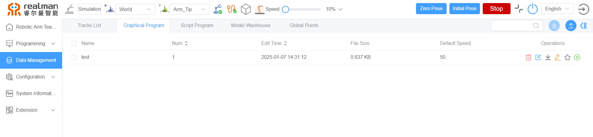
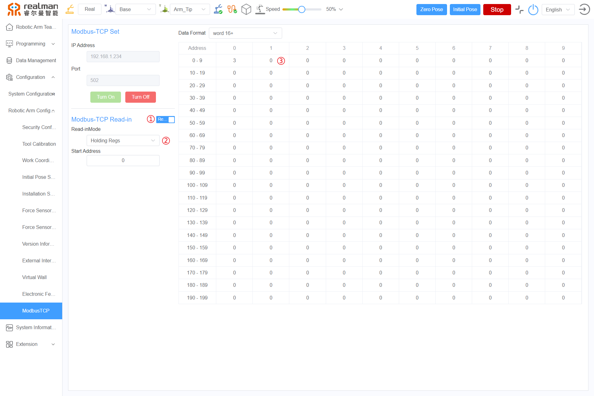
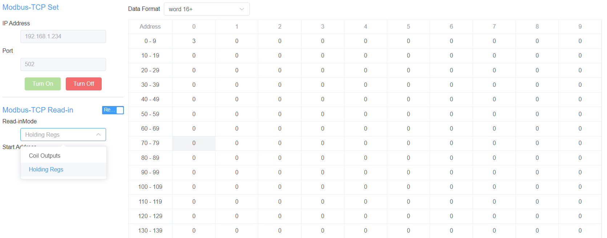
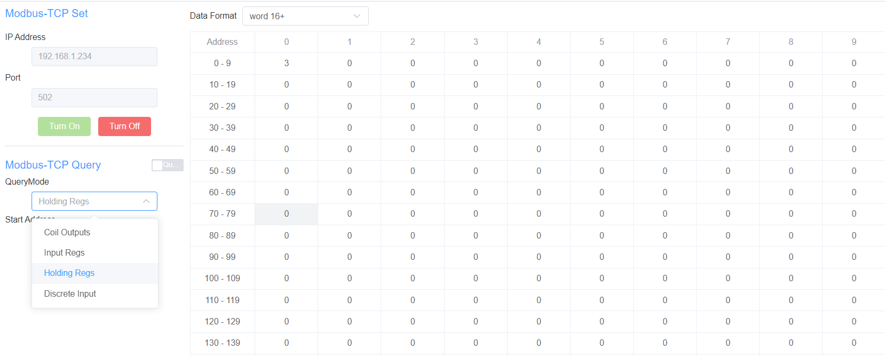
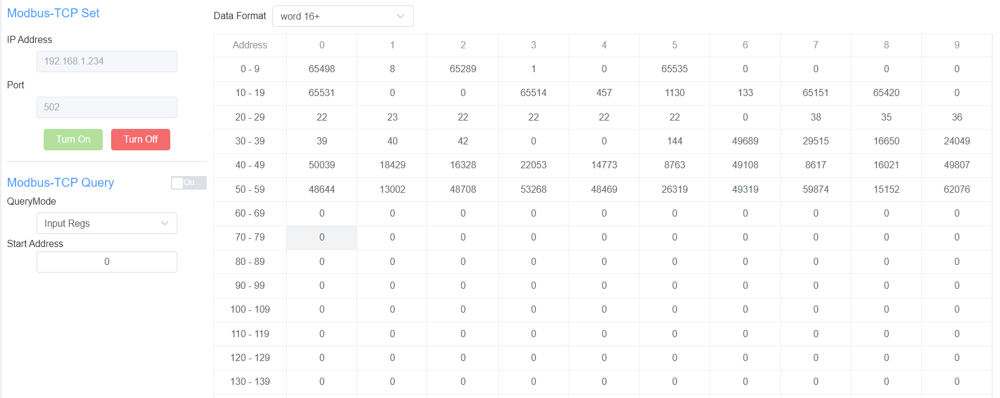
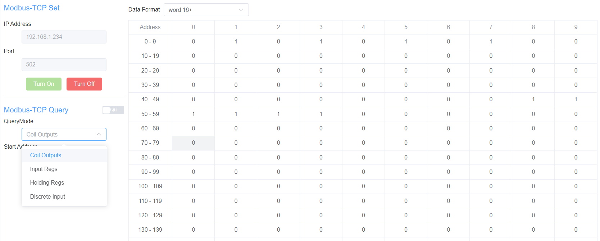
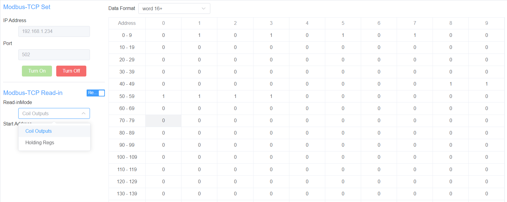
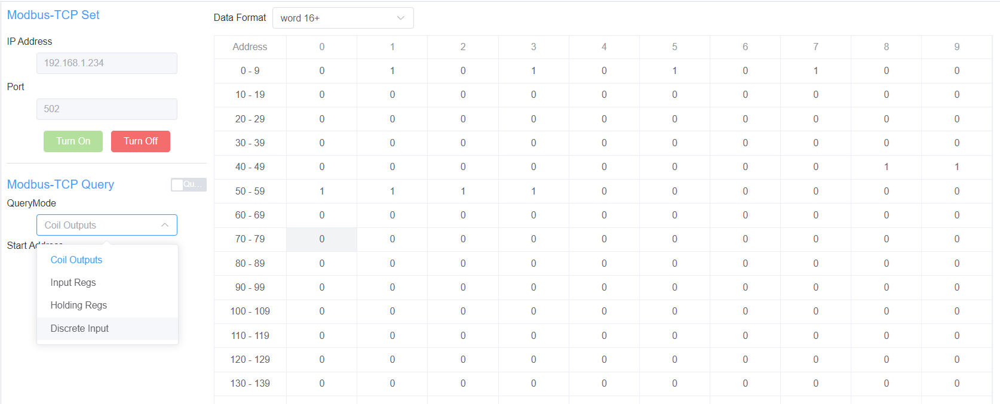

# 
Start guide: 
MODBUS-TCP Function

The RM65 I-series robotic arm can directly call programming files saved by the WEB teach pendant via the MODBUS-TCP protocol, and can also directly control or query the robotic arm's state.

- **Modbus-TCP Settings**: Displays the default address and communication interface of the connected device. When you need to use the MODBUS-TCP function, please click Enable to activate the MODBUS-TCP function; after use, please click Disable to deactivate the MODBUS-TCP function.
- **Modbus-TCP Query/Write**: You can switch between query and write modes by clicking the toggle button as needed, and also select the starting address of the register as required.
    - **Query Mode**: You can query the current data of the robotic arm as needed, including coil outputs, input registers, holding registers, and discrete inputs.
    - **Write Mode**: You can write to registers as needed, including coil outputs and holding registers.
    - **Starting Address**: Set the starting address for querying registers. Only the data of registers after the starting address will be displayed. If not set, all register address data will be displayed.
- **Data Display Format Switching**: In the register query results, you can switch the display format of the data as needed. Currently, three formats are supported: word16+, deline+/-, and hex.

## Call online programming files

Using the Modbus-TCP protocol, you can call graphical programming files saved in data management.

**Calling Steps**:

1. On the Modbus-TCP settings page, click `Turn On` to activate the MODBUS-TCP function.
2. Select `Holding Res` in `Read-inMode`, and click on the value of register address 1, as shown in the figure below.
    
3. In the `Read-in` dialog box, enter the number of the graphical programming file to be called, and click `Read-in` to complete the call.
    

## Control the robotic arm

- When users select `Holding Res` in `Read-inMode`, they can use the Modbus-TCP protocol to write angles, positions, and orientations into the corresponding registers, controlling the movement of the robotic arm.
    
- When users select `Holding Res` in `Query Mode`, they can query the current data of the robotic arm.
    
- For detailed explanations of address parameter values, please refer to the [Holding Registers Command Set](../../modbus/index.md#13-holding-register).

## Get the current state of the robotic arm

Users can select `Holding Res` in `Query Mode` to retrieve the current data of the robotic arm. For detailed explanations of address parameter values, please refer to the [Holding register instruction set](../../modbus/index.md#14-input-register)

## IO Coil Output

- When users select `Coil Outputs` in `Query Mode`, they can obtain the input or output status of the IO mode based on the parameter value in the address bar.
    
- When users select `Coil Outputs` in `Read-inMode`, they can modify the parameter value in the address bar as needed to change the input or output status of the IO mode.
    
- For detailed explanations of address parameter values, please refer to the [Coil Output Register Command Set](../../modbus/index.md#11-coil).

## IO Discrete Input

When users select `Discrete Input` in `Query Mode`, they can read the current status of the robotic arm through the parameter value. For detailed explanations of address parameter values, please refer to the [Discrete Input Register Command Set](../../modbus/index.md#12-discrete-input).

