# <p class="hidden">Start guide:</p>Online Programming

## Graphical programming

Users can program the RM65 robot on the graphical programming interface to enable the complex motion of the robot.

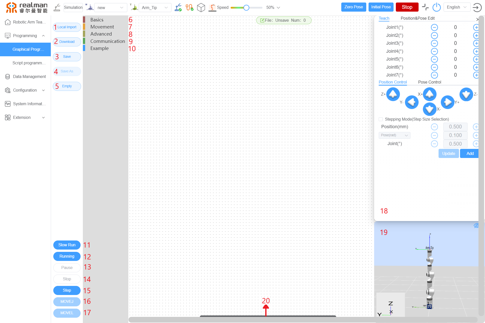

<center>Graphical programming interface</center>

**Graphical programming interface**

| S/N | Name             |
|------|----------------|
| 1    |  File Import button    |
| 2    |  Download button     |
| 3    |  Save button       |
| 4    |  Save As button   |
| 5    |  Clear button       |
| 6    |  General command     |
| 7    |  Motion command       |
| 8    |  Advanced command  |
| 9    | Communication command       |
| 10   | Demo           |
| 11   |  Low-speed Debug button  |
| 12   |  Run button        |
| 13   |  Pause button    |
| 14   |  Stop button       |
| 15   |  Single-step button     |
| 16   |  MoveJ to Point button    |
| 17   |  MoveL to Point button   |
| 18   |  Add point           |
| 19   |  Model preview     |
| 20   |  Information view   |

The following will explain each area/button in order according to the table above:

### File Import button

For the established file, click the `Local Import` button, and the prompt "Whether to save the edited file before importing local file?" will pop up. Then, click continue importing, choose the file, and click `Open`, and the file will be displayed in the text box on the right, with the suffix .txt.

For example, choose the file named "program2024_10_21 14_28_33.txt".

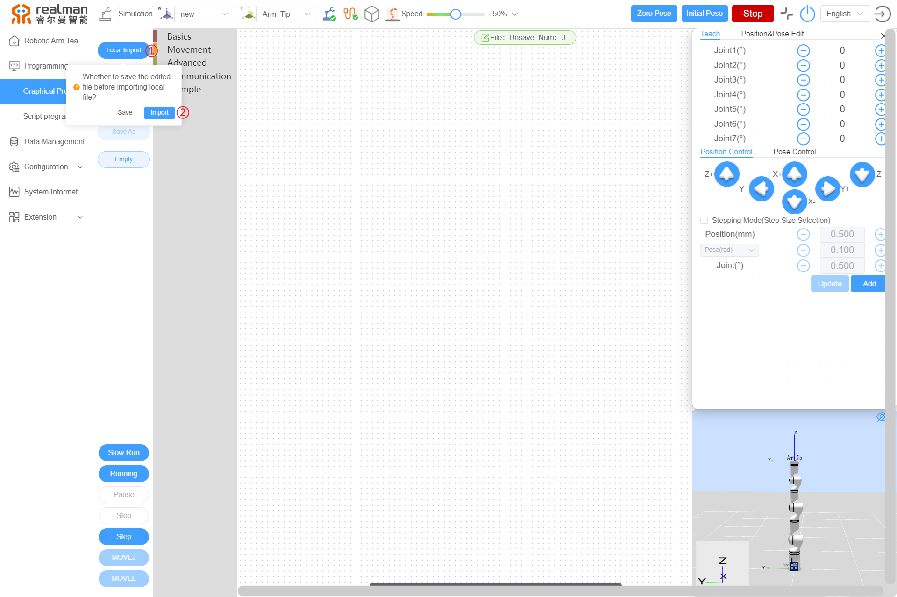

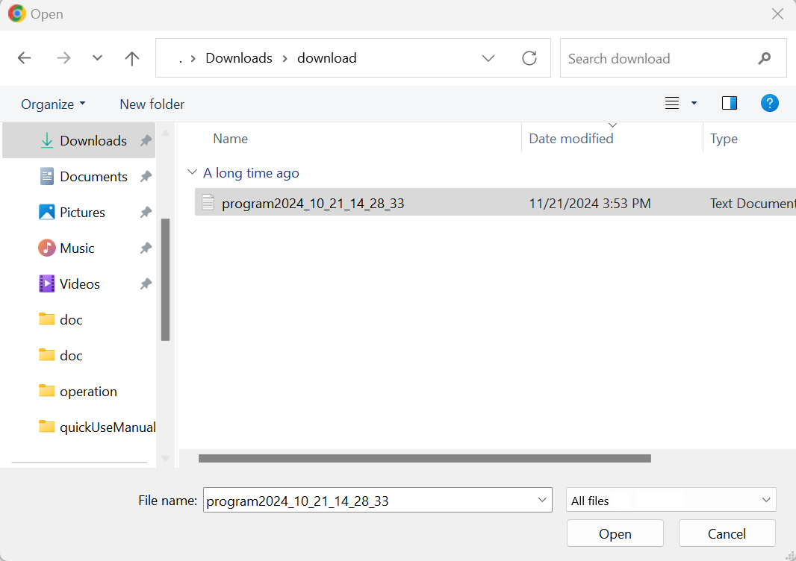

<center>Local file import</center>

### Download button

Click the `Download` button, and the data in the file display area will be downloaded to the set download path, with the name of "program_date_time", such as "program2025_01_07 14_28_33.txt".

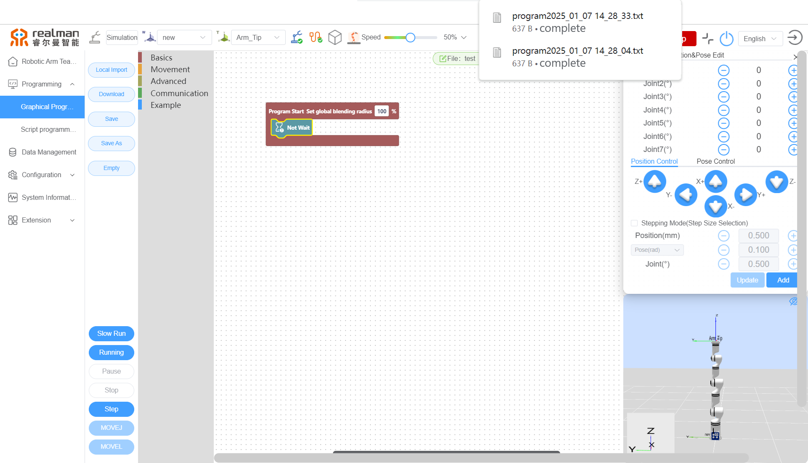

<center>File saving image</center>

### Save button

After writing the program on the graphical programming interface, click the `Save` button, and a prompt box will pop up for setting the name and num of the file. Then, click `Save`, and check the saved file in `Data Management` > `Graphical Program`. Additionally, the saved file can be called directly via TCP or Modbus.

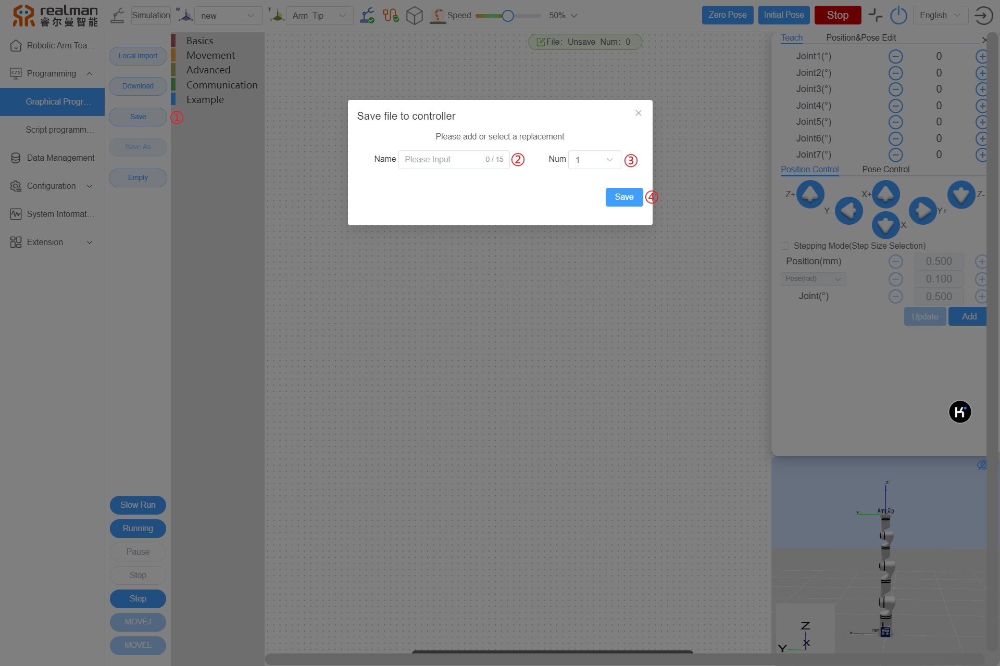

<center>File naming image</center>


<center>File path image</center>

### Save As button

After writing the program on the graphical programming interface, click the `Save As` button, and a prompt box will pop up for setting the name and num of the file. Then, click `Save`, and check the saved file in `Data Management` > `Graphical Program`. Additionally, the saved file can be called directly via TCP or Modbus.

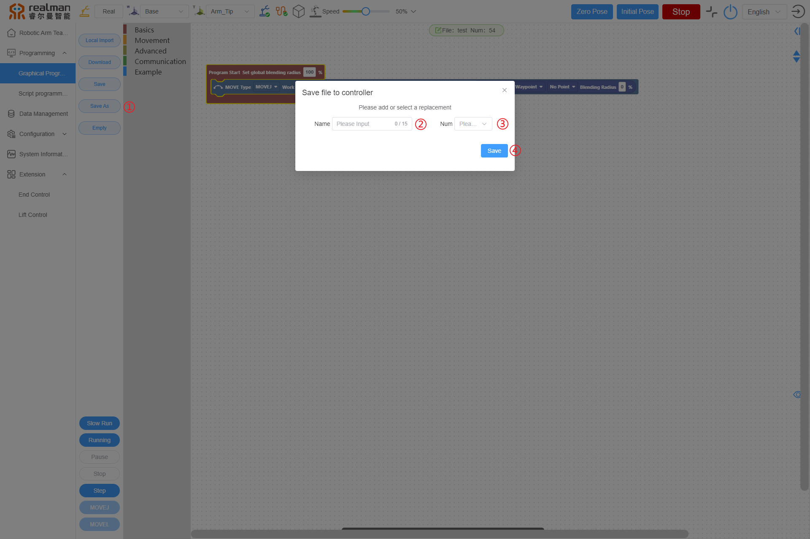

<center>File naming image</center>


<center>File path image</center>

### Clear button

**Button table**  

Click the `Empty` button, and the content in the programming area will be cleared. If there is a file being edited currently, the prompt "Confirm clearing?" will pop up. Then, click `Confirm` or `Cancel` according to actual demand.

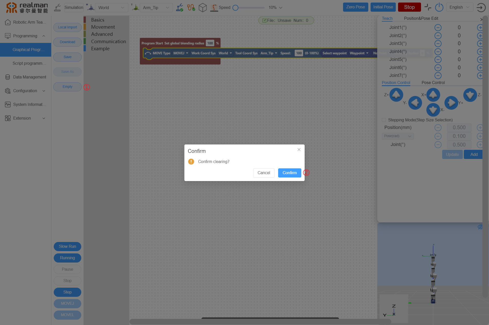

<center>Clear confirmation prompt</center>

### General command

The general command includes "Initialization Module", "Loop", "Wait", "Set", "Digtal", "Termination", "Prompt", and "Select trajectory file", in a total of 8.

<div align="center"> 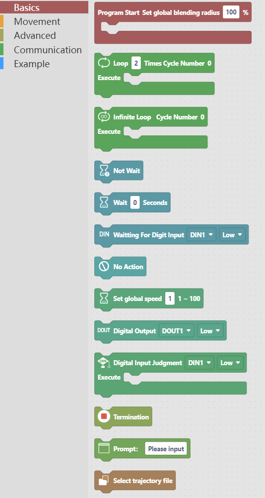 </div>

<center>General command</center>

#### Initialization Module

"**Initialization Module**" is essential for each program and is added before the start of the program. Without adding the module, click Start, and the prompt "Modules are redundant or incomplete" will pop up at the top of the teach pendant interface.

<div align="center">  </div>

<center>Initialization module</center>

<div align="center"> 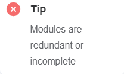 </div>

<center>Initialization module missing prompt</center>

#### Wait command

"**Wait**" command is used for inputting the waiting time or signal. It is optional for no wait, waiting time, and waiting for digital input.

<div align="center"> 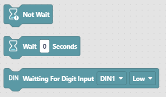 </div>

<center>Wait command</center>

**No wait:** Set no wait conditions.

**Waiting time:** Set waiting time, in s.

**Wait for digital input:** Wait for the digital input interface to meet the set conditions. These digital input interfaces include DIN1, DIN2, DIN3, and DIN4 on the controller and T_DIN1 and T_DIN2 on the tool. The digital input is optional for high and low levels.

**Program demo:** Add a wait command in the program, such as wait for 2s between waypoints 1 and 2 as shown below.

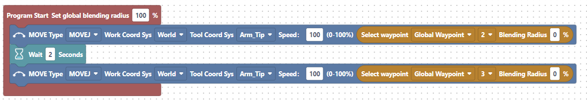

<center>Wait command program demo</center>

#### Set command

"**Set**" command is used to set the state of the digital output interface. It is optional for no action or setting digital output.

<div align="center"> 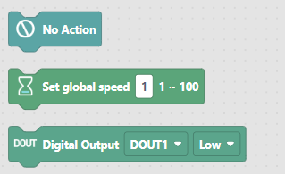 </div>

<center>Set command</center>

**No action:** Keep the state of the digital output interface unchanged.

**Set Global Speed**: Configure the global speed of the controller, which is used to control the overall execution speed of subsequent commands.

**Set digital output:** Set the digital output interface to the given state. These digital output interfaces include DOUT1, DOUT2, DOUT3, and DOUT4 on the controller and T_DOUT1 and T_DOUT2 on the tool. The digital output is optional for high and low levels.

**Program demo:** Add a set command in the program, such as that between waypoints 2 and 3 as shown below.

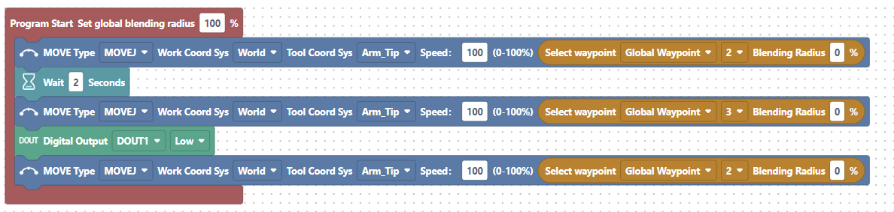

<center>Set command program demo</center>

In the program, line 5 refers to the set mode, and the "set digital output" is optional for low or high levels as shown below.

<div align="center"> 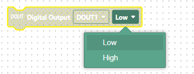 </div>

<center>Set command program demo</center>

#### Digital command

"**Digtal**" command is used to digital whether to execute the branching program. If the set conditions are met, the branching program will be executed. Otherwise, the branching program will be skipped.

<div align="center"> 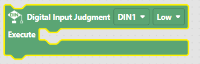 </div>

<center>Digital command</center>

**Digital Input Judgment:** Digital whether the digital input interface meets the set conditions. These digital input interfaces include DIN1, DIN2, DIN3, and DIN4 on the controller and T_DIN1 and T_DIN2 on the tool. The digital input is optional for high and low levels.

**Program demo:** Add a digital command in the program, such as that between waypoints 1 and 2 as shown below.

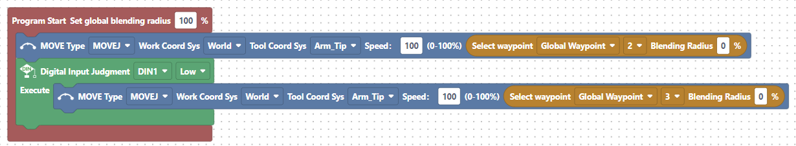

<center>Digital command program demo</center>

In the program, line 3 refers to the digital mode, and the "Digital Input Judgment" is optional for low or high levels as shown below.

<div align="center"> 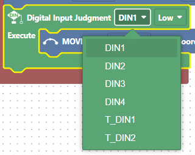 </div>

<center>Digital command program demo</center>

#### Loop command

"**Loop**" command is used to execute the program command repeatedly. It is optional for loop count and infinite loop.

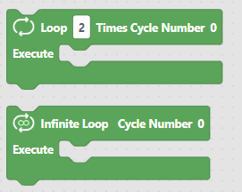

<center>Loop command parameter</center>

**Loop count:** Set count for the loop execution of the program command.

**infinite loop:** Set infinite loop execution of the program command.

**Program demo:** Add a loop command in the program, such as that between waypoints 1 and 2 as shown below.

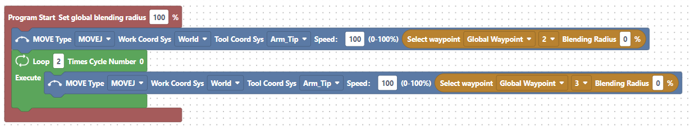

<center>Loop command program demo</center>

In the program, the bottom line refers to the loop mode, and the loop count is 2.

#### Termination command

"**Termination**" command is used to termination running the program.

**Program demo:** Add a termination command in the program, such as that between waypoints 1 and 2 as shown below.

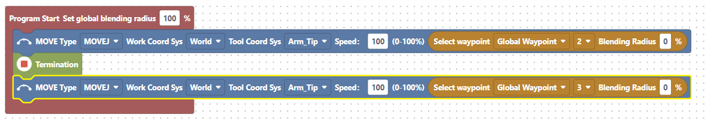

<center>Termination command program demo</center>

In the program, line 3 refers to the termination command. The program will termination after the trajectory runs to this point and no action will be performed at waypoint 2.

#### Prompt command

"**Prompt**" command is used to prompt the user. However, Chinese content is not allowed.

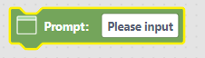

<center>Prompt command parameter</center>

**Program demo:** Add a Prompt command in the program, such as that between waypoints 1 and 2 as shown below.

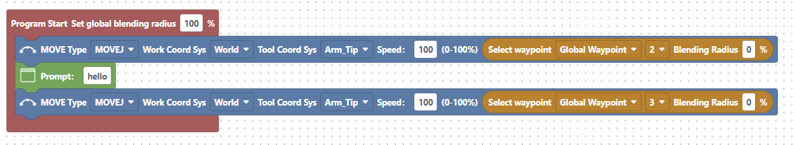

<center>Prompt command program demo</center>

In the program, line 3 refers to the Prompt mode, and a window will pop up when the trajectory runs to this point as shown below:

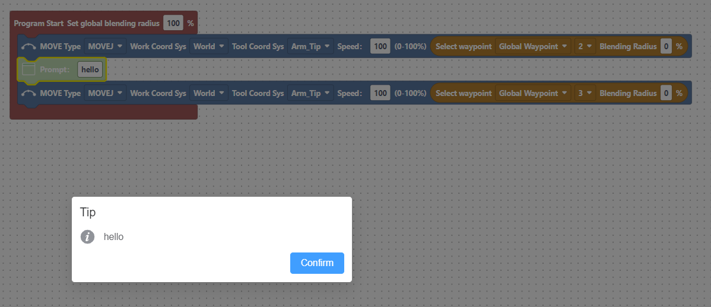

<center>Prompt command program demo</center>

After confirmation, the program will continue to execute.

### Motion command

The motion command includes "move" and "waypoint".

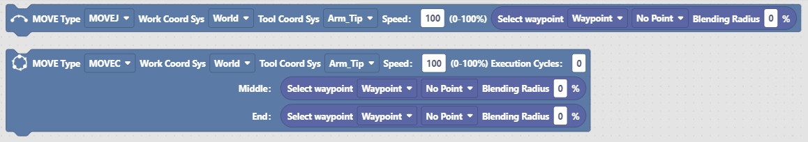

<center>Motion command</center>

### Move command

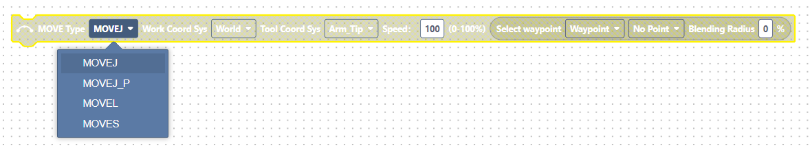

<center>Move command parameter</center>

The move command is classified into "MOVEJ", "MOVEJ_P", "MOVEL", "MOVEC", and "MOVES", in a total of 5.

1. MOVEJ and MOVEJ_P commands: Ensure the final waypoint only, without constraining the intermediate trajectory.
2. MOVEL command: Ensure both the final waypoint and the linear motion between the two points.
3. MOVEC command: Execute circular or arc trajectory, with only two waypoints (via-point and end point) added.
4. MOVES command: Execute complex spline curve motion, without consecutive points in the same position.


<center>Move command</center>

**"Move"** command is available to set the motion type, motion speed, work frame, and tool frame.

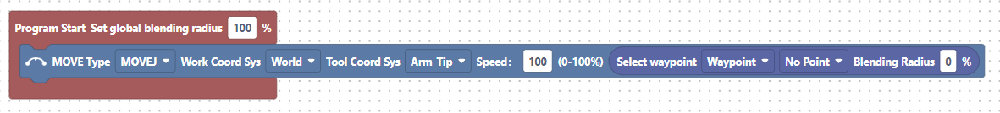

<center>Add move command</center>

**Motion type:** "MOVEJ", "MOVEL", "MOVEJ_P", "MOVEC", and "MOVES", indicating joint motion, linear motion, circular motion (When the circle number is 0, arc trajectory is performed; when the circle number is greater than or equal to 1, the circular trajectory is performed), and spline curve motion. "MOVEJ" and "MOVEJ_P" are both joint motions, but their waypoint parameters are different, which are the joint angles for "MOVEJ", and the poses in the tool frame for "MOVEJ_P".

**Motion speed:** Set the default speed for the waypoint under the move command.

**Work frame:** Set the frame based on the actual working position, allowing for user creation.

**Tool frame:** Set the frame based on the center of the actual end effector, allowing for user creation.

**Program demo 1:** Add a MOVEJ trajectory to the program, such as that between waypoints 1 and 2 as shown below.

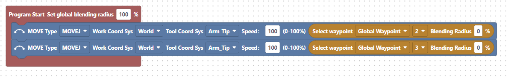

<center>MOVEJ program demo</center>

**Program demo 2:** Add a MOVEL trajectory to the program as shown below.

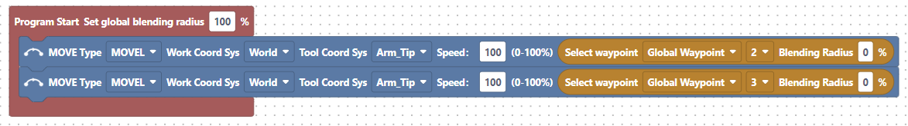

<center>MOVEL program demo</center>

**Program demo 3:** Add a MOVEC trajectory to the program as shown below.

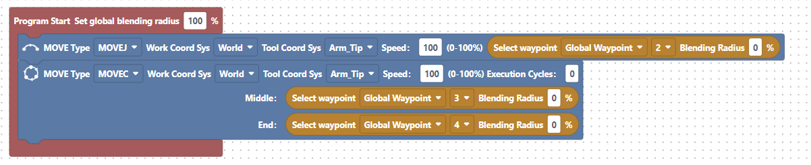

<center>MOVEC program demo</center>

#### Waypoint command

"**Waypoint**" command must be added under the "**Move**" command as the robot's motion point. This command is available to select the pre-saved waypoints and set the speed and blend radius.

<div align="center">  </div>

<center>Waypoint command parameter</center>

**Waypoint:** Click the drop-down box to select the saved waypoints.

**Blend radius:** Set to 0 by default, without any changes.

**Program demo:** Add a waypoint of the MOVEJ trajectory to the program, such as waypoint 2 under waypoint 1 as shown below.

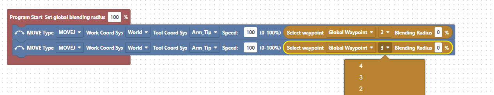

<center>Waypoint command program demo</center>

### Advanced command

The advanced command includes "Power control", "Gripper", "Annotation", "Dexterous Hand", and "Lift", in a total of 5.

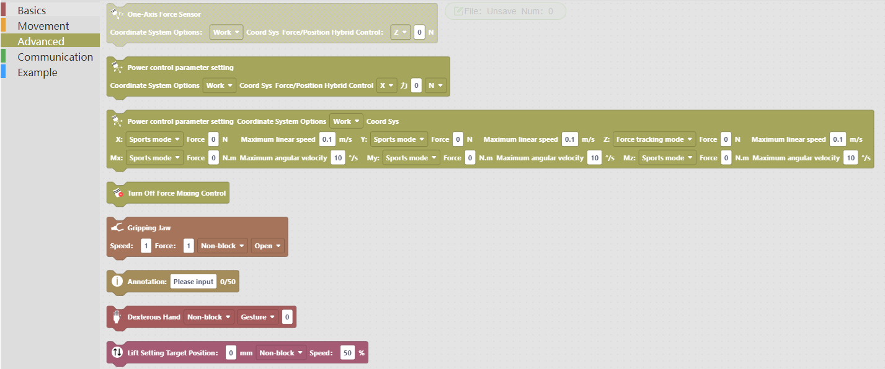

<center>Advanced command</center>

#### Power control command

"**Power control**" command is only available for robots with 6-DoF installed at the end of the robot. Setting parameters include sensor type, frame type, power-position hybrid control direction, power threshold, and enable/disable power-position hybrid control.

<div align="center"> 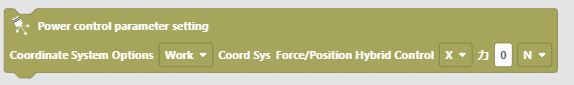 </div>

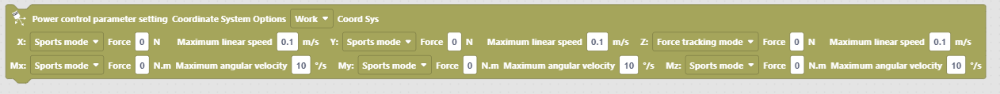

<div align="center">  </div>

<center>Power control command parameter</center>

**Sensor type:** Select the 1-DoF power sensor or 6-DoF power sensor.

**Frame type:** Select a reference frame for power control.

**Power-position hybrid control:** Set the direction and power of the power-position hybrid control, such as X\\Y\\Z\\Rx\\Ry\\Rz for the 6-DoF power sensor.

**Disable Power-position hybrid control:** Disable the power-position hybrid control, and the subsequent move commands in the program will no longer use the power-position hybrid control mode.

::: warning

1. The points moved under the power-position hybrid control must be recorded by the Cartesian coordinate system, that is, no MOVEJ command shall be included.
2. The RM65-B robot does not support power control command, and the power control module is disabled in the teach pendant when the standard robotic arm is connected.
3. The previous point for the power control should be consistent with the first point.
4. When the power control command is enabled, it is prohibited to apply external power on the power sensor, to avoid poor calibration (refer to program demo for programming).
:::

It is allowed to set the motion mode, power, torque, maximum linear speed, and maximum acceleration at different axes. <br>
The mode includes fixed mode, float mode, spring mode, motion mode, and power tracking mode.

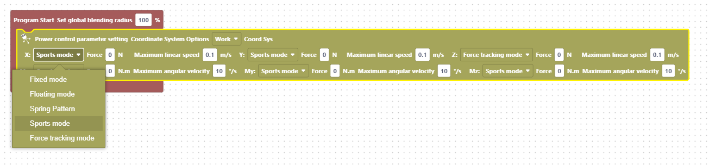

<center>Mode description</center>

**Program demo:** Add a power control trajectory to the program, where the linear motion in the loop is under force control as shown below.

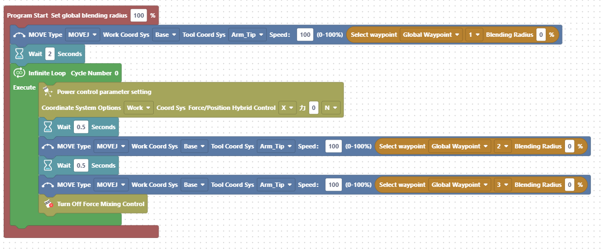

<center>Power control command program demo</center>

#### Gripper command

"**Gripper**" command is used to control the action of the two-finger gripper. It is available to set the speed, force, blocking mode, and gripping state of the gripper.

<div align="center"> 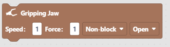 </div>

<center>Gripper command parameter</center>

**Speed:** Set the gripper speed from 0 to 1,000, with a maximum of 70 mm/s.

**Force:** Set the gripping force from 0 to 1,000, with a maximum of 20 N.

**Blocking mode:** Set the blocking or non-blocking mode. In blocking mode, after the gripper movement is completed, the robot executes the subsequent commands; while in non-blocking mode, the robot synchronously executes subsequent commands during the gripper movement.

**Gripping state:** Set the opening or closing state.

**Program demo:** Add a gripper command to the program as shown below:

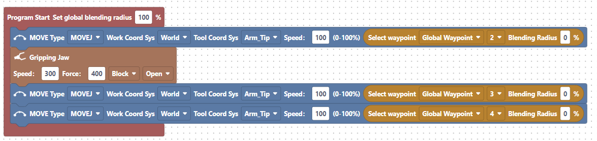

<center>Gripper command program demo</center>

In the program, line 2 refers to mode: blocking, speed: 300, and force: 400.

**The gripper closing is set as shown below:**

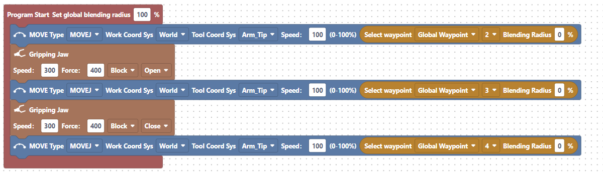

<center>Gripper closing command program demo</center>

#### Annotation command

"**Annotation**" command is used to explain the function of the program. It is unavailable for the robot control. Additionally, Chinese comment is not allowed.

<div align="center">  </div>

<center>Annotation command parameter</center>

**Program demo:** Add a annotation command in the program, such as that between waypoints 2 and 3 as shown below.

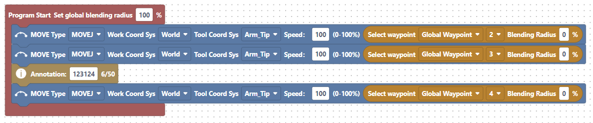

<center>Annotation command program demo</center>

### Dexterous hand command

"**Dexterous hand**" command is used to control the action of the five-fingered dexterous hand. It is available to set the blocking mode, gesture, and action sequence number.

<div align="center"> 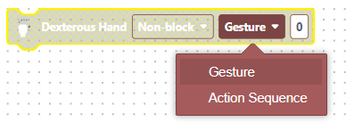 </div>

<center>Dexterous hand command parameter</center>

**Blocking mode:** Set the blocking or non-blocking mode. In blocking mode, after the dexterous hand movement is completed, the robot executes the subsequent commands; while in non-blocking mode, the robot synchronously executes subsequent commands during the dexterous hand movement.

**Gesture:** Set the gesture pre-stored in the dexterous hand.

**Action sequence number:** Set the gesture sequence number pre-stored in the dexterous hand from 1 to 40, with each sequence number representing one gesture.

**Program demo:** Add a dexterous hand command in the program, such as that under waypoint 1 as shown below.

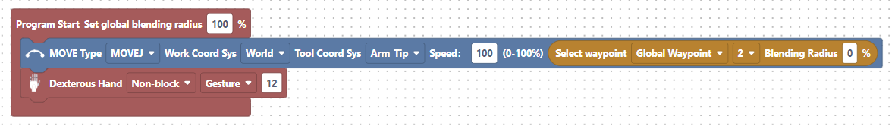

<center>Dexterous hand command program demo</center>

In the program, line 3 refers to the dexterous hand command, with a gesture of 12.

#### Lift command

"**Lift**" command is used to control the movement of the expansion joint lift or sliding table. It is available to set the target height, blocking mode, and speed.

<div align="center">  </div>

<center>Lift command parameter</center>

**Target height:** Set the position of the lift according to the actual working position of the robot, with consideration to the actual travel of the lift.

**Blocking mode:** Set the blocking or non-blocking mode. In blocking mode, after the lift moves in position, the robot executes the subsequent commands; while in non-blocking mode, the robot synchronously executes subsequent commands during the lift movement.

**Speed:** Set the speed of the lift from 0 to 100, with 50% by default.

**Program demo:** Add a lift command in the program, such as that under waypoint 1 as shown below.

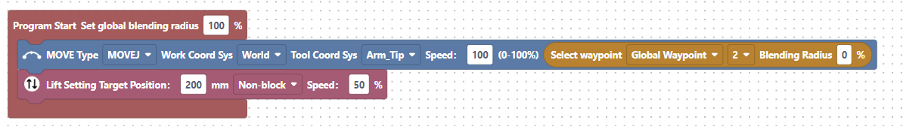

<center>Lift command program demo</center>

In the program, line 3 refers to the lift command, with a target height of 200 mm and a speed of 50%.

### Low-speed Debug button

When the online programming file is established, click the `Slow Run` button on the lower left side (after being clicked, it becomes the `Slow Running` button). During the automatic running of the trajectory, the background color of the current motion point turns bright.


<center>Low-speed Debug button</center>


<center>Low-speed debug program in progress</center>

### Run button

When the online programming file is established, click the `Running` button on the lower left side (after being clicked, it becomes the `Pause` button). During the automatic running of the trajectory, the background color of the current motion point turns bright.

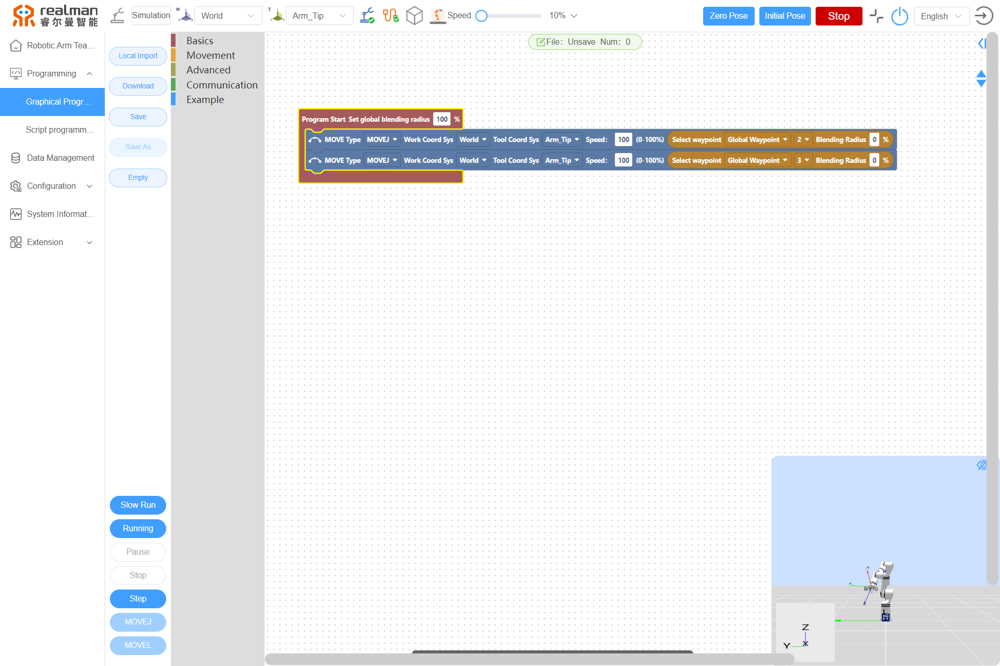

<center>Run program</center>

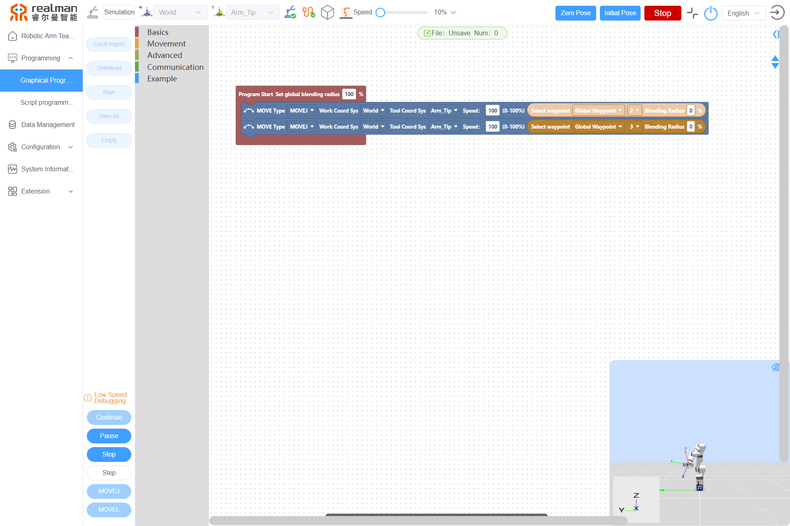

<center>Program in running</center>

### Pause button

Click the `Pause` button during the robot movement, and the robot will stop the movement immediately. Then, click the `Continue` button, and the robot will continue to move.

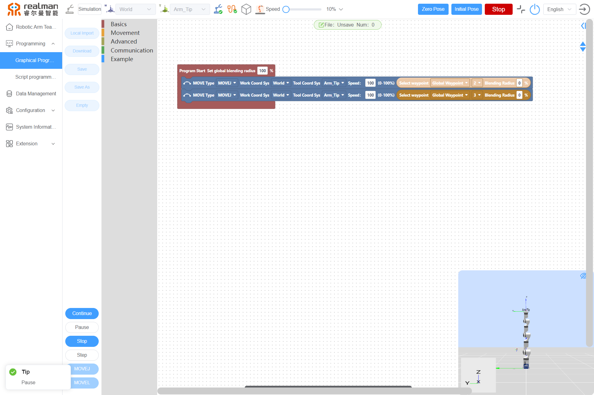

<center>Program pause and continuation</center>

### Stop button

Click the `Stop` button, and the file will stop running, and the `Continue` button will restore to the `Running` button. Click the `Stop` button, and the trajectory will also stop, unavailable for continuation.


<center>Program stop</center>

### Single-step button

The online programming file can be run in a single step. Click the `Step` button, and the `Run` button will become the `Continue` button (complete trajectory recovery with the pause function). In single-step mode, the command is executed one by one, and the next trajectory command can be published by clicking the `Step` button only after completing a trajectory.

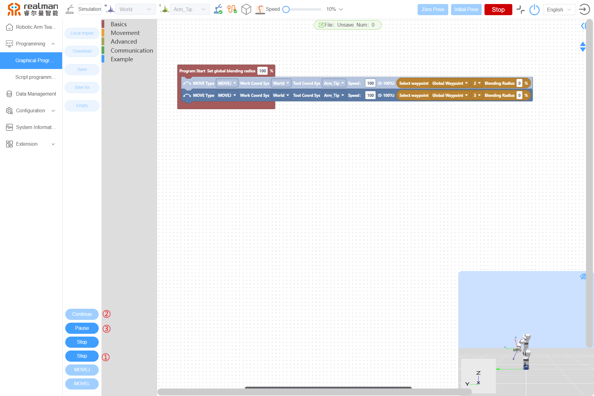

<center>Program running in a single step</center>

### MoveJ to Point button

This button is only effective for the "waypoint" command and is used to move the robot from the current position to the target point through MOVEJ. First, click the target point in the program display bar on the right (after the target point is selected, a yellow border will be added). Then, long press the `MOVEJ` button to plan the joint motion to the point, and release the button to stop the motion.

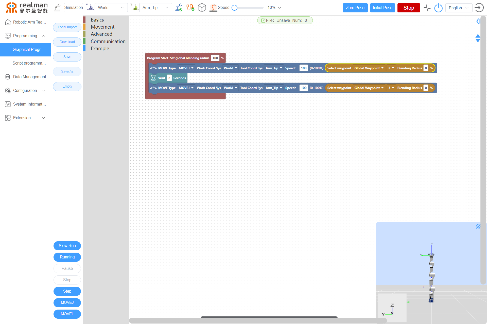

<center>MoveJ to point</center>

### MoveL to Point button

This button is only effective for the "waypoint" command and is used to move the robot from the current position to the target point through MOVEL. After selecting the target point, long press the `MOVEL` button, and the end effector of the robot will move along a straight line to the target point. Release the button, and the end effector will stop (or when the point is unreachable).

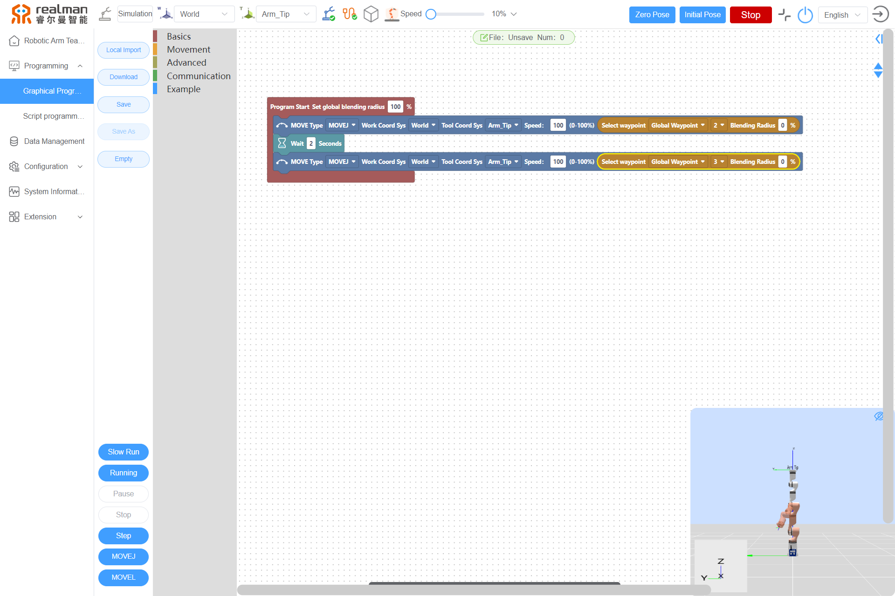

<center>MoveL to point</center>

### Add point

It is used to save common points, and the saved points are available in point management for viewing and editing.

**Add point demo:**

1. Click the `Data Management` > `Global Points`, then click Green Plus icon on the right side, and it will jump to the point interface.

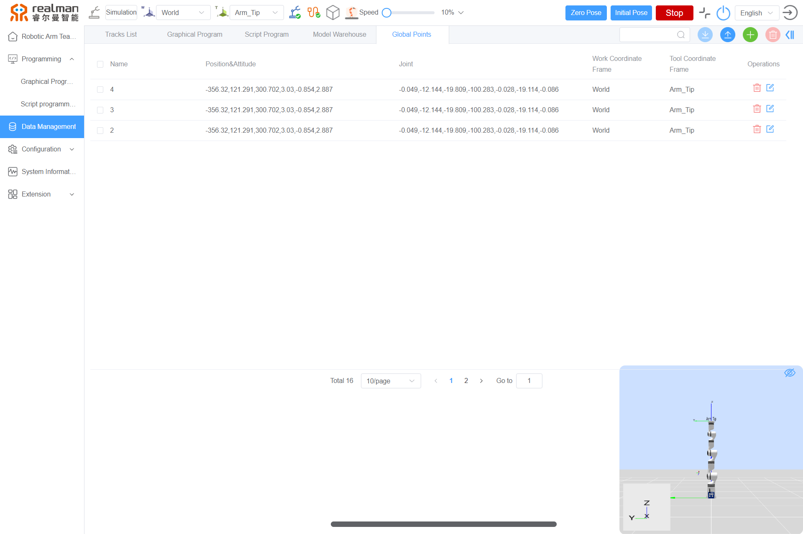

<center>Add point</center>

2. On this interface, click `Add` after the robotic arm reaches the desired point through the teaching button, pose editing button or end effector drag teaching button.

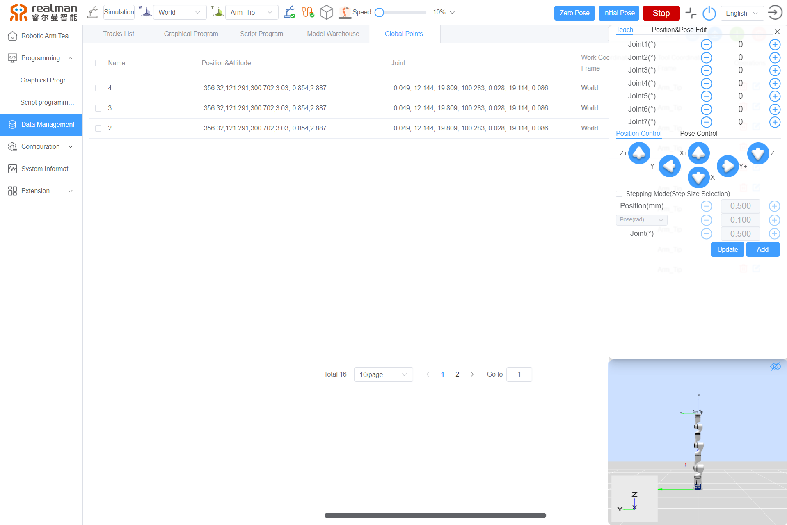

<center>Edit point</center>

3. Click the `confirm` button to save the point.

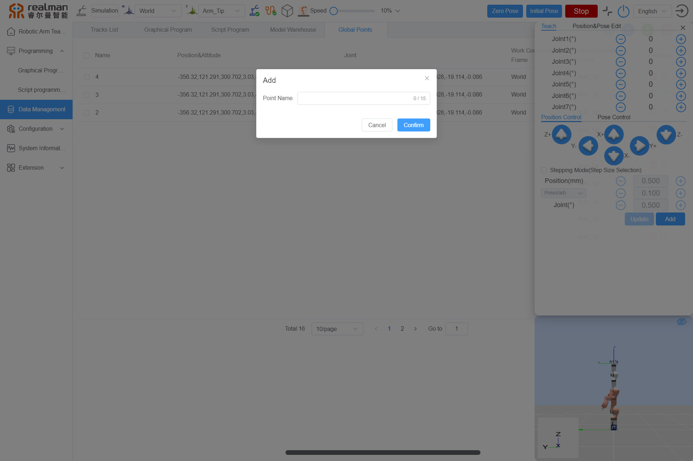

<center>Confirm point</center>

### Communication command

The communication command includes the creation and execution of ModBus-TCP and ModBus-RTU master and slave, which is used to access and write the peripheral or built-in register.

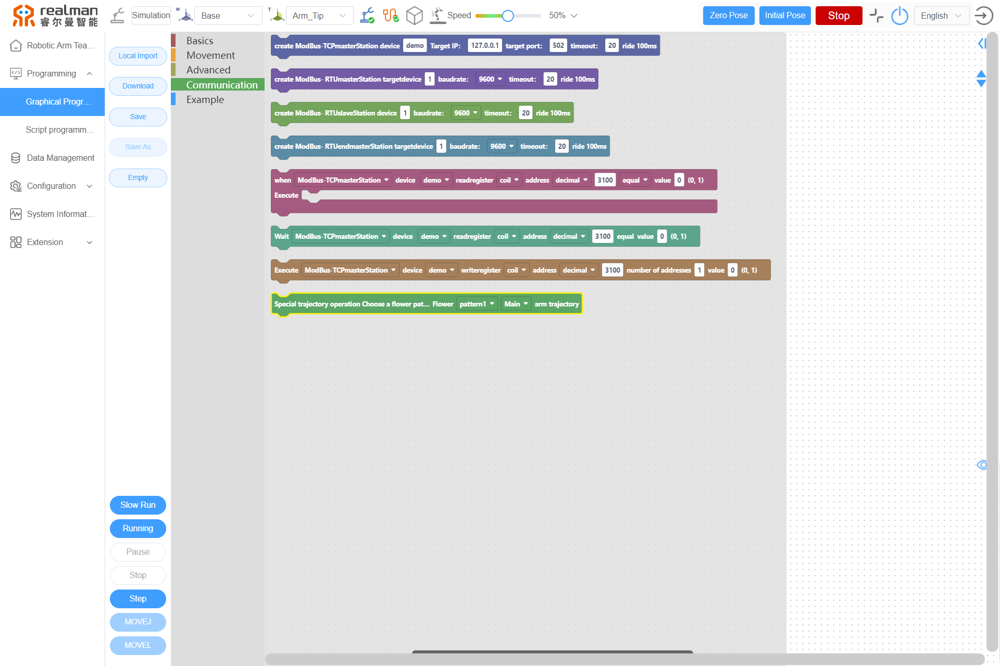

<center>Communication command</center>

### Model preview

The model preview is used to run the program in simulation mode for the trajectory preview or run the program synchronously with the real robotic arm in real mode.

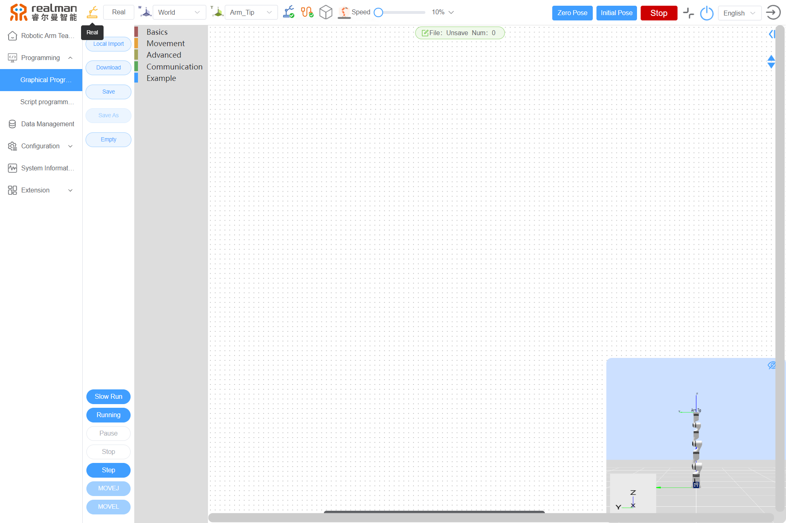

<center>Model preview</center>

## Script programming

The robotic arm can be controlled by directly inputting python codes in the code editor. In the code editor, click the `gray icon` at the bottom of the interface, and icons of various functions will appear, including `Scripting Programing Code Options`, `Console`, `Scripting Programming Files`, `Position & Pose`, `Joint Status`, `IO status`, etc.

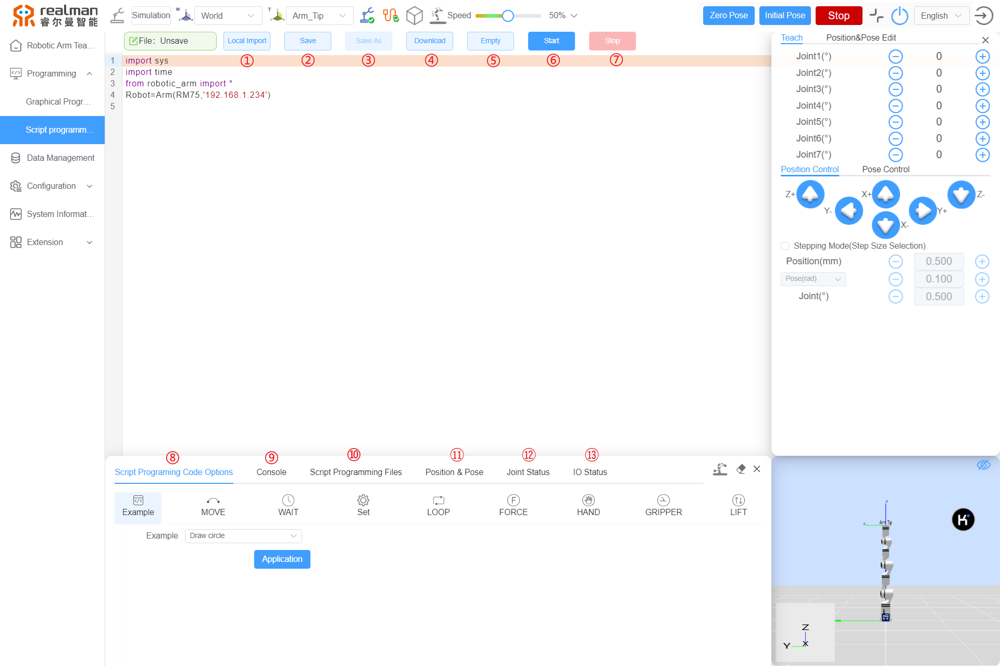

<center>Scripting</center>

**Scripting icon description**

| S/N | Name             |
|------|------------------|
| 1    |  Local Import    |
| 2    |  Save             |
| 3    |  Save As       |
| 4    |  Download    |
| 5    |  Empty           |
| 6    |  Start            |
| 7    |  Stop             |
| 8    | Scripting Programing Code Options |
| 9    | Console          |
| 10   |  Scripting Programming Files   |
| 11   | Position & Pose       |
| 12   | Joint Status        |
| 13   | IO status      |

### Scripting Programing Code Options

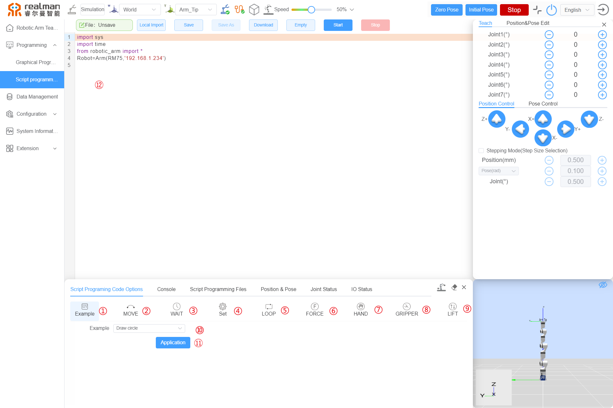

<center>Scripting Programing Code Options</center>

**Scripting Programing Code Options**

| S/N | Name             |
|------|--------------|
| 1    | Example             |
| 2    | MOVE    |
| 3    | WAIT        |
| 4    | Set               |
| 5    | LOOP    |
| 6    | FORCE     |
| 7    | HAND |
| 8    | GRIPPER            |
| 9    | LIFT  |
| 10   |  Example                 |
| 11   | Application                      |
| 12   | Program editing area           |

#### Example

After clicking the `Example` button, the drop-down menu of `Example` is as follows:

<div align="center"> 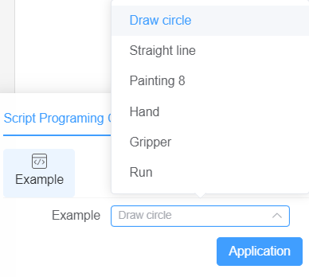 </div>

<center>Example</center>

"Example" covers the Draw circle, straight line, Painting 8, Hand, Gripper, and Run programs. Select the corresponding demo and click `Application`, and the Example will be displayed in the code editor of the teach pendant.

#### MOVE button

Click the `MOVE` button to enter the MOVE window, covering the Type, Speed, Blending Radius, EXecution Cysles, Block, Motion Planning, Select waypoint, Application, etc. Point editing is available in the upper right window. It should be noted that the work frame and tool frame used in point editing are the current ones.

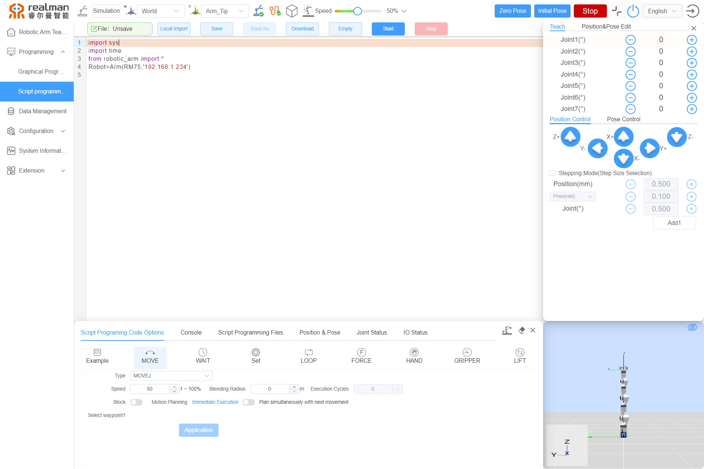

<center>MOVE button</center>


<center>Current work frame and tool frame</center>

Click `Type`, and the move command will pop up. Please refer to [MOVE command](../../teachingPendant/onlineCode/index.md#motion-command) for details.

<div align="center"> 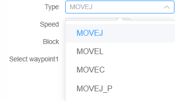 </div>

<center>MOVE command</center>

The speed is optional from 0 to 100%, with 50% by default, and the up and down buttons are used to increase or decrease 1% for each click.


<center>Speed</center>

The blend radius is optional for a desired value, and the default is 0, which can remain unchanged unless otherwise required.


<center>Blend Radius</center>

The eXecution cysles is effective only for the MOVEC command and is set to the desired value.


<center>EXecution Cysles</center>

The block can be enabled or disabled through the button at the bottom of the interface.

<div align="center">  </div>

<center>Block</center>

After setting the desired motion type, waypoint, etc., click `Application`, and the program will be displayed in the code editor of the teach pendant.

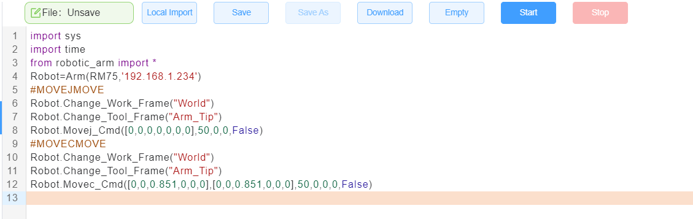

<center>Script programming</center>

#### WAIT button

Click the `WAIT` button, and two wait types will be available, namely Waiting Time and Waiting For Digital Input.

The waiting time is optional for the desired time in ms.


<center>Waiting Time</center>

Waiting for digital input includes options such as controller IO (`DIN1`, `DIN2`, `DIN3`, `DIN4`) and end effector IO (`T_DIN1`, `T_DIN2`), `High`, and `Low`.

<div align="center"> 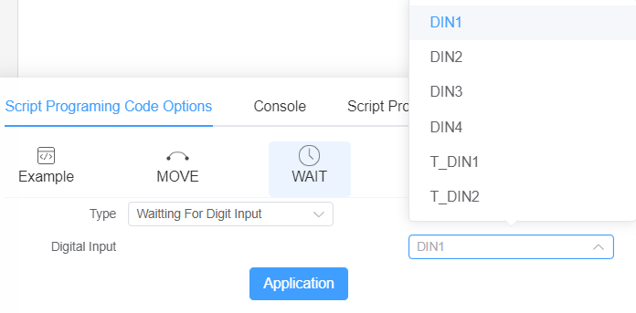 </div>

<div align="center"> 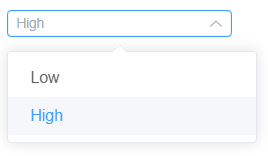 </div>

<center>Waiting For Digital Input</center>

After setting the waiting time or waiting for digital input, click `Application`, and the program will be displayed in the code editor of the teach pendant.

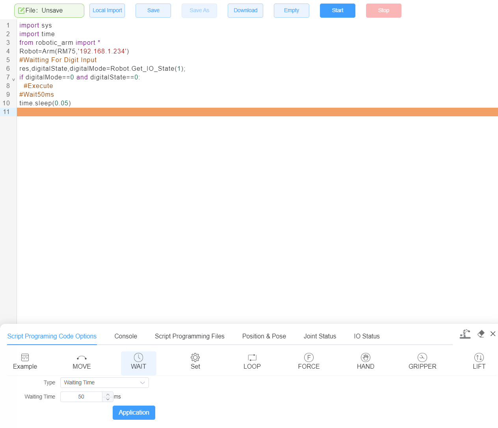

<center>Script programming</center>

#### Set button

The `Set` is optional for DOUT1−DOUT4, T_DOUT1\T_DUOT2, high level, low level, and blocking.

The `Set` content includes setting digital outputs, which involve controller IO (`DOUT1`, `DOUT2`, `DOUT3`, `DOUT4`) and end effector IO (`T_DOUT1`, `T_DOUT2`), `High`, `Low`, and `Block` switch settings.

<div align="center"> 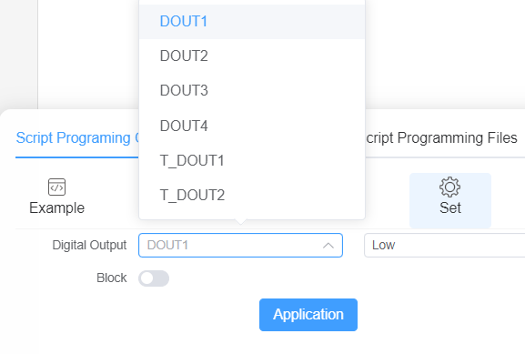 </div>

<div align="center"> 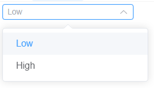 </div>

<center>Set</center>

After setting the digital output, click `Application`, and the program will be displayed in the code editor of the teach pendant.

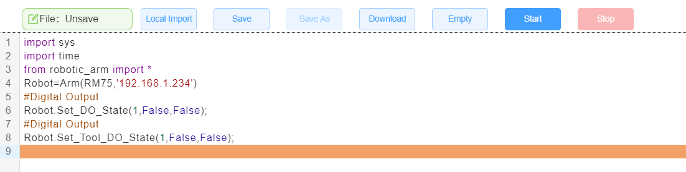

<center>Script programming</center>

#### LOOP button

The `LOOP` covers the loop, infinite loop, and end loop. Additionally, the loop count can be set when selecting the loop.

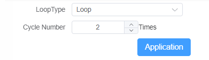


<center>LOOP</center>

After setting the loop type, click `Application`, and the program will be displayed in the code editor of the teach pendant.

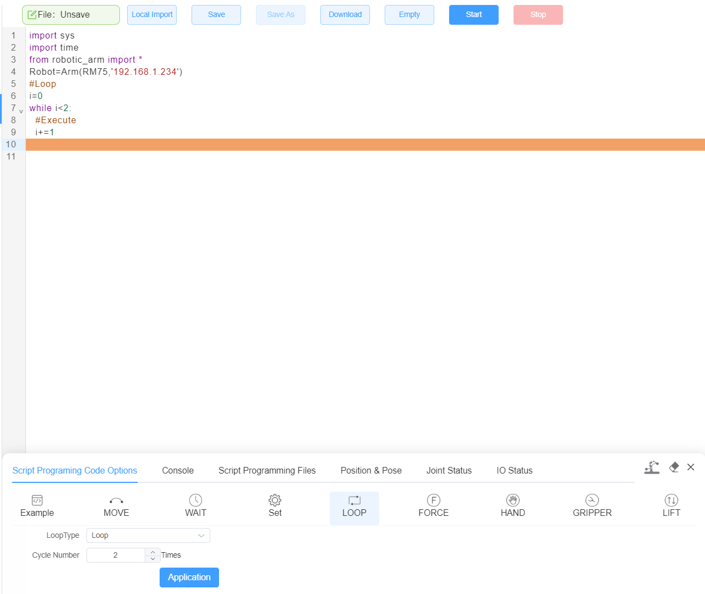

<center>Script programming</center>

#### FORCE button

The `FORCE` covers force and blocking. The force is optional for disabling the force-position hybrid control mode and enabling the 6-DoF force sensor. After the 6-DoF force sensor is enabled, it is required to set the desired work frame, tool frame, force-position hybrid control direction, and force (in N). The force-position hybrid control direction is optional for X, Y, Z, MX, MY, and MZ.

After the setting is completed, the corresponding 6-DoF force sensor script will pop up on the Script programming.

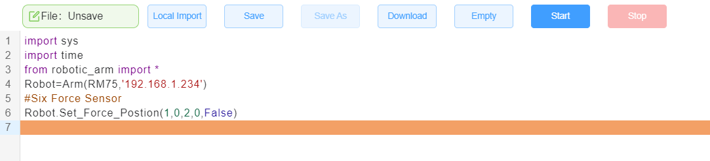

<center>Script programming</center>

#### HAND button

The `HAND` covers the dexterous hand, number, and blocking, and the dexterous hand is optional for the gesture and action sequence. Then, the built dexterous hand program is selected in the number interface.

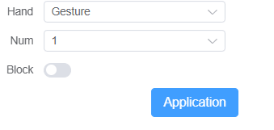

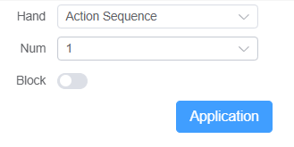

<center>HAND interface</center>

After setting the required gesture or action sequence and the corresponding number, click `Application`, and the program will be displayed in the code editor of the teach pendant.

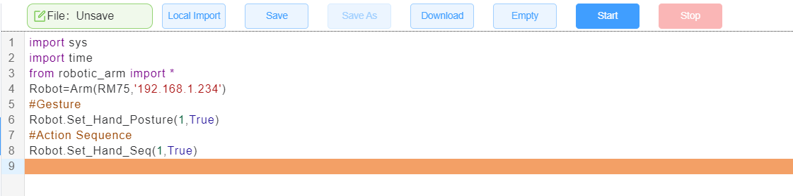

<center>Script programming</center>

#### GRIPPER button

The `GRIPPER` covers the action type, speed, force, and blocking. The action type is optional for opening and closing, the speed is 50% by default, and the force is 50 N by default.

<div align="center"> 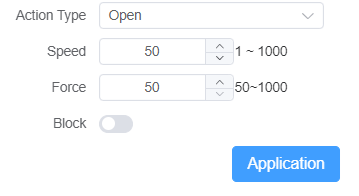 </div>

<div align="center"> 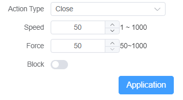 </div>

<center>GRIPPER button</center>

After setting the action type, speed, and force, click `Application`, and the program will be displayed in the code editor of the teach pendant.

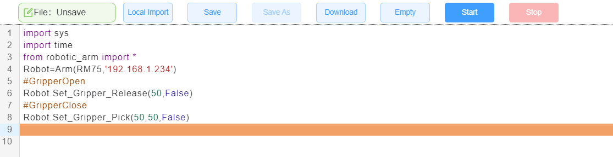

<center>Script programming</center>

#### LIFT button

The `LIFT` covers the target position, speed, and blocking.

<div align="center"> 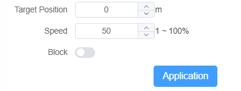 </div>

<center>LIFT</center>

After setting the target height and speed of the lifting mechanism, click `Application`, and the program will be displayed in the code editor of the teach pendant.

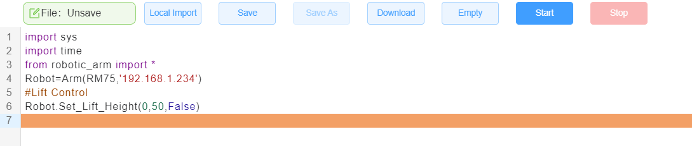

<center>Script programming</center>

### General button

There are `Local Import`, `Save`, `Save As`, `Download`, `Empty`, `Start`, and `Stop` at the top of the interface. `Local Import` is used to import local programming files, `Save` is used to save the current code to the teach pendant, `Save As` is used to re-save the current code to the teach pendant, `Download` is used to save the current code locally, `Empty` is used to empty the code editor, `Start` is used to run a scripting file in the teach pendant, and `Stop` is used to stop a scripting file that is running in the teach pendant. When the local programming file is imported, only the file format .py is checked. After the programming file is selected to be saved, the currently running python codes can be automatically saved when the programming file is published.

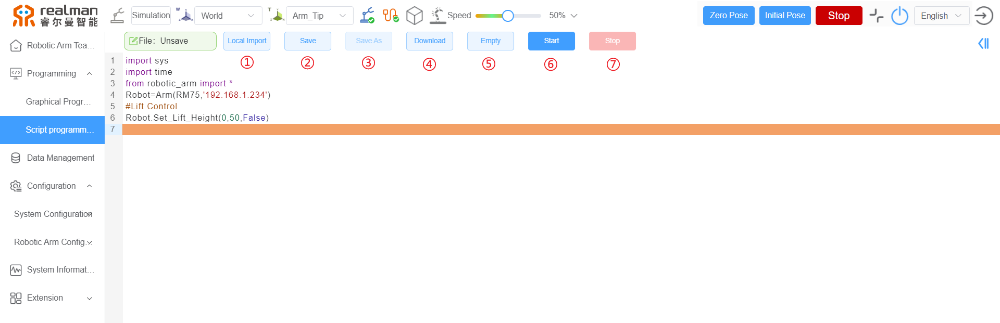

<center>General button for scripting</center>

No format or syntax check is performed before the programming file is published, and the prompts in the console area shall prevail.

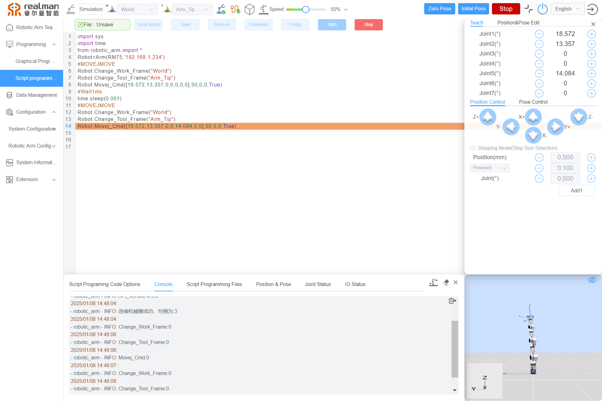

<center>Console for scripting</center>

**Note: RM65 scripting — splayed shape drawing code demo**

```python
import sys
import time
from robotic_arm import *
Robot=Arm(RM65,'192.168.1.18')

#MOVEJ
Robot.Change_Work_Frame("World")
Robot.Change_Tool_Frame("Arm_Tip")
Robot.Movej_Cmd([0,20,70,0,90,0],50,0,0,True)

#MOVEL
Robot.Change_Work_Frame("World")
Robot.Change_Tool_Frame("Arm_Tip")
Robot.Movel_Cmd([-0.388,0,0.337,3.142,0,0],10,0,0,True)

#MOVEC
Robot.Change_Work_Frame("World")
Robot.Change_Tool_Frame("Arm_Tip")
Robot.Movec_Cmd([-0.298,0.1,0.337,3.142,0,0],[-0.298,-0.1,0.337,3.142,0,0],10,2,0,0,True)
```

## Data management

It is used to manage the user-saved Tracks List, Graphical Program, Script Program, Model Warehouse, and Global Points.

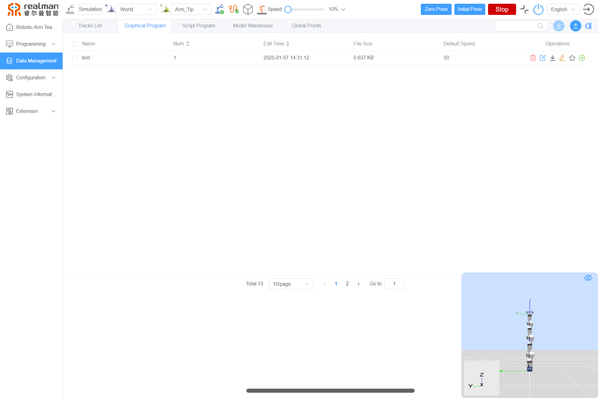

<center>Data management</center>

### Tracks List

The Tracks management interface displays the Tracks Name, File Size, Creat Time, and Edit Time. Available operations include `delete`, `Skip Edit`, and `download`. Supports sorting based on File Size, Creat Time, and Edit Time.

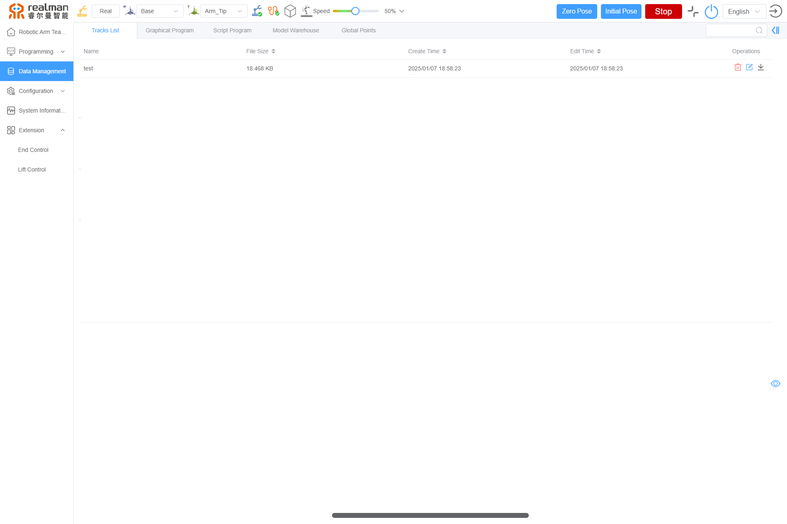

<center>Tracks List</center>

**Delete:** Delete the Tracks.

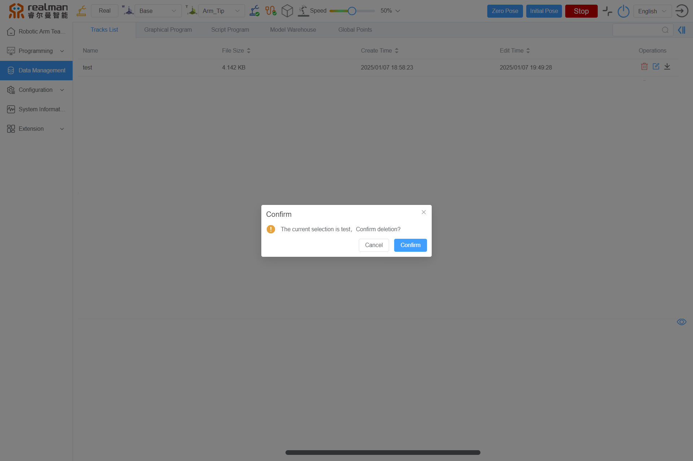

<center>Delete Tracks</center>

**Skip Edit:** Modify the saved points.

Click this button, and the robotic arm teaching interface will be available to cut the tracks, and click OK to save it.

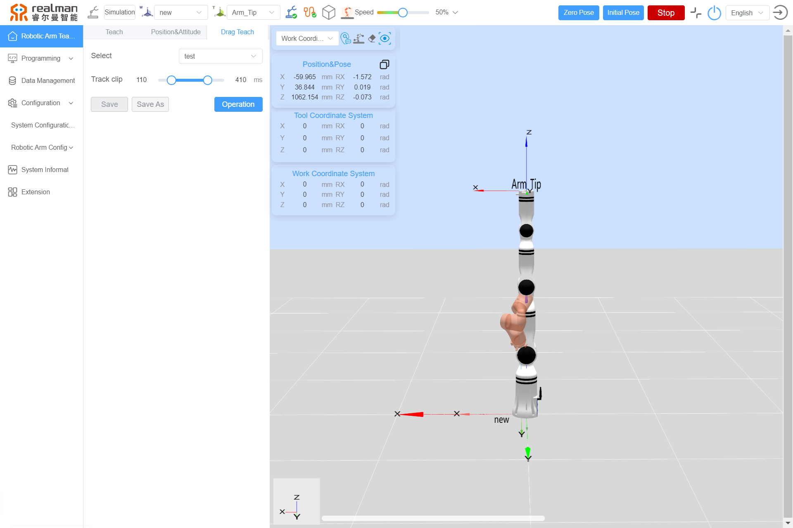

<center>Edit Tracks</center>

**Download:** Save the Tracks locally.

Click this button, and the tracks file will be downloaded to the download location for the browser, with the suffix .txt.

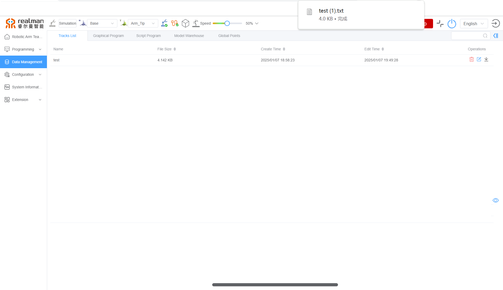

<center>Download Tracks</center>

### Graphical Program

The Graphical Program interface displays the Name, Num, Edit time, File Size, Default Speed, and Operations. It supports sorting by Num and Edit time. Available operations include `delete`, `Skip Edit`, `download`, `Edit`, `Default`, and `Run Program`. It also supports batch uploading and downloading.


<center>Graphical Program</center>

**Delete**: Delete the graphical programming entry.

Click the button and then click `Confirm` in the pop-up dialog box to complete the deletion of the graphical programming data.

**Skip Edit**: Modify the saved graphical programming.

Click the button to jump to the graphical programm page. After editing the corresponding graphical programm information on this page, click `Save`.

**Download**: Save the graphical programming to the local device.

Click the `Download` button to download the graphical programming to the download path set in the browser, with a .txt extension.

**Edit**: Change the parameter information of the graphical programming.

Click the button to edit the name and default running speed of the graphical programming.

**Default**: Set the graphical programming as the default program.

After setting it as the default program, when opening the graphical programming page, this graphical programming will be used by default.

**Run Program**: Execute the graphical programming.

Click the `Run Program` button to run the graphical programming. The button will change to `Stop`, and clicking it will stop the execution of the graphical programming.

**Batch Upload**: Upload multiple local graphical programming files to the teaching pendant.

Click the `Batch Upload` button, select the files to be uploaded, and then click Confirm.

**Batch Download**: Supports downloading multiple graphical programming files from the system to the local device.

Select the graphical programming data to be downloaded, and click the `Batch Download` button to download all selected graphical programming files to the download path set in the browser, with a .txt extension.

### Script Program

The Script Program interface displays the Name, Num, File Size, and Operations. It supports sorting by Num and File Size. Available operations include `delete`, `download`, `Skip Edit`, and `Run Program`.

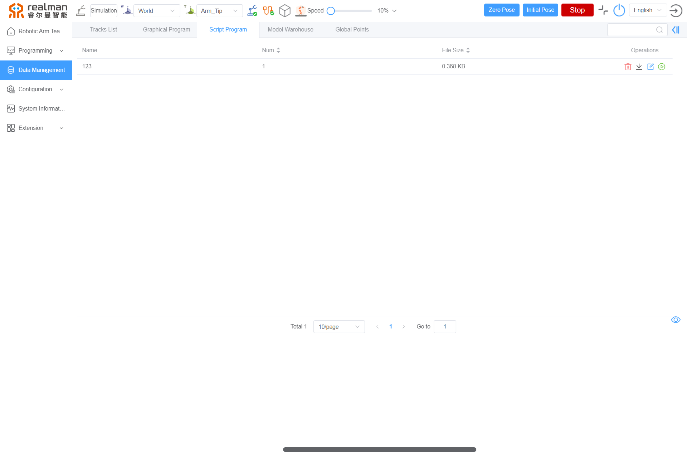

<center>Script Program</center>

**Delete**: Delete the script programming entry.

Click the button and then click `Confirm` in the pop-up dialog box to complete the deletion of the script programming data.

**Download**: Save the script programming to the local device.

Click the `Download` button to download the script programming to the download path set in the browser, with a .py extension.

**Skip Edit**: Modify the saved script programming.

Click the button to jump to the script programming page. After editing the corresponding script programming information on this page, click `Save`.

**Run Program**: Execute the script programming.

Click the `Run Program` button to run the script programming. The button will change to `Stop`, and clicking it will stop the execution of the script programming.

### Model Warehouse

The Model Warehouse interface displays the Name, Type, Parameters, Operations, etc. It supports sorting by Type. Click `delete` allows to delete it. For related operations on setting up electronic fences, please refer to [Electronic fence](../../teachingPendant/setting/index.md#electronic-fence) for details.

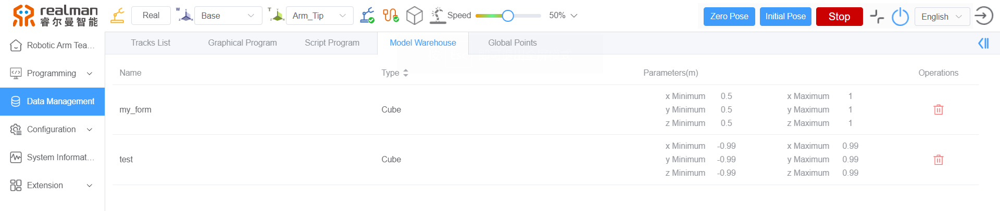

<center>Model Warehouse</center>

### Global Points

The point management interface displays the point name, position and orientation, joint angle, work frame, and tool frame, and available operations include the `delete`, `batch delete`, `edit`, `Add`, `Search`, `Global points file import` and `Global points file download`. At the bottom of the interface, there is the page of points saved and the page jump icon.

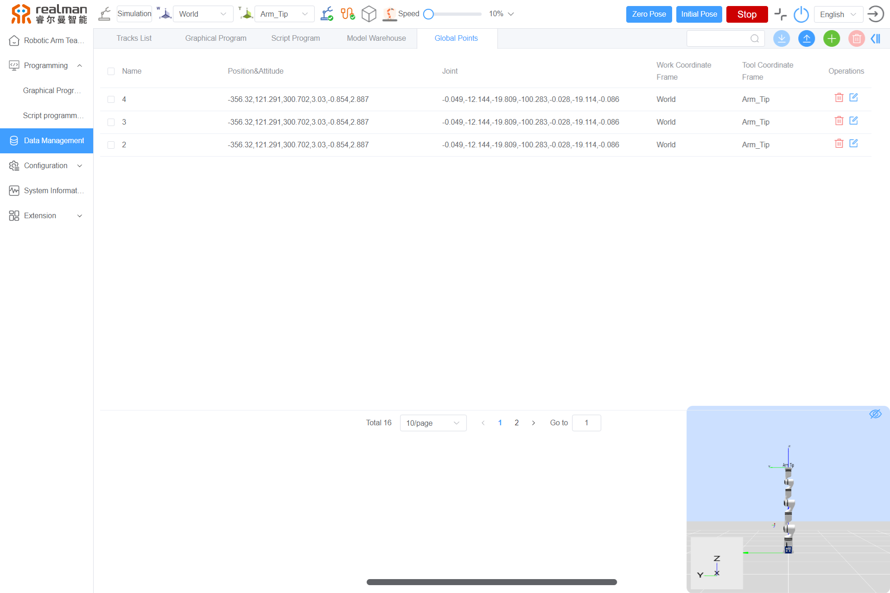
<center>Global Points management</center>

**Delete:** Delete the points.

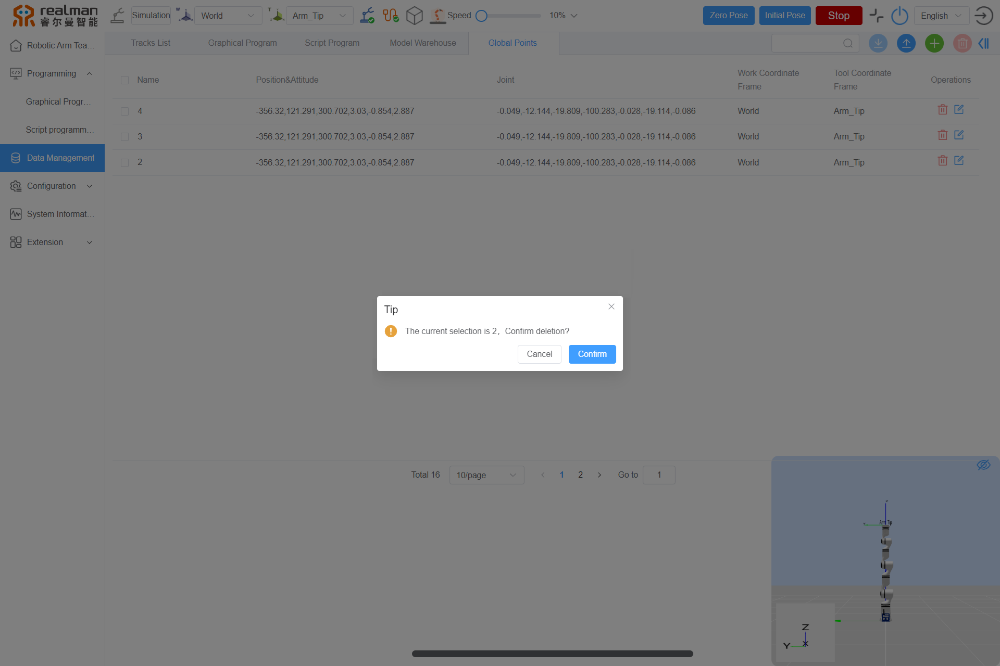

<center>Delete Points</center>

**Edit:** Modify the saved points.

Click this button, and the robotic arm teaching interface will be available to move the robotic arm to the desired point through the teaching button or end effector drag teaching button, and click OK to save.


<center>Edit Points</center>

**Add:** Add a new point.

Please refer to the above [Add point](../../teachingPendant/onlineCode/index.md#Add point) for details.

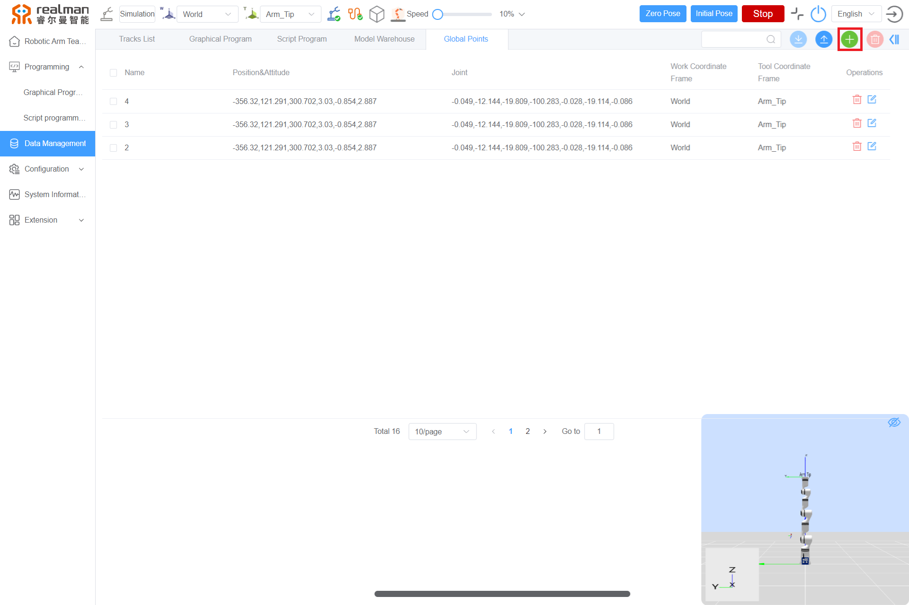

<center>Add</center>

**Batch delete:** Delete multiple points with one click.


<center>Batch delete</center>

**Search:** Search by point name, with vague search available.

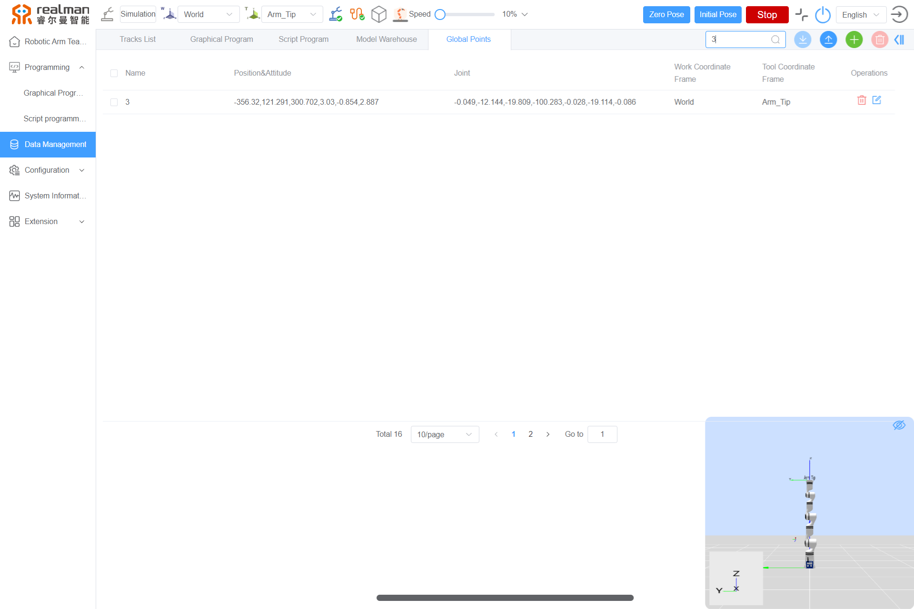

<center>Search</center>

**Upload**: Upload local point files to the teaching pendant.

Click the `Upload` button, select the file you want to upload, and click `Open` to complete the upload of the global point file.

**Download**: Supports downloading one or more global point files to the local device as needed.

Select the global point files you want to download, and click the `Download` button to download the selected global point files to the download path set in the browser, with a .txt extension. When downloading multiple global point files, the information of multiple global points will be saved into one file.
