# 
Start guide:
Robotic Arm Configuration

## System configuration

### Communication configuration

The system configuration interface is mainly used to configure the communication of robot controller. After the AP, STA and IP mode are configured, the page will automatically get the set mode, and display the name, password, and other information, as well as the physical channels of WiFi hotspots in AP mode.

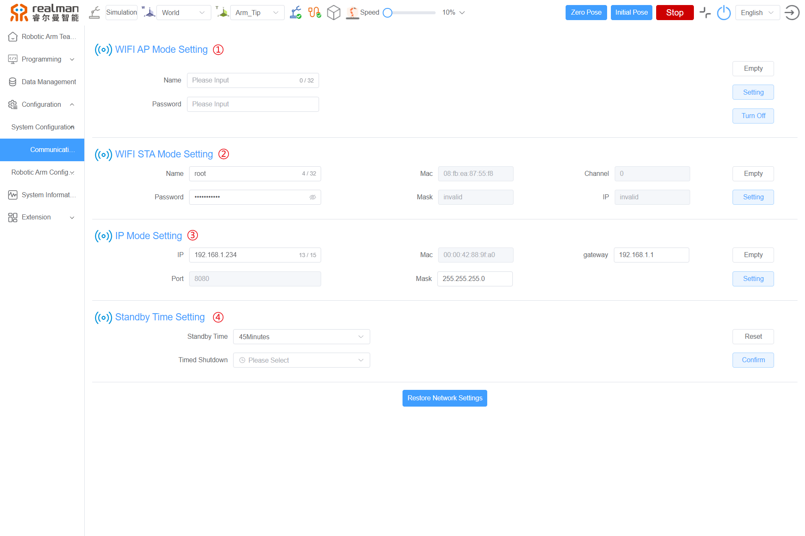

System configuration diagram

**System configuration items**  

| S/N | Name             |
|------|------------------|
| 1    | WIFI AP Mode Setting  |
| 2    | WIFI STA Mode Setting |
| 3    | IP Mode Setting       |
| 4    | Standby Time Setting     |

These configuration items are explained in detail below in the sequence as shown above.

#### WIFI AP Mode Setting

The controller can switch to the WIFI AP Mode for external communication. The network name is the WiFi name of the controller displayed to external devices, and the network password is the password of the controller WiFi. After clicking the setting button, the controller will start the network configuration according to this information, and after the configuration is completed, it can immediately communicate with external devices in WIFI AP Mode.  In this mode, the IP address of the controller is 192.168.33.80, the communication port number is 8080, and the communication mode is server mode. The robotic arm comes in the AP mode by default. The name format is shown in the figure, and the default password is 12345678.

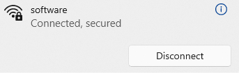

Set the network name and password. The network name and password shall contain no Chinese characters, and the password shall be set to 8-10 digits. Click the `Setting` button. The robot controller will make a "tick" sound, and the interface will pop up a window prompting that the setting is successful and the network name and password will be automatically downloaded and saved. Restart the controller to complete the mode switching.

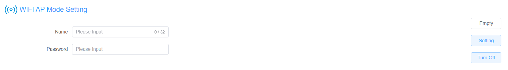

WIFI AP Mode setting

When connecting the robot in WIFI AP Mode, connect the robot WiFi on the PC (the example WIFI name is RM65-01) and set the PC WLAN to automatically get the IP address.

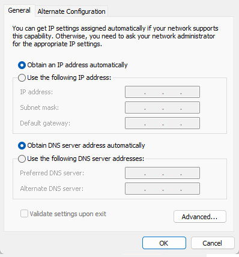

PC local IP address setting

::: warning
After the setting is completed, enter the IP address "192.168.33.80" in the browser to log in to the web teach pendant.
:::

#### WIFI STA Mode Setting

The controller can switch to WIFI STA Mode to connect the router specified by the user. The network name is the name of the specified router which the controller is to connect, and the network password is the specified router password. After the configuration is completed, the controller will immediately communicate with the external devices in WIFI STA Mode. In this mode, the IP address of the controller is automatically assigned by the router, the communication port number is 8080, and the communication mode is server mode.

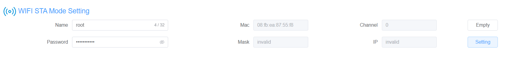

WIFI STA Mode Setting

Click the `Setting` button. The robot controller will make a "tick" sound, indicating that the mode switching is completed. Control the PC to be connected to the same router as the robot.

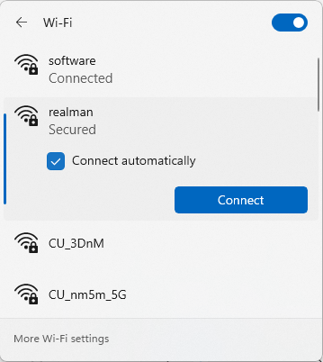

PC connecting router

Log in to the router management interface and check the IP address assigned by the router to the robot (with the IP address 192.168.1.142 as an example).

When the teach pendant and the controller are connected through the Ethernet port, the controller and the teach pendant communicate with each other through the Ethernet port (port number: 8080, communication mode: server mode). The following figure shows the location of the Ethernet port. The communication rate is 1000 Mbps.

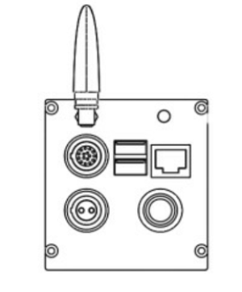

Ethernet port

Local network setting: the default IP address of the controller is 192.168.1.18 and the port number is 8080 when the teach pendant is started (for the method to change the IP address of robotic arm, see [Set IP address of robotic arm](../../teachingPendant/setting/index.md#setting-of-robotic-arm-ip-address)).

The IP address of the robot controller is 192.168.1.18. To establish network connection between the PC and the controller, the local network IP address must be configured in the same network segment.

When connecting the Windows system with the robotic arm, the IP address of the PC must be changed to any IP address in the 192.168.1.xx network segment except 192.168.1.18, and is recommended to be 192.168.1.100. The method to configure the IP address of a Windows system is as follows:

1. Click on the search bar of your computer, type in "Control Panel" to search for the control panel, and then click to enter the Control Panel page.
  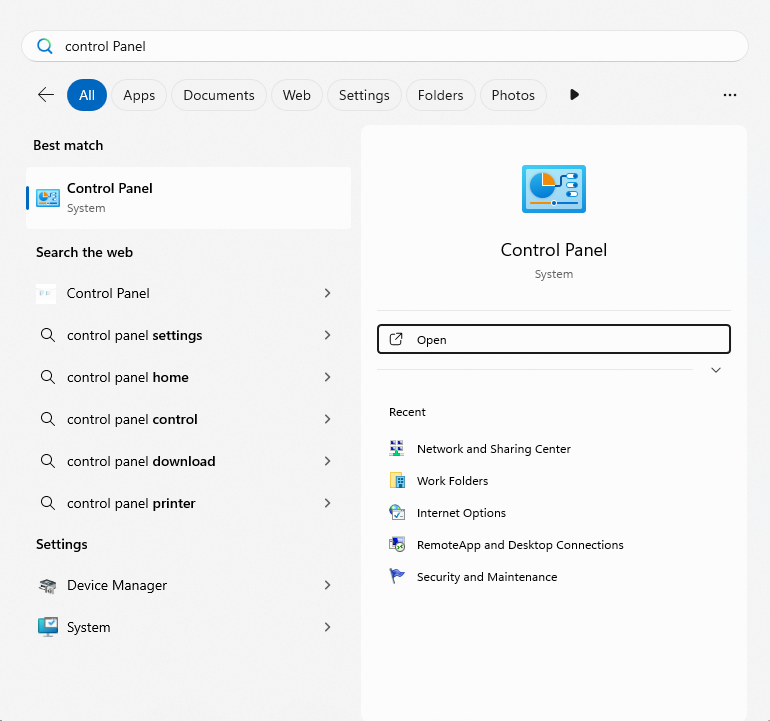
2. Click the "Network and Sharing Center" to enter the Network and Sharing Center page.
  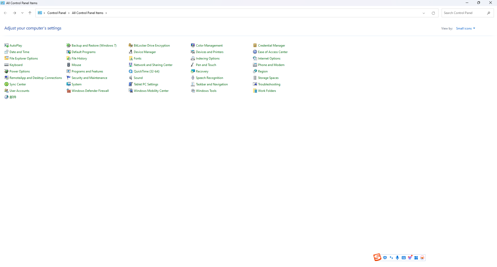
3. Click the "Change adapter settings" to enter the Network Connections page.
  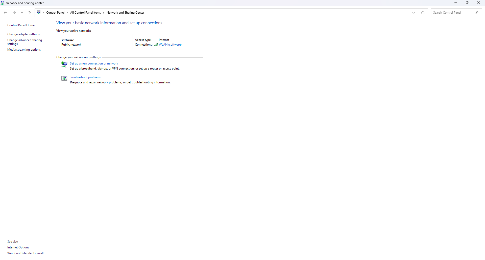
4. Double-click Ethernet and open it, and click `Properties` in the pop-up window.
  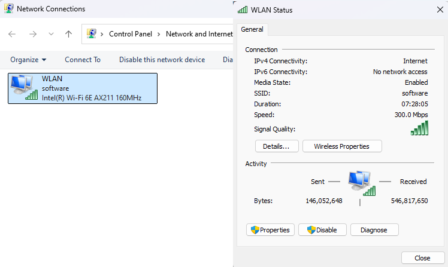

5. In the pop-up dialog box, select "Internet Protocol Version 4(IPv4)" first and then click `Properties`.

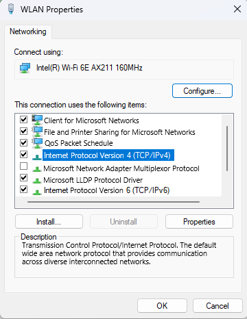

Protocol version diagram

5. Configure the network IP address as shown in the figure below, and click `OK`. Then the local network setting is completed.

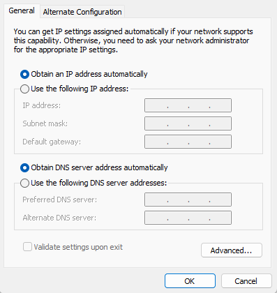

Diagram of network IP address

6. After the IP address of the PC is configured, connect the robotic arm with the PC through a network cable. After the robotic arm is started, enter 192.168.1.18 at the address bar on the webpage. If the following interface is displayed, it means that the robotic arm is connected successfully. Enter the account and password to enter the teach pendant.

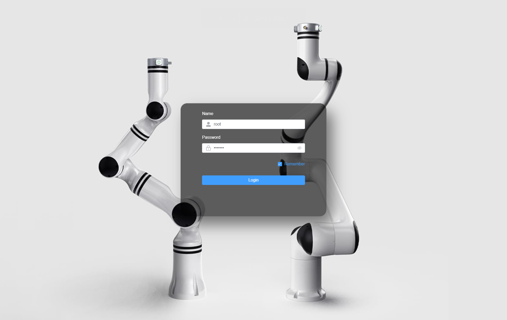

Diagram of connecting the robot

#### IP Mode Setting

After the robotic arm is connected successfully with the teach pendant, the IP address of robotic arm can be set by clicking `Configuration` > `System Configuration` > `Communication Settings` > `IP Mode Setting` > `Target IP Textbox`.

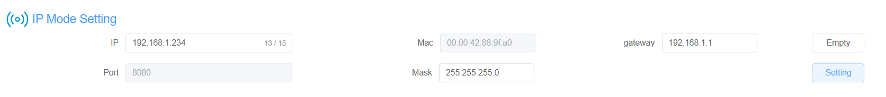

IP Mode Setting

In the IP mode setting bar on the teach pendant, the IP address of robotic arm can be directly set by entering the IP address in the target IP address textbox, for example, 192.168.1.19, and then clicking the `Setting` button. The robotic arm needs to be restarted for the IP address setting to take effect. To restore the IP address to 192.168.1.18, click the Reset button, and the IP address of robotic arm will be restored to 192.168.1.18 after the robotic arm is restarted. (If the IP address of the robotic arm has been changed, then log in to the teach pendant interface and enter the updated IP address.)

After clicking `Setting`, the set IP address will be downloaded automatically. Remember to save it in case you forget it.

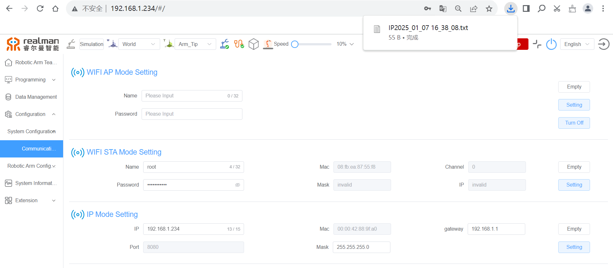

Setting succeeds

#### Standby Time Setting

As shown in the figure below, set the time of inactivity for auto-logout or the timed turn-off of the teach pendant. If both are set, the earlier time of logout will take effect.

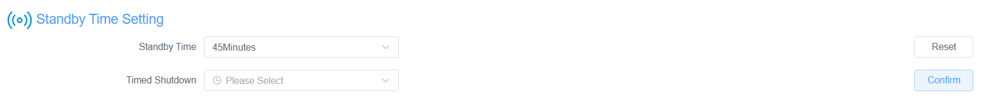

Standby Time Setting

### Robot configuration

The robot configuration interfaces include Security Configuration, Tool Calibration, Work Coordinate System Calibration, Initial Pose Setting, Installation Setting, Force Sensor Configuration, Force Sensor Data Graph, Version Information, External Interface Setting, and etc.

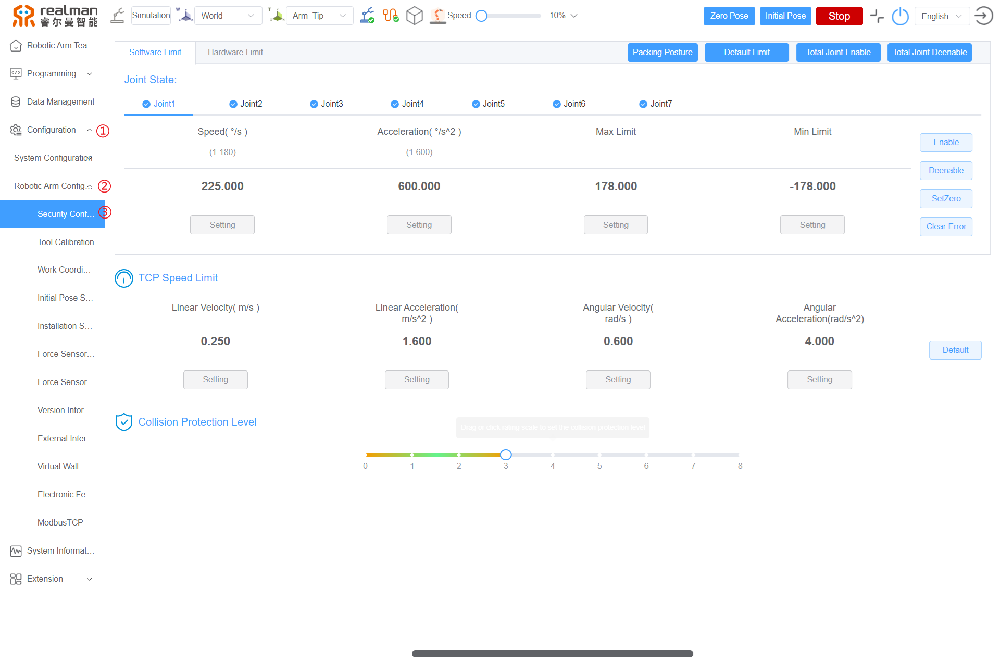

Robot configuration

#### Security Configuration

The Security Configuration interface is mainly used to configure the Joint State, TCP Speed Limit and Collision Protection Level of the robot. See the figure below.

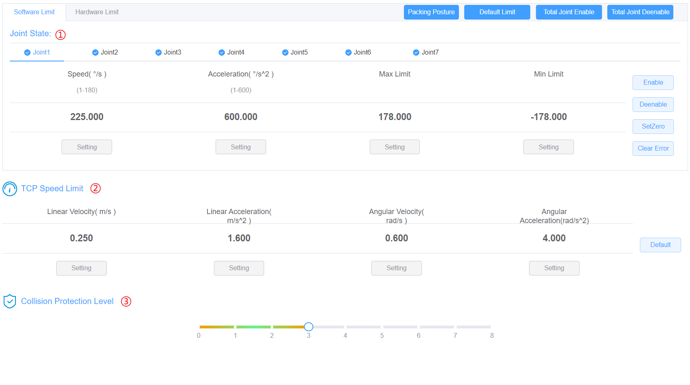

Diagram of Security Configuration interface

##### Joint State

Select joints 1−6 in the upper tab, which respectively correspond to the six joints of the robot from bottom to top. After the teach pendant is connected with the robot, the maximum speed, acceleration, minimum limit and maximum limit of the joints will be automatically displayed in the corresponding positions.

::: warning
All parameters of the RealMan robotic arm are configured to their optimal state before delivery. It is generally not recommended for users to modify the underlying joint parameters. If the user needs to make modifications, the robotic arm must first be set to a non-enabled state. Afterward, the parameter modification command can be sent. Once the parameters are successfully updated, the joint re-enabling command should be issued. It is important to note that when re-enabling the joint, the user must ensure that the joint remains stationary to avoid reporting of a positioning error during the enabling process. Once the joint is successfully re-enabled, the user can control its movement. When changing the parameters, the ratio of the set maximum acceleration to the maximum speed of joint must be no less than 1.5; otherwise, the movement may be abnormal.
:::

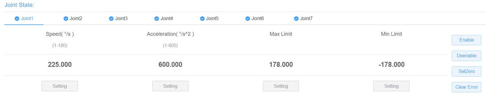

Joint State diagram

 

1. Speed: maximum joint speed, expressed in °/s. The maximum speed of joint 1 and joint 2 is 180°/s, and that of other joints is 225°/s.
2. Acceleration: maximum joint acceleration, expressed in °/s\^2, with the maximum value of 600°/s\^2. The factory default value is 600°/s\^2, which is the best setting considering all factors, and it is recommended not to change it.
3. Min Limit: the minimum position that the joint reaches, expressed in °.
4. Max Limit: the maximum position that the joint reaches, expressed in °.
5. Enable: The Enable button and Disable button send the enable and disable commands respectively to the specified joint.

**Enable demo:**

Enable joint 1 (other joints can be enabled in the same way)

1. Select joint 1 in the leftmost option.
2. If the error message indicates other errors, first click the "Clear error" button to clear the errors.
3. Click the "Enable" button on the right.

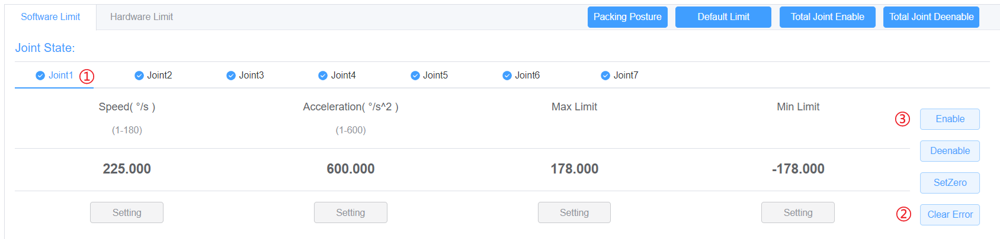

Diagram of enabling the joint

SetZero: When the joint is in disabled state, click the `SetZero` button to set the current position of the specified joint to zero position, and the joint will remain in disabled state after the setting. Click the `Enable` button to enable the joint. Otherwise, the joint motion cannot be controlled.

Each joint of the robot has a mechanical origin position (as shown in the figure below), and the zero Pose is the pose of each joint in the robot origin position. If, when the robot is in zero Pose, the mechanical origin position marks are not aligned, it is necessary to manually set the robot back to the mechanical origin position. When in the zero Pose, the state of the robot is as shown in the following figure:

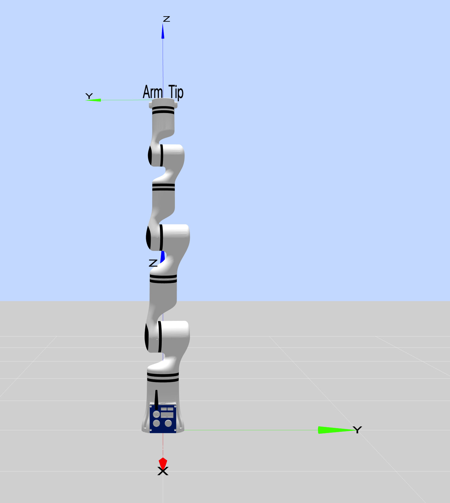

Zero Pose of robot

When the robot joint is changed, the zero position of the corresponding joint must be reset.

::: warning
Not all robots support this function. Please confirm with RealMan Intelligent Technology (Beijing) Co., Ltd. before setting.
:::

Set the zero position of joint 1 (the zero position of other joints can be set in the same way).

1. Select joint 1 in the leftmost option.

2. Click the `Deenable` button on the right (if the joint is enabled) to disable the joint first.

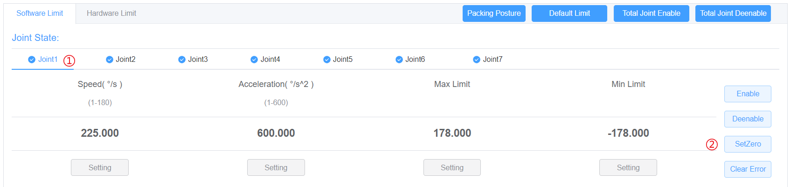

Disabling the joint

3. Rotate joint 1 to the mechanical origin position (it is the mechanical origin position when the grooves on both sides of the joint gap are completely aligned with each other).

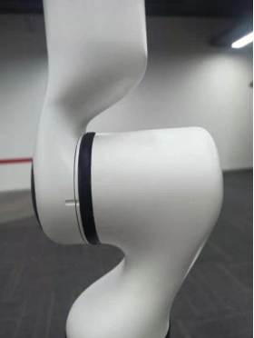

Zero position mark of robot joint

1. Click the `SetZero` button on the rightmost side to complete the zero position setting of joint 1.

2. Enable

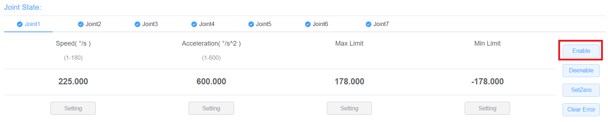

Enabling the joint

**Packing Posture demo:**

When it is necessary to pack the robot after use, as the robot's packing posture has been saved in the controller, when long pressing the `Packing Posture` button, the robot will automatically move to the packing posture. When the robot stops moving, the packing osture is completed.

Diagram of Packing Posture

##### TCP Speed Limit

This part mainly involves the setting of the Linear Velocity, Linear Acceleration, Angular Velocity and Angular Acceleration of the robot end effector. After the network connection between the teach pendant and robot controller is established, the current TCP parameters of robot will be automatically updated, and users can manually modify the parameters and issue them.

Click the `Default` button, and the robot TCP parameters will be restored to the default values. End Linear Velocity: 0.25 m/s, end Linear Acceleration: 1.6 m/s2, end Angular Velocity: 0.6 rad/s, end Angular Acceleration: 4 rad/s2.

::: warning
It is recommended to use the default TCP speed. To change it if necessary, the ratio of the maximum acceleration to the maximum speed of the end effector must be no less than 3; otherwise, the motion may be abnormal.
:::

##### Collision Protection Level

This part mainly involves the setting of Collision Protection Level of the robot. The level can be configured to 0−8, which represents the level of collision sensitivity of the robot. The higher the level, the more sensitive it is to collision. When the robot is powered on, the default Collision Protection Level is 0, that is, no collision detection.

Collision Protection Level setting

::: warning
When setting the Collision Protection Level, users shall choose a reasonable level. The higher the level, the higher the probability of mistakenly detecting collision. Unless specially required, it is recommended that the Collision Protection Level be set at around 4. In addition, if the end tools and load changes, it is necessary to set the mass and center of mass of the tool during **tool calibration** ([tool calibration](../../teachingPendant/setting/index.md#tool-calibration) process reference) to match the correct dynamic model.
:::

#### Tool Calibration

The tool calibration is as shown in the following figure. Zone 1 displays all current tool coordinate and tool pose information, zone 2 involves automatic calibration of the current tool coordinate, and zone 3 involves manual setting of tool coordinate information.

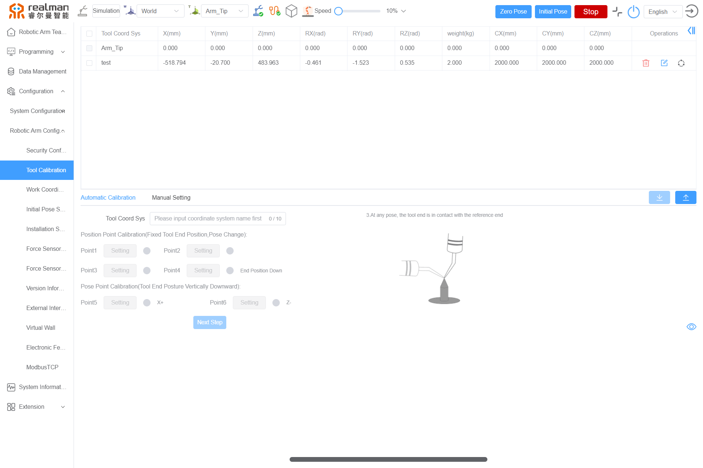

Diagram of tool coordinate calibration interface

##### Tool Calibration Display

The table lists the names and pose parameters of all tool coordinates that have been established for the current robot. To delete a tool, select it in the table and click the Delete tool button. After the tool is deleted, the robot enters the end flange coordinate to work. In addition, Arm_Tip (robot end tool coordinate) cannot be deleted.

##### Automatic calibration

After this part is selected, the current tool coordinate can be calibrated with the six-point method. First, fill in the Tool Coord Sys name (in English characters, up to 10 characters), and then make the robot tool touch the tool reference point in six Poses (the reference point requires a sharp end that is placed vertically within the working range of the robot).

After calibrating six points, click `Next Step`,and a `New Tool` dialog box will pop up.Click `Calibration Start`,and then click `Confirmation of identification` in the pop-up dialog box to automatically calculate the current tool information according to the six calibration points. After the calculation is completed, click `Add`. The results will be sent back to the teach pendant and displayed in the tool table. In addition, due to the limited capacity of the robot controller, only 10 tool coordinates can be saved; therefore, make sure that the limit will not be exceeded before calibration.

The six-point calibration rules are as follows:

| No. | Name                      |
|------|:-----------------------------------------------------:|
| 1    | Any Pose, the tool end in contact with the reference end                               |
| 2    | Any Pose, the tool end in contact with the reference end                               |
| 3    | Any Pose, the tool end in contact with the reference end                               |
| 4    | Tool end vertically downward and in contact with the reference end                              |
| 5    | Keep the Pose of 4, and move from point 4 to point 5 along the positive direction of the X axis of the tool coordinate, and the distance between this position and point 4 shall be greater than 10 cm as far as possible  |
| 6    | Keep the Pose of 4, and move from point 4 to point 5 along the negative direction of the Z axis of the tool coordinate, and the distance between this position and point 4 shall be greater than 10 cm as far as possible 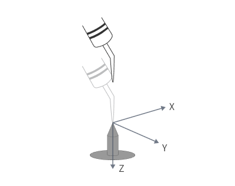 |

::: warning
The Pose of the first four points shall differ from each other as much as possible, and no same points shall be used.
:::

##### Manual Setting

When users know the accurate relative pose of the tool relative to the center of the robot end flange, they can directly set the tool coordinate by manually entering information. After selecting this part, enter the name and pose information of the new tool, click the Add tool button, and the new tool information will be sent to the robot controller and displayed in the tool table. After the tool is successfully calibrated, the robot enters the end flange center tool coordinate to work.

##### End effector payload

After the tool calibration, it is necessary to enter the mass and center of gravity of the end tool to supplement the parameters of the robot end tool.

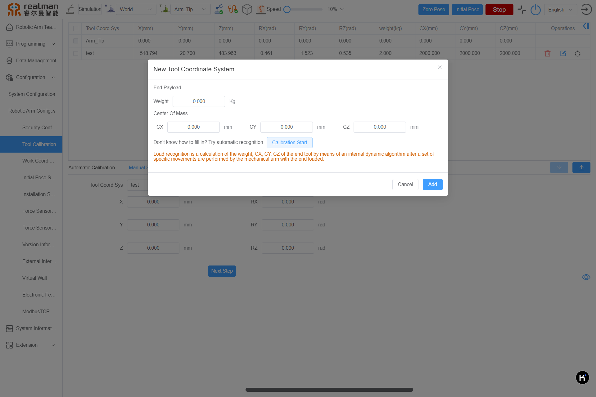

End effector payload setting

**Load Identification**: By performing a set of specific movements with the robotic arm carrying a load at the end, the weight of the end tool, as well as the center of mass offsets CX, CY, and CZ, can be calculated using internal dynamic algorithms. It is normal for the calculated end load to have a deviation of about 0.5KG from the actual weight measured.

::: warning
If the end gripper is relatively long, it may collide with the robotic arm during the load identification movement.
:::

#### Work Coordinate System Calibration

The work coordinate is as shown in the following figure. Zone 1 displays the names of all current Work Coordinate System Calibration and the pose of Work Coordinate System Calibration relative to the base Coordinate System Calibration, zone 2 involves automatic calibration of the current Work Coordinate System Calibration, and zone 3 involves manual setting of Work Coordinate System Calibration information.

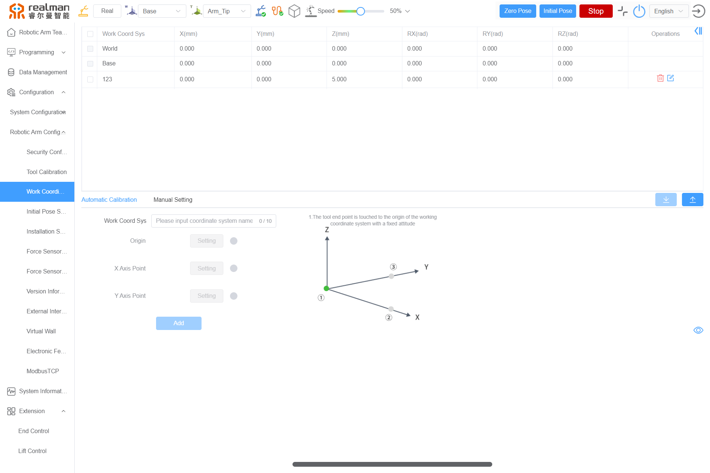

Diagram of work Coordinate System Calibration interface

##### Work Coordinate System Calibration Display

The table lists the names and pose parameters of all Work coordinate System Calibration that have been established for the current robot. To delete a coordinate, select it in the table and click the `Delete` button. After the coordinate is deleted, the robot enters the base coordinate to work. In addition, World (world coordinate System Calibration) and Base (base coordinate System Calibration) cannot be deleted.

##### Automatic Calibration of work Coordinate System Calibration

After this part is selected, the current work coordinate System Calibration can be calibrated with the three-point method. First, fill in the name of the work coordinate System Calibration (in English characters, up to 10 characters), and then make the robot tool end contact the origin of the work coordinate System Calibration, any point in the positive direction of X axis (the distance between the point and the origin shall be more than 10 cm if possible), and any point in the positive direction of Y axis (the distance between the point and the origin shall be more than 10 cm if possible), respectively in a fixed Pose.

| No. |Name     |
|------|:------------------------------------------------------------------:|
| 1    | The robot tool end in contact with the origin of work coordinate System Calibration in a fixed Pose             |
| 2    | Contact any point along the positive direction of the X axis of the work coordinate System Calibration, and the distance between this point and the origin shall be greater than 10 cm as far as possible  |
| 3    | Contact any point along the positive direction of the Y axis of the work coordinate System Calibration, and the distance between this point and the origin shall be greater than 10 cm as far as possible    |

After calibrating three points, click `Add` to automatically calculate the current coordinate information according to the three calibration points. After the calculation is completed, the results will be sent back to the teach pendant and displayed in the coordinate table. In addition, due to the limited capacity of the robot controller, only 10 work coordinate System Calibration can be saved; therefore, make sure that the limit will not be exceeded before calibration. After the coordinate is calibrated, the robot enters the base coordinate System Calibration to work.

##### Manual setting of Work Coordinate System Calibration

When users know the accurate relative pose of the coordinate relative to the center of the robot end flange, they can directly set the work coordinate System Calibration by manually entering information. After selecting this part, enter the name and pose information of the new coordinate, click the `Add` button, and the new coordinate information will be sent to the robot controller and displayed in the coordinate table.

#### Initial Pose Setting

The initial Pose can be configured for the robot, so that users can conveniently control the robot to reach this pose quickly.

- Zone 1 shows the joint angles in the initial pose established for the current robot;
- In zone 2, users can manually set the virtual robotic arm. Set the angles of six joints and click the setting button, the set joint angles will be sent to the robot and be saved, and will be displayed in zone 1 after the setting succeeds;
- In zone 3, the initial pose can be set automatically. Set the current angles of six joints of the robot as the initial pose. After the setting succeeds, they will be displayed in zone 1.

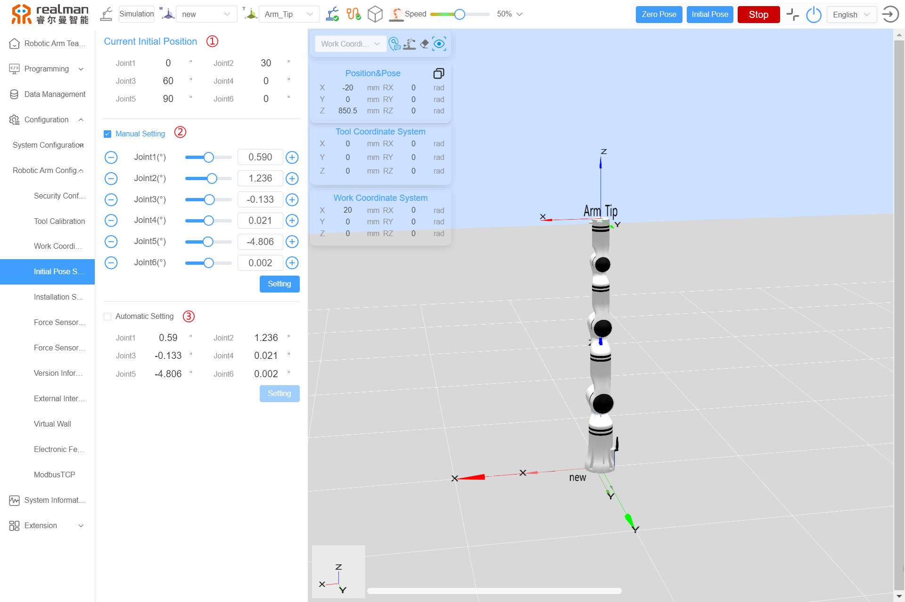

Setting of initial Pose of robot

#### Installation Setting

Robot installation setting refers to the installation angle settings. In the model window of this interface, users can check whether the set installation angle is consistent with the required angle in real time. Zone 1 can quickly set the commonly used installation directions, including upright, side, and flip installation. Zone 2 can set the installation angle by adjusting the angles of X-axis, Y-axis and Z-axis. After setting, click OK to save it.

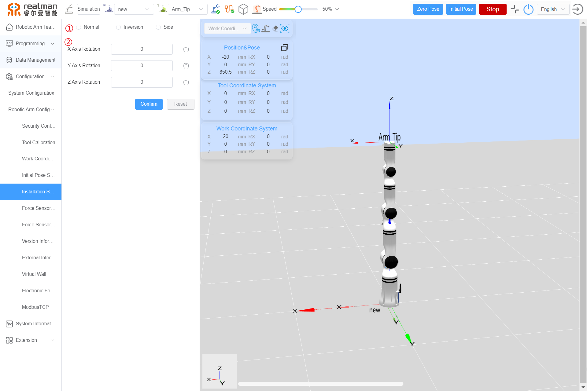

Installation Setting

#### Configuration of Six-Axis force sensor

The parameters of Six-Axis force sensor are explained in the table below.

<table>
  <tr>
    <th colspan="7">Six-Axis force sensor</th>
  </tr>
  <tr>
    <td>Payload</td>
    <td>X：200N</td>
    <td>Y：200N</td>
    <td>Z: 200N</td>
    <td>MX：7Nm</td>
    <td>MY：7Nm</td>
    <td>MZ: 7Nm</td>
  </tr>
</table>

::: warning
The Six-Axis force measuring range is 200 N/7 Nm. If the end effector is subjected to a force of more than 600 N or a torque of more than 21 Nm, it will cause irreversible damage to the sensor. Due care shall be taken to avoid damage to the sensor due to hard collision with external devices and cause damage during the running of robotic arm.
:::

Calibration of Six-Axis force center of gravity calculation sensor on the force sensor configuration interface.

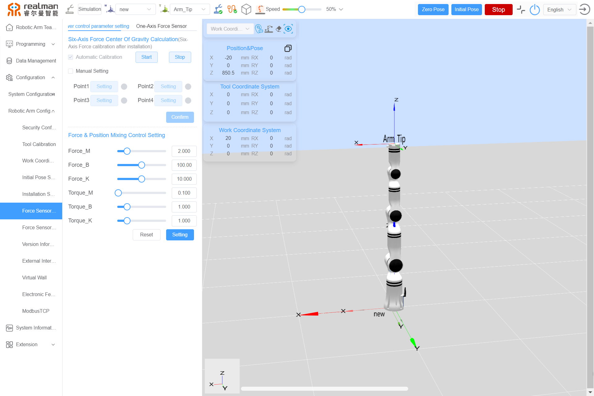

Force sensor configuration

##### Force sensor calibration

1. **Six-Axis force calibration**

The Six-Axis force center of gravity needs to be recalculated only when the end tool is changed. Automatic calibration can be performed through the trajectory path prestored on the controller. To prevent the prestored trajectory from interfering with external devices during running, users can also perform manual calibration in view of the actual scenario.

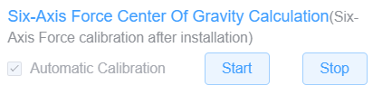

Automatic Six-Axis force calibration

For automatic calibration, click the Start button, and the calibration state prompt will pop up, as shown in the figure below.

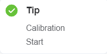

Prompt of state confirmation

The robot will automatically run four poses already set and calculate the center of gravity. In the case of any risk of robot collision during the movement, click the Stop button to stop the running.

After the Six-Axis force center of gravity calibration is successful, the message "Calibration succeeds" will pop up, indicating that the center of gravity calibration is completed.

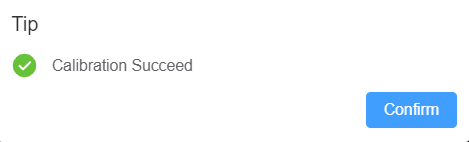

Six-Axis force center of gravity calibration completed

For manual calibration, select the Manual setting checkbox, and set four points with as significant as possible pose differences on the robotic arm teaching interface. When the four points are recorded, click OK.

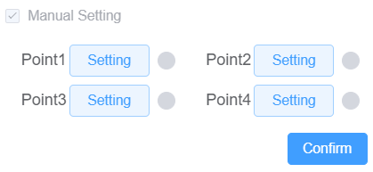

Manual Six-Axis force calibration

The robot automatically calculates the Six-Axis force center of gravity. When the message "Sensor center of gravity calibration succeeds" pops up, it indicates that the center of gravity calibration is completed.

Six-Axis force center of gravity calibration completed

Force & Position Mixing Control Settings are supported, allowing you to set Force_M, Force_B, Force_K, Torque_M, Torque_B, and Torque_K. After modifying the parameters, click `Setting` to complete the settings. If you need to restore the initial settings, click `Reset`.

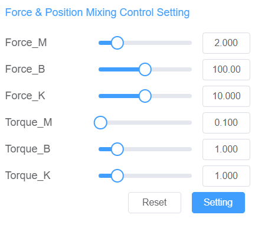

Force & Position Mixing Control Settings

1. **One-Axis force calibration**

The methods for calibration of One-Axis force sensor is similar to those for Six-Axis force sensor, also including automatic calibration and manual calibration.

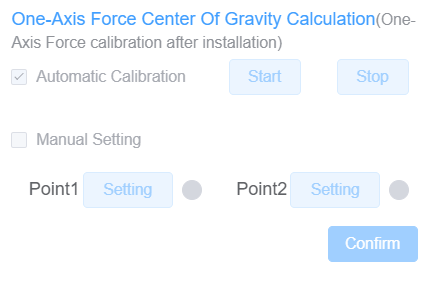

Automatic One-Axis force calibration

For automatic calibration, click the Start button, and the calibration state confirmation prompt will pop up, as shown in the figure below.

Prompt of state confirmation

The robot will automatically run two poses already set and calculate the center of gravity. In the case of any risk of robot collision during the movement, click the Stop button to stop the running.

After the One-Axis force center of gravity calibration is successful, the message "Sensor center of gravity calibration succeeds" will pop up, indicating that the center of gravity calibration is completed.

One-Axis force center of gravity calibration completed

For manual calibration, select the Manual setting checkbox, and set two points with as significant as possible pose differences on the robotic arm teaching interface. When the two points are recorded, click OK.

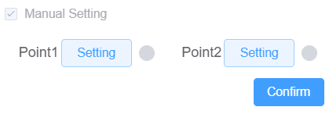

Manual One-Axis force calibration

The robot automatically calculates the One-Axis force center of gravity. When the message "Calibration succeeds" pops up, it indicates that the center of gravity calibration is completed.

One-Axis force center of gravity calibration completed

::: warning
During force sensor calibration, make sure that there is a sufficient space around the robot to avoid collision of the robot with external objects. Furthermore, in the whole calibration process, do not impose any external force on the robot and sensor, to avoid data errors.
:::

##### Force sensor data Graph

According to the robot model, the force sensor can record the Six-Axis force data at the end of the robot in real time. See the following Six-Axis force data graph.

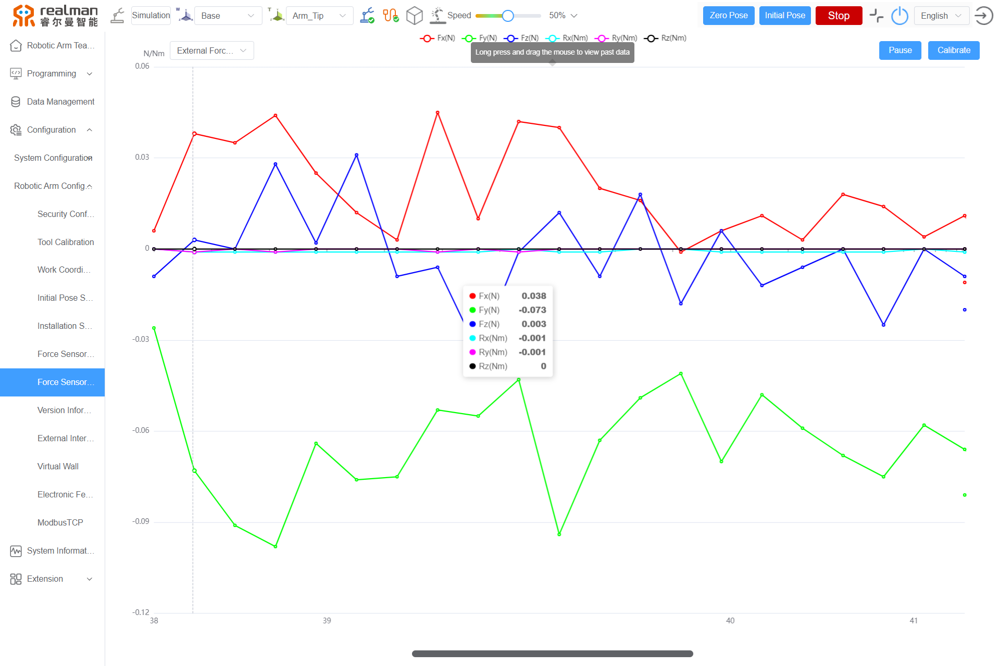

Force sensor data Graph

#### Version information

After the robot is connected, the robotic arm model, teach pendant version, controller software version, algorithm version, dynamic model version, joint software version, and end interface version can be checked on the version information interface.

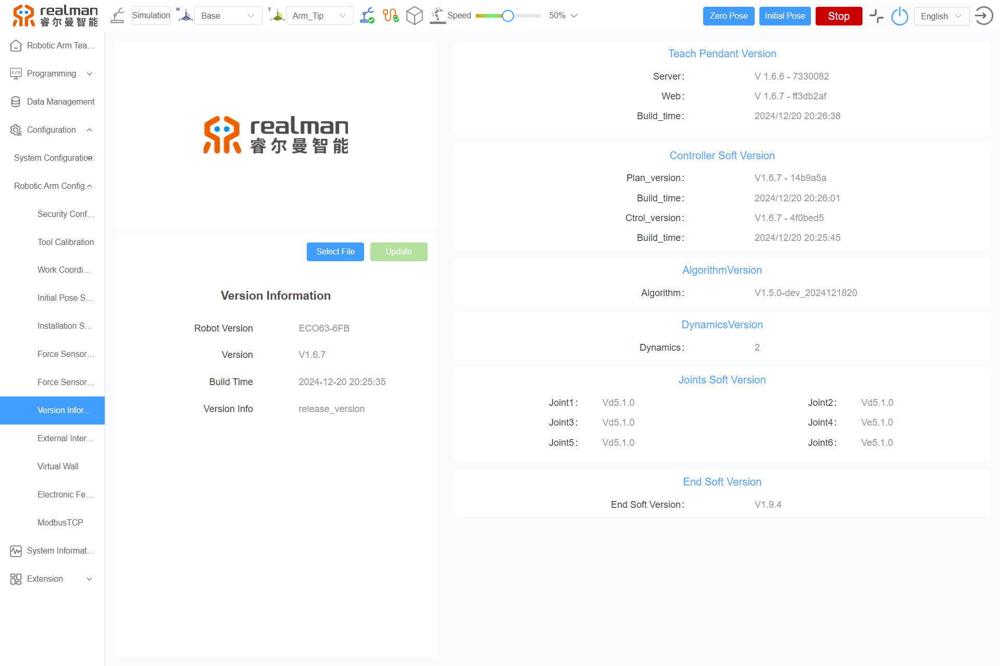

Version information interface

#### External Interface Setting

External Interface Setting includes the controller I/O Configuration and tool I/O Configuration, as shown in the figure below.

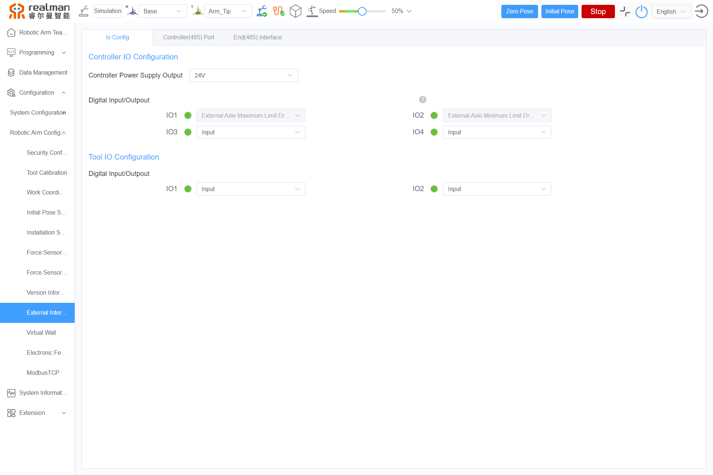

External Interface Setting interface

1. **Controller I/O Configuration:**

The I/O configuration interface on the teach pendant displays the state of the controller I/O and can configure the controller I/O, as shown in the following figure.

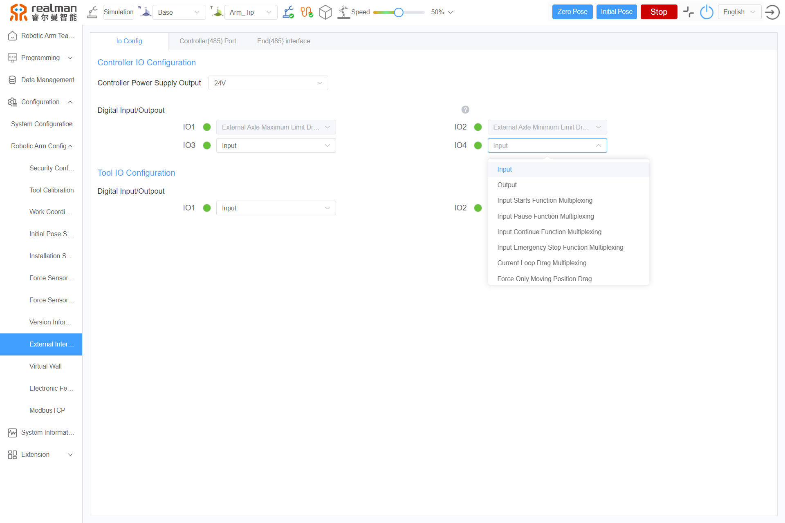

Controller I/O Configuration interface

- **Controller power output**: In this section, the external power output of the controller can be configured to 0 V, 12 V, or 24 V.
- **Digital Input/Output**: This section displays the state of digital I/O. Users can set the digital Input/Output to Input, Output, Input Starts Function Multiplexing, Input Pause Function Multiplexing, Input Continue Function Multiplexing, Input Emergency Stop Function Multiplexing, Current Loop Drag Multiplexing, Input initial pose function multiplexing mode, Output collision function multiplexing mode, Real time speed regulation function reuse mode as actually needed.
- **When it is set as an input interface**: A gray circle represents low level and the green circle represents high level.
- **When it is set as an output interface**: Pressing the button turns it green, setting the corresponding channel to a high output state; releasing the button turns it gray, indicating that the corresponding channel output is low.

2. **Tool I/O Configuration**

The tool I/O configuration interface on the teach pendant displays the state of the tool I/O and can configure the tool I/O, as shown in the following figure.

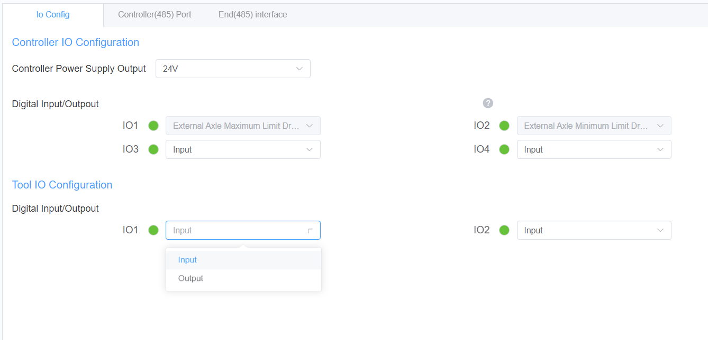

Tool I/O Configuration interface

Digital I/O: this section displays the state of digital I/O. The gray circle represents low level and the green circle represents high level. Users can set the digital I/O as an input or output interface according to the actual need.

#### Virtual wall

**Virtual Wall Introduction**:

- The virtual wall configuration is to create a virtual wall to limit the motion range of the robotic arm to within the wall during drag teaching. The virtual wall acts on the whole robotic arm. When the robotic arm is dragged and a part of the robotic arm touches the wall and is to move beyond the wall limit, the robotic arm will feel resistance, and will not be able to move out of the wall.
- The virtual wall function currently supports two shapes: cuboid and sphere, allowing for precise limitation of the dragging range. Under the current loop drag teaching and force control drag teaching modes, users can use the virtual wall function to ensure that the robotic arm's dragging operations do not exceed the preset range.
- The virtual wall function is currently only supported in the current loop drag teaching and force control drag teaching modes. In other operation modes, this function will automatically become ineffective. Therefore, please ensure that the virtual wall function is used in the correct operation mode to fully utilize its ability to limit the dragging range.

**Setting Virtual Wall**:

1. Open the teach pendant, and select `Configuration` > `Robotic Arm Configuration` > `Virtual wall` to enter the virtual wall page.
2. Set the relevant parameters according to the table below.

|Parameter|Description|
|-|-|
|Shape|Currently, the virtual wall function supports the rectangular prism shape and sphere shape.|
|Select Parameters|Supports selecting saved virtual wall parameters.|
|Set Parameters|The x, y, and z parameters are all based on the world coordinate, with the unit of 0.001 m and the maximum range of -5(m) to +5(m).|
|Drag Area|Defaults to inside the wall, modification is not supported.|
|Effective Position|Supports selecting whether the virtual wall affects the entire arm or just the end effector.|

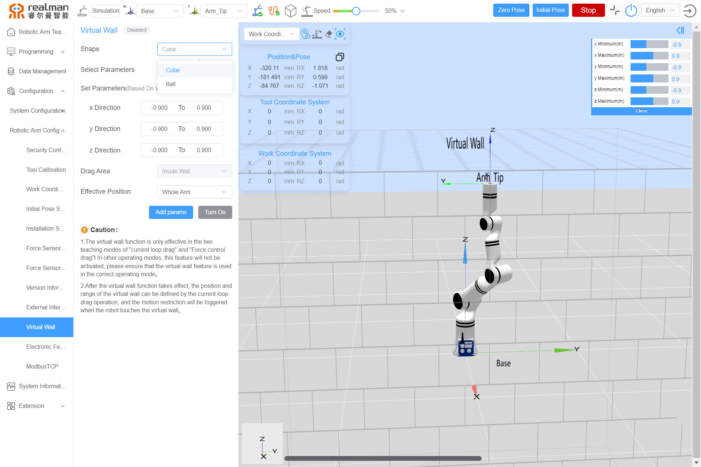

Virtual wall parameter setting

3. After setting up, click on `Add Params`, and in the pop-up dialog box, enter the name for the new virtual wall, then click `Save` to complete the creation of the virtual wall.  
    When `Select Parameters` chooses a saved virtual wall, you will need to click `Update` to modify the saved virtual wall's settings.  
    The saved virtual wall can be viewed by clicking `Data Management` in `Model Warehouse`.

    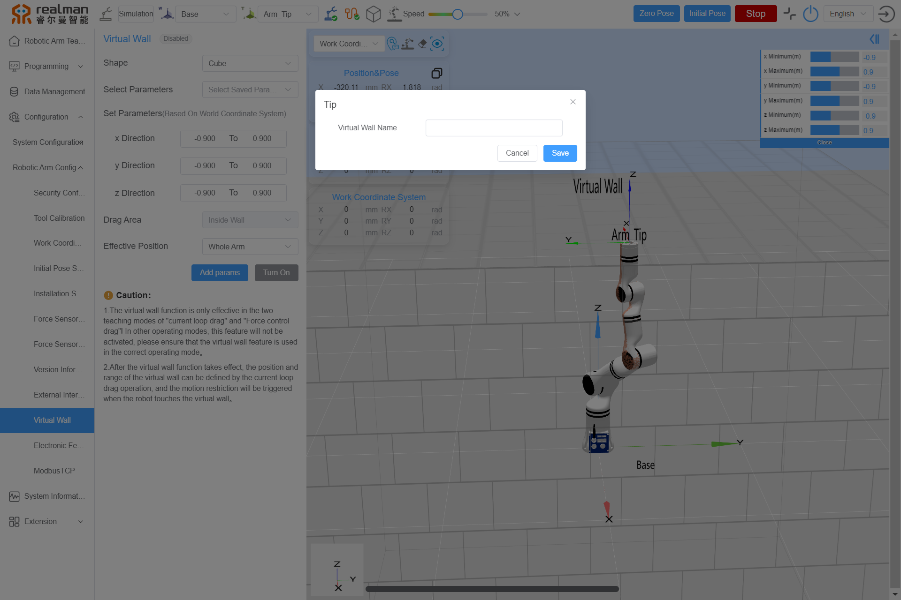

    
Virtual wall started

**Turn On Virtual Wall**:

1. On the virtual wall page, click `Turn On` to complete the activation of the virtual wall.
2. After the virtual wall is enabled, the status will be displayed as `Enabled`, the icon will turn green, the `Turn On` button will change to a green `Turn Off`, and the virtual wall set in the model will be visible in green.

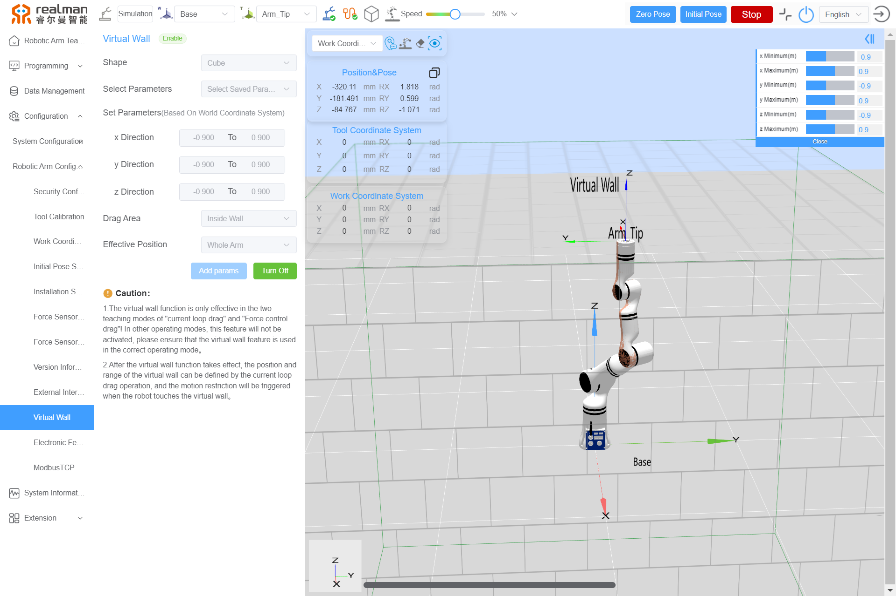

Virtual wall started

3. After the virtual wall is set, users need to click `Extension` > `End Control`. In Current Loopdrag, perform Drag To Teach. At this time, the virtual wall is effective. When dragging the robotic arm, users can feel that its motion is confined within the wall.

#### Electronic fence

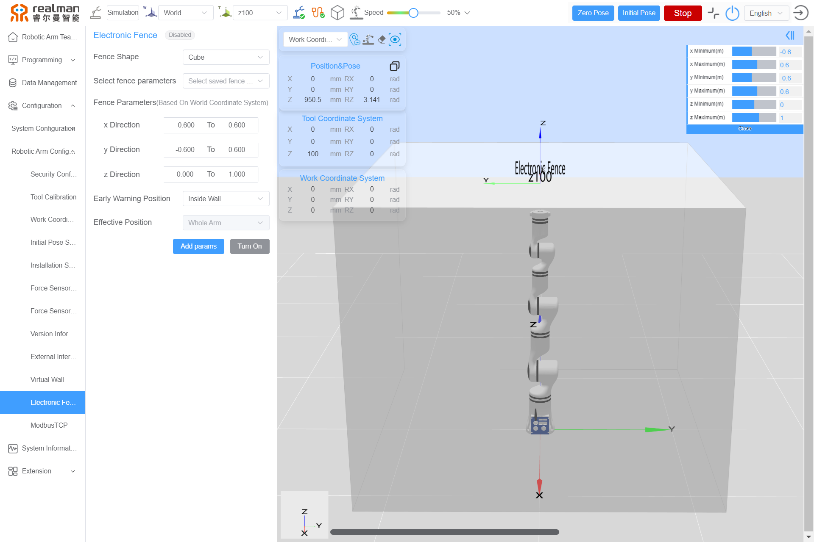

The electronic fence settings include the Fence Shape, Select fence parameters, Fence Parameters, Early Warning Position, Effective Position, Add params, Update, Turn On, etc.

1. The shape of the fence is a Cube 3D view by default, which displays the 3D shape of the current electronic fence, and distinguish the fence by color (gray: not effective, green: effective, and red: wall collision warning).
2. When setting the electronic fence, users can choose from the saved fences (up to 10 electronic fences can be saved). The fence parameters can also be entered manually. The fence parameters include the maximum and minimum values in X, Y and Z directions. Alternatively, the position can also be set by dragging the mouse at the upper right of the page (unit of position: m).
3. Setting and enabling are supported, which remain valid after restart.
4. The early warning position is within the wall by default, and the acting position is the whole robotic arm by default.

::: warning
If the electronic fence has already been activated, and the installation angle is reconfigured, the electronic fence must be reconfigured according to the current installation angle.
:::
