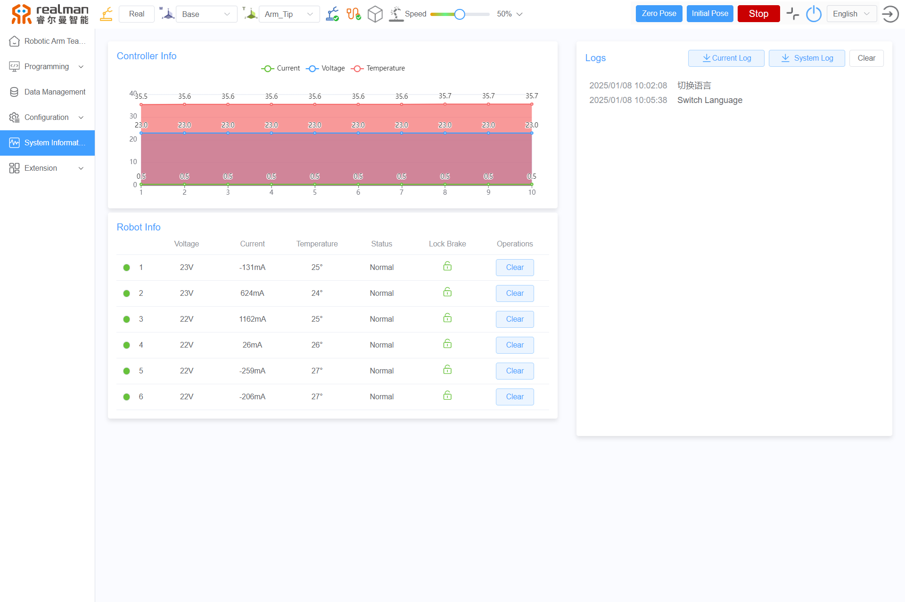

# 
Start guide: 
Robotic Arm System Information

The system information includes the Controller Info, Joint Info, system log, error message, etc.

1. System information: contains the controller's input voltage, output current, temperature, pose, and error code.
2. Robotic arm information: contains the voltage, current, temperature, status, and error code for all six joints. After resolving joint errors, you must click the `Clear` button to remove the error codes before enabling the joints to control their motions.
3. System log: contains all operational commands from the teach pendant interface, along with error types for the robotic arm and controller, displayed with timestamps in a text box. Click `Current Log` to save the current log information locally. Click `System Log` to download all robotic arm logs locally, supporting the complete logs of all programs. Click `Clear` to delete all displayed system logs.

System information diagram

