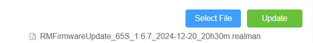
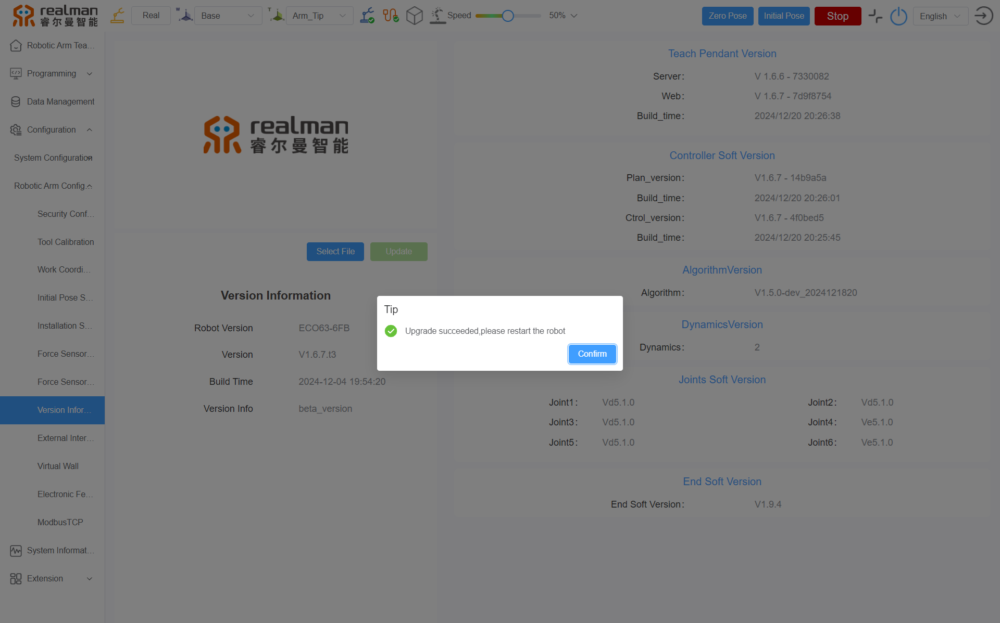

# 
Start guide: 
Robotic Arm System Upgrade

The system of the robotic arm controller can be upgraded on the **"Configuration > Robotic Arm Config > Version Information"** page as shown in the teach pendant (Before upgrading, please confirm whether the corresponding version can be upgraded; otherwise, serious issues may occur).  
Detailed steps are as follows:

1. Download the file provided by the manufacturer with the **.realman** extension locally.
2. Click the `Select File` button, and locate and select the file saved in the previous step from the pop-up window. Once successfully selected, the file name will be displayed below the button, as shown in the image below.

Select file

3. Click the `Upgrade` button, and the page will display an upgrade progress bar. Wait for the upgrade to complete (for larger files, the upgrade may take 4–5 mins; please wait patiently).

Upgrade progress

4. Upon successful upgrade, a pop-up message will appear on the teach pendant page, and the controller will emit continuous beeping sounds. Restart the controller at this time, and the robot will resume normal operation.

Successful upgrade prompt

::: warning
Precautions for the controller program update: After the robot program update is completed, restart the robotic arm and open the WEB teach pendant. Navigate to the teach pendant homepage and press Ctrl+F5 to force refresh the browser and clear the cache. At this point, the updated robotic arm and WEB teach pendant will be ready for normal use.
:::
