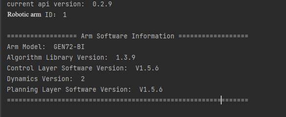

# Robotic arm Python API: Get started

## 1. Introduction

The development package is designed to provide convenient Python interfaces for secondary development of the RealMan robotic arm. With this package, users can easily implement functions such as robotic arm control, path planning, and state monitoring, thereby accelerating the development process of robotic arm-related applications.

## 2. Target user

- **Robotic arm developers**: For developers who wish to program and debug the RealMan robotic arm via Python, this development package provides a rich set of APIs and example codes, to help users get started quickly.
- **Automation system integrators**: When integrating the RealMan robotic arm into automation systems, this development package simplifies the integration process and improves development efficiency.
- **Researchers**: Researchers can use this development package to conduct studies and experiments related to RealMan robotic arm algorithms, such as path planning, and force control.
- **Educators**: For users in the field of robotics education, this development package can be used for teaching and experiments with the RealMan robotic arm, helping students better understand and apply robotic arm technology.

## 3. Operating systems and software versions supported

### Operating system

- **Windows (64-bit and 32-bit)**: The 64-bit and 32-bit versions of Windows operating system are supported, for the convenience of Windows users to develop robotic arms.
- **Linux (x86 and ARM)**: The x86 and ARM Linux operating systems are supported, which can meet the demand of different hardware environments.

### Software version

- **Python 3.9 and higher versions**: The development package is developed based on Python 3.9 and higher versions, to ensure compatibility with the latest Python version.

## 4. Installation and usage

### Installation

Users can install the development package through the pip command:

```bash
pip install Robotic_Arm
```

Alternatively, users can download the secondary development package locally:

```bash
git clone https://github.com/RealManRobot/RM_API2.git
```

### Usage

Upon installation, users can import the development package into the Python script and use the corresponding API interface to develop robotic arms. The following is a simple example code to use the Python development package to connect the robotic arm and query the version of robotic arm:

```python
from Robotic_Arm.rm_robot_interface import *

robot = RoboticArm(rm_thread_mode_e.RM_TRIPLE_MODE_E)
handle = robot.rm_create_robot_arm("192.168.1.18", 8080)
print ("robotic arm ID:", handle.id)

software_info = robot.rm_get_arm_software_info()
if software_info[0] == 0:
    print("\n================== Arm Software Information ==================")
    print("Arm Model: ", software_info[1]['product_version'])
    print("Algorithm Library Version: ", software_info[1]['algorithm_info']['version'])
    print("Control Layer Software Version: ", software_info[1]['ctrl_info']['version'])
    print("Dynamics Version: ", software_info[1]['dynamic_info']['model_version'])
    print("Planning Layer Software Version: ", software_info[1]['plan_info']['version'])
    print("==============================================================\n")
else:
    print("\nFailed to get arm software information, Error code: ", software_info[0], "\n")
```

Output result as shown below:



## 5. Technical support and community

- **SDKs and libraries**: [Python SDK](https://github.com/RealManRobot/RM_API2.git)
