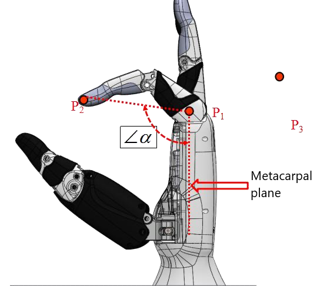
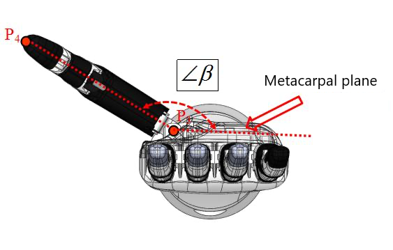
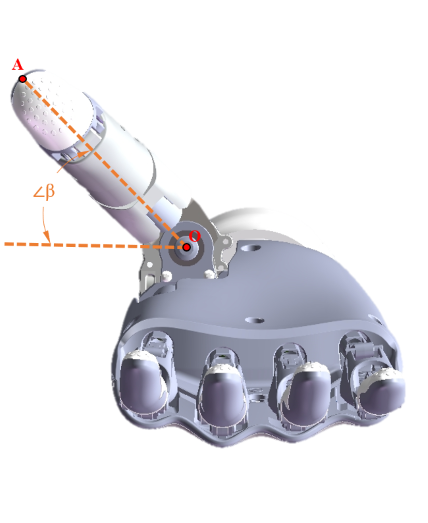

# <p class="hidden">JSON protocol: </p>End Effector Command set (optional)

## Gripper control

The RealMan robotic arm is equipped with the INSPIRE-ROBOTS EG2-4C2 gripper. To facilitate user operation of the gripper, the robotic arm controller provides an open gripper control protocol (the gripper control protocol is mutually exclusive with the end modbus functionality).

### Set the gripper stroke `set_gripper_route`

Set the gripper stroke, which refers to the maximum and minimum opening values of the gripper. Once set successfully, the values are saved automatically and will not be lost when the gripper is powered off.

- **Input parameter**

| Parameter             | Type     | Description             |
| :--- | :------------------------- |:---|
| `set_gripper_route` | `string` |Set the gripper stroke. |
| `min` | `int` |Minimum opening value of the gripper, range: 0−1,000, without a unit of measurement. |
| `max` | `int` |Maximum opening value of the gripper, range: 0−1,000, without a unit of measurement. |

- **Code demo**

**Input**

```json
{"command":"set_gripper_route","min":70,"max":500}
```

**Output**

Setting succeeded:

```json
{
    "command": "set_gripper_route",
    "state": true
}
```

Setting failed:

```json
{
    "command": "set_gripper_route",
    "state": false
}
```

### Set the gripper release `set_gripper_release`

- **Input parameter**

| Parameter             | Type     | Description             |
| :--- | :------------------------- |:---|
| `set_gripper_release` | `string` |Set the gripper release. |
|  `speed`  |    `int`    |Release speed of the gripper, range: 1−1,000, without a unit of measurement. |
|  `block`  |    `int`    |true: blocking mode, false: non-blocking mode. |

- **Output parameter**

| Parameter        | Type    | Description                                   |
| :-------------- | :----- | :------------------------------------ |
| `state` | `bool` | `true`: setting succeeded, `false`: setting failed. |

You can refer to [current_trajectory_state](../motionConfig/index.md#5439) for the output parameters of the motion completion return result.

- **Code demo**

**Input**

```json
{"command":"set_gripper_release","speed":500,"block":true}
```

**Output**

Gripper release succeeded:<br>
This command will be returned regardless of whether it is in blocking mode.

```json
{
    "command": "set_gripper",
    "state": true
}
```

Gripper release failed:<br>
This command will be returned regardless of whether it is in blocking mode.

```json
{
    "command": "set_gripper",
    "state": false
}
```

This command is used to report the motion to a given position in blocking mode.

```json
{"state":"current_trajectory_state","trajectory_state":true,"device":1,"trajectory_connect": 1}
```

### Set the force-controlled grasping of the gripper `set_gripper_pick`

Force-controlled grasping of the gripper: The gripper grasps with the set speed and force. When the gripping force exceeds the preset threshold, the gripper stops grasping.

- **Input parameter**

| Parameter             | Type     | Description             |
| :--- | :------------------------- |:---|
| `set_gripper_pick` | `string` |Set the force-controlled grasping of the gripper. |
|  `speed`  |    `int`    |Release speed of the gripper, range: 1−1,000, without a unit of measurement. |
|  `force`  |    `int`    |    Force control threshold, range: 50−1,000, without a unit of measurement. |
|  `block`  |    `int`    |true: blocking mode, false: non-blocking mode. |

- **Output parameter**

| Parameter        | Type    | Description                                   |
| :-------------- | :----- | :------------------------------------ |
| `state` | `bool` | `true`: setting succeeded, `false`: setting failed. |

You can refer to [current_trajectory_state](../motionConfig/index.md#5439) for the output parameters of the motion completion return result.

- **Code demo**

**Input**
Set the force-controlled grasping of the gripper.

```json
{"command":"set_gripper_pick","speed":500,"force":200,"block":true}
```

**Output**

Gripper release succeeded:<br>
This command will be returned regardless of whether it is in blocking mode.

```json
{
    "command": "set_gripper",
    "state": true
}
```

Gripper release failed:<br>
This command will be returned regardless of whether it is in blocking mode.

```json
{
    "command": "set_gripper",
    "state": false
}
```

This command is used to report the motion to a given position in blocking mode.

```json
{
    "state": "current_trajectory_state",
    "trajectory_state": true,
    "device": 1,
    "trajectory_connect": 1
}
```

### Set the continuous force-controlled grasping of the gripper `set_gripper_pick_on`

Continuous force-controlled grasping of the gripper: The gripper grasps with the set speed and force. When the gripping force exceeds the preset threshold, the gripper stops grasping. When the gripping force is less than the preset threshold, the gripper grasps again until the gripping force exceeds the preset threshold.

- **Input parameter**

| Parameter             | Type     | Description             |
| :--- | :------------------------- |:---|
| `set_gripper_pick_on` | `string` |Set the continuous force-controlled grasping of the gripper. |
|  `speed`  |    `int`    |Release speed of the gripper, range: 1−1,000, without a unit of measurement. |
|  `force`  |    `int`    |    Force control threshold, range: 50−1,000, without a unit of measurement. |
|  `block`  |    `int`    |true: blocking mode, false: non-blocking mode. |

- **Output parameter**

| Parameter        | Type    | Description                                   |
| :-------------- | :----- | :------------------------------------ |
| `state` | `bool` | `true`: setting succeeded, `false`: setting failed. |

You can refer to [current_trajectory_state](../motionConfig/index.md#5439) for the output parameters of the motion completion return result.

- **Code demo**

**Input**  

Set the continuous force-controlled grasping of the gripper.

```json
{"command":"set_gripper_pick_on","speed":500,"force":200,"block":true}
```

**Output**

Gripper release succeeded:<br>
This command will be returned regardless of whether it is in blocking mode.

```json
{
    "command": "set_gripper",
    "state": false
}
```

Gripper release failed:<br>
This command will be returned regardless of whether it is in blocking mode.

```json
{
    "command": "set_gripper",
    "state": false
}
```

This command is used to report the motion to a given position in blocking mode.

```json
{
    "state": "current_trajectory_state",
    "trajectory_state": true,
    "device": 1,
    "trajectory_connect": 1
}
```

### Set the gripper to a given position `set_gripper_position`

Gripper at a given position: When the current opening is smaller than the given opening, the gripper releases to a given position at the given speed. When the current opening is larger than the given opening, the gripper closes to a given position at the given speed and force. The gripper stops when the gripping force exceeds the preset threshold or when the given position is reached.

- **Input parameter**

| Parameter             | Type     | Description             |
| :--- | :--- |:---|
| `set_gripper_position` | `string` |Set the gripper to a given position. |
|  `position`  |    `int`    | Opening position of the gripper, range: 1−1,000, without a unit of measurement. |
|  `block`  |    `int`    |true: blocking mode, false: non-blocking mode. |

- **Output parameter**

| Parameter        | Type    | Description                                   |
| :-------------- | :----- | :------------------------------------ |
| `state` | `bool` | `true`: setting succeeded, `false`: setting failed. |

You can refer to [current_trajectory_state](../motionConfig/index.md#5439) for the output parameters of the motion completion return result.

- **Code demo**

**Input**  

Set the gripper to a given position.

```json
{"command":"set_gripper_position","position":500,"block":true}
```

**Output**

Gripper release succeeded. <br>
This command will be returned regardless of whether it is in blocking mode.

```json
{
    "command": "set_gripper",
    "state": true
}
```

Gripper release failed. <br>
This command will be returned regardless of whether it is in blocking mode.

```json
{
    "command": "set_gripper",
    "state": false
}
```

This command is used to report the motion to a given position in blocking mode.

```json
{
    "state": "current_trajectory_state",
    "trajectory_state": true,
    "device": 1,
    "trajectory_connect": 1
}
```

### Get the gripper state `get_gripper_state`

- **Input parameter**

| Parameter             | Type     | Description             |
| :--- | :--- |:---|
| `get_gripper_state` | `string` |Get the gripper state. |

- **Output parameter**

| Parameter             | Type     | Description             |
| :--- | :--- |:---|
| `enable` | `int` |Gripper enabling state, 0: disable, 1: enable. |
|`status`|`int`|Gripper online state, 0: offline, 1: online. |
| `error` | `int` |Gripper error message. <br>Indicated by the lower 8 bits. <br>Bit5−7: reserved. <br>Bit4: internal communication. <br>Bit3: driver.  <br>Bit2: overcurrent. <br>Bit1: over-temperature. <br>Bit0: locked rotor. |
| `mode` | `int` | Current mode, 1: gripper fully open and idle, 2: gripper fully closed and idle, 3: gripper stopped and idle, 4: gripper in closing, 5: gripper in opening, 6: gripper stopped during closing due to force control. |
| `current_force` | `int` |Current force of the gripper, in g. |
| `temperature` | `int` |Current temperature, in °C. |
| `actpos` | `int` |Gripper opening. |

- **Code demo**

**Input**

```json
{"command":"get_gripper_state"}
```

**Output**

```json
{
    "command": "get_gripper_state",
    "enable": 1,
    "status": 1,
    "error": 0,
    "mode": 1,
    "current_force": 100,
    "temperature": 40,
    "actpos": 150
}
```

## Five-fingered dexterous hand

The RealMan robotic arm is equipped with an INSPIRE-ROBOTS five-fingered dexterous hand, which can be configured by the protocol.

### Set the gesture of the dexterous hand `set_hand_posture`

- **Input parameter**

| Parameter             | Type     | Description             |
| :--- | :--- |:---|
| `set_hand_posture` | `string` |Set the gesture of the dexterous hand. |
|  `posture_num`  |    `int`    |    Gesture sequence number pre-stored in the dexterous hand, range: 1−40. |
|  `block`  |  `bool` |true: blocking mode, false: non-blocking mode. |

- **Output parameter**

| Parameter        | Type    | Description                                   |
| :-------------- | :----- | :------------------------------------ |
| `state` | `bool` | `true`: setting succeeded, `false`: setting failed. |

You can refer to [current_trajectory_state](../motionConfig/index.md#5439) for the output parameters of the motion completion return result.

- **Code demo**

**Input**  

Set the gesture of the dexterous hand.

```json
{"command":"set_hand_posture","posture_num":1,"block":true}
```

**Output**
Setting succeeded:

```json
{
    "command": "set_hand_posture",
    "set_state": true
}
```

Setting failed:

```json
{
    "command": "set_hand_posture",
    "set_state": false
}
```

This command is used to report the motion to a given position in blocking mode.

```json
{
    "state": "current_trajectory_state",
    "trajectory_state": true,
    "device": 2,
    "trajectory_connect": 1
}
```

### Set the action sequence of the dexterous hand `set_hand_seq`

- **Input parameter**

| Parameter             | Type     | Description             |
| :--- | :--- |:---|
| `set_hand_seq` | `string` |Set the action sequence of the dexterous hand. |
|  `seq_num`  |    `int`    |Action sequence number pre-stored in the dexterous hand, range: 1−40. |
|  `block`  |  `bool` |true: blocking mode, false: non-blocking mode. |

- **Output parameter**

| Parameter        | Type    | Description                                   |
| :-------------- | :----- | :------------------------------------ |
| `state` | `bool` | `true`: setting succeeded, `false`: setting failed. |

You can refer to [current_trajectory_state](../motionConfig/index.md#5439) for the output parameters of the motion completion return result.

- **Code demo**

**Input**  

Set the action sequence of the dexterous hand.

```json
{"command":"set_hand_seq","seq_num":1,"block":true}
```

**Output**
Setting succeeded:

```json
{
    "command": "set_hand_seq",
    "set_state": true
}
```

Setting failed:

```json
{
    "command": "set_hand_seq",
    "set_state": false
}
```

This command is used to report the motion to a given position in blocking mode.

```json
{
    "state": "current_trajectory_state",
    "trajectory_state": true,
    "device": 2,
    "trajectory_connect": 1
}
```

### Set the angles of the dexterous hand `set_hand_angle`

Set the angles of the dexterous hand, which has 6 degrees of freedom: 1. Little finger, 2. Ring finger, 3. Middle finger, 4. Index finger, 5. Thumb bending, 6. Thumb rotation.

- **Input parameter**

| Parameter             | Type     | Description             |
| :--- | :--- |:---|
| `set_hand_angle` | `string` |Set the finger angles. |
|  `hand_angle`  |    `int`    |    Array of finger angles, range: 0−1,000. <br>Additionally, -1 indicates that no action will be performed for this degree of freedom, and the current state will be maintained. |
|  `block`  |  `bool` |true: blocking mode, false: non-blocking mode. |

- **Output parameter**

| Parameter        | Type    | Description                                   |
| :-------------- | :----- | :------------------------------------ |
| `state` | `bool` | `true`: setting succeeded, `false`: setting failed. |

You can refer to [current_trajectory_state](../motionConfig/index.md#5439) for the output parameters of the motion completion return result.

- **Code demo**

**Input**  

Set the angles of the dexterous hand.

```json
{"command":"set_hand_angle","hand_angle":[-1,100,200,300,400,500],"block":true}
```

**Output**
Setting succeeded:

```json
{
    "command": "set_hand_angle",
    "set_state": true
}
```

Setting failed:

```json
{
    "command": "set_hand_angle",
    "set_state": false
}
```

This command is used to report the motion to a given position in blocking mode.

```json
{
    "state": "current_trajectory_state",
    "trajectory_state": true,
    "device": 2,
    "trajectory_connect": 1
}
```

### Set the speed of the dexterous hand `set_hand_speed`

- **Input parameter**

| Parameter             | Type     | Description             |
| :--- | :--- |:---|
| `set_hand_speed` | `string` |Set the finger speed. |
| `hand_speed` | `int` |Finger speed, range: 1−1,000. |

- **Code demo**

**Input**

```json
{"command":"set_hand_speed","hand_speed":500}
```

**Output**
Setting succeeded

```json
{
    "command": "set_hand_speed",
    "set_state": true
}```

Setting failed

```json
{
    "command": "set_hand_speed",
    "set_state": false
}
```

### Set the force threshold of the dexterous hand `set_hand_force`

- **Input parameter**

| Parameter             | Type     | Description             |
| :--- | :--- |:---|
| `set_hand_force` | `string` |Set the finger force threshold. |
| `hand_force` | `int` |Finger force, range: 1−1,000. |

- **Code demo**

**Input**

```json
{"command":"set_hand_force","hand_force":500}
```

**Output**
Setting succeeded

```json
{
    "command": "set_hand_force",
    "set_state": true
}
```

Setting failed

```json
{
    "command": "set_hand_force",
    "set_state": false
}
```

### Set the angle follow control of the dexterous hand `hand_follow_angle`

Set the following angles of the dexterous hand, which has 6 degrees of freedom: 1. Little finger, 2. Ring finger, 3. Middle finger, 4. Index finger, 5. Thumb bending, 6. Thumb rotation. The control frequency is up to 50 Hz.

::: warning
To use this feature, you need to contact technical support for a customized firmware upgrade package for the dexterous hand (OYMotion or INSPIRE-ROBOTS).
:::

- **Input parameter**

| Parameter             | Type     | Description             |
| :--- | :--- |:---|
| `hand_follow_angle` | `string` |Set the finger angles. |

- **The angle definitions and motion ranges for each degree of freedom of INSPIRE-ROBOTS are as follows.**

| Angle | Legend |Range|
| :--- | :--- |:---|
| Little finger<br>Ring finger<br>Middle finger<br>Index finger |  |19°−176.7°|
| Thumb bending angle |  |-130−53.6°|
| Thumb rotation angle |  |90°−165°|

- **The angle definitions and motion ranges for each degree of freedom of OYMotion are as follows.**

| Angle | Legend |Range|
| :--- | :--- |:---|
| Index finger<br>Middle finger<br>Ring finger<br>Little finger |  |100.22°−178.37°<br>97.81°−176.06°<br>101.38°−176.54°<br>98.84°−174.86°|
| Thumb bending angle |  |2.26°−36.76°|
| Thumb rotation angle |  |0°−90°|

- **Code demo**

**Input**

Execution: Set the finger actions of the dexterous hand. hand_angle: array of finger angles, controlled according to the angles defined by the manufacturer of the dexterous hand. For example: <br>

1. OYMotion has an angle range from -32,768 to +32,767;
2. INSPIRE-ROBOTS has an angle range from 0 to +2,000.

Definition of angles of the dexterous hand (int16):<br>

1. OYMotion: angle of joint 1 of the first finger × 100;
2. INSPIRE-ROBOTS: 0−2,000. Please contact technical support for the relationship table between the driver stroke and angle.

```json
{"command":"hand_follow_angle","hand_angle":[100,100,200,300,400,500]}
```

**Output**
Setting succeeded

```json
{
    "command": "hand_follow_angle",
    "set_state": true
}
```

Setting failed

```json
{
    "command": "hand_follow_angle",
    "set_state": false
}
```

### Set the position follow control of the dexterous hand `hand_follow_pos`

Set the following angles of the dexterous hand, which has 6 degrees of freedom: 1. Little finger, 2. Ring finger, 3. Middle finger, 4. Index finger, 5. Thumb bending, 6. Thumb rotation. The control frequency is up to 50 Hz.

::: warning
To use this feature, you need to contact technical support for a customized firmware upgrade package for the dexterous hand (OYMotion or INSPIRE-ROBOTS).
:::

- **Input parameter**

| Parameter             | Type     | Description             |
| :--- | :--- |:---|
| `hand_follow_pos` | `string` |Set the finger angles. |

- **Code demo**

**Input**

Execution: Set the finger actions of the dexterous hand. hand_pos: array of finger positions, controlled according to the angles defined by the manufacturer of the dexterous hand. For example: <br>

1. INSPIRE-ROBOTS has a position range from 0 to 1,000;
2. OYMotion has a position range from 0 to 65,535.

```json
{"command":"hand_follow_pos","hand_pos":[100,100,200,300,400,500]}
```

**Output**
Setting succeeded

```json
{
    "command": "hand_follow_pos",
    "set_state": true
}
```

Setting failed

```json
{
    "command": "hand_follow_pos",
    "set_state": false
}
```
