# 
Start Guide: 
Realman Robot Hardware Preparations

This manual is a quick user manual for robots, which is intended to help users complete the assembly and simple action edition in a short time.
With this manual, operators, technicians, technical service personnel, and robot program developers can learn how to use Realman's robotic arms quickly.
The robots developed by Realman include the RM65 series, RM75 series, RML63 series, ECO series, GEN72 series, etc. This manual is applicable for all series of robots.

## 1. Product components

A complete set of Realman collaborative robot comprises the following components:

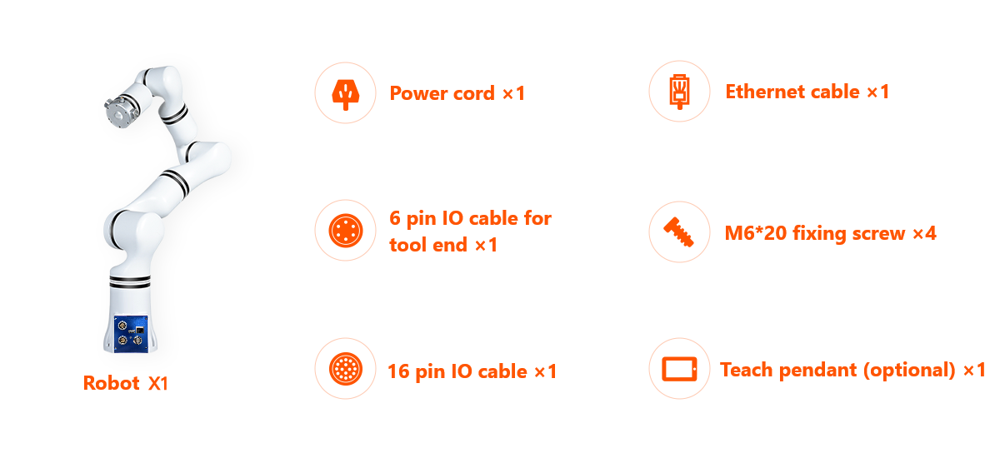

### Explanation of the Electrical Indications

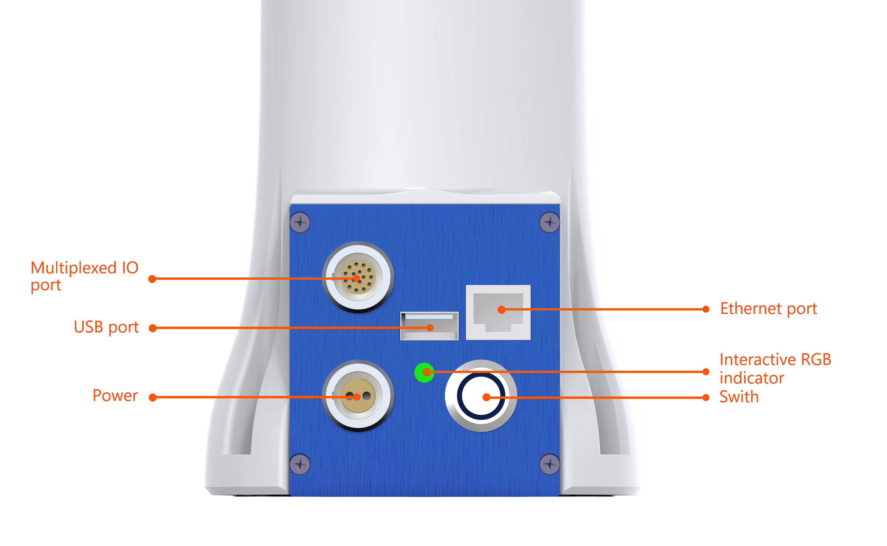

Gen 4 controller

| No. | Interface            | Function      |
| :--- | :-------------- | :------- |
| 1    | Switch            | Control the power supply to the robot, and the blue indicator light is on after being turned on |
| 2    | Power        | Insert the power cable |
| 3    | Multiplexing IO interface    |  Lead out the RS485 and I/O interfaces, etc.   For example, the external emergency stop button box. For detailed information, please refer to the [External Emergency Stop Button Box](../../../blog/arm/ExternalEmergencyStopButtonBox/index.md).|
| 4    | USB port      | An extension interface, for connecting the bluetooth handle receiver |
| 5    | Ethernet port   | Gigabit wired network interface, Communication network interface |
| 7    | Interactive RGB indicator | Change among white, blue, green, red, yellow, and Purple with the status of robotic arm   ①White steady: During initialization, the LED shows a steady white light to indicate that the device is starting up; ② Blue steady: Joint start and initialization. ③Green flashing: When the controller is operating normally, the green light flashes, indicating that the system is running well; ④Red flashing: A serious fault has occurred in the robotic arm and needs to be handled immediately; for example, if the communication module is offline from the ctrl or the online programming module, the red light will flash; ⑤Yellow flashing: The robotic arm issues a warning message, which is a common fault that needs to be handled immediately. The status light will return to green flashing after the error is cleared; ⑥Purple flashing: When upgrading using a USB drive, the purple light flashes. When upgrading using a web browser, it remains in its original state.|

### Beeper Sound Indications

- **Continuous Intermittent Beeping After Upgrade Completion**: After the software update is completed, the beeper emits a continuous sound until the controller restarts.
- **Single Beep Upon Successful Handle Connection**: When the handle is successfully paired with the system, the beeper emits a long beep.
- **Three Short Beeps When Handle Switches to Joint Teaching Mode**: When entering the joint teaching function, the beeper emits three rapid beeps.
- **Single Beep When Handle Switches to Pose Teaching Mode**: When switching to the pose teaching mode, the beeper emits a long beep.
- **Continuous Intermittent Beeping During Severe Robotic Arm Fault**: When a fault occurs in the robotic arm, the beeper emits a continuous sound until the error is resolved or the robotic arm restarts.

## 2. Quick installation of robot

Realman's robotic arms are of ultra-lightweight type, which can be quickly installed by only one person. The RM65 series, for example, weighs only 7.2 kg, with a base of only 110 mm. The following will take the RM65-B robotic arm as an example to introduce how to install the base and end extension tools, which are similar for other series of robotic arms.

- **Base installation**

  1. Take the RM65 robot out of the packing box and install the base at a fixed position. The dimensions of the base are as follows.
    
  2. Prepare four M6 hexagon socket bolts and an M6 hex wrench.
    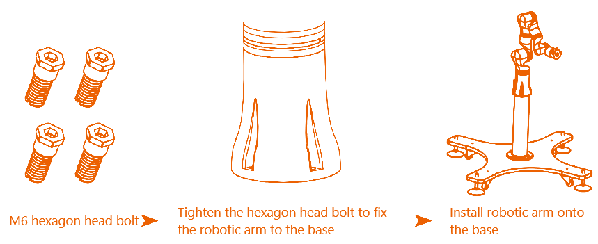

- **End installation**

  The robotic arm provides standard flange interfaces. Six M4 threaded holes evenly distributed on the ⌀49 mm reference circle are reserved on the flange of the robotic arm. Users only need to fit the holes according to the installation dimensions, as shown in the figure below.
  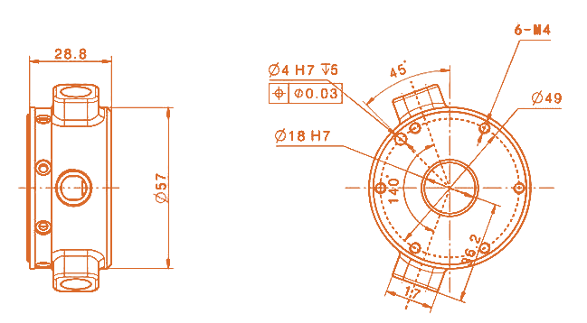

## 3. Wiring and startup of robot

1. Take out the 24 V DC cable of RM65 robot from the packing box.
2. Prepare a 24 V DC power supply and connect it to the power supply interface of the robotic arm. The power supply interface of the robotic arm is a 2-core aerial plug, which is located in the lower left corner of the controller panel. In the 2-core power cable, the brown wire is the power supply positive pole and the blue wire is the power supply negative pole.

   ::: tip
   The power voltage ranges from 20 V to 27 V, or even up to 30 V. It is recommended to use a switching power supply rated above 600 W with hiccup mode and constant current output of 1S.
   :::

3. Do not expose the robot to dust or a humid environment beyond the protection level of IP54. Pay close attention to the environment with conductive dust, for which special protection is required.
4. Connect the cables of the robot. If there are no external devices, just connect the power cable and network cable, as shown in the figure below:
  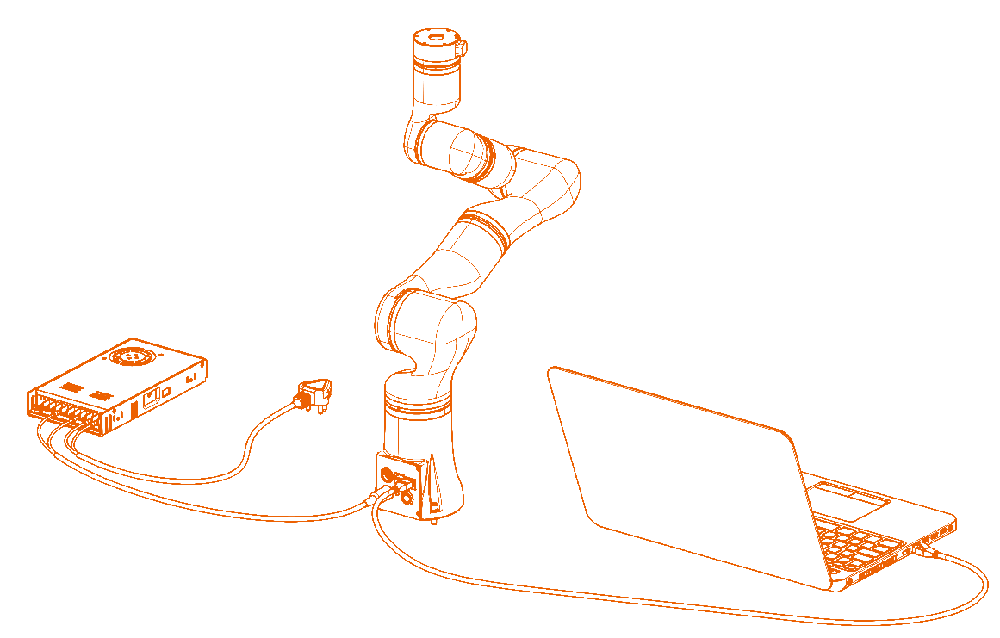

   ::: warning
   Check the following items before turning on the power supply:
   - Check whether the power cable and power plug are properly connected.
   - Check whether the power switch of the controller is off when it is not connected.
   - Ensure that the robot will not touch any person or equipment around. Make sure that the power cable is connected to the 24 V DC power supply.
   :::

5. Press the power switch to start the robotic arm.

   ::: tip
   ① The background indicator light of the power switch turns blue, indicating that the robotic arm has been energized.  
   ② Meanwhile, the indicator light of the robot controller turns White, indicating that the controller is starting.  
   ③ The indicator light of the controller turns blue, indicating that the robot joints are being initialized.  
   ④ The indicator light of the controller turns green and flashes, indicating that the robot has started and are ready for normal operation. This process takes approximately 50s.
   :::

  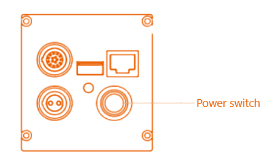

## 4. Teach pendant connection

The teach pendant software is web-end software. Users can log in to the software simply by entering the specified IP address in the browser (Google Browser is recommended). Through this human-machine interface, users can operate the robot body and controller, run and create robot programs, and read robot information.

The teach pendant supports platform-wide use, and different carriers can be selected according to the application scenarios, such as an Android pad, a Windows pad or computer, an Apple pad or computer, and a Linux computer.

The connection between the teaching pendant and the robotic arm currently only supports wired methods.

The Windows system is connected with the robotic arm by wired means through network interface.
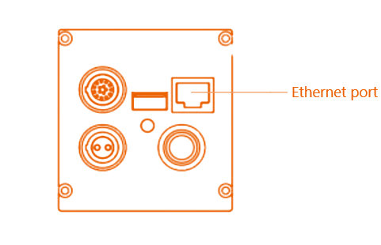

- Before wired connection with the teach pendant, it is necessary to change the IP address of the computer to the `192.168.1.xx` network segment, in which `xx` can be any IP address other than "18" in "192.168.1.18". It is recommended to configure the IP address to 192.168.1.100. The configuration method is as follows: 
  (1) Right-click the WiFi icon in the bottom right corner of the computer to open "Network & Internet":
    ::: tip
    For Windows 11 system, click "Advanced network settings" to open "Ethernet".
    :::

    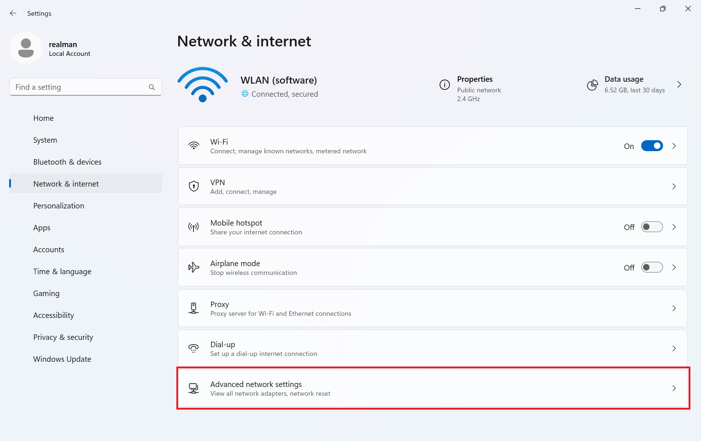
  (2) In the dropdown menu of "Ethernet," click on "Edit" after selecting "More adapter options."
    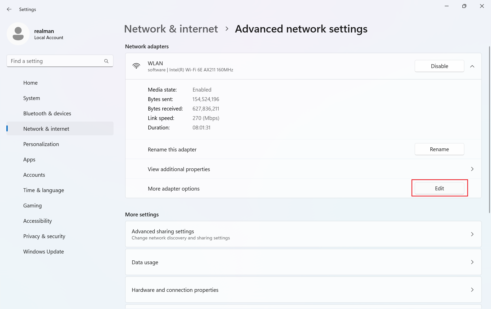
  (3) In the pop-up dialog box, select "Internet Protocol Version 4" first and then click the "Properties" button.
    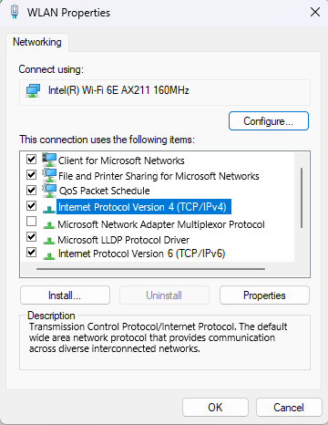
  (4) Configure the network IP address as shown in the figure below, and click "OK". Then the local network setting is completed.
    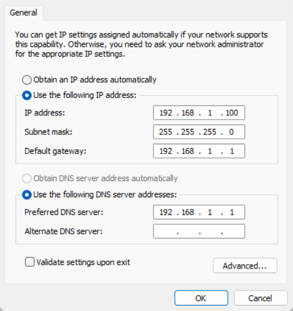

- Open the teach pendant as follows: 
  (1) Open a browser and enter the website "192.168.1.18".
  
  (2) Open the robotic arm teaching interface.
  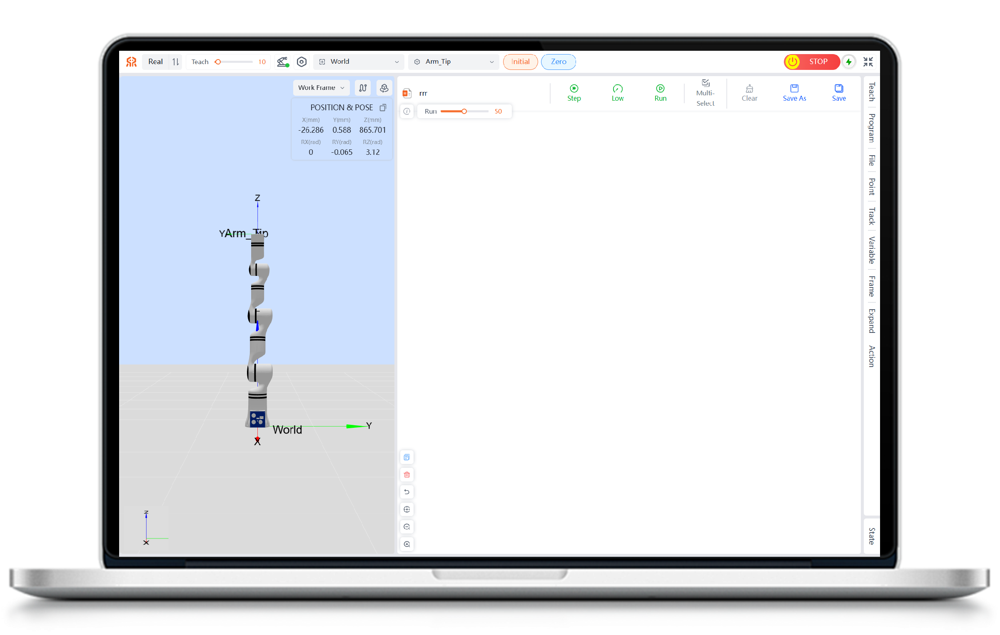

## 5. Description of teach pendant interface

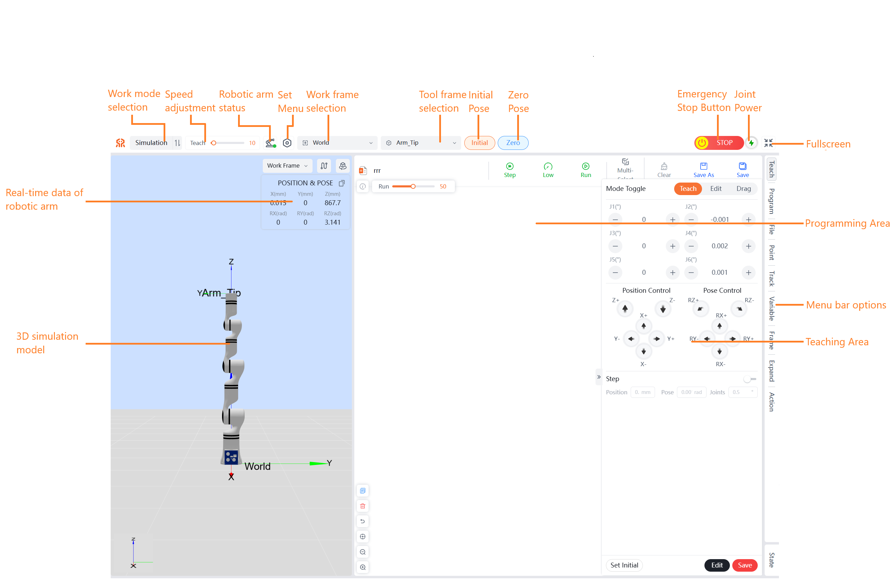

::: tip
If the page is stuck when connecting the teach pendant for the first time or after program upgrade, you can refresh the page by pressing "Ctrl+F5".
:::

## 6. Drag teaching

There are two buttons on the end flange housing of robotic arm, which are intended to control the drag teaching and trajectory reproduction respectively.

- By long pressing the green button at the end of robotic arm, the robotic arm will become draggable, and the trajectory will be recorded in real time automatically during the dragging process. Trajectory recording will be completed as long as the green button is released.
- By short pressing the blue button at the end of the robotic arm, the robotic arm will automatically return to the starting position of the trajectory and reproduce the trajectory once (the robotic arm reproduces only the finally recorded drag trajectory).
- By long pressing the blue button at the end of robotic arm, the robotic arm to start the arm moving to the initial position. Release to stop.

Here is just simple description of teaching motion control. For more details, refer to the [Guide to Use of Web Teach Pendant of Realman Robotic Arm](../teachingPendantfour/armTeching/index.md). For further secondary development, refer to the interface instructions open to users at the website.

## 7. Power-off of robot

1. Press the power switch to make it pop up and close.
2. Turn off the 24 V DC power supply to the robot.

