# 
Start guide: 
Robot Arm Teaching

The teaching pendant software panel is used for robot teaching operations, where users move the robot by clicking on icons on the panel. The panel also provides feedback to the user about the robot's movement.

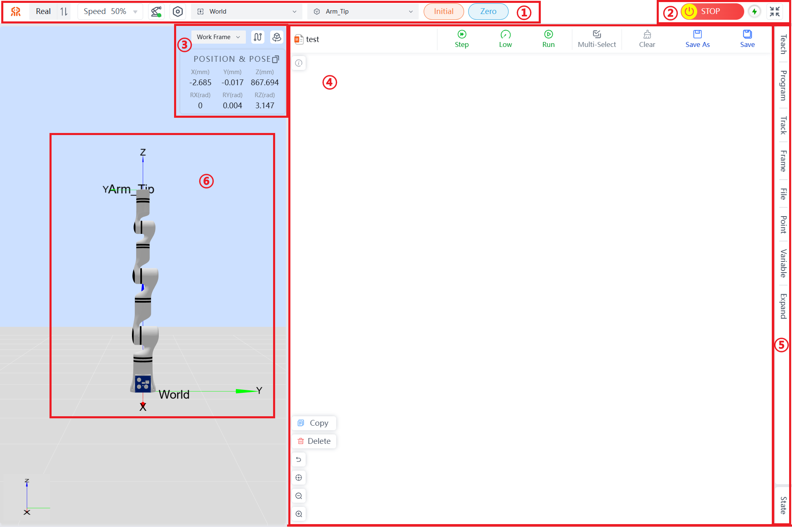

Robot Teaching Panel

**Names of Functional Areas on the Robot Teaching Panel**:

| No. | Name             |
|:------|:------------------|
| 1    | Top Navigation Bar: Includes work mode selection, speed percentage, robot arm status, configuration management, work coordinate system selection, tool coordinate system selection, initial posture, and zero position.  |
| 2    | Quick Menu: Includes emergency stop/cancel emergency stop, robot power switch, and full screen/exit full screen.  |
| 3    | Work Coordinate System Area: Includes start/end trajectory drawing, reset view, position and posture, and copy position and joint information.  |
| 4    | Graphical Programming Area: Supports graphical programming and debugging.  |
| 5    | Menu Bar Options: Includes teaching, programming, trajectory, coordinate system, file, point, variable, expansion, and status.      |
| 6    | 3D Simulation Model   |

The following sections will describe each area/button in the order listed in the table above:

## Work Mode Selection

- When `Real` is displayed, it indicates the current mode is real mode. In this mode, the program runs on the actual robot, and the robot will move according to the commands. The interface will display the robot parameters and the image of the robot arm's movement.
- When `Simulation` is displayed, it indicates the current mode is simulation mode. In this mode, the actual robot does not move; only the 3D simulation model moves. After completing a robot program, you can first choose simulation mode to verify whether the program is feasible, thereby enhancing the safety of robot applications and ensuring that the planned trajectory is achievable.

  

Work Mode Selection

## Speed Display

This section can display or set the robot's movement speed as a percentage of its maximum speed in real-time. When using position editing, you can set the data change speed when holding down the plus or minus buttons here.

 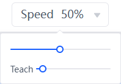 

Speed Setting Diagram

::: tip
Here, speed refers to the running speed during online programming; teaching speed refers to the speed at which the teaching pendant operates in initial posture, zero position, angle teaching, and position teaching.
:::

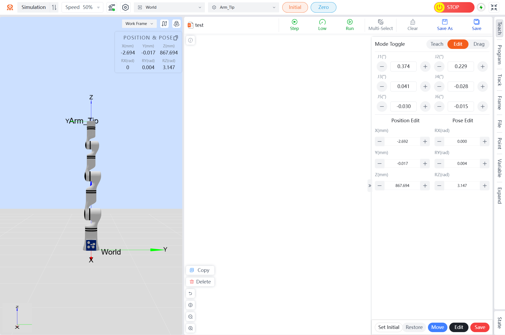

## Robot Arm Status Display

When an error occurs with the robot, it will be displayed here. Clicking the icon will open a list of error messages.

 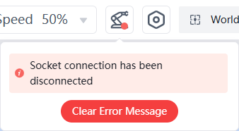 

Robot Arm Error Status Display

## Configuration Management

Clicking the configuration button will take you to the teaching pendant configuration page, where you can perform Basic Config, Security Config, About, Modbus, Force Config, and view teaching pendant information and updates. The specific operations can be referred to in [Robot Arm Configuration](../setting/index.md)。

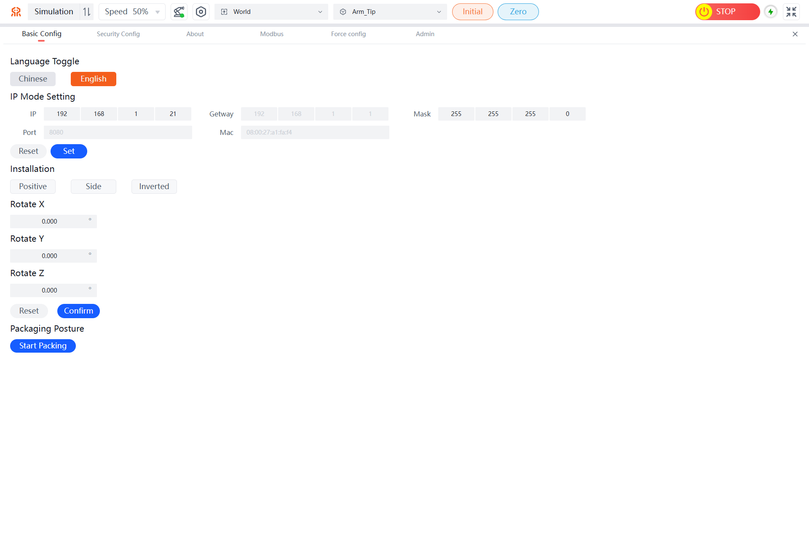

## Work Coordinate System Selection

Users can select a work coordinate system to control the robot's movement. In the teaching pendant interface, selecting the base coordinate system (Base) will control the robot to move in the direction of the coordinate system shown in the figure. Users can also create their own work coordinate system based on actual project needs as a reference direction for robot movement. For example, if work1 is a user-defined work coordinate system (see [Setting Robot Work Coordinate System](../onlineCode/index.md#352411)), you can switch to this work coordinate system after setting it up.

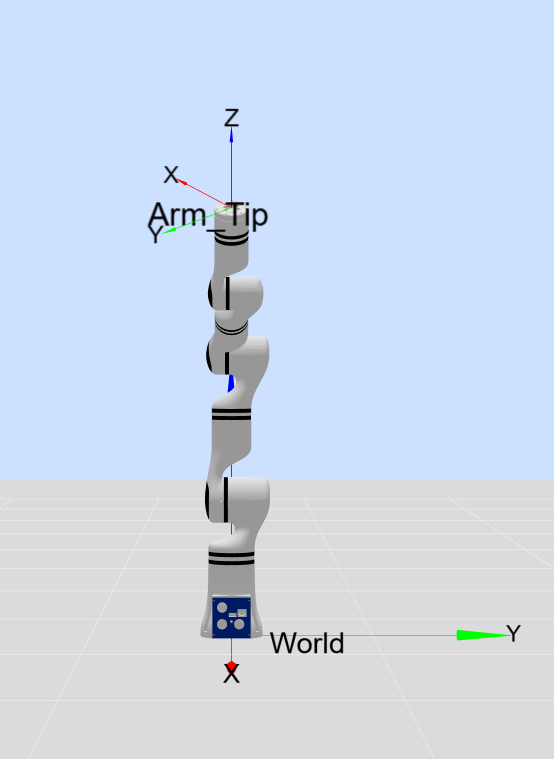

Robot Base Coordinate System Diagram

 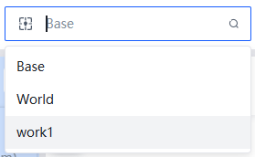 

Work Coordinate System Selection Diagram

## Tool Coordinate System Selection

The tool coordinate system can be selected from a drop-down menu. The default target position is the center of the flange. Users can define their own tool coordinate system. For example, if tool1 is a user-defined tool coordinate system (see [Setting Robot Tool Coordinate System](../onlineCode/index.md#352412)), you can switch to this tool coordinate system after setting it up.

Robot End Flange Center Coordinate System

 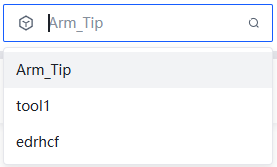 

Tool Coordinate System Selection Diagram

## Initial Posture Button

Initial Position: Holding down the `Initial` button will return the robot to its initial position. Users can set the initial position of the robot through the teaching pendant interface (see [Setting Initial Position](../onlineCode/index.md#352413)). Releasing the button stops the movement.

  

Initial Posture Button

## Zero Position Button

Zero Position: Holding down the `Zero` button will return the robot to its zero position. Releasing the button stops the movement.

  

Zero Position Button

## Robot Emergency Stop Button

After pressing the emergency stop button, the robot stops at its maximum speed. Pressing it again cancels the emergency stop, allowing the robotic arm to be operated again.

  

Robot Emergency Stop Button

## Power Button

This button is used to control the power switch of the robot. Green indicates that the robot's power is on, while gray indicates that the robot's power is off.

  

Robot Power Switch

## Full Screen Button

This button is used to control the teaching interface to enter or exit full screen.

  

Full Screen Button

## Teaching Coordinate System Selection

Selecting the work coordinate system will cause the robot to move according to the direction of the work end coordinate system. Selecting the tool coordinate system will cause the robot to move according to the direction of the tool end coordinate system.

 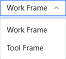 

Motion Coordinate System Selection Diagram

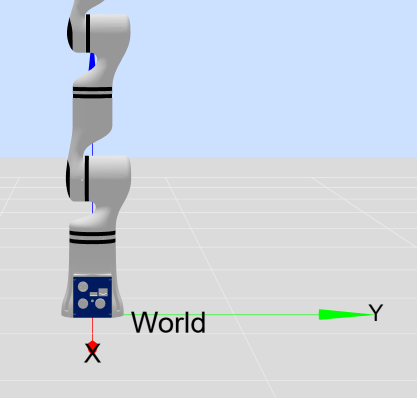

Work Coordinate System Motion Diagram

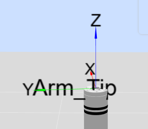

Tool End Motion Diagram

## Trajectory Drawing

By enabling the `Trajectory Drawing` function, the robot's end-effector trajectory line will be displayed in real-time in the model preview area.

  

Trajectory Drawing Button

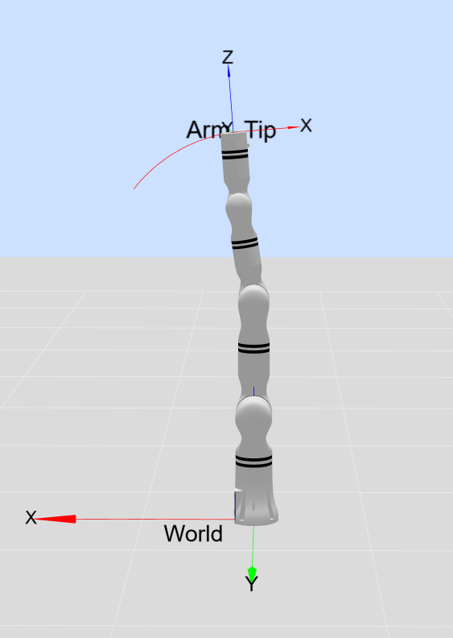

Trajectory Drawing Diagram

By disabling the `Trajectory Drawing` function, the robot's trajectory line in the model preview area will be cleared.

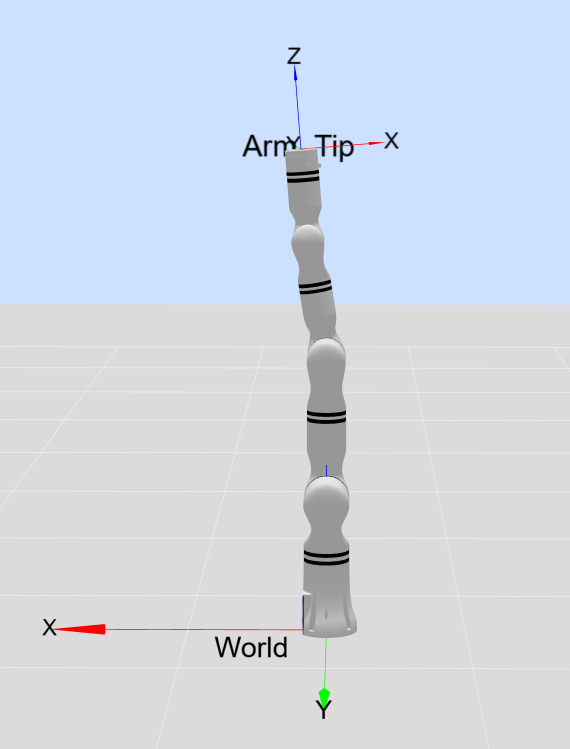

Clear Trajectory Diagram

## One-Click Reset Button

Clicking the `One-Click Reset` button will quickly restore the 3D simulation model view to its initial view.

  

One-Click Reset Button

## Robot Position and Pose Parameter Display

X, Y, Z represent the coordinates of the tool flange center point (selected tool coordinate system) in the selected coordinate system (base coordinate system, end-effector coordinate system, user-defined coordinate system). RX, RY, RZ represent the radian values of rotation relative to the selected coordinate system.  
The copy button in the upper right corner supports copying pose information or joint information, allowing you to copy the corresponding data.

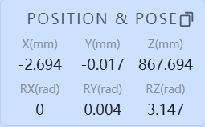

End-Effector Pose Display Diagram

## Graphical Programming Area

This area displays the current graphical programming information, supporting programming operations for Reeman series robots to achieve complex movements and various debugging methods such as Step, Low, and Run. For specific operations, please refer to [Teaching Pendant Operation Guide](../onlineCode/index.md).

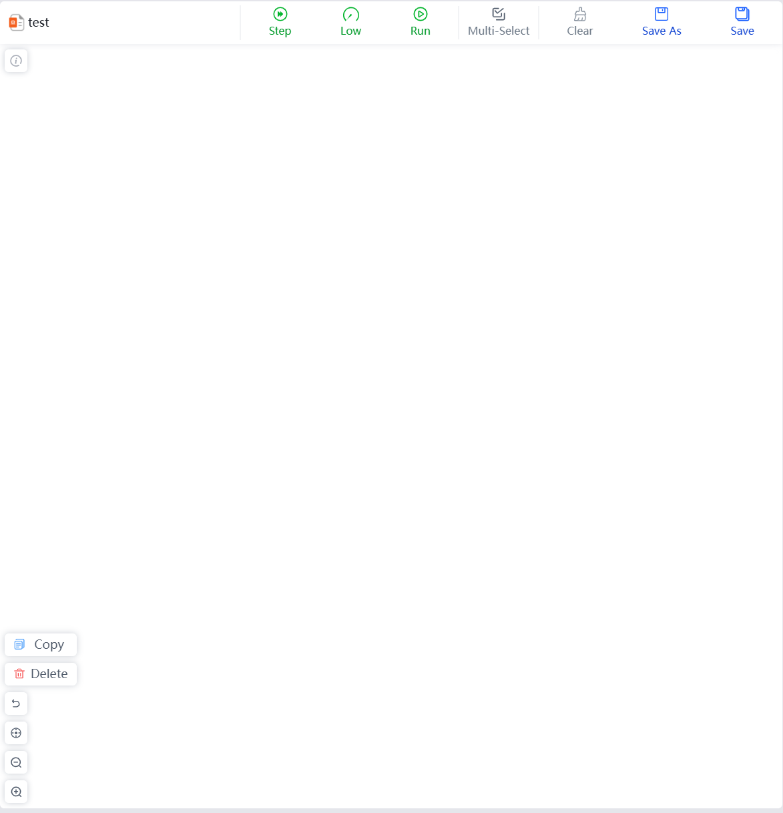

Graphical Programming Area

## Menu Bar Options

Clicking on the option names in the menu bar will switch to the corresponding panel, making it convenient for users to operate. The selected panel will have a gray background. For specific operations, please refer to [Teaching Pendant Operation Guide](../onlineCode/index.md).

 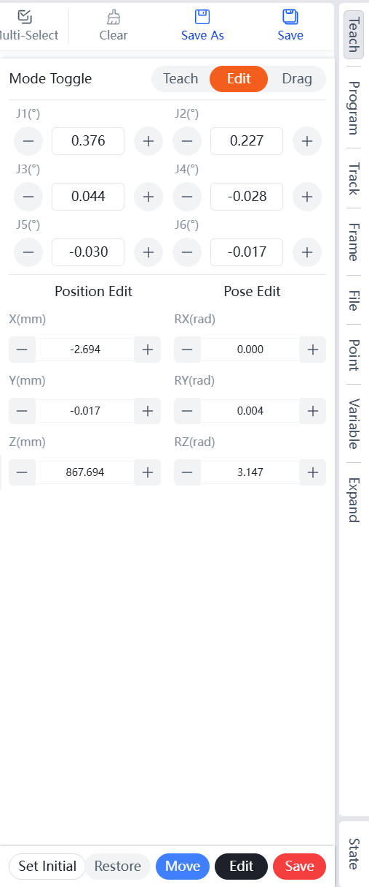 

Menu Bar Options

## 3D Simulation Model

The purpose of the robot simulation interface is to validate user-written programs without using a real robotic arm. Users can use the simulation environment to check if the control program for the robot is reasonable. Additionally, the model area has the following functions to facilitate user use:

- The simulation model can be resized and rotated by dragging with a mouse (or touching a tablet interface) as needed.
- Each joint of the red virtual robotic arm can be dragged with a mouse. If a joint is dragged beyond its limit, a pop-up message will appear at the top of the page.

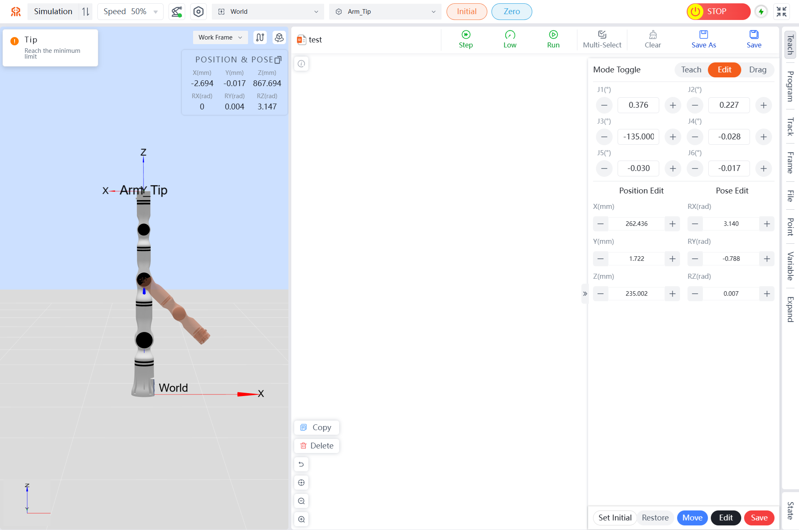

Drag Limit Exceeded Prompt

