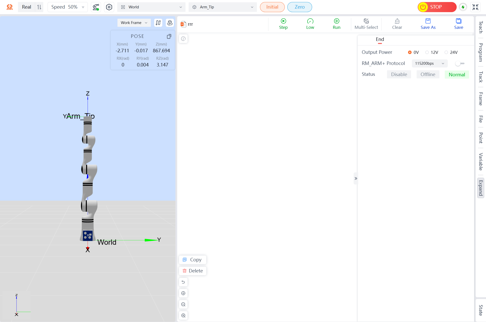
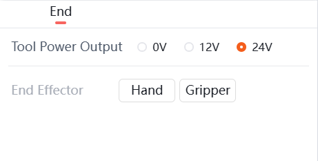
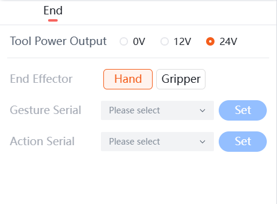
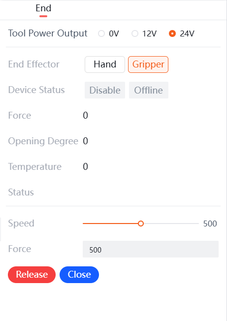
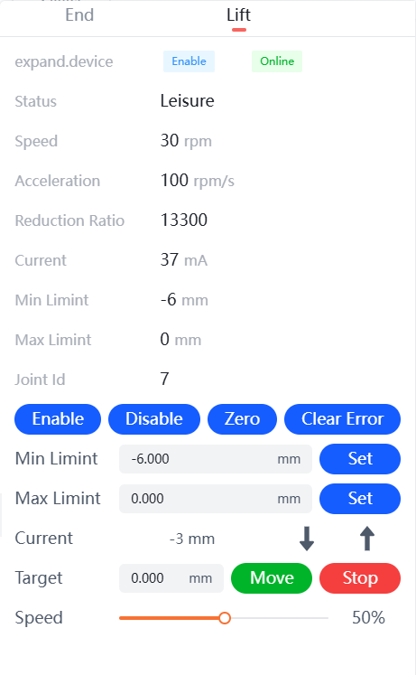
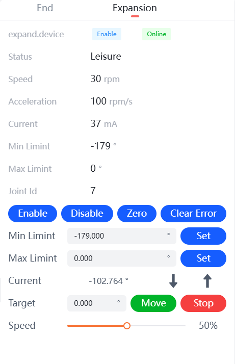

# 
Start guide: 
Robotic Arm Extension

The extension interface on the teaching pendant allows for configuration of the end effector, as shown in the figure below:

Extension Interface Schematic

## End Effector Control

The extension interface on the teaching pendant allows for management of the end effector. It supports switching the output voltage of the tool end and provides simple control of the end effector, as shown in the figure below:

End Effector Control Interface

- **Output Power**: This section allows configuration of the output power from the end-effector interface board. It can be set to 0V, 12V, or 24V.
- **End-Effector Peripheral Devices**: Currently supports peripheral devices for gripper and dexterous hand control that are added by default at the tool end.
  - **Gripper Control**: Install the gripper and check the box for the gripper. When the gripper status is enabled and online, you can view the current status parameters of the gripper and perform `Release` and `Closed` controls.
  - **Dexterous Hand Control**: After installing the dexterous hand and checking the box for the dexterous hand, you can set gestures and action sequences by configuring the `Gesture Serial` and `Action serial`. The Gesture Number and Action Sequence here refer to the gestures and actions defined within the dexterous hand.

    

    
End-effector Dexterous Hand Control Interface

    

    
End-effector Gripper Control Interface

## Lift Control and Expand Joints Control

The expand interface on the teaching pendant allows for parameter configuration of the lift control, as shown in the figure below. You can move the lift up or down from the current position, or set a target position and click the `Move` button to reach the desired height.

Lift Control

The expand interface on the teaching pendant also allows for control of the expand joints, with parameter settings as shown in the figure below:

Expand Joints Parameter Settings

After connecting the expand joints, the current expand device, status, speed, acceleration, current, maximum and minimum limits, and joint ID will be displayed. To prevent errors in the joint after connection, clear the joint errors first and then enable the joint. The expand joints can move in the positive or negative direction. You can set the target angle for movement, and the movement speed of the expand joints can be adjusted below.
