# 
Start guide: 
Robot Arm Configuration

## Basic Configuration

### Switch Language

Click the target language button to switch to the desired language, currently supporting Chinese and English.

  

Switch Language

### IP Mode Setting

On the basis of a successful connection between the robot arm and the teaching pendant, you can set the robot arm's IP in the `Configuration` > `Basic Config` > `IP Mode Setting` module.

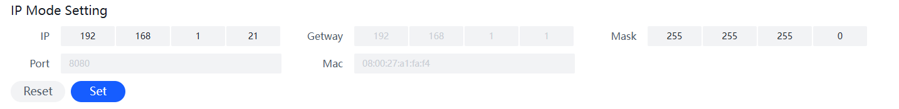

IP Mode Setting

In the teaching pendant's IP mode setting, you can directly set the robot arm's IP by entering it in the IP text box, such as "192.168.1.19". After entering the IP, click the `Set` button to directly set the robot arm's IP. This setting requires a reboot of the robot arm to take effect. To restore the IP address to "192.168.1.18", click the `Reset` button, and the robot arm's IP will be restored to "192.168.1.18". This setting also requires a reboot of the robot arm to take effect. (If you have modified the robot arm's IP, you need to enter the updated IP when logging into the teaching pendant interface.)

After clicking the set button, the configured IP will be automatically downloaded. Please save it to avoid forgetting the IP.

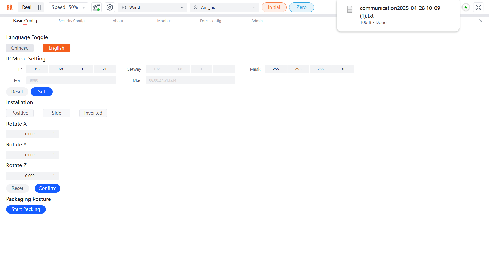

Setting Successful

### Installation Information

Robot installation information refers to the installation angle settings. In this interface's model window, you can view in real-time whether the set installation angle matches the required angle. Area 1 allows quick setting of common installation directions, including Positive, Side, and Inverted installation. Area 2 allows setting Rotate X, Rotate Y, and Rotate Z for the installation. After setting, click the `Confirm` button to save.

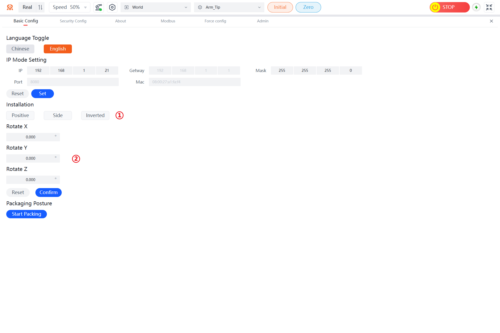

Installation Information Setting

### Packing Pose Example

After using the robot, when you need to repackage it, the controller has already saved the robot's packing pose. Long-press the `Start Packing` button in the packing pose module, and the robot will automatically move to the packing pose. When the robot stops moving, the packing pose is complete.

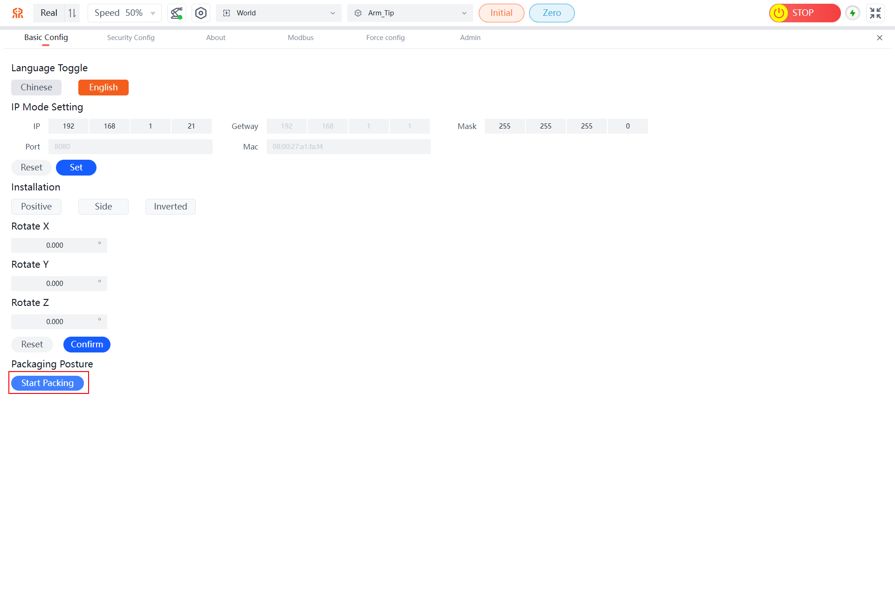

Start Packing Button

## Security Config

The Security Config interface mainly configures the robot's joints, end-effector TCP speed limits, and Collision protection level parameters. As shown in the following figure:

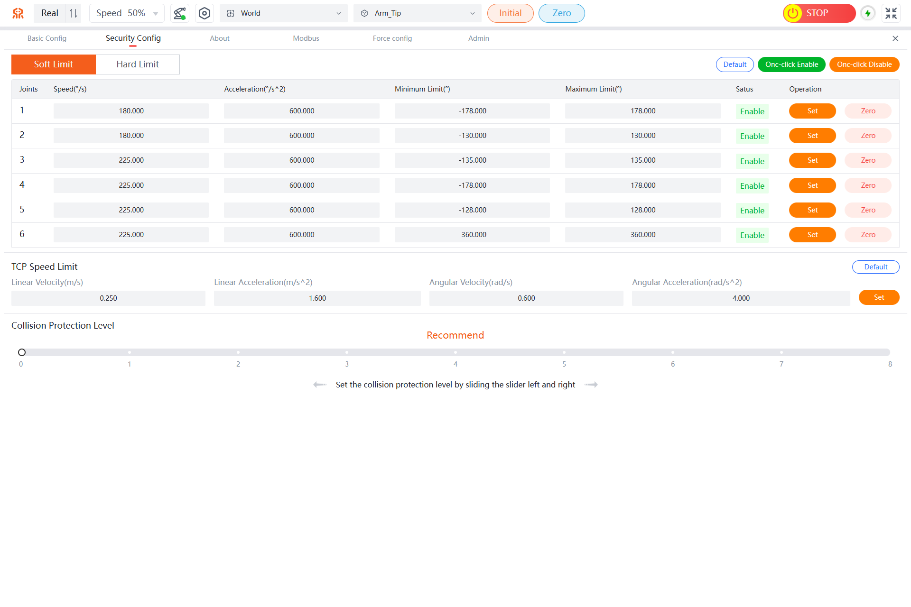

Security Config Interface Diagram

### Joint Configuration

At the top of the page, parameters for joints 1 to 6 are displayed, corresponding to the six joints from bottom to top of the robot. After establishing a connection between the teaching pendant and the robot, the maximum speed, acceleration, minimum limit, maximum limit, and status information of each joint will be automatically displayed in their respective positions.

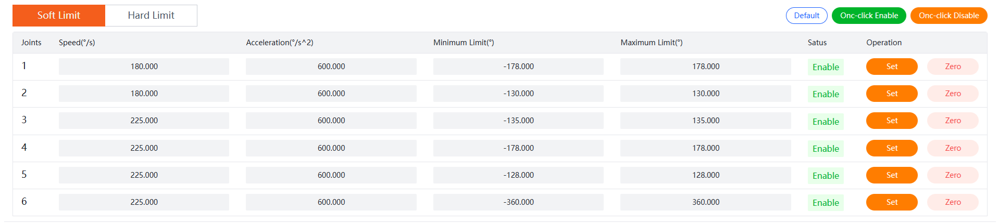

Joint Configuration Diagram

 

1. Speed: The maximum rotational speed of the joint, unit: °/s. Joints 1 and 2 have a maximum of 180°/s, while other joints have a maximum of 225°/s.
2. Acceleration: The maximum acceleration of the joint, unit: °/s^2, with a maximum value of 600°/s^2. The default factory value is 600°/s^2, which is the best data for all aspects and is not recommended for user modification.
3. Minimum Limit: The minimum position that the joint can reach, unit: degrees.
4. Maximum Limit: The maximum position that the joint can reach, unit: degrees.
5. Status: The current enabled status of the joint.
6. Operation: Supports setting and zeroing operations for joints.
7. The `One-click Enable` button and `One-click Disable` button send enable and disable commands to all joints, respectively.

#### Set Joints

::: warning
All parameters of Realman robot arms are configured to their optimal state before leaving the factory, and it is generally not recommended for users to modify the underlying parameters of the joints. If users indeed need to modify them, they should first ensure that the robot arm is in a non-enabled state, then send the parameter modification command. After successfully setting the parameters, send an enable command to the joints. It is important to note that when enabling the joints, users must ensure that the joints are in a stationary state to prevent positioning errors during the enable process. After normal joint enablement, users can control joint movement. When modifying, the ratio of the maximum acceleration to the maximum speed of the joint should be ≥1.5 times; otherwise, abnormal movement may occur.
:::

1. Refer to [Disable](../systemInformation/index.md#352417) to complete joint 1 disable.
2. Modify joint 1's maximum speed, acceleration, minimum limit, and maximum limit parameters as needed.

  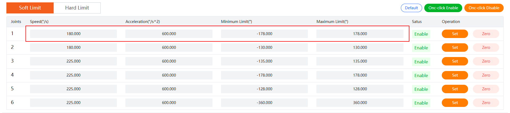

  
Joint 1 Parameter Modification

3. Click the `Set` button in joint 1's operation column to complete parameter settings for joint 1.
4. Refer to [Enable](../systemInformation/index.md#352418) to complete joint 1 enable.

#### Zero

**Introduction**:

When a joint is in a disabled state, clicking the `Zero` button sets the current position of the specified joint as zero position. After setting, the joint remains in a disabled state. Clicking the `Enable` button re-enables the joint so that it can be controlled. 

Each joint of the robot has a mechanical origin position (as shown in the figure below). The zero position pose is the pose where all joints are at the robot's origin position. When the robot is in its zero position pose and the mechanical origin position markers are misaligned, you need to manually set the robot back to its mechanical origin position. The state of the robot when it is in its zero position pose is shown in the following figure:

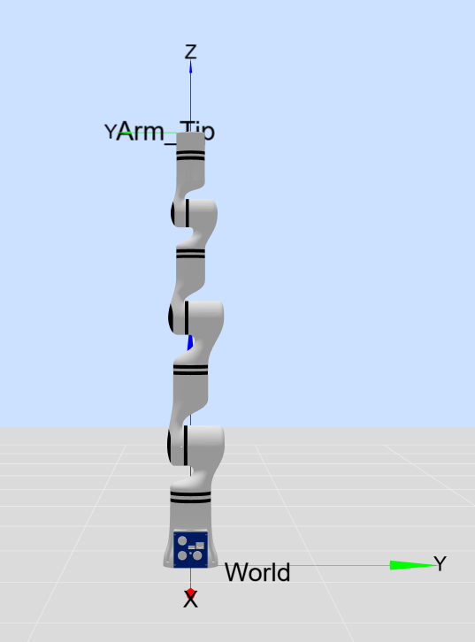

Robot Zero Position Pose

When replacing a robot joint, you must re-set the zero position for the corresponding joint.

::: warning
Not all robots support this feature. Please confirm with Realman Intelligent Technology (Beijing) Co., Ltd. before setting it up.
:::

**Operation Steps**：

This article uses setting the zero position of Joint 1 as an example (setting the zero position for other joints can also refer to this).

1. Refer to [Disable](../systemInformation/index.md#352417) to complete the drop enable for Joint 1.
2. Rotate Joint 1 to the mechanical origin position (where the grooves on both sides of the joint gap are perfectly aligned, which is the mechanical origin position).

  

  
Robot Joint Zero Position Mark

3. Click the `Zero` button in the operation column of Joint 1, and click `Confirm` in the pop-up dialog box to complete the zero position setting for Joint 1.
4. Refer to [Enable](../systemInformation/index.md#352418) to complete the enable for Joint 1.

### TCP Speed Limit

This section mainly sets the Linear Velocity, Linear Acceleration, Angular Velocity, and Angular Acceleration of the robot's end-effector. After the teaching pendant establishes a network connection with the robot controller, this section will automatically update the current TCP parameters of the robot. Users can manually modify the parameters and send them.

Click the `Default` button to restore the robot's TCP parameters to their default values. End-effector Linear Velocity: 0.250m/s, Linear Acceleration: 1.600m/s², Angular Velocity: 0.600rad/s, Angular Acceleration: 4.000rad/s².

::: warning
It is recommended to use the default TCP speed. If changes are needed, the ratio of the maximum acceleration to the maximum speed of the robot's end-effector should be ≥3; otherwise, abnormal movements may occur.
:::

### Collision Protection Level

This section mainly sets the collision level of the robot, with levels ranging from 0 to 8, representing the sensitivity levels of collision detection. The higher the level, the more sensitive the robot is to collisions. The default collision level when the robot is powered on is 0, meaning no collision detection is performed.

Collision Protection Level Setting

::: warning
When setting the collision protection level, users should choose reasonably. The higher the level, the higher the probability of false collision detection. If there are no special requirements, it is recommended to set the collision level around 4. Additionally, if the tool and load at the robot's end-effector change, the tool's mass and center of mass parameters should be set during **Tool Coordinate System Calibration** ([Tool Coordinate System Calibration](../onlineCode/index.md#352412)) to match the correct dynamic model.
:::

## About

The About page displays the following information for the teaching pendant and supports operations such as Update, Configs Download, and Logs Download.

- Robot Type, Version Info, and Build Time;
- Communication, Program, Ctrl, and Modbus versions and build times;
- Software versions of each joints.
- End-effector interface board version.
- Official Website: [https://www.realman-robotics.cn/](https://www.realman-robotics.cn/).

### Update

The system program of the robot controller can be upgraded by clicking the `Configuration` button on the teaching pendant and selecting the `About` tab on the configuration page (before upgrading, please confirm whether the corresponding version can be upgraded, otherwise serious problems may occur). 
The specific operation steps are as follows:

1. Download the file with a **.realman** extension provided by the manufacturer to your local machine.
2. Click the `Update` button, find and select the file saved in step 1 in the pop-up window. After a successful selection, file parsing will begin.

  

  
File Parsing

3. After file parsing is complete, a list of selected update files will pop up. Choose the files you need to update (all files are selected by default), click the `Update` button, and begin the update.

  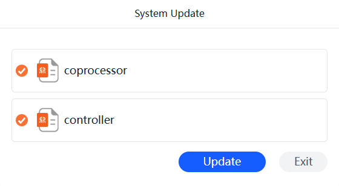

  
Start Update

4. Wait for the update to complete (the update time may take 4-5 minutes for large files; please be patient).

  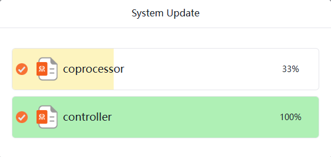

  
Update Progress

5. When all progress is successfully updated, the interface will display that the update is complete.

  

  
Update Successful

6. Click `Please restart immediately`, and in the pop-up dialog box, click `OK` to restart the robot.

  

  
Confirm Restart

7. After restarting, the robot can operate normally.

  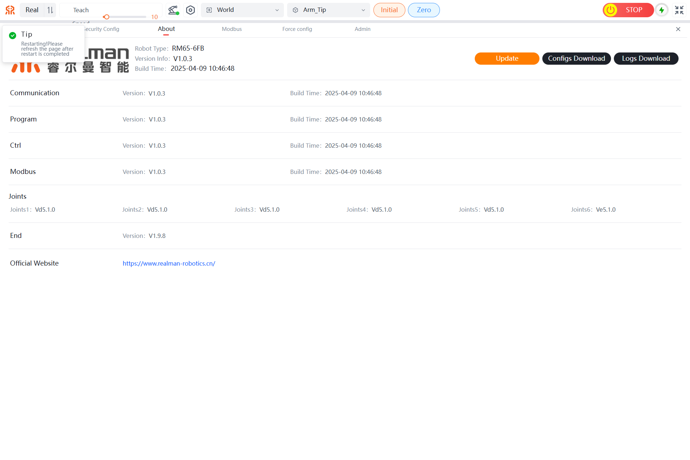

  
Robot Restart Prompt

::: warning
Precautions for updating controller programs: After updating the robot program, restart the robot and open the WEB teaching pendant. After entering the home page of the teaching pendant, press Ctrl+F5 to force a browser refresh and clear the cache. At this point, both the updated robot and WEB teaching pendant can be used normally.
:::

### Configs Download

When you need to download a configuration file, please follow these steps. The configuration file mainly includes parameter configuration information for the current robot.

1. Click the `Configuration` button to enter the configuration page.
2. Select the `About` tab, click `Configs Download`, and the system will automatically start packaging and download the teaching pendant configuration file.。

  
  
Packaging Configs

  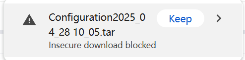
  
Download Configs

### Logs Download

When you need to download logs, please follow the steps below. The logs mainly include all operation commands of the teaching pendant and various error codes, along with timestamps.

1. Click the `Configuration` button to enter the configuration page.
2. Select the `About` tab, click `Logs Download`, and the system will automatically start packaging and download the teaching pendant log.

  
  
Packaging Log

  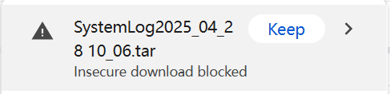
  
Download Log

## Modbus

The robotic arm can directly call the programming files saved by the WEB teaching pendant via the MODBUS-TCP protocol, or directly control or query the status of the robotic arm. The specific operation methods are as follows. 

The Modbus function is divided into Controller(485), End(485), and ModbusTCP. Users can complete a series of Modbus settings by selecting the corresponding tabs.

### Controller(485)

The robotic arm can query the status of the robotic arm through the Controller(485).
 

- **Type:** Supports selecting JSON Mode, Modbus-RTU(Controller Master), and Modbus-RTU(Controller Slave) types.
- **Baud Rate:** Supports selecting seven baud rates: 9600, 19200, 38400, 57600, 115200, 230400, and 460800.
- **Query:** You can set query parameters as needed, including Mode, Address, Device, Length, and Polling.
  - **Mode:** You can query data from different modes of the robotic arm, including Coil Output, Holding Register, Input Register, and Discrete Input. The Coil Output and Holding Register modes support writing parameter values.
  - **Address:** Set the starting address of the query register to display only the register data after the starting address. The default is 0.
  - **Device:** Set the address of the peripheral device to be queried. The default is 1.
  - **Length:** Set the address length of the query register to display only the corresponding length of register data after the starting address. The default is 100, with a range of 1-100.
  - **Polling:** Set the polling time for querying registers. The default is 0, with a range of 1-10, and can be set to three decimal places.
- **Base Select:** In the query results of the registers, you can switch the display format of the data as needed. Currently, it supports Decimal (Unsigned), Decimal (Signed), and Hexadecimal formats.

### Getting Controller(485) Parameter Values

In the `Controller(485)` tab, select the Type and Baud Rate in sequence, then click `Set`. Next, select the Mode and set the Address, Device, Length, and Polling. Click `Query` to query the current data of the robotic arm. For specific address parameter value descriptions, please refer to the [Modbus Slave Address Table of the RM Robotic Arm](../../modbus/index.md).

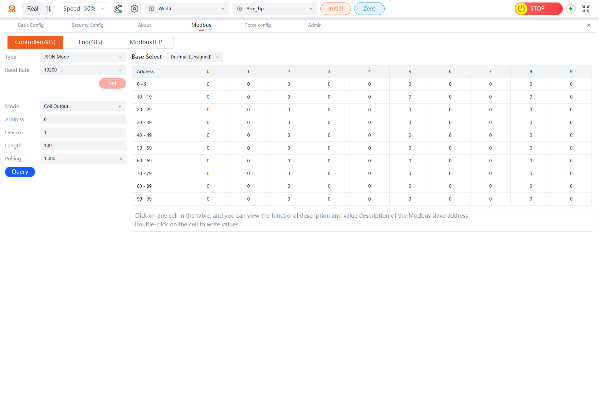

**Note:** Click any cell in the table to view the function description and value description of the Modbus slave address; in the Coil Output and Holding Register models of the Modbus master type, you can double-click a cell to write a value.

### End(485)

The robotic arm can query the status of the robotic arm through the End(485). 

- **Type:** Supports selecting Modbus-RTU(End Master), Hand Mode, and Gripper Mode.
- **Baud Rate:** Supports selecting three baud rates: 9600, 115200, and 460800.
- **Query:** You can set query parameters as needed, including mode, address, device, length, and polling.
  - **Mode:** You can query data from different modes of the robotic arm, including coil output, holding register, input register, and discrete input. The coil output and holding register modes support writing parameter values.
  - **Address:** Set the starting address of the query register to display only the register data after the starting address. The default is 0.
  - **Device:** Set the address of the peripheral device to be queried. The default is 1.
  - **Length:** Set the address length of the query register to display only the corresponding length of register data after the starting address. The default is 100, with a range of 1-100.
  - **Polling:** Set the polling time for querying registers. The default is 0, with a range of 1-10, and can be set to three decimal places.
- **Base Select:** In the query results of the registers, you can switch the display format of the data as needed. Currently, it supports decimal (unsigned), decimal (signed), and hexadecimal formats.

### Getting End(485) Parameter Values

In the `End(485)` tab, select the type and baud rate in sequence, then click `Set`. Next, select the mode and set the address, device, length, and polling. Click `Query` to query the current data of the robotic arm. For specific address parameter value descriptions, please refer to the [Modbus Slave Address Table of the RM Robotic Arm](../../modbus/index.md).

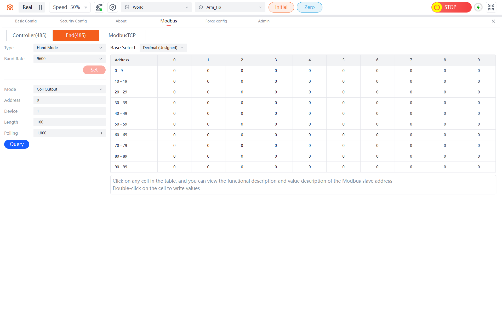

**Note:** Click any cell in the table to view the function description and value description of the Modbus slave address; in the coil output and holding register models of the Modbus master type, you can double-click a cell to write a value.

### ModbusTCP

The robotic arm can directly control or query its status via the Modbus-TCP protocol.
 

- **Type:** Supports selecting Modbus-TCP(Master) and Modbus-TCP(Slave) types.
- **Query/Write:** You can set query parameters as needed, including mode, connect (supported only by Modbus-TCP master type), address, device, length, and polling.
  - **Mode:** You can query data from different modes of the robotic arm, including coil output, holding register, input register, and discrete input. The coil output and holding register modes support writing parameter values.
  - **Connect:** Select an added Modbus-TCP master station.
  - **Address:** Set the starting address of the query register to display only the register data after the starting address. The default is 0.
  - **Device:** Set the address of the peripheral device to be queried. The default is 1.
  - **Length:** Set the address length of the query register to display only the corresponding length of register data after the starting address. The default is 100, with a range of 1-100.
  - **Polling:** Set the polling time for querying registers. The default is 0, with a range of 1-10, and can be set to three decimal places.
- **Base Select:** In the query results of the registers, you can switch the display format of the data as needed. Currently, it supports decimal (unsigned), decimal (signed), and hexadecimal formats.
- **Modbus-TCP Master Station List:** Displayed only for Modbus-TCP master type. You can add multiple master station information via the `Add` button and perform ping tests, editing, and deletion operations.
  - **Ping:** Test the connection status of the master station.
  - **Edit:** Modify the name, IP, and port information of the master station.
  - **Delete:** Delete master station information.

### Robotic Arm Master Station Management

Modbus master stations support operations such as adding new stations, testing connectivity (ping), editing, and deleting.

#### Add

1. In the `ModbusTCP` tab, click the `Add` button to open a dialog box for adding a new Modbus TCP master.
  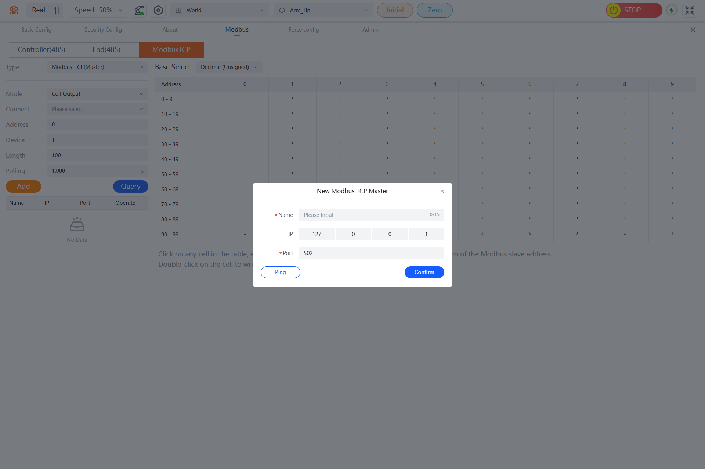
2. After filling in the master name, IP, and port information, click `Confirm` to add a new ModbusTCP master. 
  Once the master information is filled in, you can click the `Ping` button to check the connectivity of the master address.
  
3. After the ModbusTCP master is added, it can be viewed in the left list.
  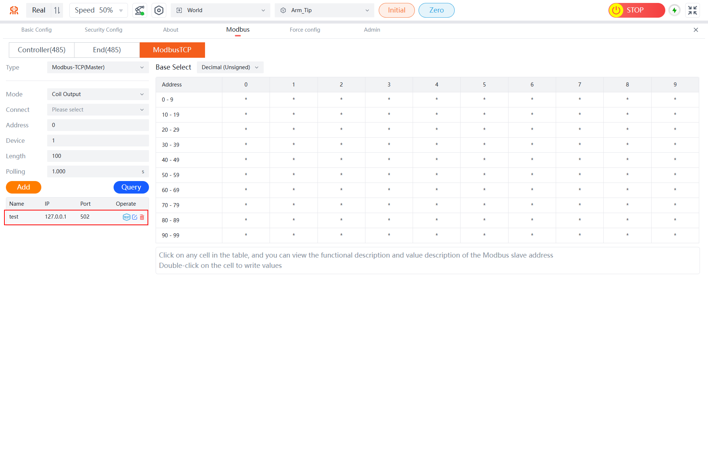

#### Ping

In the ModbusTCP master list on the `ModbusTCP` tab, click the `Ping` button in the operation column of the target master. If a prompt appears, it indicates that the connectivity test was successful; otherwise, it indicates a failure.

#### Edit

1. In the ModbusTCP master list on the `ModbusTCP` tab, click the `Edit` button in the operation column of the target master to open the edit ModbusTCP master dialog box.
  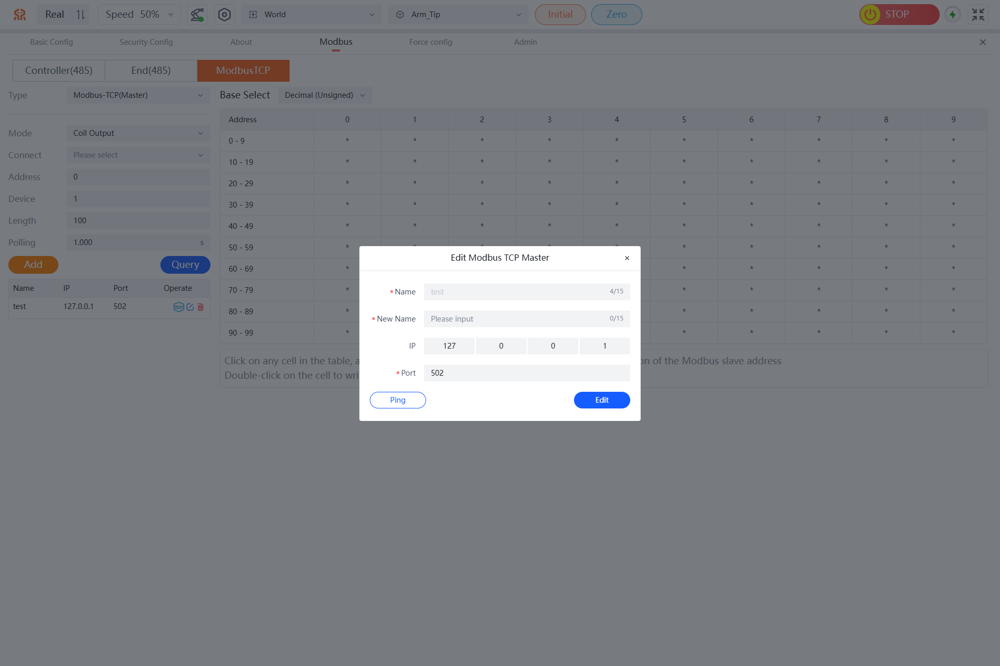
2. Fill in the new name for the ModbusTCP master and modify the IP and port information as needed, then click `Edit` to complete the editing of the ModbusTCP master. 
  After modifying the master information, you can click the `Ping` button to confirm the connectivity of the master address.

#### Delete

In the ModbusTCP master list on the `ModbusTCP` tab, click the `Delete` button in the operation column of the target master, and in the pop-up dialog box, click `Confirm` to complete the deletion of the ModbusTCP master.

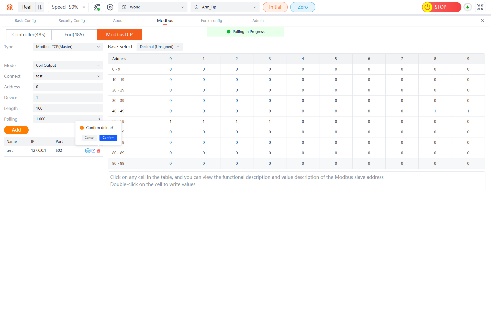

### Retrieve ModbusTCP Parameter Values

On the `ModbusTCP` tab, sequentially select the Modbus type, mode, and connect (only supported for Modbus-TCP master type), and set the address, device, length, and polling. Then click `Query` to retrieve the current data of the robotic arm. For specific address parameter values, refer to the [Modbus Slave Address Table of the RM Robotic Arm](../../modbus/index.md).

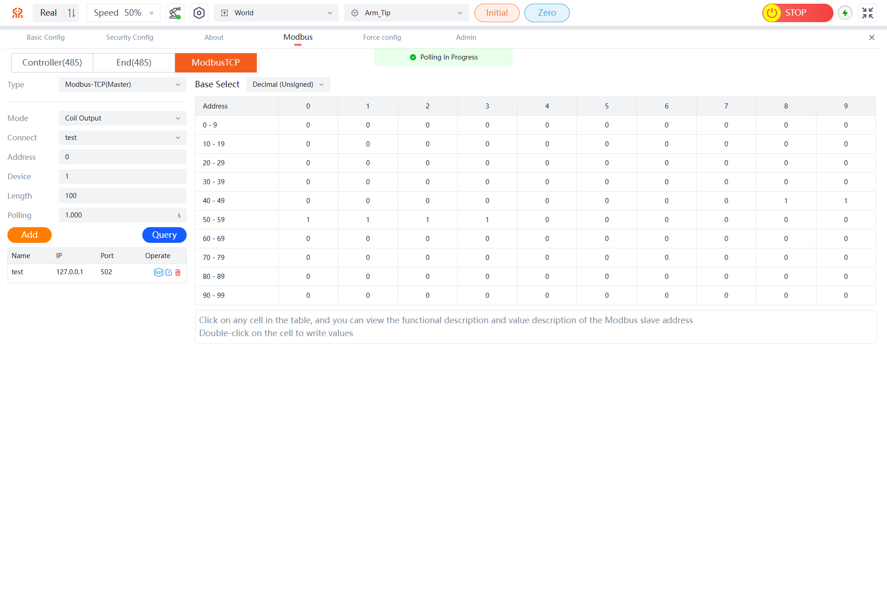

**Note**: Click any cell in the table to view the function and value description of the Modbus slave address; in the coil output and holding register models of the Modbus master station type, you can double-click a cell to write a value.

### Modify ModbusTCP Parameter Values

- When the user selects the `Modbus-TCP(Master)` type and chooses the `Coil Output` mode, they can modify the parameter to 0 or 1 by double-clicking the corresponding address cell.
  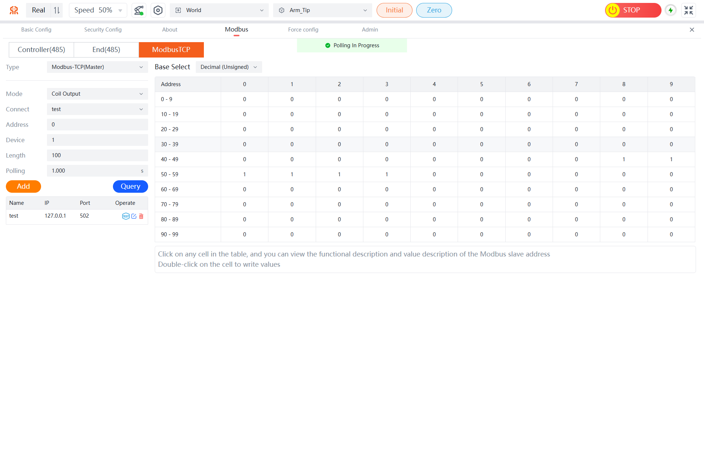
- When the user selects the `Modbus-TCP(Master)` type and chooses the `Holding Register` mode, they can modify the parameter value of the corresponding cell by double-clicking it and entering a value in the data write dialog box that pops up. The length can be modified as needed to modify multiple address parameter values at once.
  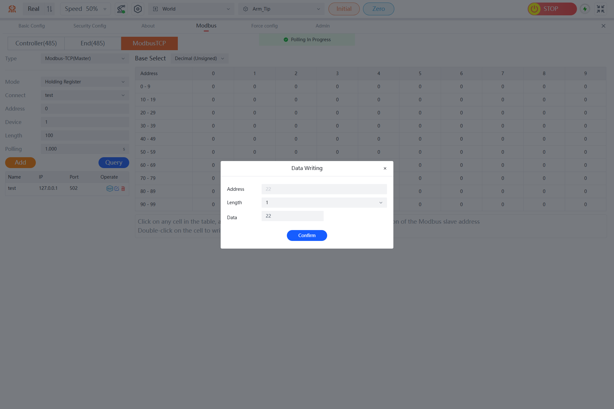
- For specific address parameter values, refer to the [Modbus Slave Address Table of the RM Robotic Arm](../../modbus/index.md).

## Force Config

The parameters of the 6-DoF Config are described in the following table:

<table>
  <tr>
    <th colspan="7">6-DoF Config</th>
  </tr>
  <tr>
    <td>Rated Load</td>
    <td>X: 200N</td>
    <td>Y: 200N</td>
    <td>Z: 200N</td>
    <td>MX: 7Nm</td>
    <td>MY: 7Nm</td>
    <td>MZ: 7Nm</td>
  </tr>
</table>

::: warning
The 6-DoF Config has a range of 200N/7Nm. If a force of more than 600N or a torque of more than 21Nm is applied to the end effector, it will cause irreversible damage to the sensor. During operation of the robotic arm, avoid hard collisions between the sensor and external devices to prevent damage.
:::

The force config interface includes 6-DoF center of gravity calculation and sensor calibration.

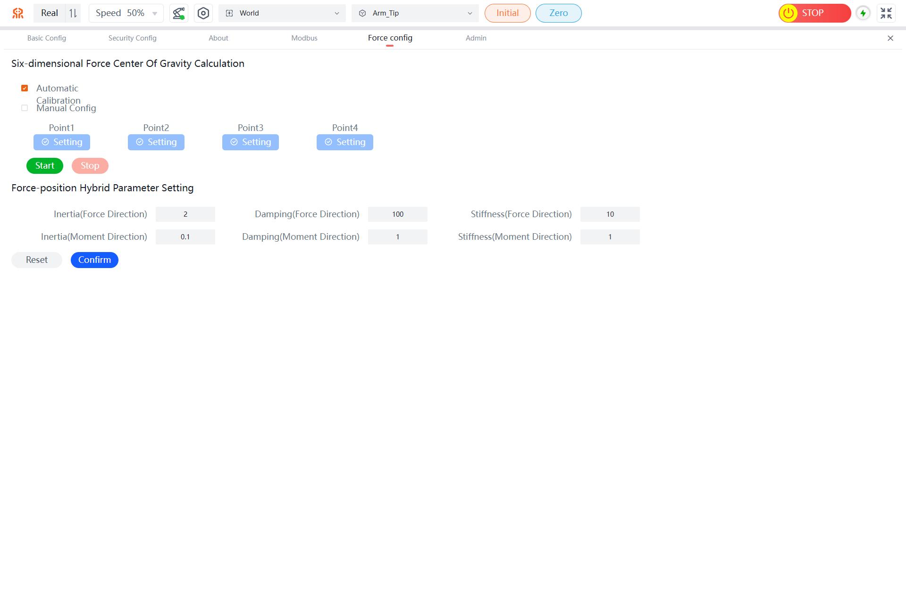

Force Config

### 6-DoF Center of Gravity Calculation

The 6-DoF center of gravity calculation is required only when the end effector tool is changed. The calibration process can be performed automatically using pre-stored trajectory paths in the controller. To avoid interference with external devices during operation of the pre-stored trajectory, users can also perform manual calibration based on actual scenarios.

**Automatic Calibration**:

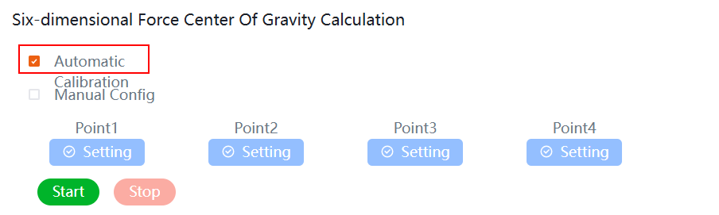

6-DoF Automatic Calibration

During automatic calibration, click the `Start` button to display a calibration status prompt as shown in the following figure.

Status Confirmation Prompt

The robot will automatically run through four predefined poses to calculate the center of gravity. If there is a risk of collision during movement, click the `Stop` button to terminate operation. 

After successful 6-DoF center of gravity calibration, a "tip.calibrationsuccessful" prompt will appear, indicating that the center of gravity calibration is complete.

6-DoF Center of Gravity Calibration

**Manual Config**：

During manual Config, check the `Manual Config` checkbox and use the robotic arm teaching interface to set four points with significantly different poses. After recording all four points, click the `Confirm` button.

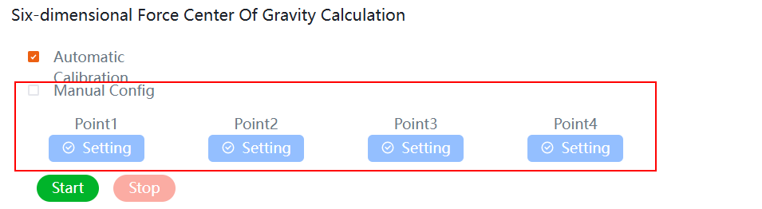

6-DoF Manual Calibration

The robot automatically performs the 6-DoF center of gravity calculation. Once the "tip.calibrationsuccessful" prompt appears, the center of gravity calibration is complete.

6-DoF Center of Gravity Calibration Complete

### Force-Position Hybrid Parameter Setting

The force and position hybrid parameter settings support configuring the inertia, damping, and stiffness in the force direction, as well as the inertia, damping, and stiffness in the Moment direction. After modifying the parameters, click `Confirm` to complete the settings. If you need to restore the initial settings, click `Settints.reset`.

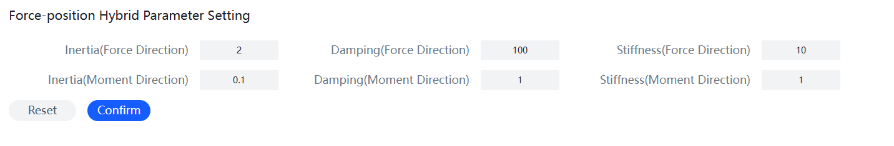

Force-Position Hybrid Parameter Settings

