# 
Start guide: 
Robot Arm State

The robot arm state includes the controller status, joint status, as well as IO and Force Sensor.

1. **Controller Status**: Includes the Current, Voltage, and Temperature of the controller.
2. **Joints Status**: Includes the Current, Voltage, Temperature, Brake, and Status of the 6 joints, as well as Disable, Enable, Clear Error, Disable All, Enable All, and Clear All operations. After a joint error is resolved, the error code must be cleared by clicking the clear error button before the joint can be enabled to control its movement.
3. **IO**: Includes Controller Power Output, Controller IO Config, and Tool IO Config.
4. **Force Sensor**: Supports viewing four types of data charts: External Force Data, Raw Data, External Force Data Of Work Coordinate, and External Force Data Of Tool Coordinate. By default, the External Force Data chart is displayed, and it supports pausing the data for viewing.

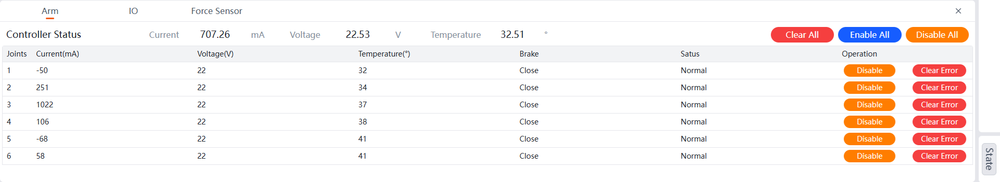

Robot Arm Status Diagram

## Robot Arm

You can view the real-time Current, Voltage, and Temperature of the controller and joints, as well as the Brake and Status of the joints. It also supports Disable, Enable, and Clear Error for the joints.

### 
Disable

#### Single Joint Disable

This section uses Joint 1 as an example (other joints can be disabled similarly).

1. Select `State` from the right menu bar.
  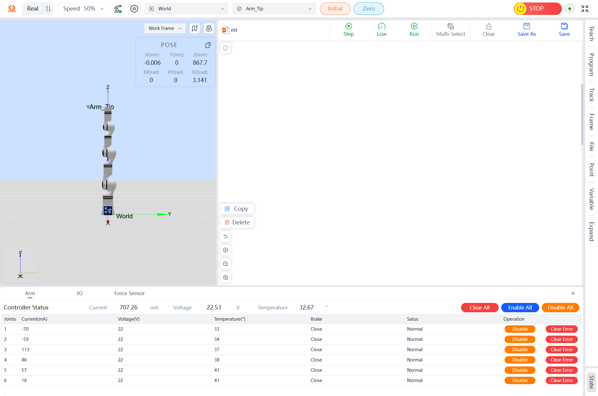
2. Click the `Disable` button in the operation column corresponding to the target joint to complete the single joint disable operation.
  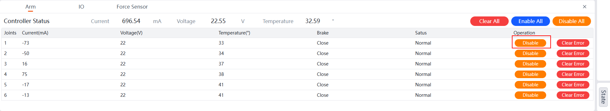

#### Disable All

When you need to disable all joints, follow the steps below.

**Method One**:

1. Click the `Configuration` button to enter the configuration page.
2. Select the `Security Config` tab and click the `One-Click Disable` button in the top-right corner to complete the disable operation for all joints.
  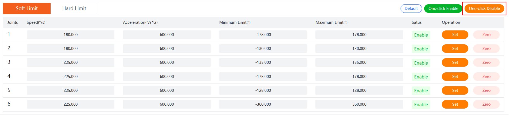

**Method Two**:

1. Select `State` from the right menu bar.
  
2. Click the `Enable All` button in the top-right corner to complete the enable operation for all joints.
  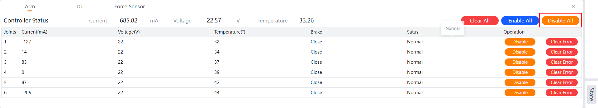

### 
Enable

#### Single Joint Enable

This section uses Joint 1 as an example (other joints can be enabled similarly).

1. Select `State` from the right menu bar.
  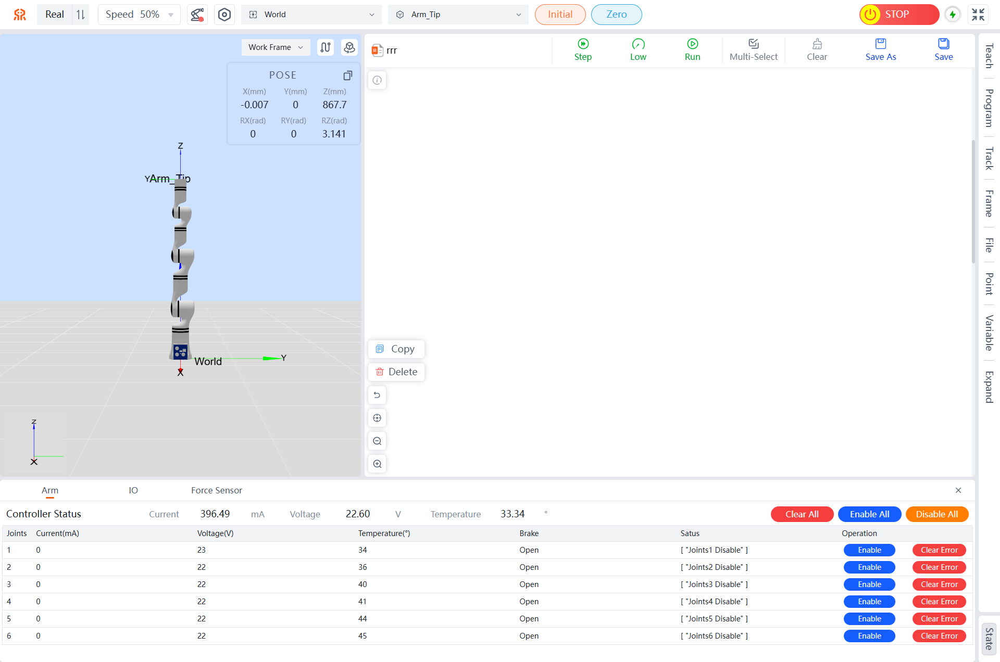
2. Click the `Enable` button in the operation column corresponding to the target joint to complete the single joint enable operation.
  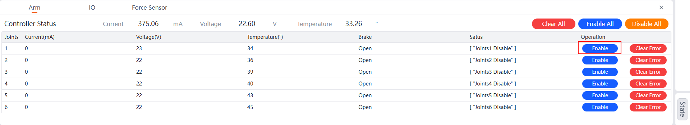

#### Enable All

When you need to enable all joints, follow the steps below.

**Method One**:

1. Click the `Configuration` button to enter the configuration page.
2. Select the `Security Config` tab and click the `One-Click Enable` button in the top-right corner to complete the enable operation for all joints.
  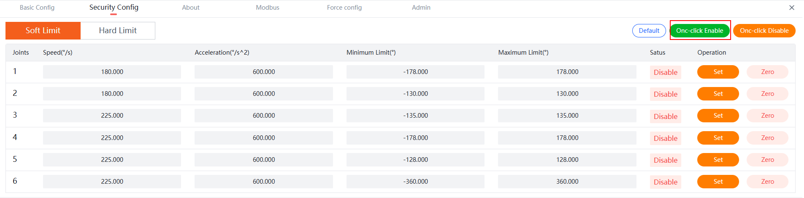

**Method Two**:

1. Select `State` from the right menu bar.
  
2. Click the `Enable All` button in the top-right corner to complete the enable operation for all joints.
  

### Clear Error

#### Single Joint Clear Error

This section uses Joint 1 as an example (other joints can have errors cleared similarly).

1. Select `State` from the right menu bar.
  
2. Click the `Clear Error` button in the operation column corresponding to the target joint to complete the single joint error clearance.
  

#### Clear All

When you need to clear errors for all joints, follow the steps below.

1. Select `State` from the right menu bar.
  
1. Click the `Clear All` button in the top-right corner to complete the error clearance for all joints.
  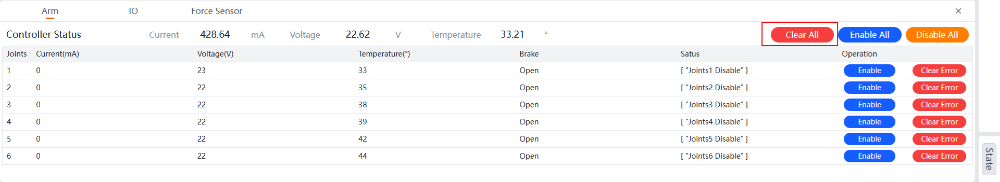

## IO

Controller Power Output, which supports setting the controller power output. Controller IO Config, which supports setting digital output/input. Tool IO Config, which supports setting digital input/output.

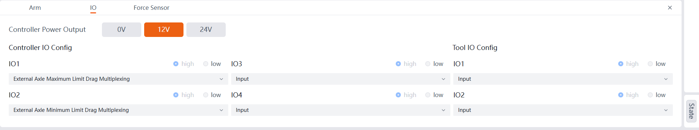

### Controller Power Output

Supports 0V, 12V, and 24V options. Corresponding to three voltage outputs for use.

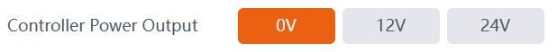

### Controller IO Config

Includes 4 IO modules. When clicking the dropdown menu, you can select input, Output, Input Starts Function Multiplexing, Input Pause Function Multiplexing, Input Continue Function Multiplexing, Input Emergency Stop Function Multiplexing, Current Loop Drag Multiplexing, Force Only Moving Position Drag (Configurable for 6-DoF), Force Only Moving Posture Drag (Configurable for 6-DoF), Force Moving Posture/Position Drag multiplexing (Configurable for 6-DoF), External Axle Maximum Limit Drag Multiplexing (configurable for External Axle mode of extended joints), External Axle Minimum Limit Drag Multiplexing (configurable for External Axle mode of extended joints), Input Initial Pose Multiplexing, and Output Collision Multiplexing, among other functions. 

Note: When selecting output mode, you can choose to output high or low levels.

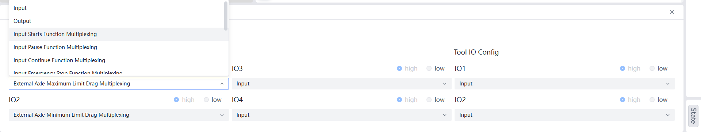

### Tool IO Config

Includes digital output/input, supporting two IO modules. After clicking the dropdown menu, you can select Output and Input options. 

Note: When selecting output mode, you can choose to output high or low levels.

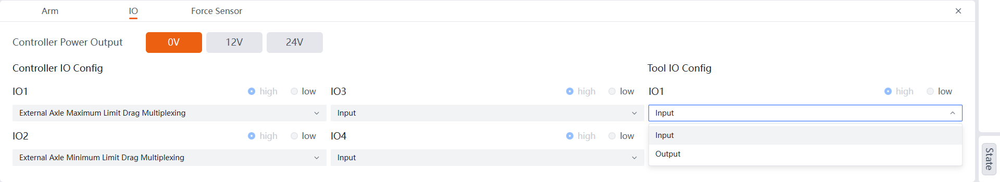

## Force Sensor

Depending on the robot model, the 6-DoF data graph can record four types of data from the robot's end-effector in real-time: External Force Data, Raw Data, External Force Data Of Work Coordinate, and External Force Data Of Tool Coordinate. The following image shows the external force data graph from the 6-DoF system:

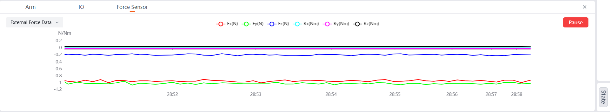

Force Sensor

