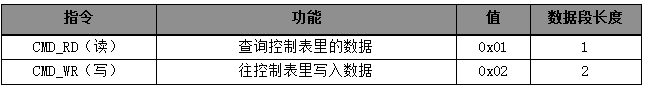
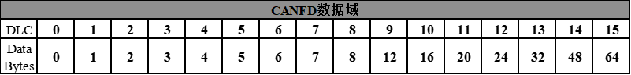
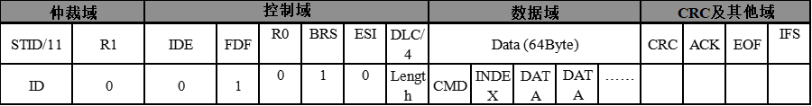
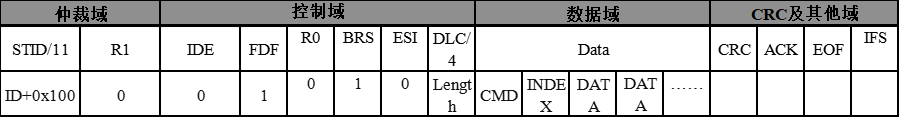
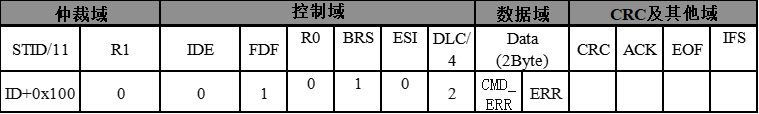
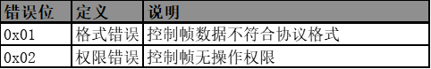

# 
CANFD: 
CANFD 协议说明

## 通信协议概要

关节产品使用CANFD通信协议，是一种控制器和模块之间采用问答方式的通信，控制器发出指令包，模块返回应答包。
一个CAN总线网络中允许有多个模块，所以每个模块都分配有一个ID号。控制器发出的控制指令中包含ID信息，只有匹配上ID号的模块才能完整接收这条指令，并返回应答信息。

所有的查询、控制和参数修改指令均通过对一张储存于模块主控芯片内部的**内存控制表**的读写操作完成。内存控制表的基本储存单位为 2 字节的有符号整形数据。

所有长度大于 1 字节的数据均采用低位在先的传输和储存方式，在协议解析中可配合使用 c 语音中的 memcpy 函数实现字节数据到整形数据或整形数据到字节数据的转换。

指令类型如下：

     

## 协议格式约定

关节使用 CANFD 的标准帧格式，只使用数据帧，远程帧无应答。CANFD 协议的数据帧最长 64 个字节，通讯速率可达 5M，CANFD 协议的数据长度码如下所示。

    

### 指令包

指令包格式如下：

    

**仲裁域**：只有目标 ID 段需要仲裁，仲裁域 ID 即为模块 ID，模块 ID 为 0x00~0x1E（0~30），广播 ID 为 0x00（0）。ID0 固定为接口板使用。 
**控制域**：DLC 长度，即数据域字节长度，最大位 64 个字节，数据长度表如上所示；BRS 表示速率可变，可变为 1，不可变为 0；ESI，暂定为 0，总线不主动报错。 
**数据域**:数据域第一个字节为指令类型，第二个字节为控制表索引，第三到第四个字节为随指令发送的数据。读指令有一个字节数据，表示所要读取的内存表寄存器的数量；写指令数据段有两个字节数据，为要写入内存表的内容，低位在前。

### 应答包

应答包格式如下：

    

应答包的格式与指令包基本一致，其区别在于：

    若模块收到的是读指令，则返回的数据段为指定长度的数据。
    若模块收到的是写指令，则返回的数据段为操作是否成功，0x01-成功，0x00-失败。
    应答包的ID为指令包ID+0x100。

> 备注：当下发的 CANFD 控制帧不符合协议要求时，驱动器返回 CMD_ERR 应答包，应答包格式如下所示。

    

> ERR 代表错误类型，错误代码如下所示：

    

