# 
CANFD: 
使用示例

## 1. 基础示例

### 读取 ID 为 1 的当前位置

指令 = CMD_RD；当前位置低 16 位地址 = 0x14，读取两个寄存器的数据；

指令包：

    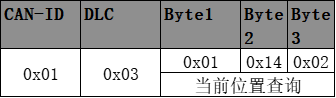

应答包：

    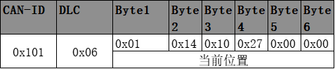

当前位置为：position = 0x00002710/10000 = 1°

### 设置 ID 为 1 的模块目标位置为 1°

指令 = CMD_WR；地址 = 0x36; 数据 = 10000 = 0x00002710；

**（1）正常模式：**

指令包：

    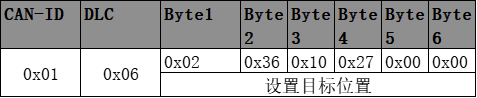

应答包：

    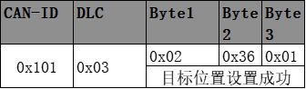

**（2）伺服模式：**

指令包：

    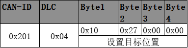

应答包：

    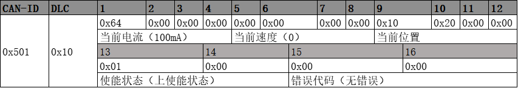

## 2. 常用指令包示例

### 位置伺服指令包

当关节处于位置伺服模式下，关节进入周期性位置伺服控制阶段，控制器向各个关节模块发送位置指令帧，各个关节模块在收到指令帧之后进行相应的位置伺服控制，并将当前的位置信息、电流信息、速度信息、使能状态和错误代码通过一帧反馈帧发送给控制器。 如果一个总线上有 7 个模块参与周期性伺服控制，那么一个控制周期之内，总线上将会产生 14 帧的通讯，以此降低总线负载。

**位置伺服指令帧**：

    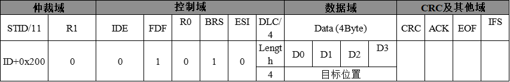

**伺服反馈帧：**

    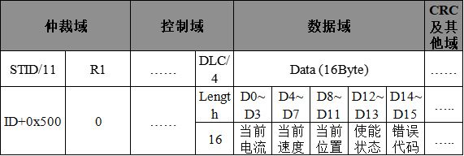

### 速度伺服指令包

当关节处于速度伺服模式下，关节进入周期性速度伺服控制阶段，控制器向各个关节模块发送速度指令帧，各个关节模块在收到指令帧之后进行相应的速度伺服控制，并将当前的位置信息、电流信息、速度信息、使能状态和错误代码通过一帧反馈帧发送给控制器。

**速度伺服指令帧**：

    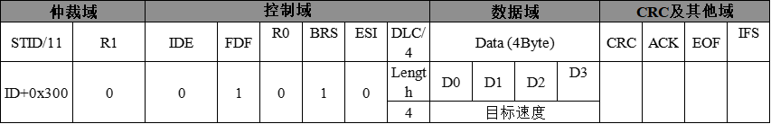

**伺服反馈帧：**

    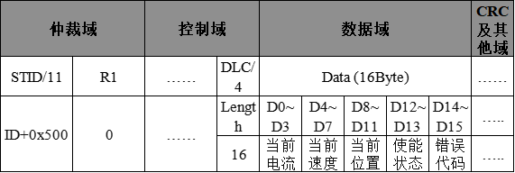

### 电流伺服指令包

控制关节的电流，每下发一帧电流伺服指令帧，返回一帧伺服反馈帧。

**电流伺服指令帧**：

    

**伺服反馈帧：**

    

### 关节状态查询指令包

周期性的查询关节的状态，为了提高总线利用率，将常用的关节数据通过一帧指令进行查询，关节收到该指令帧后，将错误代码、系统电压、系统温度、使能状态和当前位置放到一帧关节状态反馈帧内进行反馈。

**关节状态查询指令帧**：

    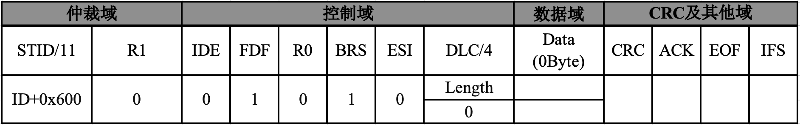

**关节状态反馈帧：**

    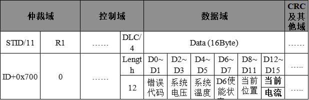

