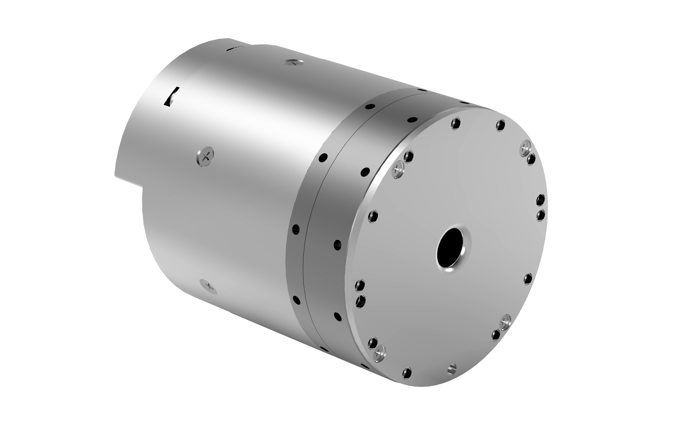

# 
关节：
60系列规格参数

## 型号：WHJ60_S_D70_100_B

### 示意图

  

### 性能参数

| 参数 | 数值 |
| --- | --- |
| 减速比 | 100 |
| 产品自重 | 1000g |
| 减速器直径mm | 70 |
| 体积（直径×长度mm） | 70×87.35 |
| 额定扭矩N.m | 60 |
| 最大扭矩N.m | 180 |
| 最大扭矩密度 | 180 |
| 重复定位精度 | ±0.003°/15角秒 |
| 峰值转速（RPM） | 30 |
| 转动惯量（kg*m^2） | 2.9*10^-5 |
| 中空孔径 | 9mm |
| 工作温度 | 0至50℃ |
| 额定功率 | 292W |
| 额定电压 | 24V |
| 额定电流 | 12A |
| 刹车类型 | 有插销式制动 |
| 增量编码器 | 18bits |
| 绝对位置编码器 | 18bits |
| 通讯接口 | CANFD |
| 场景举例 | 机械臂、人形机器人肩关节、腰关节、垂直髋关节、踝关节、重型转台等。 |

### 详细尺寸

