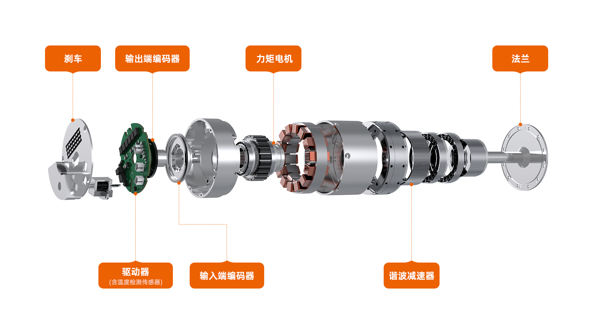
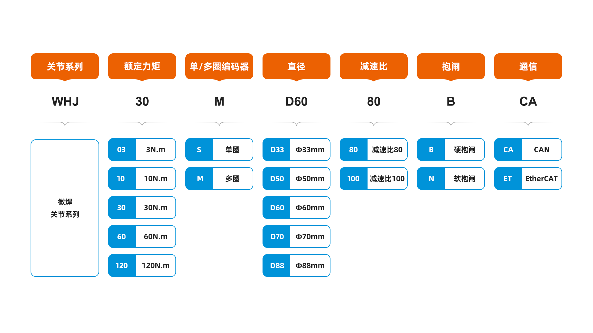

# 快速选型说明

WH系列关节模组结构设计紧凑、安装简便、控制功能丰富，集成了伺服驱动器、电机端绝对值编码器、输出端绝对值编码器、无框力矩电机、制动器、精密谐波减速机等主要部件，极大减少减速器、编码器、电机、驱动等选型、集成设计、采购、组装测试等开发人力投入和时间周期，助力用户进行通用机器人、外骨骼、医疗装备、工业自动化装备等智能产品快速上市，让用户专注于终端应用。

微悍动力WHJ系列一体化关节所有核心部件驱动伺服、电机、谐波减速器自研自产，自研谐波减速器专注于体积更微小、自重更轻量，较市场上大多数传统谐波减速机同性能规格减重约30%-50%，且扭矩是同尺寸产品的2倍。且WHJ系列丰富，关节模组包含WHJ03、WHJ10、WHJ30、WHJ60和WHJ120等多款产品，最大可输出360Nm扭矩，关节最小尺寸可达直径33mm。

微悍动力WHJ关节系列支持客户根据实际场景需求进行选型，选型条目体现在具体型号中，下面是WHJ关节的型号释义：

