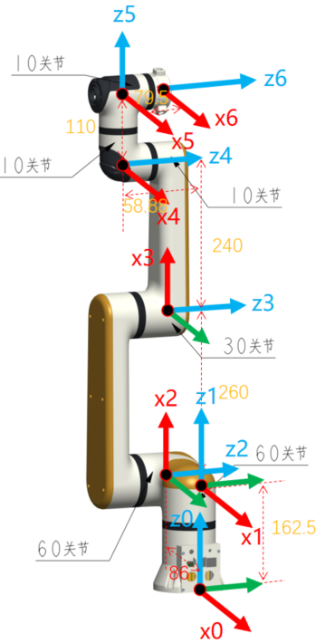

# 1. ECO65系列DH参数

**MDH模型坐标系：**

  

 

**MDH参数(改进D-H参数)：**

表1.1 ECO65系列MDH参数

|关节编号(i)|$a_{i-1}$(mm)|$\alpha_{i -1}$(°)|$d_i$(mm)|offset(°)|
|:--|:--|:--|:--|:--|
|   1   |   0  |   0  | 162.5  |    0  |
|   2   | -90  | -86  |   0    |  -90  |
|   3   |   0  | 260  |   0    |    0  |
|   4   |   0  | 240  | -58.88 |   90  |
|   5   |  90  |   0  |  110   |    0  |
|   6   | -90  |   0  |  $d_6$ |    0  |

 

- ECO65-B &nbsp;: $d_6=79.5$ mm
- ECO65-6F: $d_6=108$ mm

 

说明: offset为机械零位与建模零位的偏差, 即`模型角度 = 关节角度 + offset`.

 

# 2. ECO65系列连杆动力学参数

表2.1 ECO65系列连杆动力学参数

|关节编号(i)|$m$|$x$|$y$|$z$|$L_{xx}$|$L_{xy}$|$L_{xz}$|$L_{yy}$|$L_{yz}$|$L_{zz}$|备注|
|:--|:--|:--|:--|:--|:--|:--|:--|:--|:--|:--|:--|
|   1   | 1.508 | -11.055 | 0.027  | -33.473 | 3648.222 | 22.882 | 25.494    | 4975.281  | -10.516| 2611.768  |  |
|   2   | 2.023 | 58.186  | -0.012 | -52.364 | 7820.980 | 4.845  | -7604.590 | 29709.375 | 4.192  | 24073.795 |  |
|   3   | 1.886 | 92.768  | -0.094 | 1.811   | 1922.701 | -13.151| 2010.953  | 38718.526 | -4.827 | 38122.090 |  |
|   4   | 0.570 | -0.040  | -34.960| 3.802   | 1202.616 | 0.267  | -0.705    | 324.974   | 0.000  | 1163.421  |  |
|   5   | 0.641 | -0.040  | 22.647 | -7.366  | 987.154  | -0.046 | 0.749     | 428.173   | 6.408  | 886.381   |  |
|   6   | 0.107 | -0.506  | 0.255  | -10.801 | 50.918   | -3.136 | -0.699    | 47.420    | 0.388  | 60.350    | B |
|   -   | 0.248 | -0.426  | 0.237  | -27.223 | 308.844  | -3.781 | -1.468    | 304.616   | 0.888  | 122.620   | 6F |

 

说明:
- $m$为连杆质量, 单位为$kg$
- $x$为连杆质心x坐标, 单位为$mm$
- $y$为连杆质心y坐标, 单位为$mm$
- $z$为连杆质心z坐标, 单位为$mm$
- $L_{xx}$,$L_{xy}$,$L_{xz}$,$L_{yy}$,$L_{yz}$,$L_{zz}$ 为连杆坐标系下描述的主惯量, 单位为$kg·mm²$
- B: 标准版, 6F: 六维力版

 

备注: 
- 以上数据来源为CAD设计值
- 如需质心坐标系下的惯性参数, 使用平行移轴定理即可, 计算方法如下所述.

 

---

 

假设有一输出坐标系为坐标系$\{i\}$，对齐坐标系$\{i\}$的质心坐标系为 $\{c\}$，质心在坐标系$\{i\}$中的坐标为 $P_c = [x_c  ，y_c， z_c]^T$，则由平行移轴定理可得：

 

$$I_c = L_i - m (P_{c}^{T}P_cI_{3×3} - P_cP_{c}^{T})$$

式中:
$$
L_i = \begin{bmatrix}L_{xx} & L_{xy} & L_{xz} \\ L_{xy} & L_{yy} & L_{yz} \\ L_{xz} & L_{yz} & L_{zz}\end{bmatrix}
$$