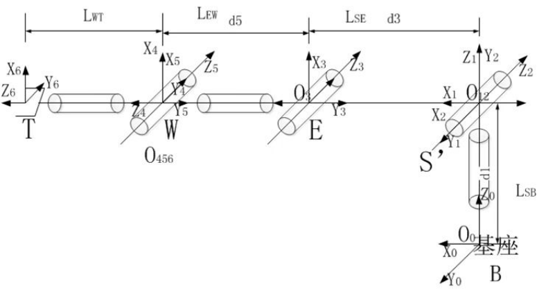

# 1. RM65系列D-H模型及参数

**MDH模型坐标系：**

  

**MDH参数(改进D-H参数)：**

表1.1 RM65系列MDH参数

|关节编号(i)|$a_{i-1}$(mm)|$\alpha_{i -1}$(°)|$d_i$(mm)|offset(°)|
|:--|:--|:--|:--|:--|
|   1   |   0   |   0   |  240.5|   0   |
|   2   |   0   |   90  |   0   |   90  |
|   3   |   256 |   0   |   0   |   90  |
|   4   |   0   |   90  |   210 |   0   |
|   5   |   0   |   -90 |   0   |   0   |
|   6   |   0   |   90  | $d_6$ |   0   |

 

- RM65-B &nbsp;: $d_6=144$ mm
- RM65-6F: $d_6=172.5$ mm

 

说明: offset为机械零位与建模零位的偏差, 即`模型角度 = 关节角度 + offset`.

 

# 2. RM65系列连杆动力学参数

表2.1 RM65系列连杆动力学参数

|关节编号(i)|$m$|$x$|$y$|$z$|$L_{xx}$|$L_{xy}$|$L_{xz}$|$L_{yy}$|$L_{yz}$|$L_{zz}$|备注|
|:--|:--|:--|:--|:--|:--|:--|:--|:--|:--|:--|:--|
|   1   | 1.51  | 0.491   | 7.803   | -10.744 | 2928.466 | -32.63  | -5.816  | 2506.35   | 47.925  | 1756.017  |  |
|   2   | 1.653 | 183.722 | 0.103   | -1.665  | 1711.553 | -38.271 | 2314.91 | 70514.722 | 6.507   | 70036.186 |  |
|   3   | 0.726 | 0.029   | -90.105 | 4.039   | 7259.884 | 2.994   | -0.314  | 371.872   | 44.451  | 7228.758  |  |
|   4   | 0.671 | 0.007   | -9.486  | -8.041  | 794.014  | -0.821  | -0.655  | 596.235   | -34.785 | 486.228   |  |
|   5   | 0.647 | 0.032   | -83.769 | 2.326   | 5375.604 | 2.665   | -0.304  | 285.265   | 14.235  | 5359.769  |  |
|   6   | 0.107 | -0.506  | 0.255   | -10.801 | 50.918   | -3.136  | -0.699  | 47.42     | 0.388   | 60.35     | B  |
|   -   | 0.248 | -0.426  | 0.237   | -27.223 | 308.844  | -3.781  | -1.468  | 304.616   | 0.888   | 122.62    | 6F |

 

说明:
- $m$为连杆质量, 单位为$kg$
- $x$为连杆质心x坐标, 单位为$mm$
- $y$为连杆质心y坐标, 单位为$mm$
- $z$为连杆质心z坐标, 单位为$mm$
- $L_{xx}$,$L_{xy}$,$L_{xz}$,$L_{yy}$,$L_{yz}$,$L_{zz}$ 为连杆坐标系下描述的主惯量, 单位为$kg·mm²$
- B: 标准版, 6F: 六维力版

 
备注: 
- 以上数据来源为CAD设计值
- 如需质心坐标系下的惯性参数, 使用平行移轴定理即可, 计算方法如下所述.

 

---

 

假设有一输出坐标系为坐标系$\{i\}$，对齐坐标系$\{i\}$的质心坐标系为 $\{c\}$，质心在坐标系$\{i\}$中的坐标为 $P_c = [x_c  ，y_c， z_c]^T$，则由平行移轴定理可得：

 

$$I_c = L_i - m (P_{c}^{T}P_cI_{3×3} - P_cP_{c}^{T})$$

式中:
$$
L_i = \begin{bmatrix}L_{xx} & L_{xy} & L_{xz} \\ L_{xy} & L_{yy} & L_{yz} \\ L_{xz} & L_{yz} & L_{zz}\end{bmatrix}
$$
