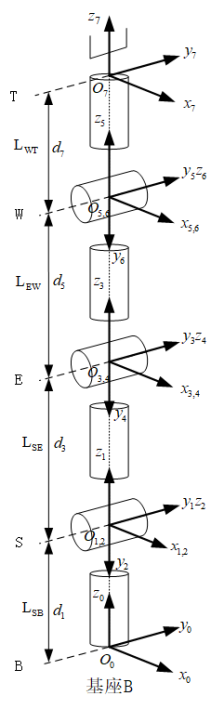

# RM75系列D-H模型及参数

## RM75-B D-H模型及参数表

**D-H模型：**

**D-H参数(改进D-H参数)：**
|关节编号(i)|ai-1 (mm)|αi -1(°)|di (mm)|变量θi (°)|
|:--|:--|:--|:--|:--|
|   1   |   0   |   0   |  240.5|   θ1(0)   |
|   2   |   0   |   -90  |   0   |   θ2(0)  |
|   3   |   0   |   90   |   256   |   θ3(0)  |
|   4   |   0   |   -90  |   0 |   θ4(0)   |
|   5   |   0   |   90 |   210   |   θ5(0)   |
|   6   |   0   |   -90  |   0 |   θ6(0)   |
|   7   |   0   |   90  |   144 |   θ7(0)   |

## RM75-6F D-H模型及参数表

**D-H模型(改进D-H参数)：**

|关节编号(i)|ai-1 (mm)|αi -1(°)|di (mm)|变量θi (°)|
|:--|:--|:--|:--|:--|
|   1   |   0   |   0   |  240.5|   θ1(0)   |
|   2   |   0   |   -90  |   0   |   θ2(0)  |
|   3   |   0   |   90   |   256   |   θ3(0)  |
|   4   |   0   |   -90  |   0 |   θ4(0)   |
|   5   |   0   |   90 |   210   |   θ5(0)   |
|   6   |   0   |   -90  |   0 |   θ6(0)   |
|   7   |   0   |   90  |   172.5 |   θ7(0)   |
