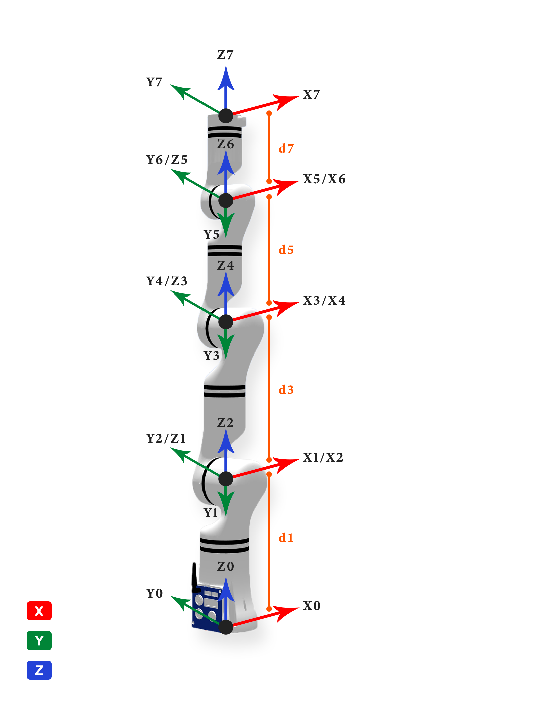

# 1. RM75系列D-H模型及参数

**MDH模型坐标系：**

  

**MDH参数(改进D-H参数)：**

表1.1 RM75系列MDH参数

|关节编号(i)|$a_{i-1}$(mm)|$\alpha_{i -1}$(°)|$d_i$(mm)|offset(°)|
|:--|:--|:--|:--|:--|
|   1   |   0   |   0    |  240.5 |  0  |
|   2   |   0   |   -90  |   0    |  0  |
|   3   |   0   |   90   |   256  |  0  |
|   4   |   0   |   -90  |   0    |  0  |
|   5   |   0   |   90   |   210  |  0  |
|   6   |   0   |   -90  |   0    |  0  |
|   7   |   0   |   90   | $d_7$  |  0  |

 

- RM75-B &nbsp;: $d_7=144$ mm
- RM75-6F: $d_7=172.5$ mm

 

说明: offset为机械零位与建模零位的偏差, 即`模型角度 = 关节角度 + offset`.

 

# 2. RM75系列连杆动力学参数

表2.1 RM75系列连杆动力学参数

|    joint_id(i)   |  1     |  2      |  3     |  4     |  5     |  6     |  7     |  -     |
|:--    |:--     |:--      |:--     |:--     |:--     |:--     |:--     |:--     |
| **$m$**       | 1.574  | 1.217   | 1.11   | 0.685  | 0.619  | 0.602  | 0.107  | 0.248  |
| **$x$**       | 0.241  | -0.357  | 0.003  | -0.005 | 0.078  | -0.014 | -0.506 | -0.426 |
| **$y$**       | -13.273 | -106.798 | -10.398 | -84.658 | -12.937 | -78.524 | 0.255  | 0.237  |
| **$z$**       | -9.95  | 5.329   | -11.324 | 4.747  | -8.781 | 2.819  | -10.801 | -27.223 |
| **$L_{xx}$**  | 2920.666 | 17404.207 | 2099.034 | 6204.576 | 778.615 | 4499.867 | 50.918 | 308.844 |
| **$L_{xy}$**  | 14.703 | -43.488 | 2.292  | -0.819 | 2.261  | -0.802 | -3.136 | -3.781 |
| **$L_{xz}$**  | -4.131 | -3.297  | -4.181 | -0.615 | -0.921 | -0.444 | -0.699 | -1.468 |
| **$L_{yy}$**  | 2476.942 | 927.428  | 1641.235 | 388.441 | 590.169 | 294.76 | 47.42  | 304.616 |
| **$L_{yz}$**  | -28.462 | 108.523 | -93.542 | 43.054 | -35.324 | 12.831 | 0.388  | 0.888  |
| **$L_{zz}$**  | 1727.926 | 17319.77 | 1182.557 | 6162.881 | 473.863 | 4478.261 | 60.35  | 122.62 |
| **备注**       |         |         |         |         |         |         | B      | 6F    |

 

说明:
- $m$为连杆质量, 单位为$kg$
- $x$为连杆质心x坐标, 单位为$mm$
- $y$为连杆质心y坐标, 单位为$mm$
- $z$为连杆质心z坐标, 单位为$mm$
- $L_{xx}$,$L_{xy}$,$L_{xz}$,$L_{yy}$,$L_{yz}$,$L_{zz}$ 为连杆坐标系下描述的主惯量, 单位为$kg·mm²$
- B: 标准版, 6F: 六维力版

 
备注: 
- 以上数据来源为CAD设计值
- 如需质心坐标系下的惯性参数, 使用平行移轴定理即可, 计算方法如下所述.

 

---

 

假设有一输出坐标系为坐标系$\{i\}$，对齐坐标系$\{i\}$的质心坐标系为 $\{c\}$，质心在坐标系$\{i\}$中的坐标为 $P_c = [x_c  ，y_c， z_c]^T$，则由平行移轴定理可得：

 

$$I_c = L_i - m (P_{c}^{T}P_cI_{3×3} - P_cP_{c}^{T})$$

式中:
$$
L_i = \begin{bmatrix}L_{xx} & L_{xy} & L_{xz} \\ L_{xy} & L_{yy} & L_{yz} \\ L_{xz} & L_{yz} & L_{zz}\end{bmatrix}
$$
