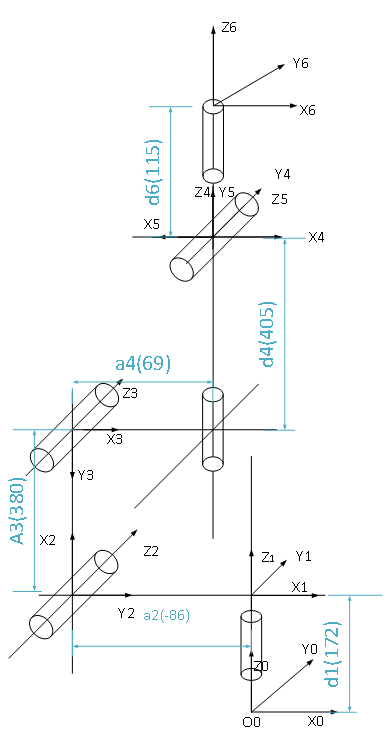

# RML63系列D-H模型及参数

## RML63-B D-H模型及参数表

**D-H模型：**

**D-H参数(改进D-H参数)：**
|关节编号(i)|ai (mm)|αi (°)|di (mm)|变量θi (°)|
|:--|:--|:--|:--|:--|
|   1   |   0   |   0   |  172|   θ1(0)   |
|   2   |   -86   |   -90  |   0   |   θ2(-90)  |
|   3   |   380 |   0   |   0   |   θ3(90)  |
|   4   |   69   |   90  |   405 |   θ4(0)   |
|   5   |   0   |   -90 |   0   |   θ5(180)   |
|   6   |   0   |   -90  |   115 |   θ6(180)   |

## RML63-6F D-H模型及参数表

**D-H模型：**

**D-H参数(改进D-H参数)：**
|关节编号(i)|ai (mm)|αi (°)|di (mm)|变量θi (°)|
|:--|:--|:--|:--|:--|
|   1   |   0   |   0   |  172|   θ1(0)   |
|   2   |   -86   |   -90  |   0   |   θ2(-90)  |
|   3   |   380 |   0   |   0   |   θ3(90)  |
|   4   |   69   |   90  |   405 |   θ4(0)   |
|   5   |   0   |   -90 |   0   |   θ5(180)   |
|   6   |   0   |   -90  |   143.5 |   θ6(180)   |
