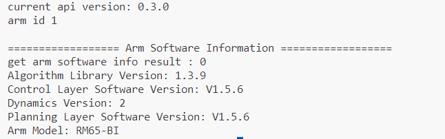

# 睿尔曼机械臂C/C++ API 开发文档


## 1.引言

本开发包旨在为睿尔曼机械臂的二次开发提供便捷的接口。通过本开发包，用户能够实现对机械臂的控制、路径规划、状态监控等一系列功能，从而加速机械臂相关应用的开发过程。

## 2.目标受众

- **机械臂开发者**：对于希望利用C/C++语言进行睿尔曼机械臂编程和调试的机器人开发者来说，本开发包提供了丰富的API和示例代码，方便快速上手。
- **自动化系统集成商**：在自动化系统中集成睿尔曼机械臂功能时，本开发包能够简化集成过程，提高开发效率。
- **科研人员**：科研人员可以利用本开发包进行睿尔曼机械臂相关算法的研究和实验，如路径规划、力控制等。
- **教育用户**：对于机器人教育领域的用户，本开发包可用于睿尔曼机械臂的教学和实验，帮助学生更好地理解和应用机械臂技术。

## 3.开发包使用说明

### 3.1 Windows环境使用说明

#### 3.1.1 支持的编译器

- **MSVC2015 或更高版本**：Microsoft Visual C++ 2015（MSVC2015）或更新的版本是推荐的编译器，它与Windows系统兼容性良好，且支持最新的C语言标准。使用MSVC可以方便地编译和调试C语言编写的睿尔曼机械臂控制程序。

#### 3.1.2 开发包说明

- **头文件**：C语言开发包含以下头文件：
  
  - `rm_define.h`：机械臂自定义头文件，包含了定义的数据类型、结构体。
  - `rm_interface.h`：机械臂自定义头文件，声明了C语言机械臂操作接口。
  
  如果是C++开发，则额外包含以下头文件：
  
  - `rm_service.h`：机械臂自定义头文件，声明了C++语言机械臂操作接口。
  - `rm_service_global.h`：机械臂自定义头文件，定义编译Windows C++版本库时导出宏。
  
- **动态链接库（DLLs）**：包含了控制机械臂所需的函数和接口。用户需要在项目中正确配置这些DLLs的路径及版本，以便编译器能够找到并链接它们。包含以下版本：

  - `32bit`：对应Windows 32位编译器（例如MSVC2017 32bit）使用的库，分为`release/debug`版本
  - `64bit`：对应Windows 64位编译器（例如MSVC2017 64bit）使用的库，分为`release/debug`版本

### 3.2 Linux 环境使用说明

#### 3.2.1 支持的架构

- **x86**：标准的Intel和AMD处理器架构。
- **ARM**：支持基于ARM架构的处理器。

#### 3.2.2 编译器

- **GCC**：GNU Compiler Collection（GCC）是Linux下广泛使用的开源编译器集合。编译器要求GCC 7.5以上版本，以确保最佳的性能和兼容性。

#### 3.2.3 开发包说明

- **头文件**：与Windows 头文件相同，详见Windows环境的开发包说明
- **共享库（.so 文件）**：包含了控制机械臂所需的函数和接口。用户需要确保这些库文件在编译和运行时都能被系统找到。包含以下版本的库：
  - `linux_x86`：包含`release/debug`版本
  - `linux_arm`：包含`release/debug`版本

## 4.使用示例-MSVC

>支持MSVC2015及以上版本

本项目是一个使用Microsoft Visual Studio开发的C/C++项目，旨在演示如何将睿尔曼C语言版本的二次开发包集成到Visual Studio项目中。本Readme文档将指导用户如何配置环境、导入库文件、设置项目属性以及编译和运行项目。

### 4.1代码结构

```
RMDemo_VisualStudio_Project
├── RMDemo_VisualStudio_Project.sln # 解决方案文件
├── include
│   ├── rm_define.h  # 机械臂二次开发包头文件，包含了定义的数据类型、结构体
│   └── rm_interface.h # 机械臂二次开发包头文件，声明了机械臂所有操作接口
├── lib
│   ├── api_c.dll    # Windows 的 API 库（默认release 64bit）
│   └── api_c.lib    # Windows 的 API 库（默认release 64bit）
├── RMDemo_VisualStudio_Project #源代码文件夹
└── readme.md            # 项目说明文档
```

### 4.2环境准备

- **Visual Studio**：
  - 安装适合C/C++开发的Visual Studio版本（如Visual Studio Community），推荐最新版本。
  - 在安装时，选择安装使用C++的桌面开发。
  - MSVC编译器要求2015以上
- **睿尔曼二次开发包**：
   下载链接

### 4.3项目步骤

#### 4.3.1项目配置

1. **创建新的C/C++项目**：

   - 打开Visual Studio，选择“创建新项目”。
   - 在“创建新项目”对话框中，选择“控制台应用”或适合你需求的C/C++项目类型，然后点击“下一步”。
   - 填写项目名称、位置等信息，然后点击“创建”。

2. **包含睿尔曼二次开发包头文件**：

   - 将睿尔曼开发包头文件及动态库文件复制到项目目录中。

     

   - 右键点击项目名称，打开“属性页”对话框。
   - 在左窗格中，选择“配置属性”>“C/C++”>“常规”。
   - 在“附加包含目录”下拉框点击编辑，在编辑控件中添加睿尔曼头文件的路径。可选择省略号 (...) 控件浏览到正确的文件夹，也可输入相对路径。

   

3. **将DLL 导入库添加到项目中**：

   - 在项目属性页中，导航到“链接器” > “输入”。
   - 在“附加依赖项”中添加睿尔曼库的名称`api_c.lib`。
   - 选择“配置属性”>“链接器”>“常规”。选择“附加库目录”旁的下拉控件，然后选择“编辑”。
   - 在编辑控件中，指定指向 `api_c.lib` 文件位置的路径。

   

4. **在生成后事件中复制 DLL**：

   将 DLL 复制到包含客户端可执行文件的目录中，作为生成过程的一部分。

   - 在项目属性页中，选择“配置属性”>“生成事件”>“生成后事件”。
   - 在”命令行“字段中选择编辑打开编辑控件，输入以下命令：

   `xcopy /y /d "..\lib\api_c.dll" "$(OutDir)"`

   

5. **保存并关闭项目属性页**。

#### 4.3.2示例代码

```c
#include "rm_interface.h"
#include <stdio.h>
#include <time.h>
#include <string.h>

int main(int argc,char **argv)
{
    rm_set_log_call_back(NULL,3);
    rm_init(RM_TRIPLE_MODE_E);

    char *version = rm_api_version();
    printf("current api version: %s\n", version);

    handle = rm_create_robot_arm("192.168.1.18",8080);
    if( handle->id  == -1)
    {
        rm_delete_robot_arm(handle);
        printf("arm connect err...\n");
    }
    else if(handle != NULL)
    {
        printf("arm id %d \n", handle->id);
    }
    
    int ret;
    rm_arm_software_version_t arm_software_version;
    ret = rm_get_arm_software_info(handle, &arm_software_version);
    printf("\n================== Arm Software Information ==================\n");
    printf("get arm software info result : %d\n", ret);
    printf("Algorithm Library Version: %s\n", arm_software_version.algorithm_info.version);
    printf("Control Layer Software Version: %s\n", arm_software_version.ctrl_info.version);
    printf("Dynamics Version: %s\n", arm_software_version.dynamic_info.model_version);
    printf("Planning Layer Software Version: %s\n", arm_software_version.plan_info.version);
    printf("Arm Model: %s\n", arm_software_version.product_version);
}
```

输出结果如下所示：



#### 4.3.3编译与运行

- 在Visual Studio中，选择“生成”菜单下的“生成解决方案”来编译项目。
- 确保没有编译错误，并且项目能够正确链接到睿尔曼库。
- 选择“调试”菜单下的“开始调试”或点击工具栏上的绿色播放按钮来运行你的应用程序。

### 4.4 注意事项

该Demo以RM65-B型号机械臂为例，请根据实际情况修改代码中的数据。

### 4.5 许可证信息

- 本项目遵循MIT许可证。

### 4.6 常见问题解答（FAQ）

- **链接错误**：检查是否已正确包含头文件及导入库。
- **运行时错误**：确保dll文件在应用程序的搜索路径中。
- **机械臂连接不上**：检查机械臂IP是否被修改。
- **机械臂运动失败**：检查机械臂型号，本示例基于RM65_B机械臂编写，其中的运动点位可能不适用于其他型号。

## 5.使用示例-Qt

本项目是一个跨平台的Qt应用程序，支持Linux和Windows操作系统。项目旨在演示如何使用Qt的qmake构建系统来导入并使用睿尔曼C语言版本二次开发包完成机械臂的连接、获取机械臂版本、机械臂运动以及断开连接。本Readme文档将说明使用环境要求、并指导用户如何新建項目-->导入库-->调用接口-->构建和运行项目。

### 5.2代码结构

```
RMDemo_QtExample_C
├── API_QtExample_C.pro # 项目文件，包含了项目的配置信息
├── include
│   ├── rm_define.h  # 机械臂二次开发包头文件，包含了定义的数据类型、结构体
│   └── rm_interface.h # 机械臂二次开发包头文件，声明了机械臂所有操作接口
├── lib
│   ├── api_c.dll    # Windows 的 API 库
│   ├── api_c.lib    # Windows 的 API 库
│   └── libapi_c.so  # Linux 的 API 库
├── main.c           # 主函数
└── readme.md            # 示例工程说明文档
```

### 5.3环境要求

- **Qt 版本**：下载并安装适合你操作系统的Qt版本（Qt 5 或 Qt 6）。
- **操作系统**：支持Linux、Windows  
- **编译器**：
  - Windows环境下，编译器要求MSVC 2015以上
  - Linux环境下，使用GCC 7.5或更高版本  
- **其他依赖**：睿尔曼二次开发包（下载链接）
  
### 5.4项目步骤

#### 5.4.1项目配置

1. **创建Qt项目**：

   - 打开Qt Creator，选择“文件” > “新建文件或项目”。
   - 选择“应用程序”下的模板（例如“Qt Console Application”），点击“选择”按钮继续。
   - 填写项目名称、位置等信息，选择qmake构建系统，点击“下一步”。
   - 构建套件选择MSVC编译器（例如Windows下选择MSVC2017 64bit），点击“下一步”直到完成向导。

2. **配置qmake**：

   - 根据选择的编译器将对应版本的睿尔曼二次开发包动态库文件及头文件放置到项目中（对应上面选择的MSVC2017 64bit编译器，这里选择Windows 64bit的库）。

   - 打开项目的`.pro`文件，添加睿尔曼库的包含路径和库文件。

   本项目二次开发包文件目录及`.pro`文件配置如下（用户根据实际路径调整）：

   

   ```pro
   INCLUDEPATH += $$PWD/include
   LIBS += -L$$PWD/lib -lapi_c
   ```

   - 注意替换`$$PWD/include`和`$$PWD/lib`为实际的头文件和库文件路径。
   - `-lapi_c`中的`api_c`是库文件（不包括前缀和后缀）的名称。

3. **修改项目代码**：

   - 在你的Qt项目中，添加包含睿尔曼头文件的代码。
   - 编写调用睿尔曼库函数的代码，以实现所需的功能。

#### 5.4.2编译与运行

1. 编译项目：
   - 在Qt Creator中，点击左下角的绿色播放按钮或使用快捷键（通常是F5）来构建并运行项目。
   - 确保没有编译错误，并且项目能够正确链接到睿尔曼库。
2. 运行与测试：
   - 运行应用程序，并测试其是否按预期工作，特别是那些使用睿尔曼库函数的部分。

### 5.5注意事项

该Demo以RM65-B型号机械臂为例，请根据实际情况修改代码中的数据。

### 5.6许可证信息

- 本项目遵循MIT许可证。

### 5.7常见问题解答（FAQ）

- **链接错误**：
  - 检查LIBS和INCLUDEPATH是否正确指向睿尔曼库的头文件和库文件。
  - 检查指向的库文件版本是否与环境相对应。
- **编译器或构建错误**：检查Qt Creator的配置设置，确保选择了正确的Qt版本和编译器。
- **运行时错误**：确保库文件在系统的库路径中，或在应用程序的可执行文件同目录下。
- **机械臂连接不上**：检查机械臂IP是否被修改。
- **机械臂运动失败**：检查机械臂型号，本示例基于RM65_B机械臂编写，其中的运动点位可能不适用于其他型号。

## 6.支持渠道

- **示例与文档**：跳转对应API链接。
- **SDK与库**：下载链接。
- **社区支持**：跳转链接。
