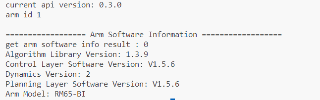

# 机械臂Python API快速开始

## 1.引言

本开发包旨在为睿尔曼机械臂的二次开发提供便捷的Python接口。通过本开发包，用户能够实现对机械臂的控制、路径规划、状态监控等一系列功能，从而加速机械臂相关应用的开发过程。

## 2.目标受众

- **机械臂开发者**：对于希望利用Python进行睿尔曼机械臂编程和调试的机器人开发者来说，本开发包提供了丰富的API和示例代码，方便快速上手。
- **自动化系统集成商**：在自动化系统中集成睿尔曼机械臂功能时，本开发包能够简化集成过程，提高开发效率。
- **科研人员**：科研人员可以利用本开发包进行睿尔曼机械臂相关算法的研究和实验，如路径规划、力控制等。
- **教育用户**：对于机器人教育领域的用户，本开发包可用于睿尔曼机械臂的教学和实验，帮助学生更好地理解和应用机械臂技术。

## 3.支持的操作系统与软件版本

### 操作系统

- **Windows（64位和32位）**：支持Windows操作系统下的64位和32位版本，方便Windows用户进行机械臂开发。
- **Linux（x86和arm）**：支持Linux操作系统的x86架构和arm架构，满足不同硬件环境的需求。

### 软件版本

- **Python 3.9以上**：本开发包基于Python 3.9及以上版本进行开发，确保与最新Python版本的兼容性。

## 4.安装与使用

### 安装

用户可以通过pip命令进行安装：

```bash
pip install Robotic_Arm
```

或者本地下载二次开发包：

```bash
git clone https://github.com/RealManRobot/RM_API2.git
```

### 使用

安装完成后，用户可以在Python脚本中导入开发包并使用相关API接口进行机械臂的开发工作。以下是一个简单的使用机械臂Python开发包连接机械臂并查询机械臂版本的示例代码：

```python
from Robotic_Arm.rm_robot_interface import *

robot = RoboticArm(rm_thread_mode_e.RM_TRIPLE_MODE_E)
handle = robot.rm_create_robot_arm("192.168.1.18", 8080)
print("机械臂ID：", handle.id)

software_info = robot.rm_get_arm_software_info()
if software_info[0] == 0:
    print("\n================== Arm Software Information ==================")
    print("Arm Model: ", software_info[1]['product_version'])
    print("Algorithm Library Version: ", software_info[1]['algorithm_info']['version'])
    print("Control Layer Software Version: ", software_info[1]['ctrl_info']['version'])
    print("Dynamics Version: ", software_info[1]['dynamic_info']['model_version'])
    print("Planning Layer Software Version: ", software_info[1]['plan_info']['version'])
    print("==============================================================\n")
else:
    print("\nFailed to get arm software information, Error code: ", software_info[0], "\n")
```

输出结果如下所示：



## 5.技术支持与社区

- **示例与文档**：[API（Python）演示](/demo/python/simpleProcess/)
- **SDK与库**: [Python SDK](wwwwwwwwww)
