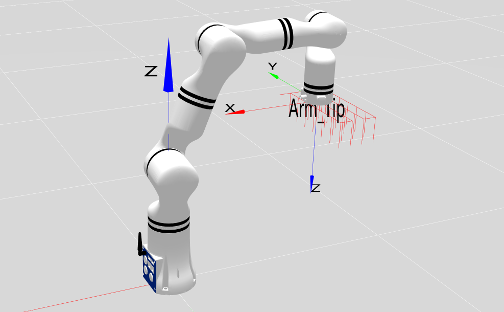

#  <p class="hidden">Demo演示(C、C++)：</p> 试管夹取自动化模拟示例

## 1. 项目介绍
本项目模拟使用睿尔曼机械臂在试管架上转移试管的场景，示例中使用两种方式来定位操作试管：一是通过步进运动移动到每个试管位置，二是通过起始点计算并移动到目标试管位置。项目基于Cmake构建，使用了睿尔曼提供的机械臂C语言开发包。

## 2. 代码结构

```
RMDemo_TubePickingSimulation
├── build              # CMake构建生成的输出目录（如Makefile、构建文件等）
├── include              # 自定义头文件存放目录
├── Robotic_Arm          睿尔曼机械臂二次开发包
│   ├── include
│   │   ├── rm_define.h     # 机械臂二次开发包头文件，包含了定义的数据类型、结构体
│   │   └── rm_interface.h  # 机械臂二次开发包头文件，声明了机械臂所有操作接口
│   └── lib
│       ├── api_c.dll    # Windows 64bit 的 API 库
│       ├── api_c.lib    # Windows 64bit 的 API 库
│       └── libapi_c.so  # Linux x86 的 API 库
├── src
│   └── main.c           # 主要功能的源文件
├── CMakeLists.txt       # 项目的顶层CMake配置文件
├── readme.md            # 项目说明文档
├── run.bat              # Windows快速运行脚本
└── run.sh               # linux快速运行脚本

```
## 3.项目下载

通过链接下载 `RM_API2` 到本地：[开发包下载](https://github.com/RealManRobot/RM_API2.git)，进入`RM_API2\Demo\RMDemo_C`目录，可找到RMDemo_TubePickingSimulation。

## 4. 环境配置

在Windows和Linux环境下运行时需要的环境和依赖项：
| 项目 | Linux | Windows |
| :-- | :-- | :-- |
| 系统架构 | x86架构 | - |
| 编译器 | GCC 7.5或更高版本 | MSVC2015或更高版本 64bit |
| CMake版本 | 3.10或更高版本 | 3.10或更高版本 |
| 特定依赖 | RMAPI Linux版本库（位于`Robotic_Arm/lib`目录） | RMAPI Windows版本库（位于`Robotic_Arm/lib`目录） |

### Linux环境配置

**1. 编译器（GCC）**
在大多数Linux发行版中，GCC是默认安装的，但可能版本不是最新的。如果需要安装特定版本的GCC（如7.5或更高版本），可以使用包管理器进行安装。以Ubuntu为例，可以使用以下命令安装或更新GCC：

```bash
# 检查GCC版本
gcc --version

sudo apt update
sudo apt install gcc-7 g++-7  
```

注意：如果系统默认安装的GCC版本已满足或高于要求，则无需进行额外安装。

**2. CMake**
CMake在大多数Linux发行版中也可以通过包管理器安装。以Ubuntu为例：

```bash
sudo apt update
sudo apt install cmake

# 检查CMake版本
cmake --version
```

### Windows环境配置

**1. 编译器（MSVC2015或更高版本）**
MSVC（Microsoft Visual C++）编译器通常随Visual Studio一起安装。可以按照以下步骤安装：

1. 访问[Visual Studio官网](https://visualstudio.microsoft.com/)下载并安装Visual Studio。
2. 在安装过程中，选择“使用C++的桌面开发”工作负载，这将包括MSVC编译器。
3. 根据需要选择其他组件，如CMake（如果尚未安装）。
4. 完成安装后，打开Visual Studio命令提示符（可在开始菜单中找到），输入`cl`命令检查MSVC编译器是否安装成功。

**2. CMake**
如果Visual Studio安装过程中未包含CMake，可以单独下载并安装CMake。

1. 访问[CMake官网](https://cmake.org/download/)下载适用于Windows的安装程序。
2. 运行安装程序，按照提示进行安装。
3. 安装完成后，将CMake的bin目录添加到系统的PATH环境变量中（通常在安装过程中会询问是否添加）。
4. 打开命令提示符或PowerShell，输入`cmake --version`检查CMake是否安装成功。

## 5. 使用指南
### **5.1. 快速运行**

**1. Linux运行**
在终端进入 `RMDemo_TubePickingSimulation` 目录，输入以下命令运行C程序：

```bash
chmod +x run.sh
./run.sh
```

运行结果如下：


**2. Windows运行**
进入 `RMDemo_TubePickingSimulation` 目录，双击运行run.bat文件。

运行结果如下：


机械臂末端运行轨迹如下图所示：


### **5.2. 关键代码说明**

下面是 `main.c` 文件的主要功能：
- **连接机械臂**
  连接到指定IP和端口的机械臂。

  ```C
  rm_robot_handle *robot_handle = rm_create_robot_arm(robot_ip_address, robot_port);
  ```

- **设置工具端电源输出**
  设置工具端电源输出24V

  ```C
  rm_set_tool_voltage(robot_handle, 3);
  ```

- **运动到夹取起始位置**
  调用movej_p控制机械臂运动到初始位置

  ```C
    rm_pose_t pose;
    pose.position.x = -0.35f;
    pose.position.y = 0.0f;
    pose.position.z = 0.3f;
    pose.euler.rx = 3.14f;
    pose.euler.ry = 0.0f;
    pose.euler.rz = 0.0f;
    pose.quaternion = (rm_quat_t){0.0f, 0.0f, 0.0f, 0.0f};
    result = rm_movej_p(robot_handle, pose, 20, 0, 0, 1);
  ```

- **步进运动到试管架孔位**
  使用位置步进功能，根据试管架孔位间的长宽距离，依次步进到每个孔位，并调用夹爪夹取/闭合接口模拟转移试管（仅模拟机械臂末端运动到到每个孔位抓取放置，不实现实际的移动试管）。

  ```C
    result = rm_set_pos_step(robot_handle, RM_X_DIR_E, x_step, 20, 1);
    result = rm_set_gripper_pick_on(robot_handle, 500, 200, 0, 0);
    result = rm_set_gripper_release(robot_handle, 500, 0, 0);
  ```

- **直线运动到试管架孔位**
  获取当前位置，计算目标孔位的位置并调用movel运动到目标孔位，调用夹爪夹取/闭合接口模拟转移试管（仅模拟机械臂末端运动到到每个孔位抓取放置，不实现实际的移动试管）。

  ```C
  rm_current_arm_state_t cur_state;
  result = rm_get_current_arm_state(robot_handle, &cur_state);
  cur_state.pose.position.x += 2*x_step;
  cur_state.pose.position.y += 2*y_step;
  result = rm_movel(robot_handle, cur_state.pose, 20, 0, 0, 1);
  ```

- **断开机械臂连接**

  ```C
  rm_delete_robot_arm(robot_handle);
  ```

## 6. 许可证信息

- 本项目遵循MIT许可证。
