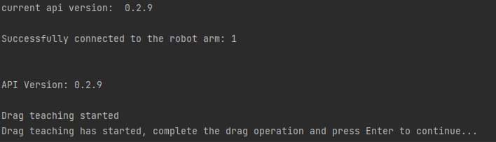
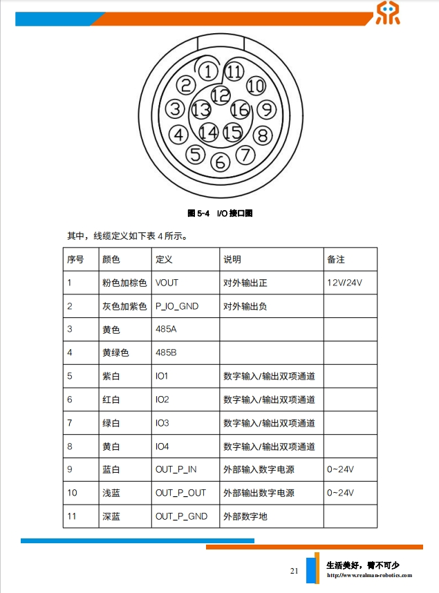
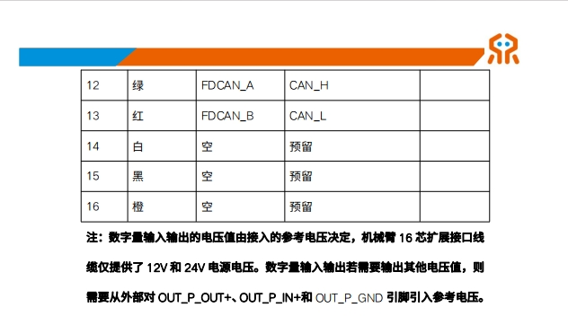
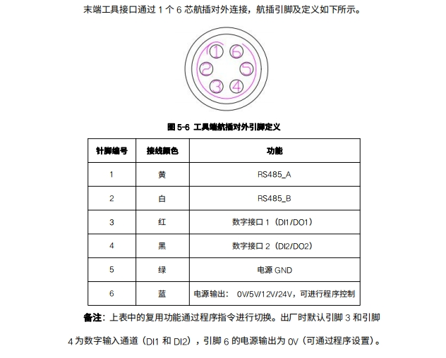

# 机械臂IO功能使用示例


## 1. 项目介绍

本项目是一个使用睿尔曼Python开发包实现拖动示教，将轨迹保存到文件夹下，并拼接为在线编程文件，再保存至在线编程列表，设置为默认IO运行编程文件，通过IO复用模式运行、暂停、继续、急停在线编程。

## 2. 代码结构

```
RMDemo_IOControl/
│
├── README.md        <- 项目的核心文档
├── requirements.txt    <- 项目的依赖列表
├── setup.py        <- 项目的安装脚本
│
├── src/          <- 项目的源代码
│  ├── main.py       <- 程序的主入口
│  └── core/        <- 核心功能或业务逻辑代码
│    └── demo_io_control.py     <- 实现拖动示教，将轨迹保存到文件夹下，并拼接为在线编程文件，再保存至在线编程列表，设置为默认IO运行编程文件，通过IO复用模式运行、暂停、继续、急停在线编程。
└── Robotic_Arm/      <- 睿尔曼机械臂二次开发包
```

## 3.环境与依赖

* Python 3.9+

##  4. 安装说明

1. 安装Python 3.9

2. 进入项目目录：`cd RMDemo_IOControl`

3. 安装依赖：`pip install -r requirements.txt`

## 5. 注意事项

该Demo以RM65-B型号机械臂为例，请根据实际情况修改代码中的数据。

## 6. 使用指南

1. **参数配置**
   
   打开`demo_algo_interface.py` 文件，在main函数中可修改以下配置：
   
   - 配置要连接的机械臂IP地址（默认为`"192.168.1.18"`）：如果用户修改过机械臂的IP，修改`RobotArmController`类的初始化参数为机械臂当前IP。
   - 配置文件保存至在线编程列表的id号（默认为100）：通过`test_id`参数修改文件保存至在线编程时的id。请检查在线编程列表，必要时修改该id号以确保在您的在线编程列表中该id为可用的。
   - 配置控制器IO复用功能（默认设置为	IO1：表示开始运行在线编程文件、IO2：表示暂停运行在线编程文件、IO3：表示继续运行在线编程文件、IO4：表示急停功能）：通过`set_io_mode`方法修改每个IO端口的复用模式。
   
2. **命令行运行**

   在终端进入`RMDemo_IOControl`目录，输入以下命令运行Python脚本：

```
python ./src/main.py
```

3. **拖动机械臂进行示教**

   当终端打印出以下信息，机械臂已进入拖动示教模式，用户可以拖动机械臂完成需要的轨迹，拖动完成后按下回车键退出拖动示教模式并保存轨迹到data文件夹下的trajectory.txt文件中。

   

4. **通过IO复用模式控制该轨迹文件的运行、暂停、继续、急停**

   程序运行结束后，拖动示教保存的轨迹文件已经保存到指定id的在线编程程序列表，并且设置为IO 默认运行的在线编程文件。此时，控制器IO设置为：

   ​	IO1：表示开始运行在线编程文件；

   ​	IO2：表示暂停运行在线编程文件；

   ​	IO3：表示继续运行在线编程文件；
   
   ​	IO4：表示急停功能；
   
   IO为高电平触发，参考 `9. 控制器和末端接口图` 完成IO接线后，即可通过对应IO端口高电平实现相应的IO功能。

* **支持渠道**：
  * 开发者论坛/社区：[链接地址](https://bbs.realman-robotics.cn)

## 7. 许可证信息


* 本项目遵循MIT许可证。

## 8. 常见问题解答（FAQ）

- **Q1：机械臂连接失败**

  答案：修改过机械臂IP

## 9. 控制器和末端接口图

### 控制器IO接口图1


### 控制器IO接口图2


### 末端IO接口图

