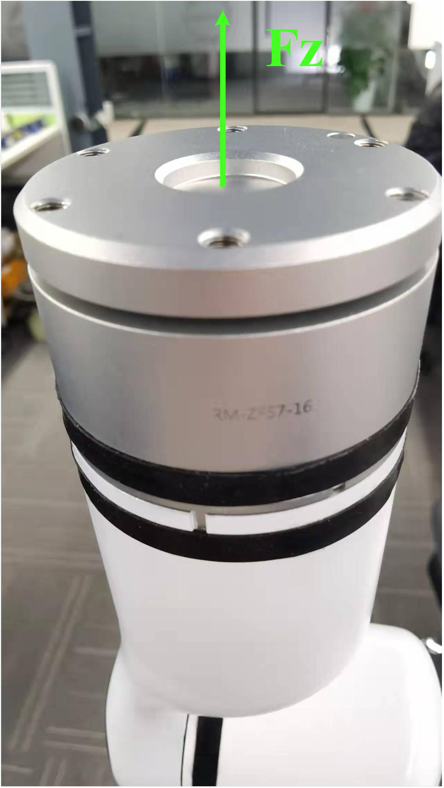

# <p class="hidden">JSON协议：</p>力传感器指令集（选配）

## 六维力

睿尔曼机械臂六维力版末端配备集成式六维力传感器，无需外部走线，用户可直接通过协议对六维力进行操作，获取六维力数据。

如下图所示，正上方为六维力的Z轴，航插反方向为六维力的Y轴，坐标系符合右手定则。机械臂位于零位姿态时，工具坐标系与六维力的坐标系方向一致。

另外，六维力额定力200N，额定力矩8Nm，过载水平300%FS，工作温度5\~80℃，准度0.5%FS。使用过程中注意使用要求，防止损坏六维力传感器。


### 查询六维力数据`get_force_data`

查询当前六维力传感器得到的力和力矩信息：Fx,Fy,Fz,Mx,My,Mz。

- **输入参数**

| 功能描述 | 类型 |说明|
| :--- | :--- |:---|
| `get_force_data` | `string` |获取力传感器信息，若要周期获取力数据，第二代机械臂查询周期不能小于50ms。|

- **代码示例**

**输入**  

```json
{"command":"get_force_data"}
```

**输出**  

原始力数据force_data<br>
依次为Fx=1N，Fy=2N，Fz=3N，Mx=0.4Nm，My=0.5Nm，Mz=0.6Nm；

传感器坐标系下系统受到的外力数据zero_force_data<br>
依次为Fx=0.5N，Fy=1N，Fz=1.5N，Mx=0.2Nm，My=0.25Nm，Mz=0.3Nm；

当前工作坐标系下系统受到的外力数据work_zero_force_data<br>
依次为Fx=0.5N，Fy=1N，Fz=1.5N，Mx=0.2Nm，My=0.25Nm，Mz=0.3Nm；

当前工具坐标系下系统受到的外力数据tool_zero_force_data<br>
依次为Fx=0.5N，Fy=1N，Fz=1.5N，Mx=0.2Nm，My=0.25Nm，Mz=0.3Nm；

数据精度：0.001。

```json
{
    "command": "get_force_data",
    "force_data": [
        1000,
        2000,
        3000,
        400,
        500,
        600
    ],
    "zero_force_data": [
        500,
        1000,
        1500,
        200,
        250,
        300
    ],
    "work_zero_force_data": [
        500,
        1000,
        1500,
        200,
        250,
        300
    ],
    "tool_zero_force_data": [
        500,
        1000,
        1500,
        200,
        250,
        300
    ]
}
```

### 六维力数据清零`clear_force_data`

将六维力数据清零，标定当前状态下的零位。

- **输入参数**

| 功能描述 | 类型 |说明|
| :--- | :--- |:---|
| `clear_force_data` | `string` |标定当前状态下的零位。|

- **代码示例**

**输入**  

```json
{"command":"clear_force_data"}
```

**输出**  

清空成功：

```json
{
    "command": "clear_force_data",
    "clear_state": true
}
```

清空失败：

```json
{
    "command": "clear_force_data",
    "clear_state": false
}
```

### 自动设置六维力重心参数`set_force_sensor`

设置六维力重心参数，六维力重新安装后，必须重新计算六维力所受到的初始力和重心。分别在不同姿态下，获取六维力的数据，用于计算重心位置。该指令下发后，机械臂以固定的速度运动到各标定点，该过程不可中断，中断后必须重新标定。

::: tip 提示
重要说明：必须保证在机械臂静止状态下标定。
以RM65机械臂为例，四个标定点的关节角度分别为：
位置1关节角度：`{0,0,-60,0,60,0}`
位置2关节角度：`{0,0,-60,0,-30,0}`
位置3关节角度：`{0,0,-60,0,-30,180}`
位置4关节角度：`{0,0,-60,0,-120,0}`
:::

- **输入参数**

| 功能描述 | 类型 |说明|
| :--- | :--- |:---|
| `set_force_sensor` | `string` |设置力传感器指定位置时的数。|

- **代码示例**

**输入**  

```json
{"command":"set_force_sensor"}
```

**输出**
配置成功：

```json
{
    "command": "set_force_sensor",
    "set_state": true
}
```

配置失败：

```json
{
    "command": "set_force_sensor",
    "set_state": false
}
```

### 手动标定六维力数据`manual_set_force`

设置六维力重心参数，六维力重新安装后，必须重新计算六维力所受到的初始力和重心。该手动标定流程，适用于空间狭窄工作区域，以防自动标定过程中机械臂发生碰撞，用户可以手动选取四个位姿下发，当下发完四个点后，机械臂开始自动沿用户设置的目标运动，并在此过程中计算六维力重心。

- **输入参数**

| 功能描述 | 类型 |说明|
| :--- | :--- |:---|
| `manual_set_force` | `string` |标定感器重心数。|
| `pose1` | `int` |位置1关节角度。|
| `pose2` | `int` |位置2关节角度。|
| `pose3` | `int` |位置3关节角度。|
| `pose4` | `int` |位置4关节角度。|

::: warning 注意
上述4个位置必须按照顺序依次下发，当下发完pose4后，机械臂开始自动运行计算重心，计算完成后返回协议
:::

- **代码示例**

**输入**
六自由度：

```json
 {"command":"manual_set_force_pose1","joint":[0,0,0,0,90000,0]}                                        
```

七自由度：

```json
{"command":"manual_set_force_pose1","joint":[0,0,0,0,0,90000,0]}                                            
```

**输出**
标定成功:

```json
{
    "command": "set_force_sensor",
    "set_state": true
}
```

标定失败:

```json
{
    "command": "set_force_sensor",
    "set_state": false
}
```

### 停止标定力传感器重心`stop_set_force_sensor`

在标定力传感器过程中，如果发生意外，发送该指令，停止机械臂运动，退出标定流程。

- **输入参数**

| 功能描述 | 类型 |说明|
| :--- | :--- |:---|
| `stop_set_force_sensor` | `string` |停止计算力传感器重心位置。|

- **代码示例**

**输入**  

```json
{"command":"stop_set_force_sensor"}
```

**输出**
计算成功：

```json
{
    "command": "stop_set_force_sensor",
    "stop_state": true
}
```

计算失败：

```json
{
    "command": "stop_set_force_sensor",
    "stop_state": false
}
```

## 一维力

睿尔曼机械臂末端接口板集成了一维力传感器，可获取 Z 方向的力，量程 200N， 准度 0.5%FS。

<div>  </div>

### 查询末端一维力数据`get_Fz`

> 基础系列机械臂第一帧指令下发后，开始更新一维力数据， 此时返回的数据有滞后性；请从第二帧的数据开始使用。 若周期查询 Fz 数据，频率不能高于 40Hz

- **输入参数**

| 功能描述 | 类型 |说明|
| :--- | :--- |:---|
| `get_Fz` | `string` |获取末端一维力数据。|

- **代码示例**

**输入**  

```json
{"command":"get_Fz"}
```

**输出**  

若成功，返回数据 Fz 原始数据，精度：0.001N，示例返回 Fz 为 12N zero_Fz 传感器坐标系下系统外受力数据，精度：0.001N，示例返回 Fz 为 0.1N

```json
{
    "command": "get_Fz",
    "Fz": 12000,
    "zero_Fz": 100,
    "work_zero_Fz ": 100,
    "tool_zero_Fz": 100
}
```

### 清零末端一维力数据`clear_Fz`

- **输入参数**

| 功能描述 | 类型 |说明|
| :--- | :--- |:---|
| `clear_Fz` | `string` |清空一维力数据后，后续所有获取到的数据都是基于当前的偏置。|

- **代码示例**

**输入**  

```json
{"command":"clear_Fz"}
```

**输出**  

设置成功：

```json
{
    "command": "clear_Fz",
    "set_state": true
}
```

设置失败：

```json
{
    "command": "clear_Fz",
    "set_state": false
}
```

### 自动标定一维力数据`auto_set_Fz`

设置一维力重心参数，一维力重新安装后，必须重新计算一维力所受到的初始力和重心。分别在不同姿态下，获取一维力的数据，用于计算重心位置，该步骤对于基于一维力的力位混合控制操作具有 重要意义。

- **输入参数**

| 功能描述 | 类型 |说明|
| :--- | :--- |:---|
| `auto_set_Fz` | `string` |标定感器零位数据。|

- **代码示例**

**输入**  

```json
{"command":"auto_set_Fz"}
```

**输出**  

设置成功：

```json
{
    "command": "set_force_sensor",
    "set_state": true
}
```

设置失败：

```json
{
    "command": "set_force_sensor",
    "set_state": false
}
```

### 手动标定一维力数据`manual_set_Fz`

设置一维力重心参数，一维力重新安装后，必须重新计算一维力所受到的初始力和重心。该手动标定流程，适用于空间狭窄工作区域，以防自动标定过程中机械臂发生碰撞，用户可以手动选取 2 个位姿下发，当下发完后，机械臂开始自动沿用户设置的目标运动，并在此过程中计算一维力重心。

- **输入参数**

| 功能描述 | 类型 |说明|
| :--- | :--- |:---|
| `manual_set_Fz` | `string` |标定感器零位数据。|
| `pose1` | `int` |关节角度。|
| `pose2` | `int` |关节角度。|

- **代码示例**

**输入**  

pose1：关节角度，精度 0.001°，如90000代表90°

六自由度：

```json
{"command":"manual_set_Fz", "pose1":[0, 0, 0, 0, 0, 0], "pos e2":[0, 0, 90000, 0, 90000, 0]}
```

七自由度：

```jsom
{"command":"manual_set_Fz", "pose1":[0, 0, 0, 0, 0, 0], "pos e2":[0, 0, 90000, 0, 0, 90000, 0]}
```

**输出**  

设置成功：

```json
{
    "command": "set_force_sensor",
    "set_state": true
}
```

设置失败：

```json
{
    "command": "set_force_sensor",
    "set_state": false
}
```

### 停止标定力传感器重心`stop_set_force_sensor`

在标定力传感器过程中，如果发生意外，发送该指令，停止机械臂运动，退出标定流程。

- **输入参数**

| 功能描述 | 类型 |说明|
| :--- | :--- |:---|
| `stop_set_force_sensor` | `string` |停止计算力传感器重心位置。|

- **代码示例**

**输入**  

```json
{"command":"stop_set_force_sensor"}
```

**输出**  

计算成功：

```json
{
    "command": "stop_set_force_sensor",
    "stop_state": true
}
```

计算失败：

```json
{
    "command": "stop_set_force_sensor",
    "stop_state": false
}
```
