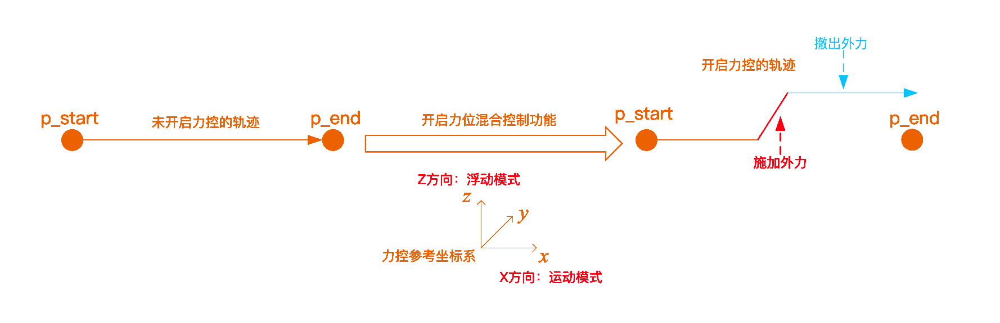
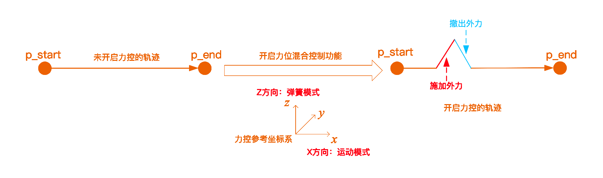
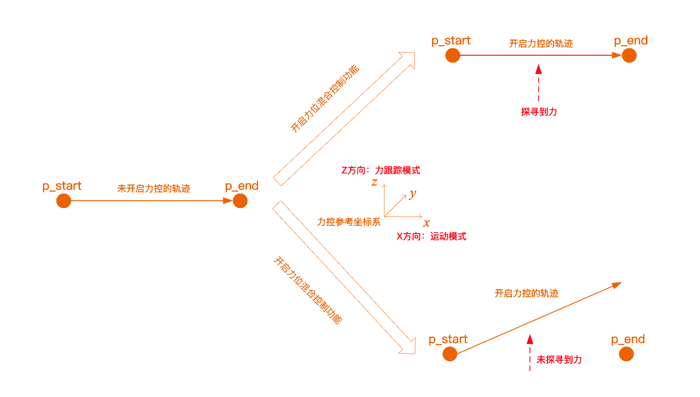
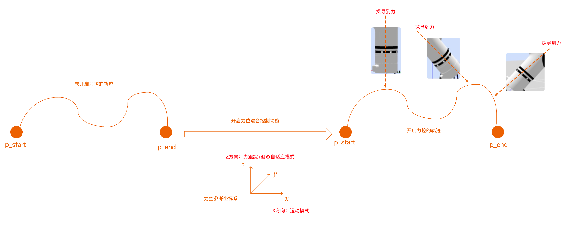

# <p class="hidden">JSON 协议：</p>运动指令集

## 轨迹运动

### 关节运动`movej`

- **输入参数**

| 参数                 | 类型     | 说明                                                                                                              |
| :------------------- | :------- | :---------------------------------------------------------------------------------------------------------------- |
| `movej`              | `string` | 关节运动指令。                                                                                                    |
| `joint`              | `int`    | 目标关节角度，精度 0.001°。                                                                                       |
| `v`                  | `int`    | 速度百分比例系数，0~100。                                                                                         |
| `r`                  | `int`    | 交融半径百分比系数，0-100。                                                                                       |
| `trajectory_connect` | `int`    | 可选参数，代表是否和下一条运动一起规划，0 代表立即规划，1 代表和下一条轨迹一起规划，当为 1 时，轨迹不会立即执行。 |

::: warning 注意
trajectory_connect 参数为 1 交融半径才生效，如果为 0 则交融半径不生效
:::

- **输出参数**

| 参数            | 类型   | 说明                                  |
| :-------------- | :----- | :------------------------------------ |
| `receive_state` | `bool` | `ture`：设置成功；`false`：设置失败。 |

- **代码示例**

**输入**  

实现：关节运动，参数如下：

六自由度关节角度：[10.1°,0.2°,20.3°,30.4°,0.5°,20.6°]；<br>
七自由度关节角度：[10.1°,0.2°,20.3°,30.4°,0.5°,20.6°,20.6°]；<br>
速度系数50%；<br>
交融半径：不交融。

六自由度：

```json
{"command":"movej","joint":[10100,200,20300,30400,500,20600],"v":50,"r":0,"trajectory_connect":0}
```

七自由度：

```json
{"command":"movej","joint":[10100,200,20300,30400,500,20600,20600],"v":50,"r":0,"trajectory_connect":0}
```

**输出**  

指令接收成功：

```json
{
    "command": "movej",
    "receive_state": true
}
```

指令接收失败：

```json
{
    "command": "movej",
    "receive_state": false
}
```

运动到位：

```json
{
    "state": "current_trajectory_state",
    "trajectory_state": true,
    "device": 0,
    "trajectory_connect": 1
}
```

::: warning 注意
trajectory_connect：代表是否连接下一条轨迹，0 代表全部到位， 1 代表连接下一条轨迹
:::

### 直线运动`movel`

- **输入参数**

| 参数                 | 类型     | 说明                                                                                                              |
| :------------------- | :------- | :---------------------------------------------------------------------------------------------------------------- |
| `movel`              | `string` | 直线运动执行。                                                                                                    |
| `pose`               | `int`    | 目标位姿，位置精度：0.001mm，姿态精度：0.001rad。                                                                 |
| `v`                  | `int`    | 速度百分比例系数，0~100。                                                                                         |
| `r`                  | `int`    | 交融半径百分比系数，0-100。                                                                                       |
| `trajectory_connect` | `int`    | 可选参数，代表是否和下一条运动一起规划，0 代表立即规划，1 代表和下一条轨迹一起规划，当为 1 时，轨迹不会立即执行。 |

::: warning 注意
MOVEL 指令也适用于目标位置不变，姿态变化<br>
trajectory_connect 参数为 1 交融半径才生效，如果为 0 则交融半径不生效
:::

- **输出参数**

| 参数 | 类型 | 说明 |
| :-------------- | :----- | :------------------------------------ |
| `receive_state` | `bool` | `ture`：设置成功；`false`：设置失败。 |

- **代码示例**

**输入**  

实现：直线运动，参数如下：

目标位置：x：0.1m，y：0.2m，z：0.03m<br>
目标姿态：rx：0.4rad，ry：0.5rad，rz：0.6rad<br>
速度系数：50%<br>
交融半径：不交融。

六自由度：

```json
{"command":"movel","pose":[100000,200000,30000,400,500,600],"v":50,"r":0,"trajectory_connect":0}
```

**输出**  

指令接收成功：

```json
{
    "command": "movel",
    "receive_state": true
}
```

指令接收失败：

```json
{
    "command": "movel",
    "receive_state": false
}
```

运动到位：

```json
{
    "state": "current_trajectory_state",
    "trajectory_state": true,
    "device": 0,
    "trajectory_connect": 1
}
```

::: warning 注意
trajectory_connect：代表是否连接下一条轨迹，0 代表全部到位，1 代表连接下一条轨迹
:::

### 圆弧运动`movec`

- **输入参数**

| 参数                 | 类型     | 说明                                                                                                              |
| :------------------- | :------- | :---------------------------------------------------------------------------------------------------------------- |
| `movec`              | `string` | 圆弧运动                                                                                                          |
| `pose`               | `int`    | 位姿。                                                                                                            |
| `pose_via`           | `int`    | 中间点位姿，位置精度 0.001mm，姿态精度 0.001rad。                                                                 |
| `pose_to`            | `int`    | 目标位姿，位置精度 0.001mm，姿态精度 0.001rad。                                                                   |
| `v`                  | `int`    | 速度百分比例系数，0~100。                                                                                         |
| `r`                  | `int`    | 交融半径百分比系数，0-100。                                                                                       |
| `loop`               | `int`    | 循环圈数，默认 0。                                                                                                |
| `trajectory_connect` | `int`    | 可选参数，代表是否和下一条运动一起规划，0 代表立即规划，1 代表和下一条轨迹一起规划，当为 1 时，轨迹不会立即执行。 |

::: warning 注意
trajectory_connect 参数为 1 交融半径才生效，如果为 0 则交融半径不生效。
:::

- **输出参数**

| 参数            | 类型   | 说明                                  |
| :-------------- | :----- | :------------------------------------ |
| `receive_state` | `bool` | `ture`：设置成功；`false`：设置失败。 |

- **代码示例**

**输入**  

实现：圆弧运动，参数如下：

中间点位置：x：0.1m，y：0.2m，z：0.03m；<br>
中间点姿态：rx：0.4rad，ry：0.5rad，rz：0.6rad；<br>
终点位置：x：0.2m，y：0.3m，z：0.03m；<br>
终点姿态：rx：0.4rad，ry：0.5rad，rz：0.6rad；<br>
速度系数：50%；<br>
交融半径：不交融。<br>

```json
{"command":"movec","pose":{"pose_via":[100000,200000,30000,400,500,600],"pose_to":[200000,300000,30000,400,500,600]},"v":50,"r":0,"loop":0,"trajectory_connect":0}
```

**输出**  

指令接收成功：

```json
{
    "command": "movec",
    "receive_state": true
}
```

指令接收失败：

```json
{
    "command": "movec",
    "receive_state": false
}
```

运动到位：

```json
{
    "state": "current_trajectory_state",
    "trajectory_state": true,
    "device": 0,
    "trajectory_connect": 1
}
```

::: warning 注意
trajectory_connect：代表是否连接下一条轨迹，0 代表全部到位，1 代表连接下一条轨迹。
:::

### 关节空间规划到目标位姿`movej_p`

通过关节空间规划运动到目标位姿。

- **输入参数**

| 参数                 | 类型     | 说明                                                                                                              |
| :------------------- | :------- | :---------------------------------------------------------------------------------------------------------------- |
| `movej_p`            | `string` | 关节空间规划到目标位姿指令。                                                                                      |
| `pose`               | `int`    | 目标位姿，位置精度：0.001mm，姿态精度：0.001rad。                                                                 |
| `v`                  | `int`    | 速度百分比系数，1~100。                                                                                           |
| `r`                  | `int`    | 交融半径百分比系数，0~100。                                                                                       |
| `trajectory_connect` | `int`    | 可选参数，代表是否和下一条运动一起规划，0 代表立即规划，1 代表和下一条轨迹一起规划，当为 1 时，轨迹不会立即执行。 |

- **输出参数**

| 参数                 | 类型   | 说明                                                           |
| :------------------- | :----- | :------------------------------------------------------------- |
| `receive_state`      | `bool` | `ture`：设置成功；`false`：设置失败。                          |
| `trajectory_connect` | `int`  | 代表是否连接下一条轨迹，0 代表全部到位，1 代表连接下一条轨迹。 |

- **代码示例**

**输入**  

实现：直线运动，运动参数如下：

目标位置：x：0.1m，y：0.2m，z：0.03m；<br>
目标姿态：rx：0.4rad，ry：0.5rad，rz：0.6rad；<br>
速度系数：50%；<br>
交融~半径：不交融。

```json
{"command":"movej_p","pose":[100000,200000,30000,400,500,600],"v":50,"r":0,"trajectory_connect":0}
```

**输出**  

返回指令接收状态且运动到位：

```json
{
    "state": "pose_state",
    "pose": [
        10,
        20,
        30,
        40,
        50,
        60
    ],
    "joint": [
        10,
        20,
        30,
        40,
        50,
        60,
        70
    ],
    "arm_err": 0
}

{
    "state": "current_trajectory_state",
    "trajectory_state": true,
    "device": 0,
    "trajectory_connect": 1
}
```

### 样条曲线运动`moves`

样条曲线运动是一种通过控制点（也称为节点或关键点）定义的平滑曲线运动轨迹。为了实现样条曲线运动，需要至少三个不同的型值点才能完成控制点反算，连续使用 moves 指令来输入这些型值点。

- **输入参数**

| 参数                 | 类型     | 说明                                                                                                              |
| :------------------- | :------- | :---------------------------------------------------------------------------------------------------------------- |
| `moves`              | `string` | 样条曲线运动指令。                                                                                                |
| `pose`               | `int`    | 目标位姿，位置精度：0.001mm，姿态精度：0.001rad。                                                                 |
| `v`                  | `int`    | 速度百分比例系数，0~100。                                                                                         |
| `r`                  | `int`    | 交融半径百分比系数，0-100。                                                                                       |
| `trajectory_connect` | `int`    | 可选参数，代表是否和下一条运动一起规划，0 代表立即规划，1 代表和下一条轨迹一起规划，当为 1 时，轨迹不会立即执行。 |

::: warning 注意
该运动暂不支持轨迹交融。
:::

- **输出参数**

| 参数 | 类型 | 说明 |
| :-------------- | :----- | :------------------------------------ |
| `receive_state` | `bool` | `ture`：设置成功；`false`：设置失败。 |

- **代码示例**

**输入**  

实现：发三个点实现一条样条曲线运动，参数如下：

目标位置：<br>
x：0.1m，y：0.2m，z：0.03m；<br>
x：0.1m，y：0.3m，z：0.03m；<br>
x：0.1m，y：0.4m，z：0.03m；<br>
目标姿态：rx：0.4rad，ry：0.5rad，rz：0.6rad；<br>
速度系数：50%；<br>
交融半径：不交融。

::: warning 注意
以下指令需逐行运行。
:::

```json
{"command":"moves","pose":[100000,200000,30000,400,500,600],"v":50,"r":0,"trajectory_connect":1}{"command":"moves","pose":[100000,300000,30000,400,500,600],"v":50,"r":0,"trajectory_connect":1}{"command":"moves","pose":[100000,400000,30000,400,500,600],"v":50,"r":0,"trajectory_connect":0}
```

**输出**  

指令接收成功：

```json
{
    "command": "moves",
    "receive_state": true
}
```

指令接收失败：

```json
{
    "command": "moves",
    "receive_state": false
}
```

运动到位：

```json
{
    "state": "current_trajectory_state",
    "trajectory_state": true,
    "device": 0,
    "trajectory_connect": 1
}
```

::: warning 注意
trajectory_connect：代表是否连接下一条轨迹，0 代表全部到位，1 代表连接下一条轨迹
:::

### 位姿透传`movep_canfd`

目标位姿透传给机械臂 CANFD，不通过控制器规划。目标位姿为当前工具在当前工作和工具坐标系下的数值。

- **输入参数**

| 参数          | 类型     | 说明                                                                                             |
| :------------ | :------- | :----------------------------------------------------------------------------------------------- |
| `movep_canfd` | `string` | 位透传到 CANFD，若指令正确，机械臂立即执行。                     |
| `pose`        | `int`    | 目标位姿。位置精度：0.001mm，姿态精度：0.001rad。                                                |
| `follow`      | `bool`   | 表示驱动器的运动跟随效果，true 为高跟随，false 为低跟随。若使用高跟随，透传周期要求不超过 10ms。 |

::: warning 注意
透传效果和周期、轨迹是否平滑有关，周期要求稳定，防止出现较大波动，第二代 WIFI 和网口模式透传周期最快 20ms，USB 和 RS485 模式透传周期最快 10ms。

高速网口的透传周期最快也可到 10ms，不过在使用该高速网口前，需要使用指令打开配置。

另外 第三代有线网口周期最快可达 2ms。

用户使用该指令时请做好轨迹规划，轨迹规划的平滑程度决定了机械臂的运行状态，帧与帧之间关节的角度最大不能超过 10°，并保证关节规划的速度不要超过 180°/s，否则关节会不响应
:::

- **输出参数**

| 参数      | 类型     | 说明                                                                                         |
| :-------- | :------- | :------------------------------------------------------------------------------------------- |
| `pose`    | `array`  | 当前位姿，位置精度：0.001mm，姿态精度：0.001rad。                                            |
| `joint`   | `array`  | 当前关节角度，关节精度：0.001°。                                                             |
| `arm_err` | `number` | 状态码。若为 0，则代表系统正常，指令正常运行；若为其他错误，则反馈相应错误代码，指令不执行。 |

::: warning 注意
第三代机械臂不再提供返回值，通过 UDP 状态主动上报接口采集机械臂实时状态。
:::

- **代码示例**

**输入**  

实现：目标位姿透传，参数如下：

目标位置：x：0.1m，y:0.2m，z：0.03m；<br>
目标姿态（欧拉角）：rx：0.4rad，ry：0.5rad，rz：0.6rad；<br>
目标姿态（四元数）：w：0.4，x：0.5，y：0.6，z：0.7。

- **代码示例**

**输入**  

位姿透传欧拉角方式：

```json
{"command":"movep_canfd","pose":[100000,200000,30000,400,500,600],"follow":true}
```

位姿透传四元数方式：

```json
{"command":"movep_canfd","pose_quat":[100000,200000,30000,400000,500000,600000,700000],"follow":true}
```

**输出**

六自由度当前位姿：位置精度：0.001mm，姿态精度：0.001rad；<br>
joint：当前关节角度，关节精度：0.001°；

```json
{
    "state": "pose_state",
    "pose": [
        10,
        20,
        30,
        40,
        50,
        60
    ],
    "joint": [
        10,
        20,
        30,
        40,
        50,
        60
    ],
    "arm_err": 0
}
```

七自由度当前位姿：位置精度：0.001mm，姿态精度：0.001rad；<br>
joint：当前关节角度，关节精度：0.001°；

```json
{
    "state": "pose_state",
    "pose": [
        10,
        20,
        30,
        40,
        50,
        60
    ],
    "joint": [
        10,
        20,
        30,
        40,
        50,
        60,
        70
    ],
    "arm_err": 0
}
```

### 角度透传`movej_canfd`

角度通过 CANFD 透传给机械臂，不通过控制器规划。

- **输入参数**

| 参数          | 类型     | 说明                                                                                             |
| :------------ | :------- | :----------------------------------------------------------------------------------------------- |
| `movej_canfd` | `string` | 角度透传到 CANFD，若指令正确，机械臂立即执行。                                                   |
| `joint`       | `int`    | 关节角度，精度 0.001°。                                                                          |
| `follow`      | `bool`   | 表示驱动器的运动跟随效果，true 为高跟随，false 为低跟随。若使用高跟随，透传周期要求不超过 10ms。 |
| `expand`      | `int`    | 为下发可选字段，如果存在通用扩展轴，并需要进行透传，可使用此字段进行透传发送。                   |

::: warning 注意
透传效果和周期、轨迹是否平滑有关，周期要求稳定，防止出现较大波动，第二代 WIFI 和网口模式透传周期最快 20ms，USB 和 RS485 模式透传周期最快 10ms。

高速网口的透传周期最快也可到 10ms，不过在使用该高速网口前，需要使用指令打开配置。

另外 第三代有线网口周期最快可达 2ms

用户使用该指令时请做好轨迹规划，轨迹规划的平滑程度决定了机械臂的运行状态，帧与帧之间关节的角度最大不能超过 10°，并保证关节规划的速度不要超过 180°/s，否则关节会不响应
:::

- **输出参数**

| 参数 | 类型 | 说明 |
| :-------- | :------- | :--------- |
| `arm_err` | `number` | 状态码。若为 0，则代表系统正常，指令正常运行；若为其他错误，则反馈相应错误代码，指令不执行 |

- **代码示例**

**输入**  

实现：目标角度透传到机械臂 CANFD，参数如下：

六自由度机械臂目标关节角度：[1°,0°,20°,30°,0°,20°]；<br>
七自由度机械臂目标关节角度：[1°,0°,20°,30°,0°,20°,20°]。

六自由度：

```json
{"command":"movej_canfd","joint":[1000,0,20000,30000,0,20000],"follow":true,"expand":1000}
```

七自由度：

```json
{"command":"movej_canfd","joint":[1000,0,20000,30000,0,20000,20000],"follow":true,"expand":1000}
```

**输出**  

六自由度：

```json
{
    "state": "joint_state",
    "joint": [
        10,
        20,
        30,
        40,
        50,
        60
    ],
    "arm_err": 0
}
```

七自由度：

```json
{
    "state": "joint_state",
    "joint": [
        10,
        20,
        30,
        40,
        50,
        60,
        70
    ],
    "arm_err": 0
}
```

### 关节空间跟随运动`movej_follow`

给机械臂更新目标关节角度，机械臂会自动规划轨迹运动跟随目标点。

- **输入参数**

| 参数          | 类型     | 说明                                                                                             |
| :------------ | :------- | :----------------------------------------------------------------------------------------------- |
| `movej_follow` | `string` | 目标角度更新给机械臂。                                                  |
| `joint`       | `int`    | 关节角度，精度 0.001°。                                                                          |

::: warning 备注
用户使用该指令时无需自行规划轨迹
:::

- **代码示例**

**输入**  

说明：目标角度，六自由度机械臂目标关节角度：[1°,0°,20°,30°,0°,20°]，七自由度机械臂目标关节角度：[1°,0°,20°,30°,0°,20°,20°]。

六自由度：

```json
{"command":"movej_follow","joint":[1000,0,20000,30000,0,20000]}
```

七自由度：

```json
{"command":"movej_follow","joint":[1000,0,20000,30000,0,20000,20000]}
```

**输出**  

可通过[UDP上报接口](../json/udpConfig.md#udp-机械臂状态主动上报接口)获取实时关节信息

### 笛卡尔空间跟随运动`movep_follow`

给机械臂更新目标关节角度，机械臂会自动规划轨迹运动跟随目标点。

- **输入参数**

| 参数          | 类型     | 说明                                                                                             |
| :------------ | :------- | :----------------------------------------------------------------------------------------------- |
| `movep_follow` | `string` | 目标角度更新给机械臂。                                                |
| `joint`       | `int`    | 关节角度，精度 0.001°。                                                                          |

::: warning 备注
用户使用该指令时无需自行规划轨迹
:::

- **代码示例**

**输入**  

说明：pose：目标位姿，位置精度：0.001mm，姿态精度：0.001rad

1. 目标位置：x：0.1m，y:0.2m，z：0.03m
2. 目标姿态（欧拉角）：rx：0.4rad，ry：0.5rad，rz：0.6rad
3. 目标姿态（四元数）：w：0.4，x：0.5，y：0.6，z：0.7
4. 目标位姿为当前工具在当前工作和工具坐标系下的数值

六自由度：

```json
{"command":"movep_follow","pose":[100000,200000,30000,400,500,600]}
```

七自由度：

```json
{"command":"movep_follow","pose_quat":[100000,200000,30000,400000,500000,600000,700000]}
```

**输出**  

可通过[UDP上报接口](../json/udpConfig.md#udp-机械臂状态主动上报接口)获取实时关节信息

## 力位混合运动（选配）

### 力位混合控制`set_force_position`

在笛卡尔空间轨迹规划时，使用该功能时开启力位混合控制，可以指定力控参考坐标系下的多个方向为力控方向，同时每个力控方向提供多种力控模式选择。<br>使用时力控方向与机械臂运动方向不能在同一方向。开启力位混合控制，执行笛卡尔空间运动。

- **输入参数**

| 功能描述 | 类型 |说明|
| :--- | :--- |:---|
| `set_force_position` | `string` |设置力位混合控制模式。|
| `sensor` | `int` |传感器；0-一维力；1-六维力。|
| `control_mode` | `int` |6个方向（Fx Fy Fz Mx My Mz）的模式 0-固定模式 1-浮动模式 2-弹簧模式 3-运动模 4-力跟踪模式 8-力跟踪+姿态自适应模式（模式8只对工具坐标系的Fz方向有效）|
| `desired_force` | `int` |力控轴维持的期望力/力矩，力控轴的力控模式为力跟踪模式时，期望力/力矩设置才会生效 ，单位0.1N。|
| `limit_vel` | `int` |力控轴的最大线速度和最大角速度限制，只对开启力控方向生效。（x、y、z）轴的最大线速度，单位为0.001 m/s，（rx、ry、rz）轴的最大角速度单位为0.001 °/s|

**备注**  

control_mode：力控轴（x、y、z、rx、ry、rz）的力控模式，取值范围为{0,1,2,3,4,8}。0代表“固定模式”，1代表“浮动模式”，2代表“弹簧模式”，3代表“运动模式”，4代表“力跟踪模式”，8代表“力跟踪+姿态自适应模式”。默认值为[3,3,4,3,3,3]，表示Z方向处于恒力跟踪状态，其他方向处于运动控制状态。

1. 固定模式（0）：该方向处于锁轴状态，不会发生运动。
2. 浮动模式（1）：该方向表现为滑块，受到外力后末端将沿着该轴运动，撤掉外力后该方向将保持位置/姿态不变。

3. 弹簧模式（2）：该方向表现为弹簧，受到外力后末端将沿着该轴运动，撤掉外力后该方向位置/姿态将自动恢复到受力前状态。

4. 运动模式（3）：该方向受笛卡尔空间轨迹规划运动指令控制。
5. 力跟踪模式（4）：该方向维持设定的期望力/力矩，例如z方向的期望力设为10N，那么控制器将会维持该方向的力为10N，即恒力控制。

6. 力跟踪模式+姿态自适应模式（8）：该方向维持设定的期望力/力矩，并且力控参考坐标系的Rx、Ry和Rz方向的姿态可以根据接触环境的变化自动调整。该模式只能在力控参考坐标系的Z方向开启，并且力控参考坐标系必须为工具坐标系。开启该模式后，力控参考坐标系的Rx、Ry和Rz方向设置的任何模式都不生效。


- **代码示例**

**输入**  

```json
{"command":"set_force_position","sensor":1,"control_mode":[3,3,4,3,3,3],"desired_force":[0,0,10,0,0,0],"limit_vel":[100,100,100,10000,10000,10000]}
```

**输出**  

设置成功:

```json
{
    "command": "set_force_position",
    "set_state": true
}
```

设置失败:

```json
{
    "command": "set_force_position",
    "set_state": false
}
```

::: warning 注意

1. 该模式只能在力控参考坐标系的Z方向开启，并且力控参考坐标系必须为工具坐标系。开启该模式后，力控参考坐标系的Rx、Ry和Rz方向设置的任何模式都不生效。
2. 由于姿态方向具有耦合性，在力控参考坐标系的Rx、Ry和Rz三个方向中，当其中一个或多个力控轴方向的力控模式设置为【运动模式】时，三个方向轴的力控模式都只能设置为【运动模式】
3. desired_force：力控轴维持的期望力/力矩，单位为N和Nm。axis_desired_force[6]，前三个元素表示期望力，取值范围为[-100,100]N；后三个元素表示期望力矩，取值范围为[-7,7]Nm。默认值为[0,0,0,0,0,0]。
4. limit_vel：力控轴的速度限制，单位为m/s和°/s。float axis_limit_vel[6]，前三个元素表示线速度限制，取值范围为[0,0.2]m/s；后三个元素表示角速度限制，取值范围为[0,10]°/s。默认值为[0.1,0.1,0.1,10,10,10]。力控轴的速度限制对“运动模式”是不生效的。
:::

### 结束力位混合控制`stop_force_position`

退出力位混合控制模式。

- **输入参数**

| 功能描述 | 类型 |说明|
| :--- | :--- |:---|
| `stop_force_position` | `string` |结束力位混合控制模式。|

- **代码示例**

**输入**  

```json
{"command":"stop_force_position"}
```

**输出**
结束成功：

```json
{
    "command": "stop_force_position",
    "stop_state": true
}
```

结束失败：

```json
{
    "command": "stop_force_position",
    "stop_state": false
}
```

### 透传力位混合控制补偿（选配）`Start_Force_Position_Move`

针对睿尔曼带一维力和六维力版本的机械臂，用户除了可直接使用示教器调用底层的力位混合控制模块外，还可以将自定义的轨迹以周期性透传的形式结合底层的力位混合控制算法进行补偿。

#### 开启透传力位混合控制补偿模式

开启底层力位混合控制模块补偿模式。在下发透传轨迹前必须下发该指令开启功能。

- **输入参数**

| 功能描述 | 类型 |说明|
| :--- | :--- |:---|
| `Start_Force_Position_Move` | `string` |开启透传力位混合控制补偿模式。|

- **代码示例**

**输入**  

```json
{"command":"Start_Force_Position_Move"}
```

**输出**
设置成功（true：设置成功，可进行后续透传。False：设置失败，机械臂有错误，不可进行后续透传）。

```json

{
    "command": "Start_Force_Position_Move",
    "set_state": true
}
```

#### 透传力位混合补偿

用户周期性下发目标角度或者目标位姿，使用机械臂底层力位混合控制模块通过一维力传感器或者六维力传感器实现力位补偿。<br>
当协议包含新参数的字段时默认采用新协议，同时兼容原有协议。

::: warning 注意

1. 该功能只适用于一维力传感器和六维力传感器机械臂版本
2. 透传效果和周期、轨迹是否平滑有关，周期要求稳定，防止出现较大波动，用户使用该指令时请做好轨迹规划，轨迹规划的平滑程度决定了机械臂的运行状态。基础系列 WIFI 和网口模式透传周期最快 20ms，USB 和 RS485 模式透传周期最快 10ms。高速网口的透传周期最快也可到 10ms，不过在使用该高速网口前，需要使用指令打开配置。另外 I 系列有线网口周期最快可达 2ms。
:::

- **输入参数**

| 功能描述 | 类型 |说明|
| :--- | :--- |:---|
| `Force_Position_Move` | `string` |透传力位混合补偿。|
| `pose` | `int` |当前坐标系下目标位姿，位置精度：0.001mm，欧拉角表示姿态，姿态精度：0.001rad。|
| `pose_quat` | `int` |表示当前坐标系下的目标位姿，位置精度：0.001mm，采用四元数方式表示姿态，姿态精度：0.000001。|
| `joint` | `int` |目标关节角度，精度0.001°。|
| `sensor` | `int` |所使用传感器类型，0-一维力，1-六维力。|
| `mode` | `int` |模式，0-沿工作坐标系，1-沿工具端坐标系。|
| `follow` | `int` |表示驱动器的运动跟随效果，true为高跟随，false为低跟随。|
| `control_mode` | `int` |6个方向（Fx Fy Fz Mx My Mz）的模式 0-固定模式 1-浮动模式 2-弹簧模式 3-运动模 4-力跟踪模式 8-力跟踪+姿态自适应模式（模式8只对Fz方向有效）。|
| `desired_force` | `int` |力控轴维持的期望力/力矩，力控轴的力控模式为力跟踪模式时，期望力/力矩设置才会生效 ，单位0.1N。|
| `limit_vel` | `int` |力控轴的最大线速度和最大角速度限制，只对开启力控方向生效。（x、y、z）轴的最大线速度，单位为0.001 m/s，（rx、ry、rz）轴的最大角速度单位为0.001 °/s。|

::: warning 注意

1. 该模式只能在力控参考坐标系的Z方向开启，并且力控参考坐标系必须为工具坐标系。开启该模式后，力控参考坐标系的Rx、Ry和Rz方向设置的任何模式都不生效。
2. 由于姿态方向具有耦合性，在力控参考坐标系的Rx、Ry和Rz三个方向中，当其中一个或多个力控轴方向的力控模式设置为【运动模式】时，三个方向轴的力控模式都只能设置为【运动模式】
3. desired_force：力控轴维持的期望力/力矩，单位为N和Nm。axis_desired_force[6]，前三个元素表示期望力，取值范围为[-100,100]N；后三个元素表示期望力矩，取值范围为[-7,7]Nm。默认值为[0,0,0,0,0,0]。
4. limit_vel：力控轴的速度限制，单位为m/s和°/s。float axis_limit_vel[6]，前三个元素表示线速度限制，取值范围为[0,0.2]m/s；后三个元素表示角速度限制，取值范围为[0,10]°/s。默认值为[0.1,0.1,0.1,10,10,10]。
5. control_mode：力控轴（x、y、z、rx、ry、rz）的力控模式，取值范围为{0,1,2,3,4,8}。0代表“固定模式”，1代表“浮动模式”，2代表“弹簧模式”，3代表“运动模式”，4代表“力跟踪模式”，8代表“力跟踪+姿态自适应模式”。默认值为[3,3,4,3,3,3]，表示Z方向处于恒力跟踪状态，其他方向处于运动控制状态。
:::

- **代码示例**

**输入**  

1. 单方向力位混合补偿示例

位姿（姿态欧拉角）方式：

```json
{"command":"Force_Position_Move","pose":[100000,200000,30000,400,500,600],"sensor":0,"mode":0,"dir":0,"force":15,"follow":true}
```

位姿（姿态四元数）方式：

```json
{"command":"Force_Position_Move","pose_quat":[100000,200000,30000,400000,500000,600000,700000],"sensor":0,"mode":0,"dir":0, "force":15,"follow":true}
```

角度方式:

```json
{"command":"Force_Position_Move","joint":[1000,2000,3000,4000,5000,6000],"sensor":0,"mode":0,"dir":0,"force":15,"follow":true}
```

2. 多方向力位混合补偿示例：

透传目标位姿进行力位混合控制补偿：

- 目标位置（欧拉角方式）：x：0.1m，y:0.2m，z：0.03m，Rx：0.4rad， Ry：0.5rad，Rz：0.6rad
- 目标位置（四元数方式）：x：0.1m，y:0.2m，z：0.03m，w：0.4， x：0.5，y：0.6，z：0.7

使用六维力传感器：

- "control_mode":[3,3,4,3,3,3]，表示Z方向处于恒力跟踪状态，其他方向处于运动控制状态。
- "desired_force":[0,0,100,0,0,0]，表示Z方向10N的力，其他方向为0.
- "limit_vel":[100,100,100,10000,10000,10000]，表示x,y,z方向0.1m/s，rx，ry，rz方向10°/s。

位姿（姿态欧拉角）方式：

```json
{"command":"Force_Position_Move","pose":[100000,200000,30000,400,500,600],"sensor":1,"mode":0,"follow":true,"control_mode":[3,3,4,3,3,3],"desired_force":[0,0,100,0,0,0],"limit_vel":[100,100,100,10000,10000,10000]}
```

位姿（姿态四元数）方式：

```json
{"command":"Force_Position_Move","pose_quat":[100000,200000,30000,400000,500000,600000,700000],"sensor":1,"mode":0,"follow":true,"control_mode":[3,3,4,3,3,3],"desired_force":[0,0,100,0,0,0],"limit_vel":[100,100,100,10000,10000,10000]}
```

3. 透传目标角度进行力位混合控制补偿

关节1~6目标角度：1°，2°，3°，4°，5°，6°

使用六维力传感器：

- "control_mode":[3,3,4,3,3,3]，表示Z方向处于恒力跟踪状态，其他方向处于运动控制状态。
- "desired_force":[0,0,100,0,0,0]，表示Z方向10N的力，其他方向为0.
- "limit_vel":[100,100,100,10000,10000,10000]，表示x,y,z方向0.1m/s，rx，ry，rz方向10°/s。

角度方式：

```json
{"command":"Force_Position_Move","joint":[1000,2000,3000,4000,5000,6000],"sensor":1,"mode":0,"follow":true,"control_mode":[3,3,4,3,3,3],"desired_force":[0,0,100,0,0,0],"limit_vel":[100,100,100,10000,10000,10000]}
```

**输出**  

规划成功——返回当前各关节角度和所使用力控方式的力或力矩，如果使用的是六维力，则也会返回全部方向上的力和力矩，需要注意的是第三代控制器机械臂不再提供返回值，可通过UDP状态主动上报接口采集机械臂实时状态。

一维力：当前关节1~6角度为0.01°~0.06°，所受到的力或力矩为-1.5

```json
{
    "state": "Force_Position_State",
    "joint": [
        10,
        20,
        30,
        40,
        50,
        60
    ],
    "force": -15,
    "arm_err": 0
}
```

六维力：当前关节1~6角度为0.01°~0.06°，力控方向所受到的力或力矩为-1.5N，所有方向的力或力矩为X：1.1N，Y：2.1N，Z：-1.5N，Rx：4.1Nm，Ry：5.1Nm，Rz：6.1Nm。<br>

```json
{
    "state": "Force_Position_State",
    "joint": [
        10,
        20,
        30,
        40,
        50,
        60
    ],
    "force": -15,
    "all_direction_force": [
        11,
        21,
        -15,
        41,
        51,
        61
    ],
    "arm_err": 0
}
```

需要注意的是第三代控制器机械臂TCP接口不再提供返回值，仅485接口提供此返回值，TCP通讯可通过[UDP状态主动上报接口](../json/udpConfig.md#udp-机械臂状态主动上报接口)采集机械臂实时状态。

规划失败——返回错误提示

```json
{
    "command": "Force_Position_Move",
    "set_state": false
}
```

::: warning 备注
透传开始的起点务必为机械臂当前位姿，否则可能会力控补偿失败或者机械臂无法运动！
:::

#### 关闭透传力位混合控制补偿模式

关闭底层力位混合控制模块补偿模式。在完成透传轨迹后必须下发该指令关闭功能。

- **输入参数**

| 功能描述 | 类型 |说明|
| :--- | :--- |:---|
| `Stop_Force_Position_Move` | `string` |关闭透传力位混合控制补偿模式。|

- **代码示例**

**输入**  

```json
{"command":"Stop_Force_Position_Move"}
```

**输出**
设置成功(True：设置成功，False：设置失败)。

```json
{
    "command": "Stop_Force_Position_Move",
    "set_state": true
}
```

## 运动控制

### 轨迹急停`set_arm_stop`

轨迹急停。

- **输入参数**

| 参数           | 类型     | 说明           |
| :------------- | :------- | :------------- |
| `set_arm_stop` | `string` | 姿态步进指令。 |

- **输出参数**

| 参数 | 类型 | 说明 |
| :--------- | :----- | :------------------------------------ |
| `arm_stop` | `bool` | `ture`：设置成功；`false`：设置失败。 |

- **代码示例**

**输入**  

实现：轨迹急停。

```json
{ "command": "set_arm_stop" }
```

**输出**  

```json
{
    "command": "set_arm_stop",
    "arm_stop": true
}
```

### 轨迹缓停`set_arm_slow_stop`

在当前正在运行的轨迹上停止。

- **输入参数**

| 参数                | 类型     | 说明           |
| :------------------ | :------- | :------------- |
| `set_arm_slow_stop` | `string` | 轨迹缓停指令。 |

- **输出参数**

| 参数 | 类型 | 说明 |
| :-------------- | :----- | :------------------------------------ |
| `arm_slow_stop` | `bool` | `ture`：设置成功；`false`：设置失败。 |

- **代码示例**

**输入**  

实现：轨迹缓停。

```json
{ "command": "set_arm_slow_stop" }
```

**输出**  

```json
{
    "command": "set_arm_slow_stop",
    "arm_slow_stop": true
}
```

### 轨迹暂停`set_arm_pause`

停在轨迹上，轨迹可恢复。

- **输入参数**

| 参数            | 类型     | 说明           |
| :-------------- | :------- | :------------- |
| `set_arm_pause` | `string` | 轨迹暂停指令。 |

- **输出参数**

| 参数 | 类型 | 说明 |
| :---------- | :----- | :------------------------------------ |
| `arm_pause` | `bool` | `ture`：设置成功；`false`：设置失败。 |

- **代码示例**

**输入**  

实现：轨迹暂停。

```json
{ "command": "set_arm_pause" }
```

**输出**  

```json
{
    "command": "set_arm_pause",
    "arm_pause": true
}
```

### 轨迹暂停后恢复`set_arm_continue`

- **输入参数**

| 参数               | 类型     | 说明                 |
| :----------------- | :------- | :------------------- |
| `set_arm_continue` | `string` | 轨迹暂停后恢复指令。 |

- **输出参数**

| 参数 | 类型 | 说明 |
| :------------- | :----- | :------------------------------------ |
| `arm_continue` | `bool` | `ture`：设置成功；`false`：设置失败。 |

- **代码示例**

**输入**  

实现：轨迹暂停后恢复。

```json
{ "command": "set_arm_continue" }
```

**输出**  

```json
{
    "command": "set_arm_continue",
    "arm_continue": true
}
```

### 清除当前轨迹`set_delete_current_trajectory`

清除当前轨迹，必须在暂停后使用！

- **输入参数**

| 参数                            | 类型     | 说明               |
| :------------------------------ | :------- | :----------------- |
| `set_delete_current_trajectory` | `string` | 清除当前轨迹指令。 |

- **输出参数**

| 参数 | 类型 | 说明 |
| :-------------------------- | :----- | :------------------------------------ |
| `delete_current_trajectory` | `bool` | `ture`：设置成功；`false`：设置失败。 |

- **代码示例**

**输入**  

实现：清除当前轨迹。

```json
{ "command": "set_delete_current_trajectory" }
```

**输出**  

```json
{
    "command": "set_delete_current_trajectory",
    "delete_current_trajectory": true
}
```

### 清除所有轨迹`set_arm_delete_trajectory`

清除所有轨迹，必须在暂停后使用！

- **输入参数**

| 参数                        | 类型     | 说明               |
| :-------------------------- | :------- | :----------------- |
| `set_arm_delete_trajectory` | `string` | 清除所有轨迹指令。 |

- **输出参数**

| 参数 | 类型 | 说明 |
| :---------------------- | :----- | :------------------------------------ |
| `arm_delete_trajectory` | `bool` | `ture`：设置成功；`false`：设置失败。 |

- **代码示例**

**输入**  

实现：清除所有轨迹。

```json
{ "command": "set_arm_delete_trajectory" }
```

**输出**  

```json
{
    "command": "set_arm_delete_trajectory",
    "arm_delete_trajectory": true
}
```

### 查询当前规划类型`get_arm_current_trajectory`

- **输入参数**

| 参数                         | 类型     | 说明                   |
| :--------------------------- | :------- | :--------------------- |
| `get_arm_current_trajectory` | `string` | 查询当前规划类型指令。 |

- **输出参数**

| 参数                     | 类型     | 说明                     |
| :----------------------- | :------- | :----------------------- |
| `arm_current_trajectory` | `string` | 返回当前正在运行的轨迹。 |

- **代码示例**

**输入**  

实现：查询当前规划类型。

```json
{ "command": "get_arm_current_trajectory" }
```

**输出**  

当前正在运行关节规划，数组内为当前关节角度，精度 0.001°

六自由度：

```json
{
    "state": "arm_current_trajectory",
    "type": "movej",
    "data": [
        0,
        0,
        0,
        0,
        0,
        0
    ]
}
```

七自由度：

```json
{
    "state": "arm_current_trajectory",
    "type": "movej",
    "data": [
        0,
        0,
        0,
        0,
        0,
        0,
        0
    ]
}
```

当前正在运行直线规划，数组内为当前末端位姿，位置精度：0.001mm，姿态精度：0.001rad。

```json
{"state":"arm_current_trajectory","type":"movel","data":[0,0,0,0,0,0]}
```

当前正在运行圆弧规划，数组内为当前末端位姿，位置精度：0.001mm，姿态精度：0.001rad。

```json
{
    "state": "arm_current_trajectory",
    "type": "movel",
    "data": [
        0,
        0,
        0,
        0,
        0,
        0
    ]
}
```

当前无规划，数组内为当前关节角度，精度 0.001°。

六自由度：

```json
{
    "state": "arm_current_trajectory",
    "type": "none",
    "data": [
        0,
        0,
        0,
        0,
        0,
        0
    ]
}
```

七自由度：

```json
{
    "state": "arm_current_trajectory",
    "type": "none",
    "data": [
        0,
        0,
        0,
        0,
        0,
        0,
        0
    ]
}
```

### 轨迹结束返回标志`current_trajectory_state`

轨迹为当前轨迹。

- **输入参数**

| 参数                       | 类型     | 说明                                                                |
| :------------------------- | :------- | :------------------------------------------------------------------ |
| `current_trajectory_state` | `string` | 当前轨迹结束返回标志。                                              |
| `device`                   | `int`    | 0：关节、1：夹爪、2：灵巧手、3：升降机构、4：扩展关节、其他：保留。 |

**代码示例**  

实现：当前轨迹到达目标。

```json
{"state":"current_trajectory_state","trajectory_state":true,"device":0}
```

## 步进运动

### 关节步进`set_joint_step`

控制机械臂某个关节的步进运动。

- **输入参数**

| 参数             | 类型     | 说明                                                        |
| :--------------- | :------- | :---------------------------------------------------------- |
| `set_joint_step` | `string` | 关节步进指令。                                              |
| `joint_step`     | `int`    | （1）步进关节号；（2）关节步进角度，单位：°，精度：0.001°。 |
| `v`              | `int`    | 速度百分比例系数，0~10。                                    |

- **输出参数**

| 参数 | 类型 | 说明 |
| :-------------- | :----- | :------------------------------------ |
| `receive_state` | `bool` | `ture`：设置成功；`false`：设置失败。 |
| `trajectory_connect` | `num` | 代表是否连接下一条轨迹，0 代表全部到位，1 代表连接下一条轨迹。 |

- **代码示例**

**输入**  

实现：关节步进，关节 1 反方向步进 10 度，速度系数 30%。

```json
{ "command": "set_joint_step", "joint_step": [1, -10000], "v": 30 }
```

**输出**  

指令接收成功：

```json
{
    "command": "set_joint_step",
    "receive_state": true
}
```

指令接收失败：

```json
{
    "command": "set_joint_step",
    "receive_state": true
}
```

运动到位：

```json
{
    "state": "current_trajectory_state",
    "trajectory_state": true,
    "device": 0,
    "trajectory_connect": 1
}
```

::: warning 注意
trajectory_connect：代表是否连接下一条轨迹，0 代表全部到位，1 代表连接下一条轨迹
:::

### 位置步进`set_pos_step`

控制机械臂沿 x、y、z 轴方向直线步进运动。

- **输入参数**

| 参数           | 类型     | 说明                                                                   |
| :------------- | :------- | :--------------------------------------------------------------------- |
| `set_pos_step` | `string` | 位置步进指令。                                                         |
| `step_type`    | `string` | 步进类型，x_step 为 X 轴方向，y_step 为 Y 轴方向，z_step 为 Z 轴方向。 |
| `v`            | `int`    | 速度百分比例系数，0~100。                                              |
| `step`         | `int`    | 步进距离单位：m，精度：0.001mm，即 0.000001m。                         |

- **输出参数**

| 参数                 | 类型   | 说明                                                           |
| :------------------- | :----- | :------------------------------------------------------------- |
| `receive_state`      | `bool` | `ture`：设置成功；`false`：设置失败。                          |
| `trajectory_connect` | `num`  | 代表是否连接下一条轨迹，0 代表全部到位，1 代表连接下一条轨迹。 |

- **代码示例**

**输入**  

实现：位置步进，x 轴负方向步进 0.5m，速度 30%。

```json
{"command":"set_pos_step","step_type":"x_step","step":-500000,"v":30}
```

**输出**  

指令接收成功：

```json
{
    "command": "set_pos_step",
    "receive_state": true
}
```

指令接收失败：

```json
{
    "command": "set_pos_step",
    "receive_state": false
}
```

运动到位：

```json
{
    "state": "current_trajectory_state",
    "trajectory_state": true,
    "device": 0,
    "trajectory_connect": 1
}
```

::: warning 注意
trajectory_connect：代表是否连接下一条轨迹，0 代表全部到位，1 代表连接下一条轨迹
:::

### 姿态步进`set_ort_step`

控制机械臂沿 x、y、z 轴方向旋转步进运动。

- **输入参数**

| 参数           | 类型     | 说明                                                                       |
| :------------- | :------- | :------------------------------------------------------------------------- |
| `set_ort_step` | `string` | 姿态步进指令。                                                             |
| `step_type`    | `string` | 步进方向，rx_step：绕 X 轴旋转，ry_step：绕 Y 旋转，rz_step：绕 Z 轴旋转。 |
| `v`            | `int`    | 速度百分比例系数，0~100。                                                  |
| `step`         | `int`    | 步进弧度，单位：rad，精度 0.001rad。                                       |

- **输出参数**

| 参数 | 类型 | 说明 |
| :-------------- | :----- | :------------------------------------ |
| `receive_state` | `bool` | `ture`：设置成功；`false`：设置失败。 |
| `trajectory_connect` | `num` | 代表是否连接下一条轨迹，0 代表全部到位，1 代表连接下一条轨迹。 |

- **代码示例**

**输入**  

实现：姿态步进，x 轴负方向旋转 0.5rad，速度 30%。

```json
{"command":"set_ort_step","step_type":"rx_step","step":-500,"v":30}
```

**输出**  

指令接收成功：

```json
{
    "command": "set_ort_step",
    "receive_state": true
}
```

指令接收失败：

```json
{
    "command": "set_ort_step",
    "receive_state":  false
}
```

运动到位：

```json
{
    "state": "current_trajectory_state",
    "trajectory_state": true,
    "device": 0,
    "trajectory_connect": 1
}
```

::: warning 注意
trajectory_connect：代表是否连接下一条轨迹，0 代表全部到位，1 代表连接下一条轨迹
:::

## 示教运动

### 关节示教`set_joint_teach`

- **输入参数**

| 参数              | 类型     | 说明                                 |
| :---------------- | :------- | :----------------------------------- |
| `set_joint_teach` | `string` | 关节示教指令。                       |
| `teach_joint`     | `int`    | 关节序号。                           |
| `direction`       | `string` | 方向，“pos”：正方向，“neg”：反方向。 |
| `v`               | `int`    | 速度系数                             |

- **输出参数**

| 参数 | 类型 | 说明 |
| :------------ | :----- | :------------------------------------ |
| `joint_teach` | `bool` | `ture`：设置成功；`false`：设置失败。 |

- **代码示例**

**输入**  

实现：关节 1 示教，正方向，速度 50%。

```json
{"command":"set_joint_teach","teach_joint":1,"direction":"pos","v":50}
```

**输出**  

```json
{
    "command": "set_joint_teach",
    "joint_teach": true
}
```

### 位置示教`set_pos_teach`

- **输入参数**

| 参数            | 类型     | 说明                                 |
| :-------------- | :------- | :----------------------------------- |
| `set_pos_teach` | `string` | 位置示教指令。                       |
| `teach_type`    | `string` | 坐标轴，“x”，“y”，“z”。              |
| `direction`     | `string` | 方向，“pos”：正方向，“neg”：反方向。 |
| `v`             | `int`    | 速度系数                             |

- **输出参数**

| 参数 | 类型 | 说明 |
| :---------- | :----- | :------------------------------------ |
| `pos_teach` | `bool` | `ture`：设置成功；`false`：设置失败。 |

- **代码示例**

**输入**  

实现：位置示教，x 轴负方向，速度 50%。

```json
{"command":"set_pos_teach","teach_type":"x","direction":"neg","v":50}
```

**输出**  

```json
{
    "command": "set_pos_teach",
    "pos_teach": true
}
```

### 姿态示教`set_ort_teach`

- **输入参数**

| 参数            | 类型     | 说明                                 |
| :-------------- | :------- | :----------------------------------- |
| `set_ort_teach` | `string` | 姿态示教指令。                       |
| `teach_type`    | `string` | 旋转所绕坐标轴，”rx”，“ry”，“rz”。   |
| `direction`     | `string` | 方向，“pos”：正方向，“neg”：反方向。 |
| `v`             | `int`    | 速度系数                             |

- **输出参数**

| 参数 | 类型 | 说明 |
| :---------- | :----- | :------------------------------------ |
| `ort_teach` | `bool` | `ture`：设置成功；`false`：设置失败。 |

- **代码示例**

- **输出参数**

| 参数 | 类型 | 说明 |
| :----------- | :----- | :------------------------------------ |
| `stop_teach` | `bool` | `ture`：设置成功；`false`：设置失败。 |

**输入**  

实现：姿态示教，rx 轴负方向，速度 50%。

```json
{"command":"set_ort_teach","teach_type":"rx","direction":"neg","v":50}
```

**输出**  

```json
{
    "command": "set_ort_teach",
    "ort_teach": true
}
```

### 示教停止`set_stop_teach`

- **输入参数**

| 参数             | 类型     | 说明           |
| :--------------- | :------- | :------------- |
| `set_stop_teach` | `string` | 示教停止指令。 |

- **代码示例**

**输入**  

实现：示教停止。

```json
{ "command": "set_stop_teach" }
```

**输出**  

```json
{
    "command": "set_stop_teach",
    "stop_teach": true
}
```

### 设置示教参考坐标系`set_teach_frame`

- **输入参数**

| 参数              | 类型     | 说明                                 |
| :---------------- | :------- | :----------------------------------- |
| `set_teach_frame` | `string` | 设置示教参考坐标系指令。             |
| `frame_type`      | `number` | 0 代表工作坐标系，1 代表工具坐标系。 |

- **输出参数**

| 参数 | 类型 | 说明 |
| :---------- | :----- | :------------------------------------ |
| `set_state` | `bool` | `ture`：设置成功；`false`：设置失败。 |

- **代码示例**

**输入**  

实现：设置示教参考坐标系为工作坐标系。

```json
{"command":"set_teach_frame","frame_type":0}
```

**输出**  

```json
{
    "command": "set_teach_frame",
    "set_state": true
}
```

### 获取示教参考坐标系`get_teach_frame`

- **输入参数**

| 参数              | 类型     | 说明                     |
| :---------------- | :------- | :----------------------- |
| `get_teach_frame` | `string` | 获取示教参考坐标系指令。 |

- **输出参数**

| 参数 | 类型 | 说明 |
| :----------- | :------- | :--------------------------------- |
| `frame_type` | `number` | 0 代表工作坐标系，1 代表工具坐标系。 |

- **代码示例**

**输入**  

 实现：获取示教参考坐标系。

```json
{ "command": "get_teach_frame" }
```

**输出**  

```json
{
    "command": "get_teach_frame",
    "frame_type": 0
}
```
