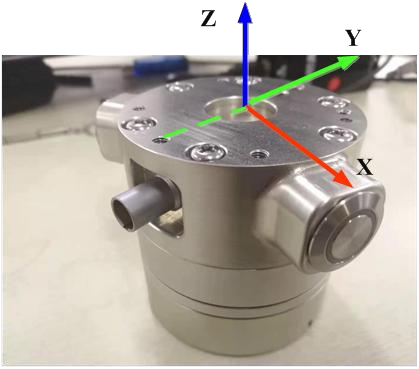

# <p class="hidden">JSON协议：</p>系统配置指令集

## 控制器状态

### 查询控制器状态`get_controller_state`

- **输入参数**

| 功能描述             | 类型     | 说明             |
| :------------------- | :------- | :--------------- |
| `get_controller_state` | `string` | 查询控制器状态。 |

- **输出参数**

| 功能描述 | 类型 |说明|
| :--- | :------------------------- |:---|
| `controller_state` | `string` |反馈控制器状态。 |

- **代码示例**

**输入**

```json
// 实现：查询控制器状态。
{ "command": "get_controller_state" }
```

**输出**

```json
//反馈控制器状态
//电压：24v，
//电流：1.5A
//温度：42℃
//控制器错误标志 0，
//电压、电流和温度的精度均为 0.001。
```

```json
{
  "state": "controller_state",
  "voltage": 24000,
  "current": 1500,
  "temperature": 42000,
  "err_flag": 0
}
```


## 系统指令

### 控制机械臂上电、断电`set_arm_power`

- **输入参数**

| 功能描述 | 类型 |说明|
| :--- | :------------------------- |:---|
| `set_arm_power` | `string` |控制机械臂上电、断电。|
| `arm_power` | `int` |上电状态1-上电0-断电。|

- **代码示例**

**输入**


```json
//说明：控制机械臂上电。
{
    "command":"set_arm_power",
    "arm_power":1
}
```

**输出**

```json
{
    "command": "set_arm_power",
    "arm_power": true
}
```

### 查询机械臂电源状态`get_arm_power_state`

- **输入参数**

| 功能描述 | 类型 |说明|
| :--- | :------------------------- |:---|
| `get_arm_power_state` | `string` |查询机械臂电源状态。               |

- **代码示例**

**输入**

```json
// 说明：查询机械臂电源状态。
{"command":"get_arm_power_state"}
```

**输出**

```json
// 上电状态（1-上电状态，0断电状态）。
{
    "state": "arm_power_state",
    "power_state": 1
}
```

### 查询软件版本号`get_arm_software_version`

- **输入参数**

| 功能描述 | 类型 |说明|
| :--- | :------------------------- |:---|
| `get_arm_software_version` | `string` |查询机械臂软件版本。|

- **输入参数**
```json
// 7013129：转换成uint32_t类型的16进制数据，0x6B0309。
// 6B：代表RM65-B型号6D-代表RM65-ZF型号6F-代表RM65-SF型号。
// 0309：代表软件版本号为V3.0.9。
// Product_version：机械臂型号，仅第三代机械臂支持。
```

- **代码示例**

**输入**

```json
// 说明：查询机械臂软件版本。
{"command":"get_arm_software_version"}
```

**输出**

```json
{
    "Real-time_Kernal2": 515,
    "state": "arm_software_version",
    "Ctrl_version": 7014147,
    "Plan_version": 7013891,
    "ctrlM4_build_info": "202212282001",
    "Real-time_Kernal1": 515,
    "ctrlM7_build_info": "202212282001",
    "Plan_build_info": "202212282001",
    "Product_version": "RM65-BI"
}
```


### 查询控制器的累计运行时间`get_system_runtime`

查询控制器自出厂以来，累计的运行时间。

- **输入参数**

| 功能描述 | 类型 |说明|
| :--- | :------------------------- |:---|
| `get_system_runtime` | `string` |查询控制器累计的运行时间。|

- **代码示例**

**输入**

```json
// 说明：查询系统运行时间。
{"command":"get_system_runtime"}
```

**输出**

```json
// 若系统正常，则返回运行时间。
{
    "command": "get_system_runtime",
    "day": 0,
    "hour": 0,
    "min": 0,
    "sec": 0
}
```

### 清零控制器的累计运行时间`clear_system_runtime`

清零控制器自出厂以来，累计的运行时间。

- **输入参数**

| 功能描述 | 类型 |说明|
| :--- | :------------------------- |:---|
| `clear_system_runtime` | `string` |清零控制器累计的运行时间。|

- **代码示例**

**输入**

```json
// 说明：清零系统运行时间。
{"command":"clear_system_runtime"}
```

**输出**

```json
// 清除成功（true-清除成功，false-清除失败）。
{
    "command": "clear_system_runtime",
    "clear_state": true
}
```

### 查询关节的累计转动角度`get_joint_odom`

查询各关节自出厂以来，累计的转动角度。

- **输入参数**

| 功能描述 | 类型 |说明|
| :--- | :------------------------- |:---|
| `get_joint_odom` | `string` |查询各关节的累计转动角度。|

- **代码示例**

**输入**

```json
// 说明：查询关节的累计转动角度。
{"command":"get_joint_odom"}  
```

**输出**

```json
//若指令正确，返回六自由度各关节累计的转动角度。
{
    "command": "get_joint_odom",
    "odom": [1000,2000,3000,4000,5000,6000]
}
```


```json
//若指令正确，返回七自由度各关节累计的转动角度。
{
    "command": "get_joint_odom",
    "odom": [1000,2000,3000,4000,5000,6000,7000]
}
```

### 清零关节的累计转动角度`clear_joint_odom`

清零各关节自出厂以来，累计的转动角度。

- **输入参数**

| 功能描述 | 类型 |说明|
| :--- | :------------------------- |:---|
| `clear_joint_odom` | `string` |清零关节累计转动的角度。|

- **代码示例**

**输入**

```json
// 说明：清零关节累计转动的角度。
{"command":"clear_joint_odom"}
```

**输出**

```json
// 清除成功（true-清除成功，false-清除失败）。
{
    "command": "clear_joint_odom",
    "clear_state": true
}
```

### 设置高速网口（第二代）`set_high_speed_eth`

控制器面板有2个网口，左侧为高速网口，默认为关闭状态，需要通过指令打开；右侧靠近面板边缘的为普通网口，用户无需配置，可直接使用。

::: warning 注意
高速网口的IP地址为：192.168.1.18，端口号为：8080，可修改。
:::

- **输入参数**

| 功能描述 | 类型 |说明|
| :--- | :------------------------- |:---|
| `set_high_speed_eth` | `string` |配置高速网口。|
| `mode` | `int` |0：关闭高速网口；1：打开高速网口。打开高速网口设置成功后，机械臂控制器蜂鸣器会提示，然后用户将网线插在高速网口上，重启控制器，初始化成功后用户即可使用。该配置信息会保存在控制器内，重启后不会丢失。|

::: warning 注意
控制器启动后，会自动查询上位机MAC地址，一直等待上位机与控制网口的物理连接。
:::

- **代码示例**

**输入**

```json
{
    "command":"set_high_speed_eth", 
    "mode":0
}  
```

**输出**


```json
// 设置成功（true-设置成功，false-设置失败）。
{
    "command": "set_high_speed_eth",
    "set_state": true
}
```

### 参数保存（第二代）`set_high_speed_eth`

- **输入参数**

| 功能描述 | 类型 |说明|
| :--- | :------------------------- |:---|
| `save_device_info_all` | `string` |保存所有参数。|

- **代码示例**

**输入**

```json
// 说明：保存所有参数
{"command":"save_device_info_all"}
```

**输出**

```json
//设置成功（true-设置成功，false-设置失败）。
{
    "command": "save_device_info_all",
    "model": true
}
```

### 设置有线网IP地址（第三代）`set_NetIP`

- **输入参数**

| 功能描述 | 类型 |说明|
| :--- | :------------------------- |:---|
| `set_NetIP` | `string` |配置有线网口IP地址。|

::: warning 注意
指令下发后，若成功设置机械臂蜂鸣器会响一声，然后手动重启机械臂。
:::

- **代码示例**

**输入**

```json
//说明：配置有线网口IP地址为192.168.1.20。
{"command":"set_NetIP","ip":"192.168.1.20"}
```

**输出**

```json
// IP地址设置成功：
{
    "command": "set_NetIP",
    "status": true
}
```


```json
// IP地址设置失败：
{
    "command": "set_NetIP",
    "status": false
}
```

### 清除系统错误`clear_system_err`

- **输入参数**

| 功能描述 | 类型 |说明|
| :--- | :------------------------- |:---|
| `clear_system_err` | `string` |清除系统错误。|

- **代码示例**

**输入**

```json
// 用于手动清除系统错误，如果不手动清除，错误将一直保留，直到新的运动指令下发则会自动清除
 {"command":"clear_system_err"} 
```

**输出**

```json
// 清除系统错误成功。
{
    "command": "clear_system_err",
    "clear_state": true
}
```


```json
// 清除系统错误失败。
{
    "command": "clear_system_err",
    "clear_state": false
}
```

### 查询机械臂软件信息`get_arm_software_info`

- **输入参数**

| 功能描述 | 类型 |说明|
| :--- | :------------------------- |:---|
| `get_arm_software_info` | `string` |查询机械臂软件信息。|

- **输出参数**

| 功能描述 | 类型 |说明|
| :--- | :------------------------- |:---|
| plan_info | `string` |plan层软件信息。|
| version | `float` |代表版本号。|
| build_time | `string` |代表编译时间。|
| ctrl_info | `string` |ctrl层软件信息。|
| version | `string` |代表版本号。|
| algorithm_info | `string` |算法库信息。|
| Product_version | `string` |机械臂型号，仅第三代机械臂支持。|
| dynamic_info | `string` |动力学版本，model_version 动力学模型版本号。|

- **代码示例**

**输入**

```json
// 查询机械臂软件信息。
{"command":"get_arm_software_info"} 
```

**输出**

```json
{
    "Product_version": "RM65-BI",
    "algorithm_info": {
        "version": "1.2.3"
    },
    "command": "arm_software_info",
    "ctrl_info": {
        "build_time": "2023/12/13 20:58:10",
        "version": "V1.4.6"
    },
    "dynamic_info": {
        "model_version": "1"
    },
    "plan_info": {
        "build_time": "2023/12/13 20:58:24",
        "version": "V1.4.6"
    }
}
```


## 通讯配置

机械臂控制器可通过网口、WIFI、RS232-USB接口和RS485接口与用户通信，用户使用时无需切换，可使用上述任一接口，控制器收到指令后，若指令格式正确，则会通过相同的接口反馈数据。

### 设置wifiAP`set_wifi_ap`

配置wifiAP内容，无返回，设置成功后蜂鸣器响，手动重启控制器进入WIFIAP模式。

- **输入参数**

| 功能描述 | 类型 |说明|
| :--- | :------------------------- |:---|
| `set_wifi_ap` | `string` |配置wifiAP内容。|

- **代码示例**

**输入**

```json
// 配置wifiAP内容，wifi名称：robot，连接密码：12345678
{
    "command":"set_wifi_ap",
    "wifi_name":"robot",
    "password":"12345678"
}
```

### 设置wifiSTA`set_wifi_ap`

配置wifiSTA内容，无返回，设置成功后蜂鸣器响，手动重启控制器进入WIFISTA模式。

- **输入参数**

| 功能描述 | 类型 |说明|
| :--- | :------------------------- |:---|
| `set_wifi_sta` | `string` |配置wifiSTA内容。|

- **代码示例**

**输入**

```json
// 配置wifiSTA内容，目标路由器名称：robot，路由器密码：12345678。
{
    "command":"set_wifi_sta",
    "router_name":"robot",
    "password":"12345678"
}
```

### 设置USB（第二代）`set_usb`

配置UART-USB波特率，无返回。波特率可选范围：9600，19200，38400，115200和460800，若用户设置其他数据，控制器会默认按照460800处理。该指令下发后控制器会记录当前波特率，断电重启后仍会使用该波特率对外通信。

- **输入参数**

| 功能描述 | 类型 |说明|
| :--- | :------------------------- |:---|
| `set_usb` | `string` |配置USB波特率，最高460800。|

- **代码示例**

**输入**

```json
// 配置USB波特率为460800。
{
    "command":"set_usb",
    "baudrate":460800
}
```

### 设置RS485`set_RS485`

配置RS485接口波特率，无返回。波特率可选范围：9600，19200，38400，115200和460800，若用户设置其他数据，控制器会默认按照460800处理。该指令下发后，若Modbus模式为打开状态，则会自动关闭，同时控制器会记录当前波特率，断电重启后仍会使用该波特率对外通信。

- **输入参数**

| 功能描述 | 类型 |说明|
| :--- | :------------------------- |:---|
| `set_RS485` | `string` |配置RS485接口波特率，最高460800。|

- **代码示例**

**输入**

```json
// 配置RS485波特率为460800。

{
    "command":"set_RS485",
    "baudrate":460800
}
```

### 设置高速网口IP（第二代）`set_high_ethernet`

- **输入参数**

| 功能描述 | 类型 |说明|
| :--- | :------------------------- |:---|
| `set_high_ethernet` | `string` |设置高速网口网络配置。|
| `ip` | `string` |网络地址。|
| `mask` | `string` |子网掩码。|
| `gateway` | `string` |网关。|

- **代码示例**

**输入**

```json
// 配置高速网口网络IP。
{
    "command":"set_high_ethernet",
    "ip":"192.168.1.18",
    "mask":"255.255.255.0",
    "gateway":"192.168.1.1"
} 
```

**输出**

```json
// 设置成功（true-设置成功，false-设置失败）。
{
    "command": "set_high_ethernet",
    "state": true
}
```

### 查询高速网口IP（第二代）`get_high_ethernet`

- **输入参数**

| 功能描述 | 类型 |说明|
| :--- | :------------------------- |:---|
| `get_high_ethernet` | `string` |获取高速网口网络配置。|

- **输出参数**

| 功能描述 | 类型 |说明|
| :--- | :------------------------- |:---|
| `ip` | `string` |网络地址。|
| `mask` | `string` |子网掩码。|
| `gateway` | `string` |网关。|
| `mac` | `string` |mac地址。|

- **代码示例**

**输入**

```json
//获取高速网口网络配置。
{"command":"get_high_ethernet"}
```

**输出**

```json
{
    "command": "get_high_ethernet",
    "mask": "255.255.255.0",
    "ip": "192.168.1.20",
    "gateway": "192.168.1.1",
    "mac": "11:22:33:44:55:66"
}
```


### 查询有线网卡网络信息（第三代）`get_wired_net`

- **输入参数**

| 功能描述 | 类型 |说明|
| :--- | :------------------------- |:---|
| `get_wired_net` | `string` |获取有线网卡信息，未连接有线网卡则会返回无效数据。|


- **输出参数**

| 功能描述 | 类型 |说明|
| :--- | :------------------------- |:---|
| `ip` | `string` |网络地址。|
| `mask` | `string` |子网掩码。|
| `mac` | `string` |mac地址。|

- **代码示例**

**输入**

```json
// 查询有线网卡网络信息。
{"command":"get_wired_net"}   
```

**输出**

```json
{
    "command": "get_wired_net",
    "mask": "255.255.255.0",
    "ip": "192.168.1.18",
    "mac": "11:22:33:44:55:66"
}
```

### 查询无线网卡网络信息（第三代）`get_wifi_net`

- **输入参数**

| 功能描述 | 类型 |说明|
| :--- | :------------------------- |:---|
| get_wifi_net | `string` |查询无线网卡网络信息。|

- **输出参数**

| 功能描述 | 类型 |说明|
| :--- | :------------------------- |:---|
| `ip` | `string` |网络地址。|
| `mask` | `string` |子网掩码。|
| `mac` | `string` |mac地址。|
| `mode` | `string` |ap代表热点模式，sta代表联网模式。|
| `ssid` | `string` |设置或默认的wifi名称。|
| `password` | `string` |设置或默认的wifi密码。|
| `channel` | `int` |如果是AP模式，则存在此字段，标识wifi热点的物理信道号。|

- **代码示例**

**输入**

```json
// 查询无线网卡网络信息。
{"command":"get_wifi_net"}
```

**输出**

```json
{
    "command": "get_wifi_net",
    "mode": "ap",
    "mask": "255.255.255.0",
    "ip": "192.168.1.18",
    "mac": "11:22:33:44:55:66",
    "ssid": "realman_ap",
    "password": "12345678",
    "channel": 6
}
```


### 恢复网络设置（第三代）`set_net_default`

恢复网络出厂设置。设置成功后，手动重新启动后生效。

- **输入参数**

| 功能描述 | 类型 |说明|
| :--- | :------------------------- |:---|
| `set_net_default` | `string` |设置网络为出厂设置。|

- **代码示例**

**输入**

```json
//网络恢复默认设置
{"command":"set_net_default"} 
```

**输出**

```json
// 配置成功
{
    "command": "set_net_default",
    "net_default_state": true
}
```


```json
// 配置失败：
{
    "command": "set_net_default",
    "net_default_state": false
}
```

### 关闭wifi功能（第三代）`set_wifi_close`

配置关闭wifi功能，需要重启后生效。

- **输入参数**

| 功能描述 | 类型 |说明|
| :--- | :------------------------- |:---|
| `set_wifi_close` | `string` |配置关闭wifi功能。|

- **代码示例**

**输入**

```json
// 配置关闭wifi功能。
{"command":"set_wifi_close"} 
```

**输出**


```json
// 配置成功：
{
    "command": "set_wifi_close",
    "wifi_close_state": true
}
```


```json
// 配置失败：
{
    "command": "set_wifi_close",
    "wifi_close_state": false
}
```

## 查询机械臂状态信息

### 查询机械臂关节角度`get_joint_degree`

- **输入参数**

| 功能描述 | 类型 |说明|
| :--- | :------------------------- |:---|
| `get_joint_degree` | `string` |获取机械臂角度信息。|

- **代码示例**

**输入**

```json
//说明：查询机械臂关节角度。
{"command":"get_joint_degree"}
```

**输出**

```json
// 反馈六自由度机械臂关节角度，关节精度：0.001°。
{
    "state": "joint_degree",
    "joint": [10,20,30,40,50,60]
}
```


```json
// 反馈七自由度机械臂关节角度，关节精度：0.001°。
{
    "state": "joint_degree",
    "joint": [10,20,30,40,50,60,70]
}
```

### 一次性查询机械臂所有状态信息`get_arm_all_state`

- **输入参数**

| 功能描述 | 类型 |说明|
| :--- | :------------------------- |:---|
| `get_arm_all_state` | `string` |获取机械臂所有信息。|


- **输出参数**

| 功能描述 | 类型 |说明|
| :--- | :------------------------- |:---|
| 温度精度 | `int` |0.001℃。|
| 电流精度 | `int` |0.001mA。|
| 电压精度 | `int` |0.001V。|
| `err_flag` | `string` |关节错误代码。|
| `sys_err` | `string` |机械臂错误代码。|

- **代码示例**

**输入**

```json
// 说明：一次性查询机械臂所有信息。
{"command":"get_arm_all_state"}
```

**输出**

```json
// 反馈六自由度机械臂所有信息。
{
    "state": "arm_all_state",
    "all_state": {
        "temperature": [21,22,23,24,25,26],
        "current": [11,12,13,14,15,16],
        "voltage": [31,32,33,34,35,36],
        "err_flag": [1,2,3,4,5,6],
        "en_flag": [1,1,1,1,1,1],
        "sys_err": 0
    }
}
```


```json
// 反馈七自由度机械臂所有信息。
{
    "state": "arm_all_state",
    "all_state": {
        "temperature": [21,22,23,24,25,26,27],
        "current": [11,12,13,14,15,16,17],
        "voltage": [31,32,33,34,35,36,37],
        "err_flag": [1,2,3,4,5,6,7],
        "en_flag": [1,1,1,1,1,1],
        "sys_err": 0
    }
}
```


### 查询轨迹规划计数`get_arm_plan_num`

- **输入参数**

| 功能描述 | 类型 |说明|
| :--- | :------------------------- |:---|
| `get_arm_plan_num` | `string` |获取机械臂轨迹规划计数。|


- **输出参数**

| 功能描述 | 类型 |说明|
| :--- | :------------------------- |:---|
| `plan_num` | `int` |机械臂轨迹规计数。|
| `loop_num` | `int` |存在循环指令的行数，没有循环指令则返回空。|
| `loop_cont` | `int` |循环指令行数对应的运行次数，没有循环指令则返回空。|

- **代码示例**

**输入**

```json
// 反馈机械臂所有信息
{"command":"get_arm_plan_num"}
```

**输出**

```json
// 规划完成第三段轨迹，轨迹规划中不包含循环指令
{
    "loop_cont": [],
    "loop_num": [],
    "plan_num": 3,
    "state": "arm_plan_num"
}
```


### 查询控制器RS485模式（第三代）`get_controller_RS485_mode`

- **输入参数**

| 功能描述 | 类型 |说明|
| :--- | :------------------------- |:---|
| `get_controller_RS485_mode` | `string` |查询控制器RS485模式。|


- **输出参数**

| 功能描述 | 类型 |说明|
| :--- | :------------------------- |:---|
| `controller_RS485_mode` | `int` |0代表默认RS485串行通讯，1代表modbus-RTU主站模式，2-代表modbus-RTU从站模式。|
| `baudrate` | `int` |波特率。|
| `modbus_timeout` | `int` |modbus协议超时时间，单位100ms，仅在modbus-RTU模式下提供此字段。|

- **代码示例**

**输入**


```json
// 查询控制器RS485模式。
{"command":"get_controller_RS485_mode"}
```

**输出**

```json
{
    "command": "get_controller_RS485_mode",
    "controller_RS485_mode": 1,
    "baudrate": 460800,
    "modbus_timeout": 1
}
```


### 查询工具端RS485模式（第三代）`get_tool_RS485_mode`

- **输入参数**

| 功能描述 | 类型 |说明|
| :--- | :------------------------- |:---|
| `get_tool_RS485_mode` | `string` |查询工具端RS485模式。|

- **输出参数**

| 功能描述 | 类型 |说明|
| :--- | :------------------------- |:---|
| `tool_RS485_mode` | `int` |0代表默认RS485串行通讯，1代表modbus-RTU主站模式，2-代表modbus-RTU从站模式。|
| `baudrate` | `int` |波特率。|
| `modbus_timeout` | `int` |modbus协议超时时间，单位100ms，仅在modbus-RTU模式下提供此字段。|

- **代码示例**

**输入**

```json
// 查询工具端RS485模式。
{"command":"get_tool_RS485_mode"}
```

**输出**

```json
{
    "command": "get_tool_RS485_mode",
    "tool_RS485_mode": 0,
    "baudrate": 460800,
    "modbus_timeout": 1
}
```


## 控制器IO配置

机械臂具有IO端口，第二代数量和分类如下所示：

| 类型 | 说明 |
| :------ | :------------ |
| 数字输出：DO | 4路，可配置为0\~12V |
| 数字输入：DI | 3路，可配置为0\~12V |
| 模拟输出：AO | 4路，输出电压0\~10V |
| 模拟输入：AI | 4路，输入电压0\~10V |

第三代数量和分类如下所示：

| 数字IO：DO/DI复用 | 4路，可配置为0\~24V |
| :----------- | :------------ |

### 设置数字IO模式（第三代）`set_IO_mode`

- **输入参数**

| 功能描述 | 类型 |说明|
| :--- | :------------------------- |:---|
| `set_IO_mode` | `string` |设置数字IO模式。|
| `IO_Num` | `int` |IO端口号，范围：1~4。|
| `IO_mode` | `int` |模式，0-通用输入模式，1-通用输出模式、2-输入开始功能复用模式、3-输入暂停功能复用模式、4-输入继续功能复用模式、5-输入急停功能复用模式、6-输入进入电流环拖动复用模式、7-输入进入力只动位置拖动模式（六维力版本可配置）、8-输入进入力只动姿态拖动模式（六维力版本可配置）、9-输入进入力位姿结合拖动复用模式（六维力版本可配置）、10-输入外部轴最大软限位复用模式（外部轴模式可配置）、11-输入外部轴最小软限位复用模式（外部轴模式可配置）。|

- **代码示例**

**输入**

```json
// 设置数字IO模式。
{
    "command":"set_IO_mode",
    "IO_Num":1,
    "IO_mode":0
}
```

**输出**

```json
// 配置成功：
{
    "command": "set_IO_mode",
    "set_state": true
}
```


```json
// 配置失败：
{
    "command": "set_IO_mode",
    "set_state": false
}
```

### 设置数字IO输出状态`set_DO_state`

- **输入参数**

| 功能描述 | 类型 |说明|
| :--- | :------------------------- |:---|
| `set_DO_state` | `string` |设置数字IO输出。|
| `IO_Num` | `int` |IO端口号，范围：1~4。|
| `state` | `int` |IO状态，1-输出高，0-输出低。|

- **代码示例**

**输入**

```json
{"command":"set_DO_state","IO_Num":1,"state":1}
```

**输出**

```json
// 配置成功：
{
    "command": "set_DO_state",
    "set_state": true
}
```


```json
// 配置失败：
{
    "command": "set_DO_state",
    "set_state": false
}
```

### 查询数字IO状态（第三代）`get_IO_state`

- **输入参数**

| 功能描述 | 类型 |说明|
| :--- | :------------------------- |:---|
| `get_IO_state` | `string` |获取数字IO输出。|
| `IO_Num` | `int` |IO端口号，范围：1~4。|

- **代码示例**

**输入**

```json
// 获取数字IO输出状态
{
    "command":"get_IO_state",
    "IO_Num":1
}  
```

**输出**

```json
{
    "state": "IO_state",
    "IO_Num": 1,
    "IO_Mode": 1,
    "IO_state": 1
}
```

- **输入参数**

| 功能描述 | 类型 |说明|
| :--- | :------------------------- |:---|
| `state` | `int` |IO状态，1-输出高，0-输出低。|
| `IO_mode` | `int` |模式，0-通用输入模式，1-通用输出模式、2-输入开始功能复用模式、3-输入暂停功能复用模式、4-输入继续功能复用模式、5-输入急停功能复用模式、6-输入进入电流环拖动复用模式、7-输入进入力只动位置拖动模式（六维力版本可配置）、8-输入进入力只动姿态拖动模式（六维力版本可配置）、9-输入进入力位姿结合拖动复用模式（六维力版本可配置）、10-输入外部轴最大软限位复用模式（外部轴模式可配置）、11-输入外部轴最小软限位复用模式（外部轴模式可配置）。|

### 查询数字IO输出状态（第二代）`get_DO_state`

- **输入参数**

| 功能描述 | 类型 |说明|
| :--- | :------------------------- |:---|
| `get_DO_state` | `string` |获取数字IO输出。|
| `IO_Num` | `int` |IO端口号，范围：1~4。|


- **输出参数**

| 功能描述 | 类型 |说明|
| :--- | :------------------------- |:---|
| `state` | `int` |IO状态，1-输出高，0-输出低。|

- **代码示例**

**输入**

```json
// 获取数字IO输出状态。
{
    "command":"get_DO_state",
    "IO_Num":1
}   
```

**输出**

```json
{
    "state": "DO_state",
    "IO_Num": 1,
    "IO_state": 1
}
```


### 查询数字IO输入状态（第二代）`get_DI_state`

- **输入参数**

| 功能描述 | 类型 |说明|
| :--- | :------------------------- |:---|
| `get_DI_state` | `string` |获取数字IO输入状态。|
| `IO_Num` | `int` |IO端口号，范围：1~4。|


- **输出参数**

| 功能描述 | 类型 |说明|
| :--- | :------------------------- |:---|
| `state` | `int` |IO状态，1-输出高，0-输出低。|

- **代码示例**

**输入**

```json
// 获取数字IO输出状态
{
    "command":"get_DI_state",
    "IO_Num":1
}   
```

**输出**

```json
{
    "state": "DI_state",
    "IO_Num": 1,
    "IO_state": 1
}
```


### 设置模拟IO输出状态（第二代）`set_AO_state`

- **输入参数**

| 功能描述 | 类型 |说明|
| :--- | :------------------------- |:---|
| `set_AO_state` | `string` |设置模拟IO输出。|
| `IO_Num` | `int` |IO端口号，范围：1~4。|
| `voltage` | `int` |IO输出电压，分辨率0.001V，范围：0~10000，代表输出电压0v~10v。|

- **代码示例**

**输入**

```json
//设置模拟IO输出。
{
    "command":"set_AO_state",
    "IO_Num":1,
    "voltage":1000
}
```

**输出**

```json
// 配置成功：
{
    "command": "set_AO_state",
    "state": true
}
```


```json
// 配置失败：
{
    "command": "set_AO_state",
    "state": false
}
```

### 查询模拟IO输出状态（第二代）`get_AO_state`

- **输入参数**

| 功能描述 | 类型 |说明|
| :--- | :------------------------- |:---|
| `get_AO_state` | `string` |查询模拟IO输出状态。|
| `IO_Num` | `int` |IO端口号，范围：1~4。|


- **输出参数**

| 功能描述 | 类型 |说明|
| :--- | :------------------------- |:---|
| `IO_Num` | `int` |IO端口号，范围：1~4。|
| `voltage` | `int` |IO输出电压，分辨率0.001V，范围：0-10000，代表输出电压0-10v。|

- **代码示例**

**输入**

```json
// 获取模拟IO输出。
{
    "command":"get_AO_state",
    "IO_Num":1
} 
```

**输出**

```json
{
    "state": "AO_state",
    "IO_Num": 1,
    "voltage": 1000
}
```


### 查询模拟IO输入状态（第二代）`get_AI_state`

- **输入参数**

| 功能描述 | 类型 |说明|
| :--- | :------------------------- |:---|
| `get_AI_state` | `string` |获取模拟IO输入状态。|
| `IO_Num` | `int` |IO端口号，范围：1~4。|


- **输出参数**

| 功能描述 | 类型 |说明|
| :--- | :------------------------- |:---|
| `IO_Num` | `int` |IO端口号，范围：1~4。|
| `voltage` | `int` |IO输出电压，分辨率0.001V，范围：0-10000，代表输出电压0-10v。|

- **代码示例**

**输入**

```json
// 获取模拟IO输出。

{
    "command":"get_AI_state",
    "IO_Num":1
} 
```

**输出**

```json
{
    "state": "AI_state",
    "IO_Num": 1,
    "voltage": 1000
}
```


### 查询所有IO输入状态`get_IO_input`

- **输入参数**

| 功能描述 | 类型 |说明|
| :--- | :------------------------- |:---|
| `get_IO_input` | `string` |获取所有IO输入状态。|


- **输出参数**

| 功能描述 | 类型 |说明|
| :--- | :------------------------- |:---|
| `DI` | `int` |数字输入状态，1-高，0-低。|
| `AI` | `int` |模拟输入电压，精度0.001V，如：1000，代表1V。|

- **代码示例**

**输入**

```json
// 获取所有IO输入状态。
{"command":"get_IO_input"}   
```

**输出**

```json
{
    "state": "IO_input_state",
    "DI": [1,1,1],
    "AI": [1000,2000,3000,4000]
}
```


### 查询所有IO输出状态`get_IO_output`

- **输入参数**

| 功能描述 | 类型 |说明|
| :--- | :------------------------- |:---|
| `get_IO_output` | `string` |获取所有IO输出状态。|


- **输出参数**

| 功能描述 | 类型 |说明|
| :--- | :------------------------- |:---|
| `DO` | `int` |数字输出状态，1-高，0-低。|
| `AO` | `int` |模拟输出电压，精度0.001V，如：1000，代表1V。|

- **代码示例**

**输入**

```json
// 获取所有IO输出。
{"command":"get_IO_output"}    
```

**输出**

```json
{
    "state": "IO_output_state",
    "DO": [1,1,1,1],
    "AO": [1000,2000,3000,3000]
}
```


### 设置电源输出（第三代）`set_voltage`

- **输入参数**

| 功能描述 | 类型 |说明|
| :--- | :------------------------- |:---|
| `set_voltage` | `string` |设置电源输出。|
| `voltage_type` | `int` |电源输出类型，范围：0~3。|

- **代码示例**

**输入**

```json
// 设置电源输出。
{
    "command":"set_voltage",
    "voltage_type":2
}   
```

**输出**

```json
// 配置成功:
{
    "command": "set_voltage",
    "state": true
}
```


```json
// 配置失败:
{
    "command": "set_voltage",
    "state": false
}
```

### 查询电源输出（第三代）`get_voltage`

- **输入参数**

| 功能描述 | 类型 |说明|
| :--- | :------------------------- |:---|
| `get_voltage` | `string` |获取电源输出。|


- **输出参数**

| 功能描述 | 类型 |说明|
| :--- | :------------------------- |:---|
| `voltage_type` | `int` |电源输出类型，范围：0~3。0-0V，2-12V，3-24V。|

- **代码示例**

**输入**

```json
// 获取控制器电源输出类型。
{"command":"get_voltage"}   
```

**输出**

```json
{
    "command": "voltage_state",
    "voltage_type": 2
}
```


## 末端工具IO配置

机械臂末端工具端具有IO端口，数量和分类如下所示：

| 类型 | 说明 |
| :--- | :------------------- |
| 电源输出 | 1路，可配置为0V/5V/12V/24V。 |
| 数字IO | 2路，输入输出可配置。          |
| 通讯接口 | 1路，可配置为RS485。         |

### 设置工具端数字IO输出状态`set_tool_DO_state`

- **输入参数**

| 功能描述 | 类型 |说明|
| :--- | :------------------------- |:---|
| `set_tool_DO_state` | `string` |设置数字IO输出。|
| `IO_Num` | `int` |IO端口号，范围：1~4。|
| `state` | `int` |IO状态，1-输出高，0-输出低。|

- **代码示例**

**输入**

```json
// 设置工具端数字IO输出。
{
    "command":"set_tool_DO_state",
    "IO_Num":1,
    "state":1
}
```

**输出**

```json
// 配置成功：
{
    "command": "set_tool_DO_state",
    "set_state": true
}
```


```json
// 配置失败：
{
    "command": "set_tool_DO_state",
    "set_state": false
}
```

### 设置工具端数字IO模式`set_tool_IO_mode`

- **输入参数**

| 功能描述 | 类型 |说明|
| :--- | :------------------------- |:---|
| `set_tool_IO_mode` | `string` |设置数字IO模式。|
| `IO_Num` | `int` |IO端口号，范围：1~4。|
| `state` | `int` |IO状态，1-输出高，0-输出低。|

- **代码示例**

**输入**

```json
// 设置数字IO模式
{
    "command":"set_tool_IO_mode",
    "IO_Num":1,
    "state":0
} 
```

**输出**

```json
// 配置成功：
{
    "command": "set_tool_IO_mode",
    "set_state": true
}
```


```json
// 配置失败：
{
    "command": "set_tool_IO_mode",
    "set_state": false
}
```

### 查询工具端数字IO状态`get_tool_IO_state`

- **输入参数**

| 功能描述 | 类型 |说明|
| :--- | :------------------------- |:---|
| `get_tool_IO_state` | `string` |获取数字IO状态。|


- **输出参数**

| 功能描述 | 类型 |说明|
| :--- | :------------------------- |:---|
| `IO_Mode` | `int` |0-输入模式，1-输出模式。|
| `IO_State` | `int` |IO状态，1-输出高，0-输出低。|

- **代码示例**

**输入**

```json
// 获取数字IO状态。
{"command":"get_tool_IO_state"} 
```

**输出**

```json
{
    "state": "tool_IO_state",
    "IO_Mode": [0,1],
    "IO_State": [0,1]
}
```


### 设置工具端电源输出`set_tool_voltage`

- **输入参数**

| 功能描述 | 类型 |说明|
| :--- | :------------------------- |:---|
| `set_tool_voltage` | `string` |设置电源输出。|
| `voltage_type` | `int` |电源输出类型，范围：0~3。0-0V，2-12V，3-24V。|

- **代码示例**

**输入**

```json
// 设置电源输出
{
    "command":"set_tool_voltage",
    "voltage_type":1
}
```

**输出**

```json
// 配置成功
{
    "command": "set_tool_voltage",
    "state": true
}
```


```json
// 配置失败
{
    "command": "set_tool_voltage",
    "state": false
}
```

### 查询工具端电源输出`get_tool_voltage`

- **输入参数**

| 功能描述 | 类型 |说明|
| :--- | :------------------------- |:---|
| `get_tool_voltage` | `string` |获取电源输出。|


- **输出参数**

| 功能描述 | 类型 |说明|
| :--- | :------------------------- |:---|
| voltage_type | `int` |电源输出类型，范围：0~3。0-0V，2-12V，3-24V。|


- **代码示例**

**输入**

```json
// 获取电源输出类型
{"command":"get_tool_voltage"} 
```

**输出**

```json
{
    "state": "tool_voltage_state",
    "voltage_type": 1
}
```

## 末端工具：夹爪控制（选配）

睿尔曼机械臂末端配备了因时的EG2-4C2夹爪，为了便于用户操作夹爪，机械臂控制器对用户开放了夹爪的控制协议（夹爪控制协议与末端modbus功能互斥）。

### 设置夹爪行程`set_gripper_route`

设置夹爪行程，即夹爪开口的最大值和最小值，设置成功后会自动保存，夹爪断电不丢失
。
- **输入参数**

| 功能描述 | 类型 |说明|
| :--- | :------------------------- |:---|
| `set_gripper_route` | `string` |设置夹爪行程。|
| `min` | `int` |夹爪开口最小值，范围：0~1000，无单位量纲。|
| `max` | `int` |夹爪开口最大值，范围：0~1000，无单位量纲。|

- **代码示例**

**输入**

```json
// 设置夹爪行程，即夹爪开口的最大值和最小值
// 设置成功后会自动保存，夹爪断电不丢失
{
    "command":"set_gripper_route",
    "min":70,
    "max":500
}
```

**输出**

```json
// 配置成功:
{
    "command": "set_gripper_route",
    "state": true
}
```


```json
// 配置失败:
{
    "command": "set_gripper_route",
    "state": false
}
```

### 松开夹爪`set_gripper_release`

- **输入参数**

| 功能描述 | 类型 |说明|
| :--- | :------------------------- |:---|
| `set_gripper_release` | `string` |设置夹爪松开。|
| `speed` | `int` |夹爪松开速度，范围1~1000，无单位量纲。|
| `block` | `int` |true 表示阻塞模式，false 表示非阻塞模式。|

- **代码示例**

**输入**

```json
// 设置夹爪行程，即夹爪开口的最大值和最小值
// 设置成功后会自动保存，夹爪断电不丢失。
{
    "command":"set_gripper_release",
    "speed":500,
    "block":true
}
```

**输出**


```json
// 夹爪松开成功：
// 该指令不论是否为阻塞模式均会返回。
{
    "command": "set_gripper",
    "state": true
}
```


```json
// 夹爪松开失败：
// 该指令不论是否为阻塞模式均会返回。
{
    "command": "set_gripper",
    "state": false
}
```


```json
// 该指令为阻塞模式下，运动到指定位置的上报信息。
{
    "state": "current_trajectory_state",
    "trajectory_state": true,
    "device": 1
}
```

### 夹爪力控夹取`set_gripper_pick`

夹爪力控夹取，夹爪以设定的速度和力夹取，当夹持力超过设定的力阈值后，停止夹取。

- **输入参数**

| 功能描述 | 类型 |说明|
| :--- | :------------------------- |:---|
| `set_gripper_pick` | `string` |设置夹爪力矩夹取。|
| `speed` | `int` |夹爪松开速度，范围1~1000，无单位量纲。|
| `force` | `int` |力控阈值，范围：50~1000，无单位量纲。|
| `block` | `int` |true 表示阻塞模式，false 表示非阻塞模式。|

- **代码示例**

**输入**

```json
// 设置夹爪力矩夹取。
{
    "command":"set_gripper_pick",
    "speed":500,
    "force":200,
    "block":true
} 
```

**输出**

```json
// 夹爪松开成功：
// 该指令不论是否为阻塞模式均会返回。
{
    "command": "set_gripper",
    "state": true
}
```


```json
// 夹爪松开失败：
// 该指令不论是否为阻塞模式均会返回。
{
    "command": "set_gripper",
    "state": false
}
```


```json
// 该指令为阻塞模式下，运动到指定位置的上报信息。
{
    "state": "current_trajectory_state",
    "trajectory_state": true,
    "device": 1
}
```

### 夹爪持续力控夹取`set_gripper_pick_on`

夹爪力控夹取，夹爪以设定的速度和力夹取，当夹持力超过设定的力阈值后，停止夹取；当夹持力再次小于力矩阈值时，夹爪再次夹取，直至夹持力超过力控阈值。

- **输入参数**

| 功能描述 | 类型 |说明|
| :--- | :------------------------- |:---|
| `set_gripper_pick_on` | `string` |设置夹爪力控夹取。|
| `speed` | `int` |夹爪松开速度，范围1~1000，无单位量纲。|
| `force` | `int` |力控阈值，范围：50~1000，无单位量纲。|
| `block` | `int` |true 表示阻塞模式，false 表示非阻塞模式。|

```json
{
    "command":"set_gripper_pick_on",
    "speed":500,
    "force":200,
    "block":true
}
```

**输出**

```json
// 夹爪松开成功：
// 该指令不论是否为阻塞模式均会返回。
{
    "command": "set_gripper",
    "state": true
}
```


```json
// 夹爪松开失败：
// 该指令不论是否为阻塞模式均会返回。
{
    "command": "set_gripper",
    "state": false
}
```


```json
// 该指令为阻塞模式下，运动到指定位置的上报信息。
{
    "state": "current_trajectory_state",
    "trajectory_state": true,
    "device": 1
}
```

### 夹爪到达指定位置`set_gripper_position`

夹爪到达指定位置，当当前开口小于指定开口时，夹爪以指定速度松开到指定开口位置；当当前开口大于指定开口时，夹爪以指定速度和力矩闭合往指定开口处闭合，当夹持力超过力矩阈值或者达到指定位置后，夹爪停止。

- **输入参数**

| 功能描述 | 类型 |说明|
| :--- | :--- |:---|
| `set_gripper_position` | `string` |设置夹爪达到指定位置。|
| `position` | `int` |夹爪开口位置，范围：1~1000，无单位量纲。|
| `block` | `int` |true 表示阻塞模式，false 表示非阻塞模式。|

```json
{
    "command":"set_gripper_position",
    "position":500,
    "block":true
}
```

**输出**

```json
// 夹爪松开成功。
// 该指令不论是否为阻塞模式均会返回。
{
    "command": "set_gripper",
    "state": true
}
```


```json
// 夹爪松开失败。
// 该指令不论是否为阻塞模式均会返回。
{
    "command": "set_gripper",
    "state": false
}
```


```json
// 该指令为阻塞模式下，运动到指定位置的上报信息。
{
    "state": "current_trajectory_state",
    "trajectory_state": true,
    "device": 1
}
```

### 查询夹爪状态`get_gripper_state`

- **输入参数**

| 功能描述 | 类型 |说明|
| :--- | :--- |:---|
| `get_gripper_state` | `string` |查询夹爪状态。|


- **输出参数**

| 功能描述 | 类型 |说明|
| :--- | :--- |:---|
| `enable` | `int` |夹爪使能标志，0 表示未使能，1 表示使能。|
| `status` | `int` |夹爪在线状态，0 表示离线， 1表示在线。|
| `error` | `int` |夹爪错误信息，低8位表示夹爪内部的错误信息bit5-7 保留bit4 内部通bit3 驱动器bit2 过流 bit1 过温bit0 堵转。|
| `mode` | `int` |当前工作状态：1 夹爪张开到最大且空闲，2 夹爪闭合到最小且空闲，3 夹爪停止且空闲，4 夹爪正在闭合，5 夹爪正在张开，6 夹爪闭合过程中遇到力控停止。|
| `current_force` | `int` |夹爪当前的压力，单位g。|
| `temperature` | `int` |当前温度单位℃。|
| `actpos` | `int` |夹爪开口度。|

- **代码示例**

**输入**

```json
{"command":"get_gripper_state"}
```

**输出**

```json
{
    "command": "get_gripper_state",
    "enable": 1,
    "status": 1,
    "error": 0,
    "mode": 1,
    "current_force": 100,
    "temperature": 40,
    "actpos": 150
}
```


## 末端工具：六维力（选配）

睿尔曼机械臂六维力版末端配备集成式六维力传感器，无需外部走线，用户可直接通过协议对六维力进行操作，获取六维力数据。

如下图所示，正上方为六维力的Z轴，航插反方向为六维力的Y轴，坐标系符合右手定则。机械臂位于零位姿态时，工具坐标系与六维力的坐标系方向一致。

另外，六维力额定力200N，额定力矩8Nm，过载水平300%FS，工作温度5\~80℃，准度0.5%FS。使用过程中注意使用要求，防止损坏六维力传感器。



### 查询六维力数据`get_force_data`

查询当前六维力传感器得到的力和力矩信息：Fx,Fy,Fz,Mx,My,Mz。

- **输入参数**

| 功能描述 | 类型 |说明|
| :--- | :--- |:---|
| `get_force_data` | `string` |获取力传感器信息，若要周期获取力数据，第二代机械臂查询周期不能小于50ms。|

- **代码示例**

**输入**

```json
{"command":"get_force_data"}
```

**输出**

```json
// 原始力数据force_data
//依次为Fx=1N，Fy=2N，Fz=3N，Mx=0.4Nm，My=0.5Nm，Mz=0.6Nm；

// 传感器坐标系下系统受到的外力数据zero_force_data
// 依次为Fx=0.5N，Fy=1N，Fz=1.5N，Mx=0.2Nm，My=0.25Nm，Mz=0.3Nm；

// 当前工作坐标系下系统受到的外力数据work_zero_force_data
// 依次为Fx=0.5N，Fy=1N，Fz=1.5N，Mx=0.2Nm，My=0.25Nm，Mz=0.3Nm；

// 当前工具坐标系下系统受到的外力数据tool_zero_force_data
// 依次为Fx=0.5N，Fy=1N，Fz=1.5N，Mx=0.2Nm，My=0.25Nm，Mz=0.3Nm；

// 数据精度：0.001。
{
    "command": "get_force_data",
    "force_data": [1000,2000,3000,400,500,600],
    "zero_force_data": [500,1000,1500,200,250,300],
    "work_zero_force_data": [500,1000,1500,200,250,300],
    "tool_zero_force_data": [500,1000,1500,200,250,300]
}
```

### 六维力数据清零`clear_force_data`

将六维力数据清零，标定当前状态下的零位。

- **输入参数**

| 功能描述 | 类型 |说明|
| :--- | :--- |:---|
| `clear_force_data` | `string` |标定当前状态下的零位。|

- **代码示例**

**输入**

```json
{"command":"clear_force_data"}
```

**输出**

```json
// 清空成功：
{
    "command": "clear_force_data",
    "clear_state": true
}
```


```json
// 清空失败：
{
    "command": "clear_force_data",
    "clear_state": false
}
```

### 自动设置六维力重心参数`set_force_sensor`

设置六维力重心参数，六维力重新安装后，必须重新计算六维力所受到的初始力和重心。分别在不同姿态下，获取六维力的数据，用于计算重心位置。该指令下发后，机械臂以固定的速度运动到各标定点，该过程不可中断，中断后必须重新标定。

::: tip 提示
重要说明：必须保证在机械臂静止状态下标定。
以RM65机械臂为例，四个标定点的关节角度分别为：
位置1关节角度：`{0,0,-60,0,60,0}`
位置2关节角度：`{0,0,-60,0,-30,0}`
位置3关节角度：`{0,0,-60,0,-30,180}`
位置4关节角度：`{0,0,-60,0,-120,0}`
:::

- **输入参数**

| 功能描述 | 类型 |说明|
| :--- | :--- |:---|
| `set_force_sensor` | `string` |设置力传感器指定位置时的数。|

- **代码示例**

**输入**

```json
{"command":"set_force_sensor"}
```

**输出**

```json
// 配置成功：
{
    "command": "set_force_sensor",
    "set_state": true
}
```


```json
// 配置失败：
{
    "command": "set_force_sensor",
    "set_state": false
}
```

### 手动标定六维力数据`manual_set_force`

设置六维力重心参数，六维力重新安装后，必须重新计算六维力所受到的初始力和重心。该手动标定流程，适用于空间狭窄工作区域，以防自动标定过程中机械臂发生碰撞，用户可以手动选取四个位姿下发，当下发完四个点后，机械臂开始自动沿用户设置的目标运动，并在此过程中计算六维力重心。

- **输入参数**

| 功能描述 | 类型 |说明|
| :--- | :--- |:---|
| `manual_set_force` | `string` |标定感器重心数。|
| `pose1` | `int` |位置1关节角度。|
| `pose2` | `int` |位置2关节角度。|
| `pose3` | `int` |位置3关节角度。|
| `pose4` | `int` |位置4关节角度。|

::: warning 注意
上述4个位置必须按照顺序依次下发，当下发完pose4后，机械臂开始自动运行计算重心，计算完成后返回协议
:::

- **代码示例**

**输入**

```json
// 六自由度：
{
    "command":"manual_set_force_pose1", 
    "joint":[0, 0, 0, 0, 90000, 0]
}                                          
```


```json
// 七自由度：
{
    "command":"manual_set_force_pose1", 
    "joint":[0, 0, 0, 0, 0, 90000, 0]
}                                                
```

**输出**

```json
// 标定成功:
{
    "command": "set_force_sensor",
    "set_state": true
}
```


```json
// 标定失败:
{
    "command": "set_force_sensor",
    "set_state": false
}
```

### 停止标定力传感器重心`stop_set_force_sensor`

在标定力传感器过程中，如果发生意外，发送该指令，停止机械臂运动，退出标定流程。

- **输入参数**

| 功能描述 | 类型 |说明|
| :--- | :--- |:---|
| `stop_set_force_sensor` | `string` |停止计算力传感器重心位置。|

- **代码示例**

**输入**

```json
{"command":"stop_set_force_sensor"}
```

**输出**

```json
// 计算成功：
{
    "command": "stop_set_force_sensor",
    "stop_state": true
}
```


```json
// 计算失败：
{
    "command": "stop_set_force_sensor",
    "stop_state": false
}
```

## 拖动示教

睿尔曼机械臂在拖动示教过程中，可记录拖动的轨迹点，并根据用户的指令对轨迹进行复现。

### 拖动示教开始`start_drag_teach`

- **输入参数**

| 功能描述 | 类型 |说明|
| :--- | :--- |:---|
| `start_drag_teach` | `string` |拖动示教开始。|
| `trajectory_record` | `int` |拖动示教时记录轨迹，0-不记录，1-记录轨迹。|

- **代码示例**

**输入**

```json
{
    "command":"start_drag_teach",
    "trajectory_record":1
    }
```

**输出**


```json
// 设置成功（true-设置成功，false-设置失败）。
{
    "command": "start_drag_teach",
    "drag_teach": true
}
```

### 拖动示教结束`stop_drag_teach`

- **输入参数**

| 功能描述 | 类型 |说明|
| :--- | :--- |:---|
| `stop_drag_teach` | `string` |拖动示教结束。|

```json
{"command":"stop_drag_teach"}
```

**输出**

```json
// 设置成功（true-设置成功，false-设置失败）。
{
    "command": "stop_drag_teach",
    "drag_teach": true
}
```

### 开始复合模式拖动示教`start_multi_drag_teach`

- **输入参数**

| 功能描述 | 类型 |说明|
| :--- | :--- |:---|
| `start_multi_drag_teach` | `string` |开始复合模式拖动示教。|
| `mode` | `int` |拖动示教模式。0-电流环模式，1-使用末端六维力，只动位置，2-使用末端六维力，只动姿态，3-使用末端六维力，位置和姿态同时动。|
| `singular_wall` | `int` |可选参数，仅在六维力模式拖动示教中生效，用于指定是否开启拖动奇异墙，0表示关闭拖动奇异墙，1表示开启拖动奇异墙，若无配置参数，默认启动拖动奇异墙。|

- **代码示例**

**输入**

```json
{
    "command":"start_multi_drag_teach",
    "mode":0,
    "singular_wall":0
}
```

**输出**

```json
// 设置成功:
{
    "command": "start_multi_drag_teach",
    "set_state": true
}
```


```json
// 设置失败:
{
    "command": "start_multi_drag_teach",
    "set_state": false
}
```

### 轨迹复现开始`run_drag_trajectory`

- **输入参数**

| 功能描述 | 类型 |说明|
| :--- | :--- |:---|
| `run_drag_trajectory` | `string` |轨迹复现开始。|

- **代码示例**

**输入**

```json
{"command":"run_drag_trajectory"}
```

**输出**

```json
// 复现成功:
{
    "command": "run_drag_trajectory",
    "run_state": true
}
```


```json
// 复现失败:
{
    "command": "run_drag_trajectory",
    "run_state": false
}
```

### 轨迹复现暂停`pause_drag_trajectory`

轨迹复现过程中暂停。

- **输入参数**

| 功能描述 | 类型 |说明|
| :--- | :--- |:---|
| `pause_drag_trajectory` | `string` |轨迹复现暂停。|

- **代码示例**

**输入**

```json
{"command":"pause_drag_trajectory"}
```

**输出**

```json
// 暂停成功：
{
    "command": "pause_drag_trajectory",
    "pause_state": true
}
```


```json
// 暂停失败：
{
    "command": "pasuse_drag_trajectory",
    "pause_state": false
}
```

### 轨迹复现继续`continue_drag_trajectory`

轨迹复现过程中暂停后继续。

- **输入参数**

| 功能描述 | 类型 |说明|
| :--- | :--- |:---|
| `continue_drag_trajectory` | `string` |轨迹复现继续。|

- **代码示例**

**输入**

```json
{"command":"continue_drag_trajectory"}
```

**输出**

```json
// 继续成功：
{
    "command": "continue_drag_trajectory",
    "continue_state": true
}
```


```json
// 继续失败：
{
    "command": "continue_drag_trajectory",
    "continue_state": false
}
```

### 轨迹复现停止`stop_drag_trajectory`

- **输入参数**

| 功能描述 | 类型 |说明|
| :--- | :--- |:---|
| `stop_drag_trajectory` | `string` |轨迹复现停止。|

- **代码示例**

**输入**

```json
{"command":"stop_drag_trajectory"}
```

**输出**

```json
// 停止成功：
{
    "command": "stop_drag_trajectory",
    "stop_state": true
}
```


```json
// 停止失败：
{
    "command": "stop_drag_trajectory",
    "stop_state": false
}
```

### 运动到轨迹起点`drag_trajectory_origin`

轨迹复现前，必须控制机械臂运动到轨迹起点，如果设置正确，机械臂将以20%的速度运动到轨迹起点。

- **输入参数**

| 功能描述 | 类型 |说明|
| :--- | :--- |:---|
| `drag_trajectory_origin` | `string` |轨迹复现起点。|

- **代码示例**

**输入**

```json
{"command":"drag_trajectory_origin"}
```

**输出**

```json
{
    "device": 0,
    "state": "current_trajectory_state",
    "trajectory_connect": 0,
    "trajectory_state": true
}
```

### 力位混合控制`set_force_position`

在笛卡尔空间轨迹规划时，使用该功能可保证机械臂末端接触力恒定，使用时力的方向与机械臂运动方向不能在同一方向。开启力位混合控制，执行笛卡尔空间运动，接收到运动完成反馈后，需要等待2S后继续下发下一条运动指令。

- **输入参数**

| 功能描述 | 类型 |说明|
| :--- | :--- |:---|
| `set_force_position` | `string` |设置力位混合控制模式。|
| `sensor` | `int` |传感器；0-一维力；1-六维力。|
| `mode` | `int` |0-工作坐标系力控；1-工具坐标系力控。|
| `direction` | `int` |力控方向；0-沿X轴；1-沿Y轴；2-沿Z轴；3-沿RX姿态方向；4-沿RY姿态方向；5-沿RZ姿态方向。|
| `N` | `int` |力的大小，单位0.1N。|

- **代码示例**

**输入**

```json
{
    "command":"set_force_position",
    "sensor":1,
    "mode":0,
    "direction":2,
    "N":10
}
```

**输出**

```json
// 设置成功:
{
    "command": "set_force_position",
    "set_state": true
}
```


```json
// 设置失败:
{
    "command": "set_force_position",
    "set_state": false
}
```

### 结束力位混合控制`stop_force_position`

退出力位混合控制模式。

- **输入参数**

| 功能描述 | 类型 |说明|
| :--- | :--- |:---|
| `stop_force_position` | `string` |结束力位混合控制模式。|

- **代码示例**

**输入**

```json
{"command":"stop_force_position"}
```

**输出**

```json
// 结束成功：
{
    "command": "stop_force_position",
    "stop_state": true
}
```


```json
// 结束失败：
{
    "command": "stop_force_position",
    "stop_state": false
}
```

## 五指灵巧手（选配）

睿尔曼机械臂末端配置因时的五指灵巧手，可通过协议对灵巧手进行设置。

### 设置灵巧手手势`set_hand_posture`

- **输入参数**

| 功能描述 | 类型 |说明|
| :--- | :--- |:---|
| `set_hand_posture` | `string` |设置手势。|
| `posture_num` | `int` |预先保存在灵巧手内的手势序号，范围：1~40。|
| `block` | `bool` |true 表示阻塞模式，false 表示非阻塞模式。|

- **代码示例**

**输入**

```json
{
    "command":"set_hand_posture",
    "posture_num":1,
    "block":true
}
```

**输出**

```json
// 设置成功:
{
    "command": "set_hand_posture",
    "set_state": true
}
```


```json
// 设置失败:
{
    "command": "set_hand_posture",
    "set_state": false
}
```


```json
// 该指令为阻塞模式下，运动到指定位置的上报信息。
{
    "state": "current_trajectory_state",
    "trajectory_state": true,
    "device": 2
}
```

### 设置灵巧手动作序列`set_hand_seq`

- **输入参数**

| 功能描述 | 类型 |说明|
| :--- | :--- |:---|
| `set_hand_seq` | `string` |设置手势。|
| `seq_num` | `int` |预先保存在灵巧手内的手势序号，范围：1~40。|
| `block` | `bool` |true 表示阻塞模式，false 表示非阻塞模式。|

- **代码示例**

**输入**

```json
{
    "command":"set_hand_seq",
    "seq_num":1,
    "block":true
}
```

**输出**

```json
// 设置成功：
{
    "command": "set_hand_seq",
    "set_state": true
}
```


```json
// 设置失败：
{
    "command": "set_hand_seq",
    "set_state": false
}
```


```json
// 该指令为阻塞模式下，运动到指定位置的上报信息。
{
    "state": "current_trajectory_state",
    "trajectory_state": true,
    "device": 2
}
```

### 设置灵巧手各自由度角度`set_hand_angle`

设置灵巧手角度，灵巧手有6个自由度，从1\~6分别为小拇指，无名指，中指，食指，大拇指弯曲，大拇指旋转。

- **输入参数**

| 功能描述 | 类型 |说明|
| :--- | :--- |:---|
| `set_hand_angle` | `string` |设置手指角度。|
| `hand_angle` | `int` |手指角度数组，范围：0~1000.另外，-1代表该自由度不执行任何操作，保持当前状态。|
| `block` | `bool` |true 表示阻塞模式，false 表示非阻塞模式。|

- **代码示例**

**输入**

```json
{
    "command":"set_hand_angle",
    "hand_angle":[-1,100,200,300,400,500],
    "block":true
}
```

**输出**

```json
// 设置成功：
{
    "command": "set_hand_angle",
    "set_state": true
}
```


```json
// 设置失败：
{
    "command": "set_hand_angle",
    "set_state": false
}
```


```json
// 该指令为阻塞模式下，运动到指定位置的上报信息。
{
    "state": "current_trajectory_state",
    "trajectory_state": true,
    "device": 2
}
```

### 设置灵巧手速度`set_hand_speed`

- **输入参数**

| 功能描述 | 类型 |说明|
| :--- | :--- |:---|
| `set_hand_speed` | `string` |设置手指速度。|
| `hand_speed` | `int` |手指速度，范围：1~1000。|

- **代码示例**

**输入**

```json
{
    "command":"set_hand_speed",
    "hand_speed":500
}
```

**输出**

```json
// 设置成功
{
    "command": "set_hand_speed",
    "set_state": true
}
```


```json
// 设置失败
{
    "command": "set_hand_speed",
    "set_state": false
}
```

### 设置灵巧手力阈值`set_hand_force`

- **输入参数**

| 功能描述 | 类型 |说明|
| :--- | :--- |:---|
| `set_hand_force` | `string` |设置手指力阈值。|
| `hand_force` | `int` |手指力，范围：1~1000。|

- **代码示例**

**输入**

```json
{
    "command":"set_hand_force",
    "hand_force":500
}
```

**输出**

```json
// 设置成功
{
    "command": "set_hand_force",
    "set_state": true
}
```


```json
// 设置失败
{
    "command": "set_hand_force",
    "set_state": false
}
```

## Modbus配置

睿尔曼机械臂在控制器的航插和末端接口板航插处，各有1路RS485通讯接口，这两个RS485端口可通过JSON协议配置为标准的ModbusRTU模式。然后通过JOSN协议对端口连接的外设进行读写操作。

注意：控制器的RS485接口在未配置为ModbusRTU模式的情况下，可用于用户对机械臂进行控制，这两种模式不可兼容。若要恢复机械臂控制模式，必须将该端口的ModbusRTU模式关闭。ModbusRTU模式关闭后，系统会自动切换回机械臂控制模式，波特率460800BPS，停止位1，数据位8，无检验。

同时，第三代控制器支持ModbusTCP主站配置，可配置使用ModbusTCP主站，用于连接外部设备的ModbusTCP从站。

### 配置通讯端口ModbusRTU模式`set_modbus_mode`

配置通讯端口ModbusRTU模式，机械臂启动后，要对通讯端口进行任何操作，必须先启动该指令，否则会返回报错信息。

- **输入参数**

| 功能描述 | 类型 |说明|
| :--- | :--- |:---|
| `set_modbus_mode` | `string` |配置端口ModbusRTU模式。|
| `port` | `int` |通讯端口，0-控制器RS485端口为RTU主站，1-末端接口板RS485接口为RTU主站，2-控制器RS485端口为RTU从站。|
| `baudrate` | `int` |波特率，支持9600,115200,460800三种常见波特率。|
| `timeout` | `int` |超时时间，单位百毫秒。对Modbus设备所有的读写指令，在规定的超时时间内未返回响应数据，则返回超时报错提醒。超时时间不能为0，若设置为0，则机械臂按1进行配置。|

- **代码示例**

**输入**

```json
{
    "command":"set_modbus_mode",
    "port":0,
    "baudrate":115200,
    "timeout":1
}
```

**输出**

```json
// 设置成功
{
    "command": "set_modbus_mode",
    "set_state": true
}
```


```json
// 设置失败
{
    "command": "set_modbus_mode",
    "set_state": false
}
```

### 关闭通讯端口ModbusRTU模式`close_modbus_mode`

- **输入参数**

| 功能描述 | 类型 |说明|
| :--- | :--- |:---|
| `close_modbus_mode` | `string` |关闭端口ModbusRTU模式。|
| `port` | `int` |通讯端口，0-控制器RS485端口为RTU主站，1-末端接口板RS485接口为RTU主站，2-控制器RS485端口为RTU从站。|

- **代码示例**

**输入**

```json
{
    "command":"close_modbus_mode",
    "port":0
}
```

**输出**

```json
// 设置成功：
{
    "command": "close_modbus_mode",
    "set_state": true
}
```


```json
// 设置失败：
{
    "command": "close_modbus_mode",
    "set_state": false
}
```

### 配置连接ModbusTCP从站（第三代）`set_modbustcp_mode`

控制器作为ModbusTCP主站连接外部ModbusTCP从站设备。

- **输入参数**

| 功能描述 | 类型 |说明|
| :--- | :--- |:---|
| `set_modbustcp_mode` | `string` |连接ModbusTCP从站。|
| `ip` | `string` |从机IP地址。|
| `port` | `int` |通讯端口号。|
| `timeout` | `int` |超时时间，单位：毫秒。|

- **代码示例**

**输入**

```json
{
    "command":"set_modbustcp_mode",
    "ip":"192.168.1.120",
    "port":502,
    "timeout":2000
}
```

**输出**

```json
// 连接成功：
{
    "command": "set_modbustcp_mode",
    "set_state": true
}
```


```json
// 连接失败：
{
    "command": "set_modbustcp_mode",
    "set_state": false
}
```

### 配置关闭ModbusTCP从站（第三代）`close_modbustcp_mode`

- **输入参数**

| 功能描述 | 类型 |说明|
| :--- | :--- |:---|
| `close_modbustcp_mode` | `string` |断开ModbusTCP从站。|

- **代码示例**

**输入**

```json
{"command":"close_modbustcp_mode"}
```

**输出**

```json
// 成功
{
    "command": "close_modbustcp_mode",
    "set_state": true
}
```


```json
// 失败
{
    "command": "close_modbustcp_mode",
    "set_state": false
}
```

### 读线圈`read_coils`

- **输入参数**

| 功能描述 | 类型 |说明|
| :--- | :--- |:---|
| `read_coils` | `string` |读线圈。|
| `port` | `int` |通讯端口，0-控制器RS485端口，1-末端接口板RS485接口，3-控制器ModbusTCP连接外部从站端口。|
| `address` | `int` |线圈起始地址。|
| `num` | `int` |要读的线圈的数量，该指令最多一次性支持读8个线圈数据，即返回的数据不会超过一个字节。|
| `device` | `int` |外设设备地址。|

- **代码示例**

**输入**

```json
{
    "command":"read_coils",
    "port":0,
    "address":10,
    "num":2,
    "device":2
}
```

**输出**

```json
// 读取成功，返回线圈状态，数据类型：int8。
{
    "command": "read_coils",
    "data": 8
}
```


```json
// 读取失败，超时时间内未获取到数据。
{
    "command": "read_coils",
    "read_state": false
}
```

### 读离散量输入`read_input_status`

- **输入参数**

| 功能描述 | 类型 |说明|
| :--- | :--- |:---|
| `read_input_status` | `string` |读离散量输入。|
| `port` | `int` |通讯端口，0-控制器RS485端口，1-末端接口板RS485接口，3-控制器ModbusTCP连接外部从站端口。|
| `address` | `int` |线圈起始地址。|
| `num` | `int` |要读的线圈的数量，该指令最多一次性支持读8个线圈数据，即返回的数据不会超过一个字节。|
| `device` | `int` |外设设备地址。|

- **代码示例**

**输入**

```json
{
    "command":"read_input_status",
    "port":0,
    "address":10,
    "num":2,
    "device":2
}
```

**输出**

```json
// 读取成功，返回离散量，数据类型：int8。
{
    "command": "read_input_status",
    "data": 8
}
```


```json
// 读取失败，超时时间内未获取到数据。
{
    "command": "read_input_status",
    "read_state": false
}
```

### 读保持寄存器`read_holding_registers`

- **输入参数**

| 功能描述 | 类型 |说明|
| :--- | :--- |:---|
| `read_holding_registers` | `string` |读保存寄存器。|
| `port` | `int` |通讯端口，0-控制器RS485端口，1-末端接口板RS485接口，3-控制器ModbusTCP连接外部从站端口。|
| `address` | `int` |线圈起始地址。|
| `device` | `int` |外设设备地址。|

- **代码示例**

**输入**

```json
{
    "command":"read_holding_registers",
    "port":0,
    "address":10,
    "device":2
}
```

**输出**

```json
// 读取成功，返回寄存器数据，数据类型：int16。
{
    "command": "read_holding_registers",
    "data": 8
}
```


```json
// 读取失败，超时时间内未获取到数据。
{
    "command": "read_holding_registers",
    "read_state": false
}
```

### 读输入寄存器`read_input_registers`

- **输入参数**

| 功能描述 | 类型 |说明|
| :--- | :--- |:---|
| `read_input_registers` | `string` |读输入寄存器。|
| `port` | `int` |通讯端口，0-控制器RS485端口，1-末端接口板RS485接口，3-控制器ModbusTCP连接外部从站端口。|
| `address` | `int` |线圈起始地址。|
| `device` | `int` |外设设备地址。|

- **代码示例**

**输入**

```json
{
    "command":"read_input_registers",
    "port":0,
    "address":10,
    "device":2
}
```

**输出**

```json
// 读取成功，返回寄存器数据，数据类型：int16。
{
    "command": "read_input_registers",
    "data": 8
}
```


```json
// 读取失败，超时时间内未获取到数据。
{
    "command": "read_input_registers",
    "read_state": false
}
```

### 写单圈数据`write_single_coil`

- **输入参数**

| 功能描述 | 类型 |说明|
| :--- | :--- |:---|
| `write_single_coil` | `string` |写单圈数据。|
| `port` | `int` |通讯端口，0-控制器RS485端口，1-末端接口板RS485接口，3-控制器ModbusTCP连接外部从站端口。|
| `address` | `int` |线圈起始地址。|
| `data` | `int` |要写入线圈的数据，数据类型：int16。|
| `device` | `int` |外设设备地址。|

- **代码示例**

**输入**

```json
{
    "command":"write_single_coil",
    "port":0,
    "address":10,
    "data":1,
    "device":2
}
```

**输出**

```json
// 写操作成功。
{
    "command": "write_single_coil",
    "write_state": true
}
```


```json
// 写操作失败，超时时间内未获取到数据，或者指令内容错误。
{
    "command": "write_single_coil",
    "write_state": false
}
```

### 写单个寄存器`write_single_register`

- **输入参数**

| 功能描述 | 类型 |说明|
| :--- | :--- |:---|
| `write_single_register` | `string` |写单个寄存器。|
| `port` | `int` |通讯端口，0-控制器RS485端口，1-末端接口板RS485接口，3-控制器ModbusTCP连接外部从站端口。|
| `address` | `int` |线圈起始地址。|
| `data` | `int` |要写入线圈的数据，数据类型：int16。|
| `device` | `int` |外设设备地址。|

- **代码示例**

**输入**

```json
{
    "command":"write_single_register",
    "port":0,
    "address":10,
    "data":1000,
    "device":2
}
```

**输出**

```json
// 写操作成功。
{
    "command": "write_single_register",
    "write_state": true
}
```


```json
// 写操作失败，超时时间内未获取到数据，或者指令内容错误。
{
    "command": "write_single_register",
    "write_state": false
}
```

### 写多个寄存器`write_registers`

- **输入参数**

| 功能描述 | 类型 |说明|
| :--- | :--- |:---|
| `write_registers` | `string` |写多个寄存器。|
| `port` | `string` |通讯端口，0-控制器RS485端口，1-末端接口板RS485接口，3-控制器ModbusTCP连接外部从站端口。|
| `address` | `string` |线圈起始地址。|
| `num` | `int` |写寄存器个数，寄存器每次写的数量不超过10个。|
| `data` | `int` |要写入线圈的数据，数据类型：int16。|
| `device` | `int` |外设设备地址。|

- **代码示例**

**输入**

```json
{
    "command":"write_registers",
    "port":0,
    "address":10,
    "num":2,
    "data":[15, 20, 25, 30],
    "device":2
}
```

**输出**

```json
// 写操作成功。
{
    "command": "write_registers",
    "write_state": true
}
```


```json
// 写操作失败，超时时间内未获取到数据，或者指令内容错误。
{
    "command": "write_registers",
    "write_state": false
}
```

### 写多圈数据`write_coils`

- **输入参数**

| 功能描述 | 类型 |说明|
| :--- | :--- |:---|
| `write_coils` | `string` |写多圈数据。|
| `port` | `string` |通讯端口，0-控制器RS485端口，1-末端接口板RS485接口，3-控制器ModbusTCP连接外部从站端口。|
| `address` | `string` |线圈起始地址。|
| `num` | `int` |写寄存器个数，寄存器每次写的数量不超过10个。|
| `data` | `int` |要写入线圈的数据，数据类型：int16。|
| `device` | `int` |外设设备地址。|

- **代码示例**

**输入**

```json
{
    "command":"write_coils",
    "port":0,
    "address":10,
    "num":16,
    "data":[15, 20],
    "device":2
}
```

**输出**

```json
// 写操作成功。
{
    "command": "write_coils",
    "write_state": true
}
```


```json
// 写操作失败，超时时间内未获取到数据，或者指令内容错误。
{
    "command": "write_coils",
    "write_state": false
}
```

### 读多圈数据`read_multiple_coils`

- **输入参数**

| 功能描述 | 类型 |说明|
| :--- | :--- |:---|
| `read_multiple_coils` | `string` |读多圈数据。|
| `port` | `string` |通讯端口，0-控制器RS485端口，1-末端接口板RS485接口，3-控制器ModbusTCP连接外部从站端口。|
| `address` | `string` |线圈起始地址。|
| `num` | `int` |写线圈个数，每次写的数量不超过160个。|
| `data` | `int` |要写入线圈的数据，数据类型：int16。|

- **代码示例**

**输入**

```json
{
    "command":"read_multiple_coils",
    "port":0,
    "address":0,
    "num":24,
    "device":2
}
```

**输出**

```json
// 读取成功，返回线圈状态，数据类型：int8。
{
    "command": "read_multiple_coils",
    "data": [1,2,3]
}
```


```json
// 读取失败，超时时间内未获取到数据。
{
    "command": "read_multiple_coils",
    "read_state": false
}
```

### 读多个保存寄存器`read_multiple_holding_registers`

- **输入参数**

| 功能描述 | 类型 |说明|
| :--- | :--- |:---|
| `read_multiple_holding_registers` | `string` |读多个保持寄存器。|
| `port` | `string` |通讯端口，0-控制器RS485端口，1-末端接口板RS485接口，3-控制器ModbusTCP连接外部从站端口。|
| `address` | `string` |线圈起始地址。|
| `num` | `int` |8< num <= 120 要读的线圈的数量，该指令最多一次性支持读 120 个线圈数据， 即15个byte。|
| `device` | `int` |外设设备地址。|

- **代码示例**

**输入**

```json
{
    "command":"read_multiple_holding_registers",
    "port":0,
    "address":0,
    "num":5,
    "device":2
}
```

**输出**

```json
// 读取成功，返回寄存器数据，数据类型：int8。
{
    "command": "read_multiple_holding_registers",
    "data": [1,2,3,4,5,6,7,8,9,10]
}
```


```json
// 读取失败，超时时间内未获取到数据。
{
    "command": "read_multiple_holding_registers",
    "read_state": false
}
```

### 读多个输入寄存器`read_multiple_input_registers`

- **输入参数**

| 功能描述 | 类型 |说明|
| :--- | :--- |:---|
| `read_multiple_input_registers` | `string` |读多个输入寄存器。|
| `port` | `string` |通讯端口，0-控制器RS485端口，1-末端接口板RS485接口，3-控制器ModbusTCP连接外部从站端口。|
| `address` | `string` |线圈起始地址。|
| `num` | `int` |2 < num < 13 要读的寄存器的数量，该指令最多一次性支持读12个寄存器数据， 即24个byte。|
| `device` | `int` |外设设备地址。|

- **代码示例**

**输入**

```json
{
    "command":"read_multiple_input_registers",
    "port":0,
    "address":0,
    "num":5,
    "device":2
}
```

**输出**

```json
// 读取成功，返回寄存器数据，数据类型：int8。
{
    "command": "read_multiple_input_registers",
    "data": [1,2,3,4,5,6,7,8,9,10]
}
```


```json
// 读取失败，超时时间内未获取到数据。
{
    "command": "read_multiple_input_registers",
    "read_state": false
}
```

## 系统安装方式及关节版本信息

睿尔曼机械臂可支持不同形式的安装方式，但是安装方式不同，机器人的动力学模型参数和坐标系的方向也有所差别。

### 设置安装方式参数`set_install_pose`

- **输入参数**

| 功能描述 | 类型 |说明|
| :--- | :--- |:---|
| `set_install_pose` | `string` |设置机械臂基座安装方式。|
| `pose` | `int` |基座相对水平面的旋转角、俯仰角和方位角，精度：1度，如上所示，即旋转角为0度，俯仰角为90度，方位角为45度。|

- **代码示例**

**输入**

```json
{
    "command":"set_install_pose",
    "pose":[0,90,45]
}
```

**输出**

```json
// 设置成功。
{
    "command": "set_install_pose",
    "set_state": true
}
```


```json
// 设置失败。
{
    "command": "set_install_pose",
    "set_state": false
}
```

### 查询关节软件版本号`get_joint_software_version`

- **输入参数**

| 功能描述 | 类型 |说明|
| :--- | :--- |:---|
| `get_joint_software_version` | `string` |获取关节软件版本号。|

- **代码示例**

**输入**

```json
{"command":"get_joint_software_version"}
```

**输出**

```json
// 531为uint16类型，转化为16进制为：0x0213，则当前关节的版本号为2.13。
{
    "state": "joint_software_version",
    "version": [531,531,531,531,531,531]
}
```


### 查询末端接口板软件版本号`get_tool_software_version`

- **输入参数**

| 功能描述 | 类型 |说明|
| :--- | :--- |:---|
| `get_tool_software_version` | `string` |获取末端接口板软件版本号。|

- **代码示例**

**输入**

```json
{"command":"get_tool_software_version"}
```

**输出**

```json
// 531为uint16类型，转化为16进制为：0x0213，则当前末端接口板的版本号为2.13。
{
    "state": "tool_software_version",
    "version": 531
}
```


## 透传力位混合控制补偿（选配）`Start_Force_Position_Move`

针对睿尔曼带一维力和六维力版本的机械臂，用户除了可直接使用示教器调用底层的力位混合控制模块外，还可以将自定义的轨迹以周期性透传的形式结合底层的力位混合控制算法进行补偿。

### 开启透传力位混合控制补偿模式

开启底层力位混合控制模块补偿模式。在下发透传轨迹前必须下发该指令开启功能。

- **输入参数**

| 功能描述 | 类型 |说明|
| :--- | :--- |:---|
| `Start_Force_Position_Move` | `string` |开启透传力位混合控制补偿模式。|

- **代码示例**

**输入**

```json
{"command":"Start_Force_Position_Move"}
```

**输出**


```json
// 设置成功（true：设置成功，可进行后续透传。False：设置失败，机械臂有错误，不可进行后续透传）。
{
    "command": "Start_Force_Position_Move",
    "set_state": true
}
```

### 透传力位混合补偿

用户周期性下发目标角度或者目标位姿，使用机械臂底层力位混合控制模块通过一维力传感器或者六维力传感器实现力位补偿。


::: warning 注意
该功能只适用于一维力传感器和六维力传感器机械臂版本

透传效果和周期、轨迹是否平滑有关，周期要求稳定，防止出现较大波动，用户使用该指令时请做好轨迹规划，轨迹规划的平滑程度决定了机械臂的运行状态。第二代WIFI和网口模式透传周期最快20ms，USB和RS485模式透传周期最快10ms。高速网口的透传周期最快也可到10ms，不过在使用该高速网口前，需要使用指令打开配置。另外第三代有线网口周期最快可达2ms
:::

- **输入参数**

| 功能描述 | 类型 |说明|
| :--- | :--- |:---|
| `Force_Position_Move` | `string` |透传力位混合补偿。|
| `pose` | `int` |当前坐标系下目标位姿，位置精度：0.001mm，欧拉角表示姿态，姿态精度：0.001rad。|
| `pose_quat` | `int` |表示当前坐标系下的目标位姿，位置精度：0.001mm，采用四元数方式表示姿态，姿态精度：0.000001。|
| `joint` | `int` |目标关节角度，精度0.001°。|
| `sensor` | `int` |所使用传感器类型，0-一维力，1-六维力。|
| `mode` | `int` |模式，0-沿工作坐标系，1-沿工具端坐标系。|
| `dir` | `int` |力控方向，0~5分别代表X/Y/Z/Rx/Ry/Rz，其中一维力类型时默认方向为Z方向。|
| `force` | `int` |力的大小，精度0.1N或者0.1Nm。|
| `follow` | `int` |表示驱动器的运动跟随效果，true为高跟随，false为低跟随。|

- **代码示例**

**输入**

```json
// 透传目标位姿进行力位混合控制补偿
// 目标位置（欧拉角方式）：x：0.1m，y:0.2m，z：0.03m，Rx：0.4rad， Ry：0.5rad，Rz：0.6rad
// 目标位置（四元数方式）：x：0.1m，y:0.2m，z：0.03m，w：0.4， x：0.5，y：0.6，z：0.7
// 使用一维力沿工作坐标系进行Z方向补偿，力控为Fz：1.5N。
// 位姿（姿态欧拉角）方式。
{
    "command":"Force_Position_Move",
    "pose":[100000,200000,30000,400,500,600],
    "sensor":0,
    "mode":0,
    "dir":0,
    "force":15,
    "follow":true
}
```


```json
// 位姿（姿态四元数）方式。
{
    "command":"Force_Position_Move",
    "pose_quat":[100000,200000,30000,400000,500000,600000,700000],"sensor":0,
    "mode":0,
    "dir":0, 
    "force":15,
    "follow":true
}
```

```json
// 透传目标角度进行力位混合控制补偿
// 关节1~6目标角度：1°，2°，3°，4°，5°，6°
// 使用一维力沿工作坐标系进行Z方向补偿，力控为Fz：1.5N。

{
    "command":"Force_Position_Move",
    "joint":[1000,2000,3000,4000,5000,6000],
    "sensor":0,
    "mode":0, 
    "dir":0, 
    "force":15
}
```

**输出**


```json
// 规划成功——返回当前各关节角度和所使用力控方式的力或力矩，如果使用的是六维力，则也会返回全部方向上的力和力矩。

// 六维力：当前关节1~6角度为0.01°~0.06°，力控方向所受到的力或力矩为-1.5N，所有方向的力或力矩为X：1.1N，Y：2.1N，Z：-1.5N，Rx：4.1Nm，Ry：5.1Nm，Rz：6.1Nm。
{
    "state": "Force_Position_State",
    "joint": [10,20,30,40,50,60],
    "force": -15,
    "all_direction_force": [11,21,-15,41,51,61],
    "arm_err": 0
}
```


```json
// 需要注意的是第三代机械臂不再提供返回值，可通过UDP状态主动上报接口采集机械臂实时状态。
{
    "command": "Force_Position_Move",
    "set_state": false
}
```

### 关闭透传力位混合控制补偿模式

关闭底层力位混合控制模块补偿模式。在完成透传轨迹后必须下发该指令关闭功能。

- **输入参数**

| 功能描述 | 类型 |说明|
| :--- | :--- |:---|
| `Stop_Force_Position_Move` | `string` |关闭透传力位混合控制补偿模式。|

- **代码示例**

**输入**

```json
{"command":"Stop_Force_Position_Move"}
```

**输出**

```json
// 设置成功(True：设置成功，False：设置失败)。
{
    "command": "Stop_Force_Position_Move",
    "set_state": true
}
```
