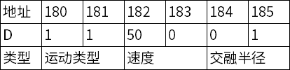

# <p class="hidden">Modbus：</p>RM机械臂Modbus从站地址表

睿尔曼机械臂支持modbus从站功能，并且从站功能在modbus-rtu和modbus-tcp上均支持，所有的从站共享地址表和相应功能。
**Modbus-TCP**：
使用有线网口或无线网口通讯，IP地址为机械臂IP地址，端口为502，设备ID为1。
**Modbus-RTU**：
使用控制器485接口通讯，波特率支持9600、115200、460800三种常见的波特率，从机地址：01。
>注意：
用户自定义使用寄存器地址时，优先使用3000及以后的地址，防止程序升级带来的地址占用与用户自定义功能冲突。

## 1.地址说明

### 1.1线圈

|  地址  |  功能  |  值说明  |
| :--- | :--- | :--- |
|  0  |  用户数字IO1模式；  |  0：输入；<br>1：输出；  |
|  1  |  用户数字IO1；  |  0：低；<br>1：高；  |
|  2  |  用户数字IO2模式；  |  0：输入；<br>1：输出；  |
|  3  |  用户数字IO2；  |  0：低；<br>1：高；  |
|  4  |  用户数字IO3模式；  |  0：输入；<br>1：输出；  |
|  5  |  用户数字IO3；  |  0：低；<br>1：高；  |
|  6  |  用户数字IO4模式；  |  0：输入；<br>1：输出；  |
|  7  |  用户数字IO4；  |  0：低；<br>1：高；  |
|  48  |  Joint1使能状态；  |  0-未使能；<br>1-使能；（暂不支持控制） |
|  49  |  Joint2使能状态；  |  0-未使能；<br>1-使能；（暂不支持控制）  |
|  50  |  Joint3使能状态；  |  0-未使能；<br>1-使能；（暂不支持控制）  |
|  51  |  Joint4使能状态；  |  0-未使能；<br>1-使能；（暂不支持控制）  |
|  52  |  Joint5使能状态；  |  0-未使能；<br>1-使能；（暂不支持控制）  |
|  53  |  Joint6使能状态；  |  0-未使能；<br>1-使能；（暂不支持控制）  |
|  54  |  Joint7使能状态；  |  0-未使能；<br>1-使能；（暂不支持控制） |

### 1.2离散输入

|  地址  |  功能  |  值说明  |
| :--- | :--- | :--- |
|  0  |  用户数字IO1模式；  |  0：输入；<br>1：输出；  |
|  1  |  用户数字IO1；  |  0：低；<br>1：高；  |
|  2  |  用户数字IO2模式；  |  0：输入；<br>1：输出；  |
|  3  |  用户数字IO2；  |  0：低；<br>1：高；  |
|  4  |  用户数字IO3模式；  |  0：输入；<br>1：输出；  |
|  5  |  用户数字IO3；  |  0：低；<br>1：高；  |
|  6  |  用户数字IO4模式；  |  0：输入；<br>1：输出；  |
|  7  |  用户数字IO4；  |  0：低；<br>1：高；  |

### 1.3保持寄存器
> 2000-2200的区间的地址（包含2000和2200），均可以实现自动寄存器断电保存

|  地址  |  功能  |  值说明  |
| :--- | :--- | :--- |
|  0  |  VOUT输出电压。  |  0：0V；<br>2：12V；<br>3：24V。  |
|  1  |  指定编程程序运行编号，输入1-100之间的数据，</br>控制器运行完成后清零，运行失败后，设为-1。  |  输入：1-100<br>输出：0 成功 ；-1失败。  |
|  2  |  指定运行速度，输入1-100的数据，</br>寄存器1控制机械臂程序启动后，速度生效，数据即清零，  |  1-100 表示速度  |
|  3  |  控制编程程序，输入1-3的数据，控制器检测到后，即清零。  |  1代表急停；<br>2代表暂停；<br>3代表继续。  |
|  1~149  |  预留  |   |
|  150  |  运动位置参数1高两字节  |   |
|  151  |  运动位置参数1低两字节  |   |
|  152  |  运动位置参数2高两字节  |   |
|  153  |  运动位置参数2低两字节  |   |
|  154  |  运动位置参数3高两字节  |   |
|  155  |  运动位置参数3低两字节  |   |
|  156  |  运动位置参数4高两字节  |   |
|  157  |  运动位置参数4低两字节  |   |
|  158  |  运动位置参数5高两字节  |   |
|  159  |  运动位置参数5低两字节  |   |
|  160  |  运动位置参数6高两字节  |   |
|  161  |  运动位置参数6低两字节  |   |
|  162  |  运动位置参数7高两字节  |   |
|  163  |  运动位置参数7低两字节  |   |
|  164  |  运动位置参数8高两字节  |   |
|  165  |  运动位置参数8低两字节  |   |
|  166  |  运动位置参数9高两字节  |   |
|  167  |  运动位置参数9低两字节  |   |
|  168  |  运动位置参数10高两字节  |   |
|  169  |  运动位置参数10低两字节  |   |
|  170  |  运动位置参数11高两字节  |   |
|  171  |  运动位置参数11低两字节  |   |
|  172  |  运动位置参数12高两字节  |   |
|  173  |  运动位置参数12低两字节  |   |
|  174-179  |  预留  |   |
|  180  |  运动类型  |  1-MoveJ；<br>2-MoveJP；<br>3-MoveL；<br>4-MoveC；  |
|  181  |  运动指令：1-开始运动 2-停止运动  |   |
|  182  |  速度百分比  |  1-100 速度比例  |
|  183  |  交融半径高两字节  |   |
|  184  |  交融半径低两字节  |   |
|  185  |  循环次数。  |   |
|  228  |  查询和设置当前碰撞等级，通过该地址可查询当前碰撞等级，</br>也可写入等级进行设置，只支持的等级设置，</br>与Json协议等级一致，超出此范围会自动使用最大的8等级。  |  0-8 表示碰撞等级  |

### 1.4输入寄存器

|  地址  |  功能  |  值说明  |
| :--- | :--- | :--- |
|  0  |  末端位置 X坐标，单位mm  |  无符号整型，负数取补码  |
|  1  |  末端位置 Y坐标，单位mm  |  无符号整型，负数取补码  |
|  2  |  末端位置 Z坐标，单位mm  |  无符号整型，负数取补码  |
|  3  |  末端姿态 RX，单位radian  |  无符号整型，负数取补码  |
|  4  |  末端姿态 RY，单位radian  |  无符号整型，负数取补码  |
|  5  |  末端姿态 RZ，单位radian  |  无符号整型，负数取补码  |
|  6  |  Joint1关节角，单位deg  |  无符号整型，负数取补码  |
|  7  |  Joint2关节角，单位deg  |  无符号整型，负数取补码  |
|  8  |  Joint3关节角，单位deg  |  无符号整型，负数取补码  |
|  9  |  Joint4关节角，单位deg  |  无符号整型，负数取补码  |
|  10  |  Joint5关节角，单位deg  |  无符号整型，负数取补码  |
|  11  |  Joint6关节角，单位deg  |  无符号整型，负数取补码  |
|  12  |  Joint7关节角，单位deg  |  无符号整型，负数取补码  |
|  13  |  Joint1电流，单位mA  |  无符号整型，负数取补码  |
|  14  |  Joint2电流，单位mA  |  无符号整型，负数取补码  |
|  15  |  Joint3电流，单位mA  |  无符号整型，负数取补码  |
|  16  |  Joint4电流，单位mA  |  无符号整型，负数取补码  |
|  17  |  Joint5电流，单位mA  |  无符号整型，负数取补码  |
|  18  |  Joint6电流，单位mA  |  无符号整型，负数取补码  |
|  19  |  Joint7电流，单位mA  |  无符号整型，负数取补码  |
|  20  |  Joint1电压，单位V  |  无符号整型，负数取补码  |
|  21  |  Joint2电压，单位V  |  无符号整型，负数取补码  |
|  22  |  Joint3电压，单位V  |  无符号整型，负数取补码  |
|  23  |  Joint4电压，单位V  |  无符号整型，负数取补码  |
|  24  |  Joint5电压，单位V  |  无符号整型，负数取补码  |
|  25  |  Joint6电压，单位V  |  无符号整型，负数取补码  |
|  26  |  Joint7电压，单位V  |  无符号整型，负数取补码  |
|  27  |  Joint1温度，单位℃  |  无符号整型，负数取补码  |
|  28  |  Joint2温度，单位℃  |  无符号整型，负数取补码  |
|  29  |  Joint3温度，单位℃  |  无符号整型，负数取补码  |
|  30  |  Joint4温度，单位℃  |  无符号整型，负数取补码  |
|  31  |  Joint5温度，单位℃  |  无符号整型，负数取补码  |
|  32  |  Joint6温度，单位℃  |  无符号整型，负数取补码  |
|  33  |  Joint7温度，单位℃  |  无符号整型，负数取补码  |
|  34  |  系统错误码，查询Json协议获取详细含义  |   |
|  35  |  心跳（每秒+1）  |   |
|  36  |  位置 X坐标，单位mm  |  Float型  |
|  38  |  位置 Y坐标，单位mm  |  Float型  |
|  40  |  位置 Z坐标，单位mm  |  Float型  |
|  42  |  姿态 RX，单位radian  |  Float型  |
|  44  |  姿态 RY，单位radian  |  Float型  |
|  46  |  姿态 RZ，单位radian  |  Float型  |
|  48  |  Joint1关节角，单位deg  |  Float型  |
|  50  |  Joint2关节角，单位deg  |  Float型  |
|  52  |  Joint3关节角，单位deg  |  Float型  |
|  54  |  Joint4关节角，单位deg  |  Float型  |
|  56  |  Joint5关节角，单位deg  |  Float型  |
|  58  |  Joint6关节角，单位deg  |  Float型  |
|  60  |  Joint7关节角，单位deg  |  Float型  |
|  99  |  表示编程程序运行状态 0代表无运行 1代表正在运行，3代表正在暂停  |   |
|  100  |  表示机械臂运行编程程序的行数  |   |
|  101  |  表示当前正在运行的编程程序ID，0代表为未存储轨迹  |   |
|  200  |  Joint1错误码  |  可查询Json协议文档  |
|  201  |  Joint2错误码  |  可查询Json协议文档  |
|  202  |  Joint3错误码  |  可查询Json协议文档  |
|  203  |  Joint4错误码  |  可查询Json协议文档  |
|  204  |  Joint5错误码  |  可查询Json协议文档  |
|  205  |  Joint6错误码  |  可查询Json协议文档  |
|  206  |  Joint7错误码  |  可查询Json协议文档  |
|  300  |  轨迹规划运动到位状态  |  0-未到位 1-到位 2-规划失败  |
|  301  |  轨迹规划状态  |  0-未规划，1-正在规划  |

## 2.数据转换

下列为寄存器转浮点角度方法：

```C
    float fun(quint16 H,quint16 L)
    {
        FloatTo4Bytes uValue;
        uValue.Byte[3] = (H >> 8) & 0xFF;
        uValue.Byte[2] = H & 0x00FF;
        uValue.Byte[1] = (L >> 8) & 0xFF;
        uValue.Byte[0] = L & 0x00FF;
        return uValue.a;
    }
```

## 3.运动控制示例

以MoveJ为例，保持寄存器地址与目标关节角度信息示例:

**说明：**
寄存器地址150-161存储了关节1到关节6的目标角度信息，相邻两个寄存器地址存储一个关节角度，浮点类型，高位在前。浮点类型角度信息转寄存器数值方法：

```C
void fun(float value, quint16 *H, quint16 *L)
{
    quint8 buf[4] = {0};
    memcpy(buf, &value, sizeof(float));
    *H = ((quint16)buf[3]<<8)|buf[2];
    *L = ((quint16)buf[1]<<8)|buf[0];
}
```

MoveJ保持寄存器地址与运动控制参数示例：


**说明：**
地址180：当前运动类型，0-None, 1-MoveJ, 2-MoveJ\_P, 3-MoveL, 4-MoveC；
地址181：运动指令，1-开始运动 2-停止运动；
地址182：速度百分比例系数，0~100；
地址183：交融半径高位；
地址184：交融半径低位；
地址185：循环圈数（仅限MoveC使用）；
