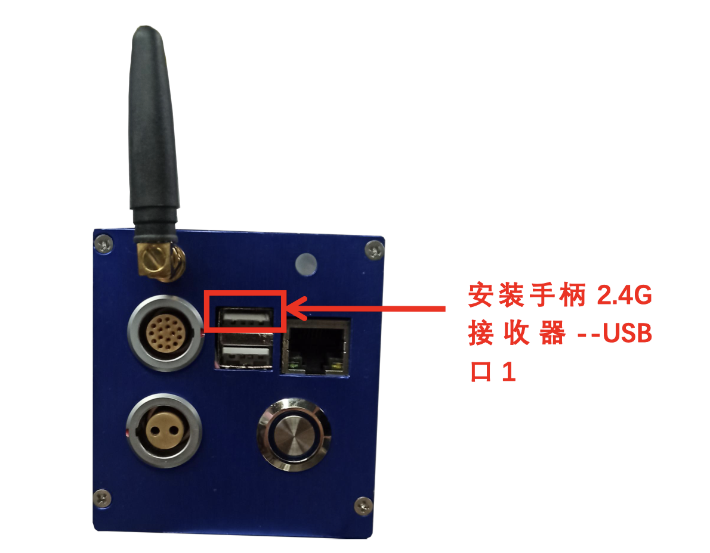
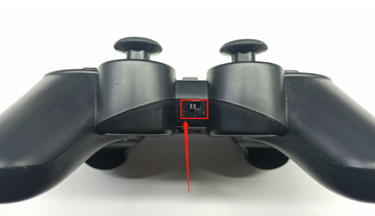
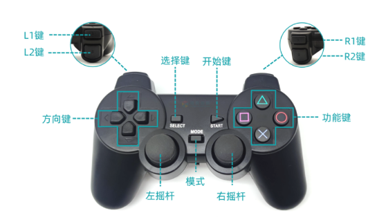
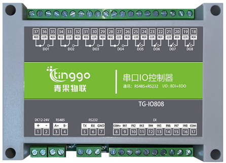
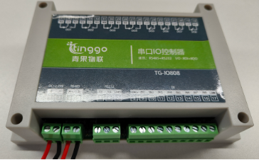
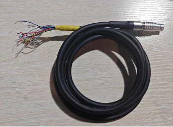
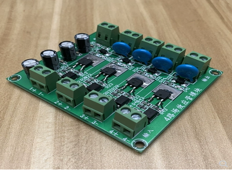
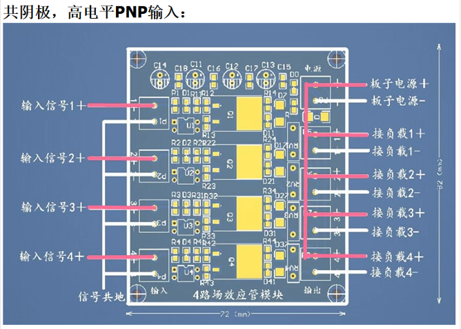

# <p class="hidden">入门指南：</p>选配功能

## 手柄控制机械臂


<center>示意图</center>

### 手柄简介

手柄采用2.4G技术进行无线通信，配备1个接收器。手柄遥控距离可达15米（此距离与使用环境有关）。其上共有15个按键及2个摇杆。


<center>手柄实物图</center>

### 控制方法

1. 确保机械臂处于断电状态，将2.4G接收器安装于USB口1。如图14-3所示。



<center>手柄接收器安装示意</center>

2. 等待机械臂开机完成，将手柄开机键拨至“ON”档。打开手柄电源，等待手柄前方信号指示灯红灯常亮时，说明连接成功。



<center>手柄电源开关示意</center>

3. 手柄键位及控制模式介绍



<center>手柄键位示意图</center>

手柄控制分为位置姿态控制和单轴关节控制间切换，切换方式为点击手柄中间位置的MODE键。机械臂开机与手柄连接默认为位置姿态控制模式，按下MODE键控制模式切换为单轴关节控制模式，模式切换成功之后机械臂会根据不同的模式发出不同的声音。切换为位置姿态控制机械臂发出“滴\~”声；切换为单轴关节控制机械臂会发出“滴\~滴\~滴”声。

#### 位置姿态控制模式

在进行位置姿态控制模式之前，需要通过拖拽示教或单轴关节控制模式，使机械臂处于图12.6类似，方便进行位置位姿控制。位姿图手柄左侧方向键、L1、L2键分别对应控制机械臂X+、X-、Y+、Y-、Z+、Z-方向运动。详情参考表13.1


<center>手柄控制机械臂位置位姿前机械臂姿态</center>

#### 单轴关节控制模式

进入单轴关节控制模式之后，手柄左侧方向键、L1、L2、右侧功能键、R1、R2分别控制各个关节正负方向运动。

手柄按键对应功能

<table>
  <tr>
    <th>手柄键位</th>
    <th>使用方法</th>
    <th>位置及姿态控制模式</th>
    <th>单轴关节控制模式</th>
  </tr>
  <tr>
    <td>MODE键</td>
    <td>短按</td>
    <td colspan="2" style="text-align: center;">2种模式切换</td>
  </tr>
  <tr>
    <td>左侧方向键--上</td>
    <td>短按/长按</td>
    <td>基坐标系Y+方向移动</td>
    <td>关节1沿正方向运动</td>
  </tr>
  <tr>
    <td>左侧方向键--下</td>
    <td>短按/长按</td>
    <td>基坐标系Y-方向移动</td>
    <td>关节1沿负方向运动</td>
  </tr>
  <tr>
    <td>左侧方向键--左</td>
    <td>短按/长按</td>
    <td>基坐标系X+方向移动</td>
    <td>关节2沿正方向运动</td>
  </tr>
  <tr>
    <td>左侧方向键--右</td>
    <td>短按/长按</td>
    <td>基坐标系X-方向移动</td>
    <td>关节2沿负方向运动</td>
  </tr>
  <tr>
    <td>左侧L1键</td>
    <td>短按/长按</td>
    <td>基坐标系Z+方向移动</td>
    <td>关节3沿正方向运动</td>
  </tr>
  <tr>
    <td>左侧L2键</td>
    <td>短按/长按</td>
    <td>基坐标系Z-方向移动</td>
    <td>关节3沿负方向运动</td>
  </tr>
  <tr>
    <td>右侧功能键--Y</td>
    <td>短按/长按</td>
    <td>沿Y+方向做姿态变化</td>
    <td>关节4沿正方向运动</td>
  </tr>
  <tr>
    <td>右侧功能键--A</td>
    <td>短按/长按</td>
    <td>沿Y-方向做姿态变化</td>
    <td>关节4沿负方向运动</td>
  </tr>
  <tr>
    <td>右侧功能键--X</td>
    <td>短按/长按</td>
    <td>沿X+方向做姿态变化</td>
    <td>关节5沿正方向运动</td>
  </tr>
  <tr>
    <td>右侧功能键--B</td>
    <td>短按/长按</td>
    <td>沿X-方向做姿态变化</td>
    <td>关节5沿负方向运动</td>
  </tr>
  <tr>
    <td>右侧R1键</td>
    <td>短按/长按</td>
    <td>沿Z+方向做姿态变化</td>
    <td>关节6沿正方向运动</td>
  </tr>
  <tr>
    <td>右侧R2键</td>
    <td>短按/长按</td>
    <td>沿Z-方向做姿态变化</td>
    <td>关节6沿负方向运动</td>
  </tr>
</table>

## IO扩展

### 功能介绍

在机械臂使用过程中，根据不同的场景，机械臂的IO可能数量不够，满足不了实际使用需求的情况。在这种情况下就需要用到外部IO控制器，本文中提到的外部IO控制器可外接8个外部数字输入传感器、8个外部数字输出信号口。

机械臂底部控制器与机械臂末端均可外接IO控制器，本文以机械臂控制器接口为例，如需使用机械臂末端接口请参考机械臂协议文档或接口文档。

### 串口IO控制器的使用



<center>串口IO控制器</center>

#### 设备接线接线

| 机械臂末端接口        | 串口IO控制器 |
|-----------------------|--------------|
| 电源输出（粉色/棕色） | DC12-24V +   |
| 电源GND（灰色/紫色）  | DC12-24V -   |
| RS485_A（黄色线）     | RS485A       |
| RS485_B（黄绿色线）   | RS485B       |

IO控制器的供电为宽电压12\~24V，接线完成之后需设置机械臂控制器输出相对应的电压，电压的具体设置根据传感器所需供电进行设置。

**串口IO控制器和16芯线**  

|  |  |
|---------------------------------------------------------------------------|-------------------------------------------|
| 控制器接线：485接口及24V供电                                              | 控制器接线：线材实物连接                  |

#### 机械臂开启通信及供电设置

机械臂开启末端通信及供电有多种方式，此处以JSON协议的方式进行设置。串口IO控制器相关的详细指令在本文中不做讲解，详情参考云盘中文档说明。

[云盘链接](https://pan.baidu.com/s/1xPAf5AajKaM40CI7bHA1yw?pwd=tkcf)

使用socket助手通过TCP向控制器下发如下JSON协议字符串：

1. 配置通讯端口ModbusRTU模式

```json
{"command":"set_modbus_mode","port":0,"baudrate":9600,"timeout":20}
```

命令下发成功后，socket助手会收到控制器反馈内容，如下所示：

```json
{"command":"set_modbus_mode","set_state":true}
```

- 若set_state值返回true，则设置成功。

- 若set_state值返回false，则设置失败。

2. 设置电源输出（I 系列），输出电压为24V

```json
{"command":"set_voltage","voltage_type":3}
```

命令下发成功后，socket助手会收到控制器反馈内容，如下所示：

```json
{"command":"set_voltage","state":true}
```

3. 写单圈数据，设置串口IO控制器继电器1号输出

```json
{"command":"write_single_coil","port":0,"address":1,"data":1,"device":1}
```

命令下发成功后，socket助手会收到控制器反馈内容，如下所示：

```json
{"command":"write_single_coil","write_state":true}
```

4. 单圈数据，设置串口IO控制器继电器1号输出

```json
{"command":"write_single_coil","port":0,"address":1,"data":1,"device":1}
```

命令下发成功后，socket助手会收到控制器反馈内容，如下所示：

```json
{"command":"write_single_coil","write_state":true}
```

5. 写单圈数据，设置串口IO控制器继电器1号关闭输出

```json
{"command":"write_single_coil","port":0,"address":1,"data":0,"device":1}
```

命令下发成功后，socket助手会收到控制器反馈内容，如下所示：

```json
{"command":"write_single_coil","write_state":true} 
```

6. 读离散量输入，读取0号信号

```json
{"command":"read_input_status","port":0,"address":0,"num":1,"device":1}
```

命令下发成功后，socket助手会收到控制器反馈内容，如下所示：

```json
{"command":"input_status","read_state":true}
```

7. 测试完成，关闭通讯端口 ModbusRTU 模式

```json
{"command":"close_modbus_mode","port":0}
```

命令下发成功后，socket助手会收到控制器反馈内容，如下所示：

```json
{"command":"close_modbus_mode","set_state":true}
```

8. 设置电源输出（I 系列），输出电压为0V

```json
{"command":"set_voltage","voltage_type":0}
```

命令下发成功后，socket助手会收到控制器反馈内容，如下所示：

```json
{"command":"set_voltage","state":true}
```

## 场效应管模块

### 功能介绍

机械臂控制器位置有4路可复用数字IO，可通过示教器或指令切换为数字输出，但默认输出电流只有2mA，如果需要控制大功率设备，如：电机、灯泡、继电器、电磁阀等，可以选配场效应管模块。

场效应管模块输出端被控功率为100W以内。



<center>场效应管模块</center>

### 场效应管模块的使用

机械臂IO需设置为输出模式，分别连接场效应管模块的输入信号。

具体接线方法如下图所示：



<center>场效应管模块接线图</center>
