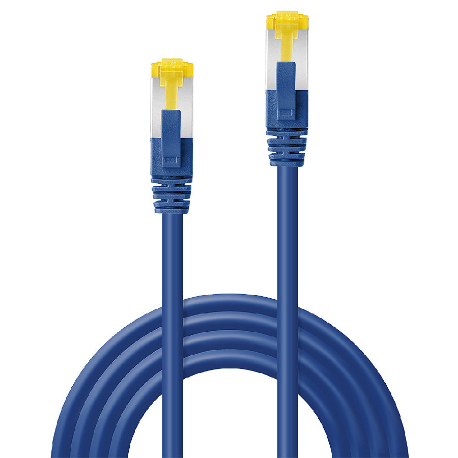
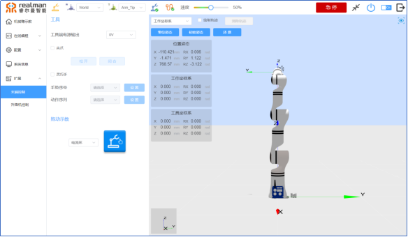
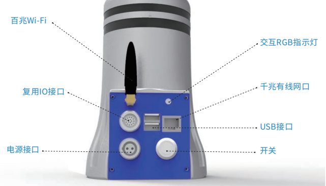
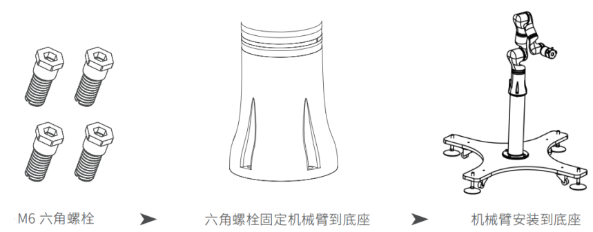
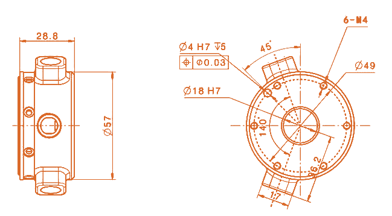
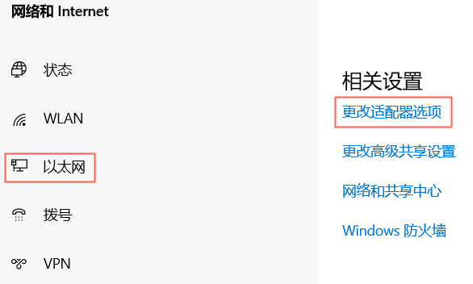
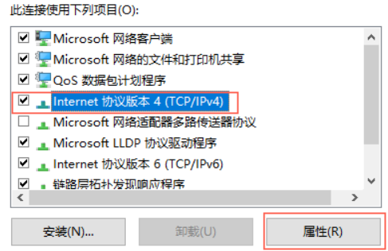
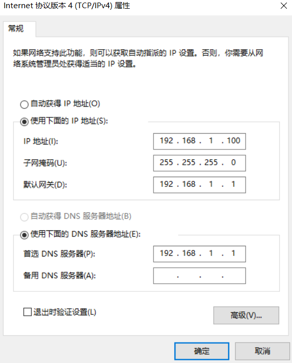
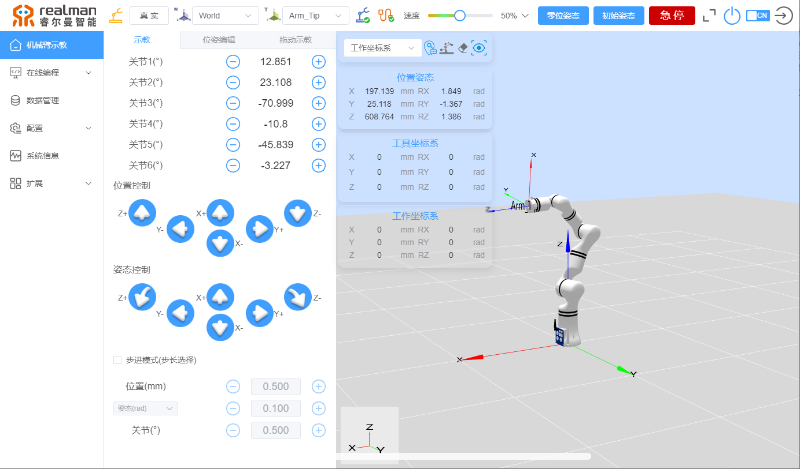
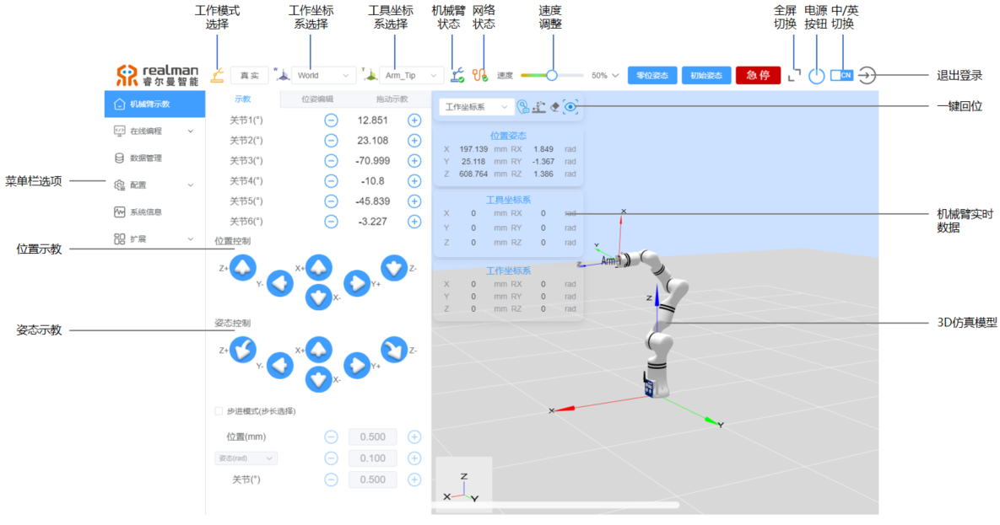

# 睿尔曼机器人硬件准备

本手册为机器人操作的快速入门手册，旨在短时间内使用户完成组装和简单动作编辑。
通过本手册，操作人员、产品技术人员、技术服务人员和机器人程序开发者都可以快速地使用睿尔曼的机械臂。
睿尔曼研发的机器人包含 RM65、RM75、RML63、ECO 系列、GEN72，快速使用过程均可参考此说明。

## 1.产品组成

一套完整的睿尔曼协作机器人产品组成如下所示：

| 名称                 | 数量 | 图例                      |
| :------------------- | :--- | :------------------------ |
| 机器人本体           | 1    |  |
| 电源连接线           | 1    |  |
| 6 芯工具端 IO 连接线 | 1    |  |
| 16 芯 IO 连接线      | 1    |  |
| 网线                 | 1    |  |
| M6\*20 固定螺丝      | 4    |  |
| 平板示教器（选配）   | 1    |  |

**机器人电气接口功能说明**

上图为第三代控制器，相比第二代控制器增加了状态指示灯，去掉了一个不常用的网口。

| 序号 | 接口            | 功能                                                                                                                                                                                                                                           |
| :--- | :-------------- | :--------------------------------------------------------------------------------------------------------------------------------------------------------------------------------------------------------------------------------------------- |
| 1    | 开关            | 控制机器人电源，开启后亮起蓝灯。                                                                                                                                                                                                               |
| 2    | 电源接口        | 插入电源线缆。                                                                                                                                                                                                                                 |
| 3    | 复用 IO 接口    | 引出控制器 RS485、I/O 等接口。                                                                                                                                                                                                                 |
| 4    | 百兆 Wi-Fi      | 无线通讯使用。                                                                                                                                                                                                                                 |
| 5    | USB 接口 1      | 扩展接口，可外接蓝牙手柄接收器。                                                                                                                                                                                                               |
| 6    | USB 接口 2      | 作为虚拟网口使用。                                                                                                                                                                                                                             |
| 7    | 千兆有线网口    | 通讯网口。                                                                                                                                                                                                                                     |
| 8    | 交互 RGB 指示灯 | 根据机械臂不同状态分别显示蓝色、白色、绿色、黄色、红色。  ① 蓝色为控制器启动初始化； ② 白色为各关节启动初始化； ③ 绿色为机械臂正常运行；   ④ 黄色为机械臂发出警告信息，为普通故障，需立即处理； ⑤ 红色为机械臂发生严重故障，需立即处理。 |

## 2.机器人快速安装

睿尔曼机械臂属于超轻量机械臂，仅需 1 人即可进行快速安装。以 RM65 系列机械臂为例，自重仅 7.2kg，且底座仅 110mm。以下将以 RM65-B 机械臂为例介绍如何进行机械臂底座安装和末端扩展工具安装，其他系列机械臂安装方式与此类似：

- **底座安装**

  1.从包装箱中取出 RM65 机器人，将底座安装到固定的位置，机械臂底座尺寸如下：

  

  2.准备四个 M6 的内六角螺栓和 M6 的内六角扳手进行安装：
  

- **末端安装**
  机械臂本体提供的标准法兰接口，机械臂法兰盘预留均匀分布在 Ф49mm 分度圆上的 6 个 M4 螺纹孔，用户仅需要根据安装尺寸进行适配即可，尺寸如下图所示。
  

## 3.机器人接线与开机

1.从包装箱中取出 RM65 机器人的 DC24V 电缆。

2.准备 DC 24V  的供电电源，与机械臂供电接口连接。机械臂供电接口为 2 芯航插，位于控制器面板左下角，2 芯电源线缆中棕色线芯为电源正极，蓝色线芯为电源负极。

> 电源电压范围可选 20~27V，极限可以达到 30V。建议使用 600W 以上，且具有打嗝模式、恒流输出 1S 功能的开关电源。

3.机器人不得暴露在灰尘或超出 IP54 等级的潮湿环境下。密切注意存在传导性灰尘的环境，需要特殊防护。

4.连接机器人线缆。若无外部设备，只需要连接电源线与网线即可,如下图：

> 启动电源前请检查以下事项：
>
> - 检查电源线与电源插头是否连接好。
> - 检查控制器电源开关在未接通时处于关闭状态。
> - 确保机器人不会碰到周围人员或设备。确保电源线已连接 24V 直流电源。

5.按下电源开关启动机械臂

> ① 电源开关背景灯变为蓝色，说明机械臂上电。
> ② 同时机器人控制器右上角指示灯变为蓝色，说明控制器正在启动。
> ③ 控制器指示灯变为白色，说明机器人关节等正在进行初始化工作。
> ④ 控制器指示灯变为绿色闪烁状态，说明机器人启动完成，可正常开始工作。此过程用时大约 50s 左右。

## 4.示教器连接

机械臂示教器软件为 web 端软件，在浏览器直接输入指定 IP 登陆即可（推荐使用谷歌浏览器）。通过此人机交互界面，可以操作机器人本体和控制器，执行和创建机器人程序，读取机器人信息。
示教器支持全平台使用，可根据使用场景，选择不同的示教器载体。如安卓平板、Windows 系统的平板或电脑、苹果系统的平板或电脑、Linux 系统的电脑。
示教器载体与机械臂连接可选择有线或无线两种方式。

**有线连接：**

Windows 系统通过网口与机械臂建立有线连接。

- 有线连接示教器前需要将电脑 ip 更改到`192.168.1.xx`网段，`xx`可为除 192.168.1.18 中“18”以外的 ip，建议配置为 192.168.1.100。配置方法如下：
  （1）右击电脑右下方 WiFi 按钮打开“网络和 Internet 设置”： >注：win11 点击后须先点击<高级网络设置，再点击更多网络适配器选项后进入以太网选项。

      

      （2）单击“以太网-->更改适配器选项”

      
      （3）双击“以太网”并打开，并且在弹出的窗口中单击“属性”按钮。

      
      (4)在弹出的对话框中，第一步选中“Internet协议版本4”，第二步单击“属性”按钮。

      

      （5）按下图配置网络IP地址，配置完成后点击“确定”按钮，即可完成本地网络设置。

      

- 打开示教器
  （1）打开浏览器，输入网址`192.168.1.18`。
  
  （2）输入账号：`user`，密码：`123`，点击登录。
  
  （3）打开机械臂示教界面。
  

**无线连接：**

用户主机通过 WiFi 连接机械臂热点。

- WiFi 连接
  默认 WiFi 热点名称格式如下图所示，密码默认为`12345678`:

  

- 打开示教器
  （1）打开浏览器，若使用无线的 AP 模式连接，则网址输入`192.168.33.80`。
  （2）输入账号：`user`，密码：`123`，点击登录。
  
  （3）打开机械臂示教界面。

## 5.示教器界面说明

> 注：若首次连接或升级程序后连接示教器出现页面卡顿后可以 Ctrl+F5  刷新页面。

## 6.拖动示教

在机械臂末端法兰外壳上有两个按钮，分别控制机器人进行拖动示教和轨迹复现。

长按机械臂末端绿色按钮，机械臂将处于可拖动状态，拖动过程中自动进行实时轨迹记录，松开绿色按钮即完成轨迹记录。
短按机械臂末端蓝色按钮，机械臂自动回到轨迹起始位置，并进行一次轨迹复现（机械臂只复现最后一次记录的拖动轨迹）。
这里只是进行简单的示教动作控制，详细的示教器界面的使用参考[睿尔曼机械臂 web 示教器使用](xxxxxxxx)，深度的二次开发参考本站开放的接口说明。

## 7.机器人关机

1.按下电源开关，使其处于弹起关闭状态； 2.关闭机器人 24V 直流供电电源。

