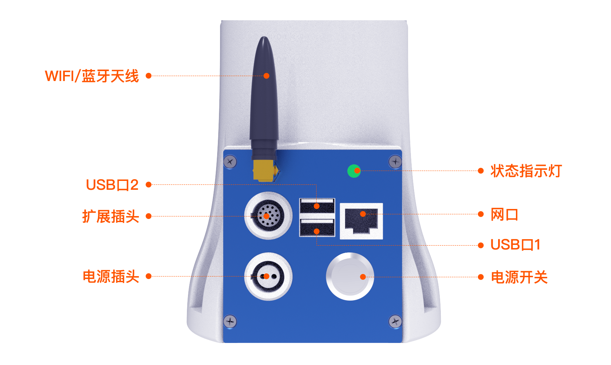

# 
入门指南：
硬件接口详细说明

## 机械臂系统组成

睿尔曼协作机器人系统主要由机器人本体、控制器（集成于本体基座内）和平板示教器（选配）组成。

### 控制器

| **序号** | **接口**      | **功能** |
|----------|---------------|-----|
| 1        | 电源开关      | 控制机器人电源，开启后亮起蓝灯      |
| 2        | 电源插头      | 插入电源线缆  |
| 3        | 扩展插头      | 引出控制器RS485、I/O等接口        |
| 4        | WIFI/蓝牙天线 | 无线通讯使用                     |
| 5        | USB接口1      | 扩展接口，可外接手柄接收器         |
| 6        | USB接口2      | 作为虚拟网口使用                  |
| 7        | 网口          | 通讯网口                        |
| 8        | 状态提示灯    | 根据机械臂不同状态分别显示蓝色、白色、绿色、黄色、红色。 ①蓝色为控制器启动初始化； ②白色为各关节启动初始化； ③绿色为机械臂正常运行； ④黄色为机械臂发出警告信息，为普通故障，需立即处理； ⑤红色为机械臂发生严重故障，需立即处理。 |

在机器人控制器面板上有一个16芯的连接器，机器人所有的I/O即从该连接器引出，请参见下图。

::: warning 注意
在进行线路连接时，禁止带电插拔航插插头。插入航插时请用户务必保证插针与孔位对齐，并检查插针是否正常.
:::

I/O接口图

其中，线缆定义如下表4所示。

| 序号 | 颜色       | 定义      | 说明             | 备注    |
|------|------------|-----------|------------------|---------|
| 1    | 粉色加棕色 | VOUT      | 对外输出正       | 12V/24V |
| 2    | 灰色加紫色 | P_IO_GND  | 对外输出负       |         |
| 3    | 黄色       | 485A      |                  |         |
| 4    | 黄绿色     | 485B      |                  |         |
| 5    | 紫白       | IO1       | 可复用IO         |         |
| 6    | 红白       | IO2       | 可复用IO         |         |
| 7    | 绿白       | IO3       | 可复用IO         |         |
| 8    | 黄白       | IO4       | 可复用IO         |         |
| 9    | 蓝白       | OUT_P_IN  | 外部输入数字电源 | 0~24V  |
| 10   | 浅蓝       | OUT_P_OUT | 外部输出数字电源 | 0~24V  |
| 11   | 深蓝       | OUT_P_GND | 外部数字地       |         |
| 12   | 绿         | FDCAN_A   | CAN_H            |         |
| 13   | 红         | FDCAN_B   | CAN_L            |         |
| 14   | 白         | 空        | 预留             |         |
| 15   | 黑         | 空        | 预留             |         |
| 16   | 橙         | 空        | 预留             |         |

::: warning 注意
数字量输入输出的电压值由接入的参考电压决定，机械臂16芯扩展接口线缆仅提供了12V和24V电源电压。数字量输入输出若需要输出其他电压值，则需要从外部对OUT_P_OUT+、OUT_P_IN+和OUT_P_GND引脚引入参考电压。
:::

#### 电源输出

机器人16芯线可对外输出12V/24V电源（当输出24V电压时，实际输出电压与机器人电源电压一致，若电源电压不稳定，输出电压会受到影响），电源输出类型可通过示教器或者JSON协议进行配置和控制通断，电气特性如下表所示。

| 参数     | 最小值 | 典型值 | 最大值 | 单位 |
|----------|--------|--------|--------|------|
| 电源电压 | 0      | ——     | 24     | V    |
| 电源电流 | ——     | 1000   | 1500   | mA   |

::: warning 注意
在通过控制器电源为外部设备进行供电时，参考上表电流参数限制，以防过载，烧毁控制器。
:::

#### 数字输入

控制器接口共有4路数字输入，用户使用时需要分别接通外部输入数字电源通道（OUT_P_IN+）和外部数字地通道（OUT_P_GND），为数字输入提供电平参考。电气特性如下表所示：

| 数字输入    | 最小值  | 典型值 | 最大值 | 单位 |
|-------------|---------|--------|--------|------|
| 输入电源Vin | 0       | —      | 24     | V    |
| 输入电压    | -0.5    |        | 24     | V    |
| 逻辑低电平  |         |        | 1      | V    |
| 逻辑高电平  | Vin-0.5 |        |        | V    |

以NPN型光电传感器接线为例，机械臂输入参考电平采用16芯航插线上的12V电源，其接线方式如下图所示：

采用内部供电的数字输入

#### 数字输出

控制器接口共有4路数字输出，用户使用时需要分别接通外部输出数字电源通道（OUT_P_OUT+）和外部数字地通道（OUT_P_GND），为数字输出提供电平参考。电气特性如下表所示：

| 数字输出    | 最小值 | 典型值 | 最大值 | 单位 |
|-------------|--------|--------|--------|------|
| 输入电源Vin | 0      | —      | 24     | V    |
| 输出电流    | —      | —      | 2      | mA   |

机械臂数字输出信号与外部设备连接时，可采用外部设备电源作为机械臂输出端的参考电平，但参考电压最大不能高于24V。接线方式如下图所示：

采用外部供电的数字输出

注意：数字输出信号最大输出电流为2mA，可以选择加装场效应模块放大电流。

#### IO复用功能

16芯线中的IO具备复用功能，可以通过程序指令或者web端示教器切换为：

| 输入（NPN型）                                      |
|----------------------------------------------------|
| 输出（最大电流2mA）                                |
| 输入开始功能复用模式                               |
| 输入暂停功能复用模式                               |
| 输入继续功能复用模式                               |
| 输入急停功能复用模式                               |
| 输入进入电流环拖动模式                             |
| 输入进入力只动位置拖动模式（六维力版本可配置）     |
| 输入进入力只动姿态拖动模式（六维力版本可配置）     |
| 输入进入力位姿结合拖动复用模式（六维力版本可配置） |
| 输入外部轴最大软限位复用模式（外部轴模式可配置）   |
| 输入外部轴最小软限位复用模式（外部轴模式可配置）   |

### 末端拓展

为方便用户在机器人末端添加工具，预留了安装法兰和通信末端接口，在法兰外壳上有两个按钮，分别控制机器人进行拖动示教和轨迹复现。下面是末端的尺寸和法兰安装说明：

通信末端接口是一个6芯的连接器，它为连接到机器人的不同夹持器和传感器提供电源和控制信号。

末端工具接口

::: warning 注意
在插拔末端接口板的航插线缆时，请确保末端的电源输出处于关闭状态，否则有造成硬件损坏的风险！插入航插时请用户务必保证插针与孔位对齐，并检查插针是否正常。
:::

接口板的功能接口如下表5所示：

| 序号 | 接口类型             | 数量        | 功能                                  |
|------|----------------------|-------------|---------------------------------------|
| 1    | 电源输出             | 1路         | 可配置为5V/12V/24V，可控制通断        |
| 2    | 数字输出             | 最大支持2路 | 参考电平与电源输出一致，仅支持12V/24V |
| 3    | 数字输入             | 最大支持2路 | 参考电平与电源输出一致，仅支持12V/24V |
| 4    | RS485                | 1路         | 与RS485接口外设通信                   |
| 5    | 拖动示教按钮（绿色） | 1路         | 长按，机器人开始进入拖动示教模式      |
| 6    | 轨迹复现按钮（蓝色） | 1路         | 短按，机器人复现拖动示教轨迹          |

末端工具接口通过1个6芯航插对外连接，航插引脚及定义如下所示。

工具端航插对外引脚定义

| **针脚编号** | **接线颜色** | **功能**                                 |
|--------------|--------------|------------------------------------------|
| 1            | 黄           | RS485_A                                  |
| 2            | 白           | RS485_B                                  |
| 3            | 红           | 数字接口1（DI1/DO1）                     |
| 4            | 黑           | 数字接口2（DI2/DO2）                     |
| 5            | 绿           | 电源GND                                  |
| 6            | 蓝           | 电源输出： 0V/5V/12V/24V，可进行程序控制 |

::: warning 备注
上表中的复用功能通过程序指令进行切换。出厂时默认引脚3和引脚4为数字输入通道（DI1和DI2），引脚6的电源输出为0V（可通过程序设置）。
:::

注：电源输出设置为 5V 时，工具端的IO 暂不支持输入输出功能。

#### 数字I/O输入

工具数字输入通道共2路，电气特性如下表所示。

| 数字输入    | 最小值  | 典型值 | 最大值 | 单位 |
|-------------|---------|--------|--------|------|
| 输入电源Vin | 0       | ——     | 24     | V    |
| 输入电压    | -0.5    |        | 24     | V    |
| 逻辑低电平  |         |        | 1      | V    |
| 逻辑高电平  | Vin-0.5 |        |        | V    |

#### 数字I/O输出

工具端数字输出通道共2路，可通过示教器或者JSON协议直接通过控制器进行配置，电气特性如下表所示。

| 数字输出    | 最小值 | 典型值 | 最大值 | 单位 |
|-------------|--------|--------|--------|------|
| 输入电源Vin | 0      | ——     | 24     | V    |

#### 电源输出

机器人末端可对外输出5V/12V/24V电源（当输出24V电压时，实际输出电压与机器人电源电压一致，若电源电压不稳定，输出电压会受到影响），电源输出类型可通过示教器或者JSON协议进行配置和控制通断，电气特性如下表所示。

| 参数     | 最小值 | 典型值 | 最大值 | 单位 |
|----------|--------|--------|--------|------|
| 电源电压 | 0      | ——     | 24     | V    |
| 电源电流 | ——     | 1000   | 1500   | mA   |

::: warning 注意
在通过末端电源为末端工具进行供电时，参考上表电流参数限制，以防过载，烧毁末端接口板。
:::

#### 通讯接口

机器人在控制器的16芯航插和末端接口板6芯航插处，各有1路RS485通讯接口（仅用于机器人控制外部设备，不支持外部设备进行机器人运动控制），这两个RS485端口可通过JSON协议配置为标准的Modbus RTU模式（为保证RS485通讯稳定，尽可能将设备与机械臂的GND连接）。然后通过 JOSN 协议对端口连接的外设进行读写操作。
