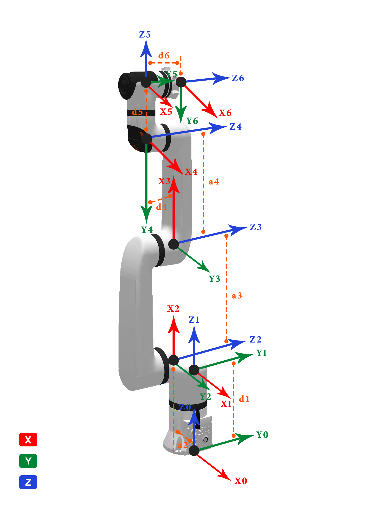
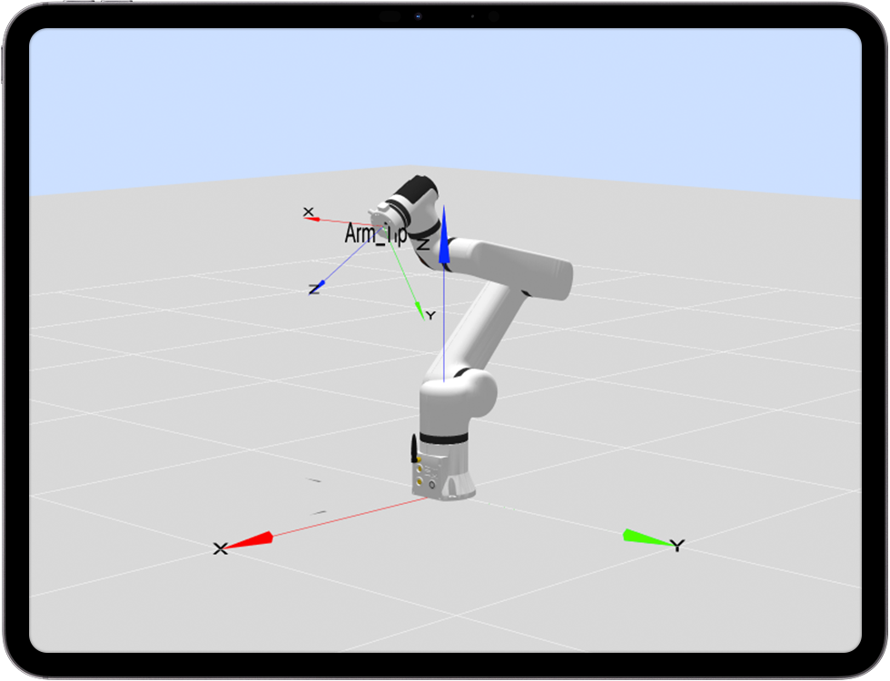
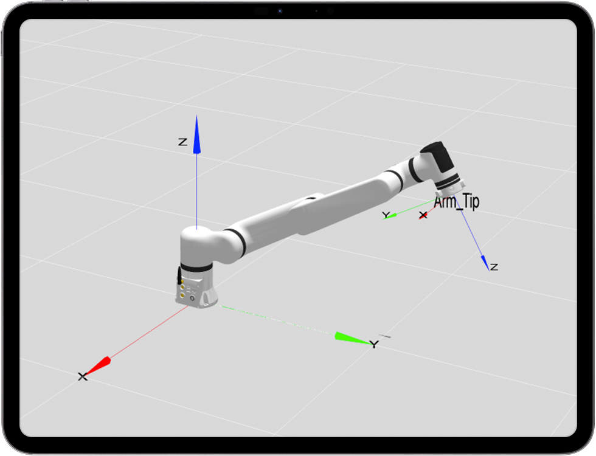
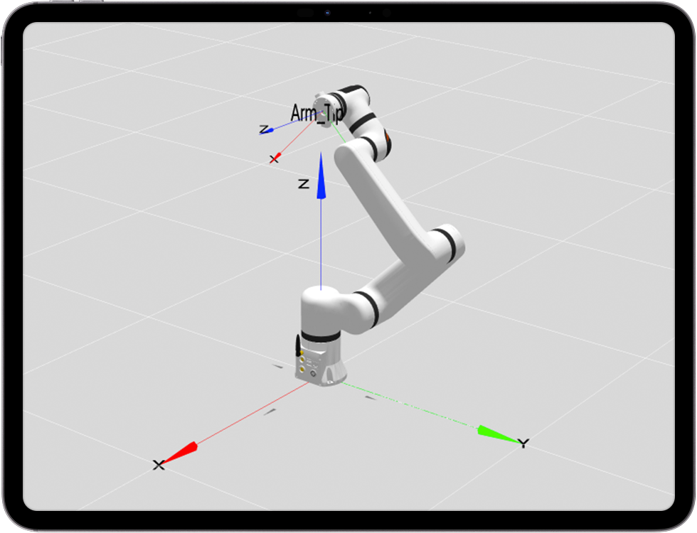

# 
本体参数：
ECO65系列DH参数

**MDH模型坐标系：**

  

**ECO65系列MDH参数(改进D-H参数)：**

|关节编号(i)|$a_{i-1}$(mm)|$\alpha_{i -1}$(°)|$d_i$(mm)|offset(°)|
|:--|:--|:--|:--|:--|
|   1   |   0  |   0  | 162.5  |    0  |
|   2   | -90  | -86  |   0    |  -90  |
|   3   |   0  | 260  |   0    |    0  |
|   4   |   0  | 240  | -58.88 |   90  |
|   5   |  90  |   0  |  110   |    0  |
|   6   | -90  |   0  |  $d_6$ |    0  |

- ECO65-B &nbsp;: $d_6=79.5$ mm
- ECO65-6F: $d_6=108$ mm

说明: offset为机械零位与建模零位的偏差, 即`模型角度 = 关节角度 + offset`.

## ECO65系列连杆动力学参数

|   joint_id(i)   |  1    |  2    |  3    |  4    |  5    |  6    |  -    |
|:--   |:--    |:--    |:--    |:--    |:--    |:--    |:--    |
| **$m$**       | 1.508  | 2.023  | 1.886  | 0.570  | 0.641  | 0.107  | 0.248  |
| **$x$**       | -11.055| 58.186 | 92.768 | -0.040 | -0.040 | -0.506 | -0.426 |
| **$y$**       | 0.027  | -0.012 | -0.094 | -34.960| 22.647 | 0.255  | 0.237  |
| **$z$**       | -33.473| -52.364| 1.811  | 3.802  | -7.366 | -10.801| -27.223|
| **$L_{xx}$**  | 3648.222 | 7820.980 | 1922.701 | 1202.616 | 987.154 | 50.918 | 308.844 |
| **$L_{xy}$**  | 22.882  | 4.845  | -13.151| 0.267  | -0.046 | -3.136 | -3.781 |
| **$L_{xz}$**  | 25.494  | -7604.590 | 2010.953 | -0.705 | 0.749  | -0.699 | -1.468 |
| **$L_{yy}$**  | 4975.281 | 29709.375 | 38718.526 | 324.974 | 428.173 | 47.420 | 304.616 |
| **$L_{yz}$**  | -10.516 | 4.192  | -4.827 | 0.000  | 6.408  | 0.388  | 0.888  |
| **$L_{zz}$**  | 2611.768 | 24073.795 | 38122.090 | 1163.421 | 886.381 | 60.350 | 122.620 |
| **备注**       |         |         |         |         |         | B       | 6F     |

说明:
- $m$为连杆质量, 单位为$kg$
- $x$为连杆质心x坐标, 单位为$mm$
- $y$为连杆质心y坐标, 单位为$mm$
- $z$为连杆质心z坐标, 单位为$mm$
- $L_{xx}$,$L_{xy}$,$L_{xz}$,$L_{yy}$,$L_{yz}$,$L_{zz}$ 为连杆坐标系下描述的主惯量, 单位为$kg·mm²$
- B: 标准版, 6F: 六维力版

备注:

- 以上数据来源为CAD设计值
- 如需质心坐标系下的惯性参数, 使用平行移轴定理即可, 计算方法如下所述.

---

假设有一输出坐标系为坐标系$\{i\}$，对齐坐标系$\{i\}$的质心坐标系为 $\{c\}$，质心在坐标系$\{i\}$中的坐标为 $P_c = [x_c  ，y_c， z_c]^T$，则由平行移轴定理可得：

$$I_c = L_i - m (P_{c}^{T}P_cI_{3×3} - P_cP_{c}^{T})$$

式中:
$$
L_i = \begin{bmatrix}L_{xx} & L_{xy} & L_{xz} \\ L_{xy} & L_{yy} & L_{yz} \\ L_{xz} & L_{yz} & L_{zz}\end{bmatrix}
$$

## 关节分布和尺寸说明

ECO65机器人本体模仿人的手臂，共有6个旋转关节，每个关节表示1个自由度。如图5-36所示，机器人关节包括肩部（关节1），肩部（关节2），肘部（关节3），腕部（关节4），腕部（关节5）和腕部（关节6）。

### 工作空间

ECO65-B运动范围，除去基座正上方和正下方的圆柱空间，工作范围为半径610mm的球体。选择机器人安装位置时，务必考虑机器人正上方和正下方的圆柱体空间，尽可能避免将工具移向圆柱体空间。另外，在实际应用中，关节1转动范围：±178°，关节2转动范围：-178°~ +135°，关节3转动范围：-160°~ +145°，关节4转动范围：±178°，关节5转动范围：±178°，关节6转动范围：±360°。

机器人可达空间示意图

### 运动奇异点

#### 肩部奇异

该机械臂的构型避免了肩部奇异的产生，但5、6轴交点靠近1轴轴线时，接近肩部奇异，机械臂会产生较大的动作，示意点位[0，-45，120，-45，-90， 0]，如图下图所示：

肩部奇异

#### 肘部奇异

q3=0，2、3、4轴线共面，即点位格式为[x,x,0,x,x,x]，示意点位[-90,-60,0,0,90,0]，如图下图所示：

肘部奇异

##### 腕部奇异

关节4、6轴线平行,q5=0,即点位格式为[x,x,x,x,0,x]，示意点位[-90,-45,90,0,0,0]，如图下图所示：

腕部奇异

##### 边界奇异

机械臂末端到达最远端，q3=0，2、3、4、6轴线共面的特殊情况,即点位格式为[x,x,0,x,0,x]。示意点位[0,40,0,0,0,0]，如下图所示：

边界奇异1

##### 负载曲线图

表示ECO65-B、ECO65-6F机械臂末端负载曲线图

ECO65-B机械臂末端负载曲线图

ECO65-6F机械臂末端负载曲线图

