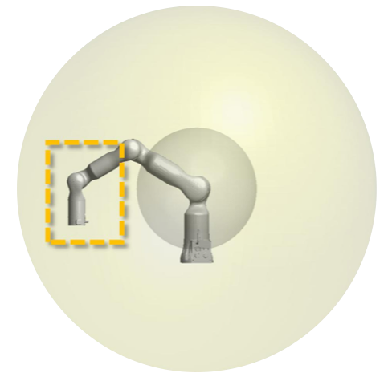
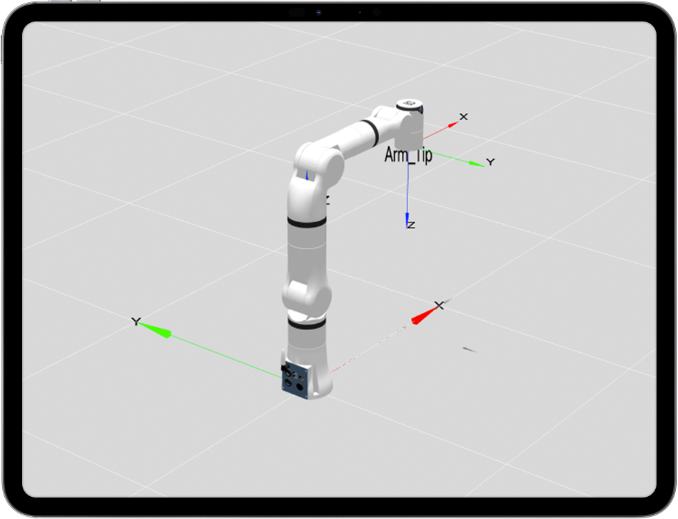
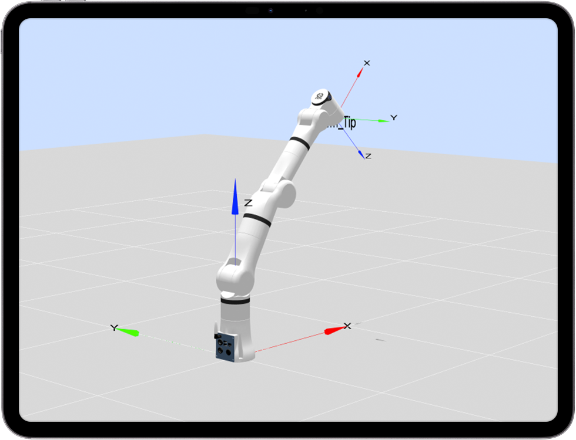
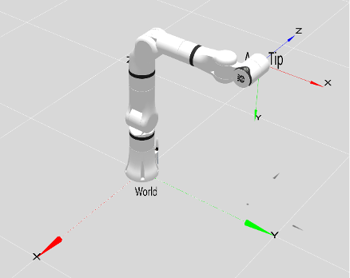
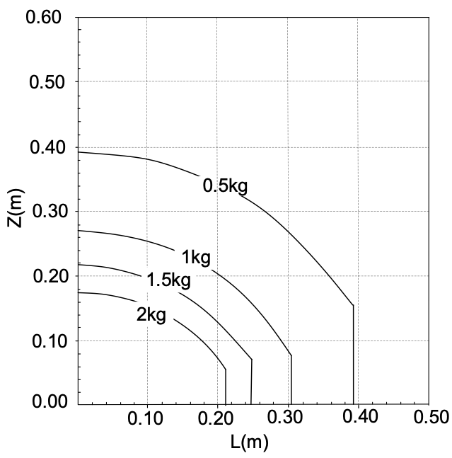

# 
本体参数：
GEN72系列D-H模型及参数

**MDH模型坐标系：**

  

**GEN72系列MDH参数(改进D-H参数)：**

|关节编号(i)|$a_{i-1}$(mm)|$\alpha_{i -1}$(°)|$d_i$(mm)|offset(°)|
|:--|:--|:--|:--|:--|
|   1   |   0   |   0   |  218   |  0  |
|   2   |   0   |   -90 |   0    |  0  |
|   3   |   0   |   90  |   280  |  0  |
|   4   |   40  |   90  |   0    |  0  |
|   5   |   -19 |   -90 |  252.5 |  0  |
|   6   |   0   |   90  |   0    |  90 |
|   7   |   67  |   90  |   90.5   |  0  |

说明: offset为机械零位与建模零位的偏差, 即`模型角度 = 关节角度 + offset`.

## GEN72系列连杆动力学参数

|   joint_id(i)   |  1    |  2    |  3    |  4    |  5    |  6    |  7    |
|:--   |:--    |:--    |:--    |:--    |:--    |:--    |:--    |
| **$m$**       | 0.849  | 0.954  | 1.166  | 0.501  | 0.164  | 0.92   | 0     |
| **$x$**       | 0.018  | 0      | 32.035 | -0.101 | -0.012 | 33.677 | 0     |
| **$y$**       | 0.485  | -113.065| 1.405  | 121.531 | -0.835 | -24.499 | 0     |
| **$z$**       | -5.062 | 1.39   | -10.865 | -0.415 | -49.324 | -0.234 | 0     |
| **$L_{xx}$**  | 619.491  | 15830.405 | 1884.802 | 7780.748 | 687.831 | 1468.45 | 0     |
| **$L_{xy}$**  | -0.64   | -0.498 | -67.215 | 3.144  | 0.372  | 1506.848 | 0     |
| **$L_{xz}$**  | -0.349  | -0.274 | -13.467 | 0.053  | -0.062 | 14.523 | 0     |
| **$L_{yy}$**  | 758.741 | 831.213 | 3392.831 | 208.799 | 647.655 | 2422.923 | 0     |
| **$L_{yz}$**  | -0.727  | -2.038 | -1.356  | 24.787 | 2.089  | -10.309 | 0     |
| **$L_{zz}$**  | 454.962 | 15738.682 | 2238.137 | 7777.93 | 119.871 | 3549.823 | 0     |
| **备注**       |         |         |         |         |         |         |  |

说明:

- $m$为连杆质量, 单位为$kg$
- $x$为连杆质心x坐标, 单位为$mm$
- $y$为连杆质心y坐标, 单位为$mm$
- $z$为连杆质心z坐标, 单位为$mm$
- $L_{xx}$,$L_{xy}$,$L_{xz}$,$L_{yy}$,$L_{yz}$,$L_{zz}$ 为连杆坐标系下描述的主惯量, 单位为$kg·mm²$

备注:

- 以上数据来源为CAD设计值
- 如需质心坐标系下的惯性参数, 使用平行移轴定理即可, 计算方法如下所述.

---

假设有一输出坐标系为坐标系$\{i\}$，对齐坐标系$\{i\}$的质心坐标系为 $\{c\}$，质心在坐标系$\{i\}$中的坐标为 $P_c = [x_c  ，y_c， z_c]^T$，则由平行移轴定理可得：

$$I_c = L_i - m (P_{c}^{T}P_cI_{3×3} - P_cP_{c}^{T})$$

式中:
$$
L_i = \begin{bmatrix}L_{xx} & L_{xy} & L_{xz} \\ L_{xy} & L_{yy} & L_{yz} \\ L_{xz} & L_{yz} & L_{zz}\end{bmatrix}
$$

## 关节分布和尺寸说明

GEN72机器人共有7 个旋转关节，每个关节表示 1 个自由度。如下图所示，机器人关节包括肩部（关节 1），肩部（关节 2），肩部（关节 3），肘部（关节 4），腕部（关节5），腕部（关节 6）和腕部（关节 7）。

### 工作空间

GEN72-B运动范围，除去基座正上方和正下方的圆柱空间，工作范围为半径 600mm 的球体。选择机器人安装位置时，务必考虑机器人正上方和正下方的圆柱体空间，尽可能避免将工具移向圆柱体空间。另外，在实际应用中，关节 1 转动范围：±172°，关节 2 转动范围：±105°，关节 3 转动范围：± 172°，关节 4 转动范围：-170°~55°，关节 5 转动范围：±172°，关节 6 转动范围：-90°~120°，关节 7 转动范围:±172°。

机器人可达空间示意图

从工作空间截面上看，7 轴机器人可操作度较好的区域如下图黄色框线示意，在工作空间中整体呈现一个环状区域。

可操作度较好的区域示意图

### 运动奇异点

#### 肩部奇异

关节1与关节3轴线共线，即q2=0，示意点位[0,0,0,-90,0,0,0]，如图下图所示：

肩部奇异

#### 肘部奇异

关节2、关节4及关节6的坐标原点共线，即q4=-12.4333582177677613，点位格式为[x,x,x,-12.43,x,x,x]，示意点位[0,30,0,-12.433,0,0,0]，如图下图所示：

肘部奇异

#### 其他奇异

关节2为0，关节3为±90度，关节5为±90度，肩部奇异的一种。点位情况为s(q2)=0 ∧ c(q3)=0 ∧ c(q5)=0，示意点位[0,0,90,-90,90,0,0]，如图下图所示：

其他奇异

### 负载曲线图

表示GEN72机械臂末端负载曲线图。其中L是末端负载的质心相对于末端法兰平面的径向距离，Z是相对于末端法兰平面的法向距离。

GEN72机械臂末端负载曲线图

