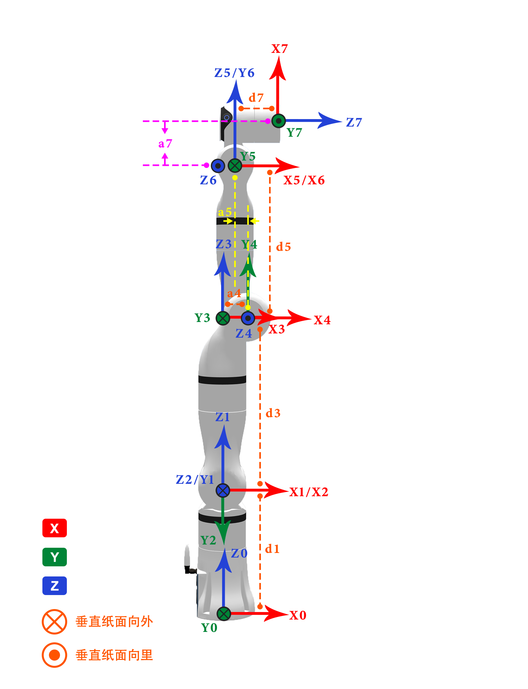

# 
本体参数：
GEN72系列D-H模型及参数

**MDH模型坐标系：**

  

 

**MDH参数(改进D-H参数)：**

表1.1 GEN72系列MDH参数

|关节编号(i)|$a_{i-1}$(mm)|$\alpha_{i -1}$(°)|$d_i$(mm)|offset(°)|
|:--|:--|:--|:--|:--|
|   1   |   0   |   0   |  218   |  0  |
|   2   |   0   |   -90 |   0    |  0  |
|   3   |   0   |   90  |   280  |  0  |
|   4   |   40  |   90  |   0    |  0  |
|   5   |   -19 |   -90 |  252.5 |  0  |
|   6   |   0   |   90  |   0    |  90 |
|   7   |   67  |   90  |   74   |  0  |

 

说明: offset为机械零位与建模零位的偏差, 即`模型角度 = 关节角度 + offset`.

 

# GEN72系列连杆动力学参数

表2.1 GEN72系列连杆动力学参数

|   joint_id(i)   |  1    |  2    |  3    |  4    |  5    |  6    |  7    |
|:--   |:--    |:--    |:--    |:--    |:--    |:--    |:--    |
| **$m$**       | 0.849  | 0.954  | 1.166  | 0.501  | 0.164  | 0.92   | 0     |
| **$x$**       | 0.018  | 0      | 32.035 | -0.101 | -0.012 | 33.677 | 0     |
| **$y$**       | 0.485  | -113.065| 1.405  | 121.531 | -0.835 | -24.499 | 0     |
| **$z$**       | -5.062 | 1.39   | -10.865 | -0.415 | -49.324 | -0.234 | 0     |
| **$L_{xx}$**  | 619.491  | 15830.405 | 1884.802 | 7780.748 | 687.831 | 1468.45 | 0     |
| **$L_{xy}$**  | -0.64   | -0.498 | -67.215 | 3.144  | 0.372  | 1506.848 | 0     |
| **$L_{xz}$**  | -0.349  | -0.274 | -13.467 | 0.053  | -0.062 | 14.523 | 0     |
| **$L_{yy}$**  | 758.741 | 831.213 | 3392.831 | 208.799 | 647.655 | 2422.923 | 0     |
| **$L_{yz}$**  | -0.727  | -2.038 | -1.356  | 24.787 | 2.089  | -10.309 | 0     |
| **$L_{zz}$**  | 454.962 | 15738.682 | 2238.137 | 7777.93 | 119.871 | 3549.823 | 0     |
| **备注**       |         |         |         |         |         |         |  |

 

说明:
- $m$为连杆质量, 单位为$kg$
- $x$为连杆质心x坐标, 单位为$mm$
- $y$为连杆质心y坐标, 单位为$mm$
- $z$为连杆质心z坐标, 单位为$mm$
- $L_{xx}$,$L_{xy}$,$L_{xz}$,$L_{yy}$,$L_{yz}$,$L_{zz}$ 为连杆坐标系下描述的主惯量, 单位为$kg·mm²$

 

备注: 
- 以上数据来源为CAD设计值
- 如需质心坐标系下的惯性参数, 使用平行移轴定理即可, 计算方法如下所述.

 

---

 

假设有一输出坐标系为坐标系$\{i\}$，对齐坐标系$\{i\}$的质心坐标系为 $\{c\}$，质心在坐标系$\{i\}$中的坐标为 $P_c = [x_c  ，y_c， z_c]^T$，则由平行移轴定理可得：

 

$$I_c = L_i - m (P_{c}^{T}P_cI_{3×3} - P_cP_{c}^{T})$$

式中:
$$
L_i = \begin{bmatrix}L_{xx} & L_{xy} & L_{xz} \\ L_{xy} & L_{yy} & L_{yz} \\ L_{xz} & L_{yz} & L_{zz}\end{bmatrix}
$$
